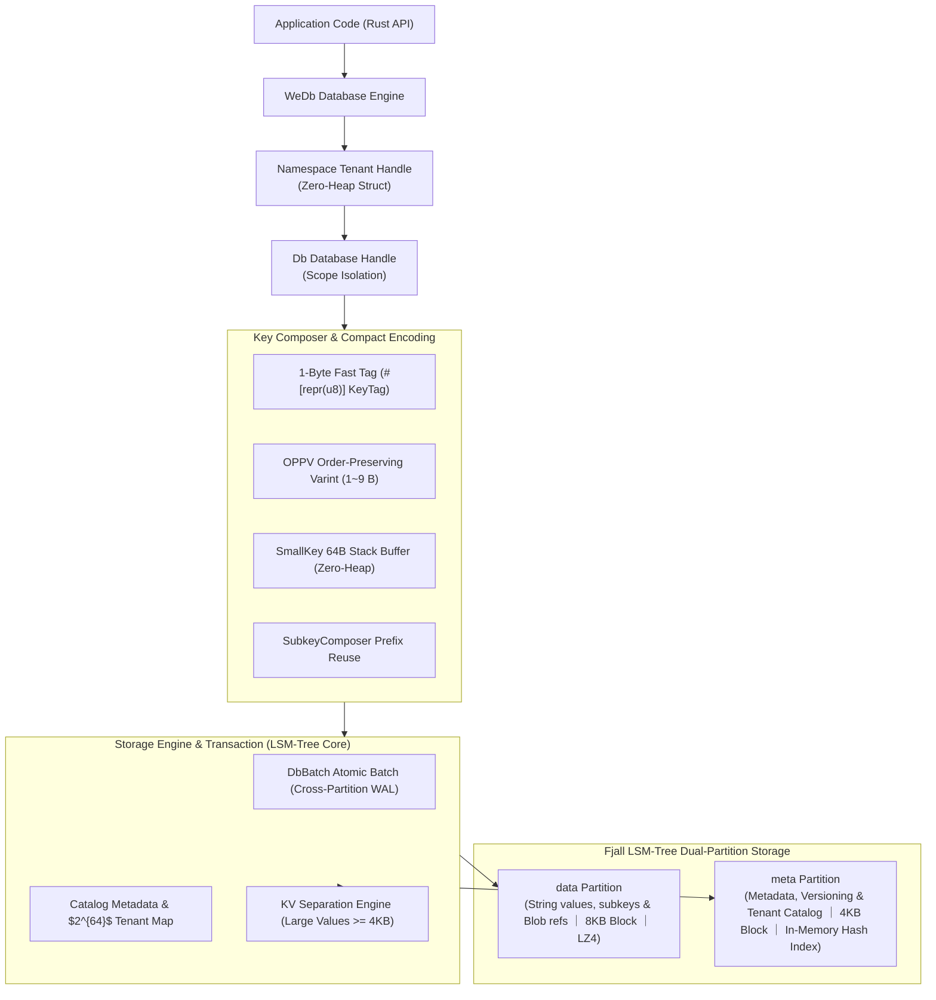
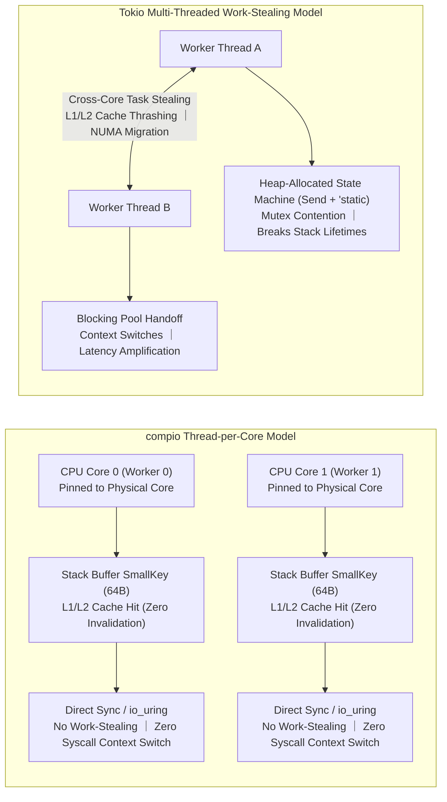
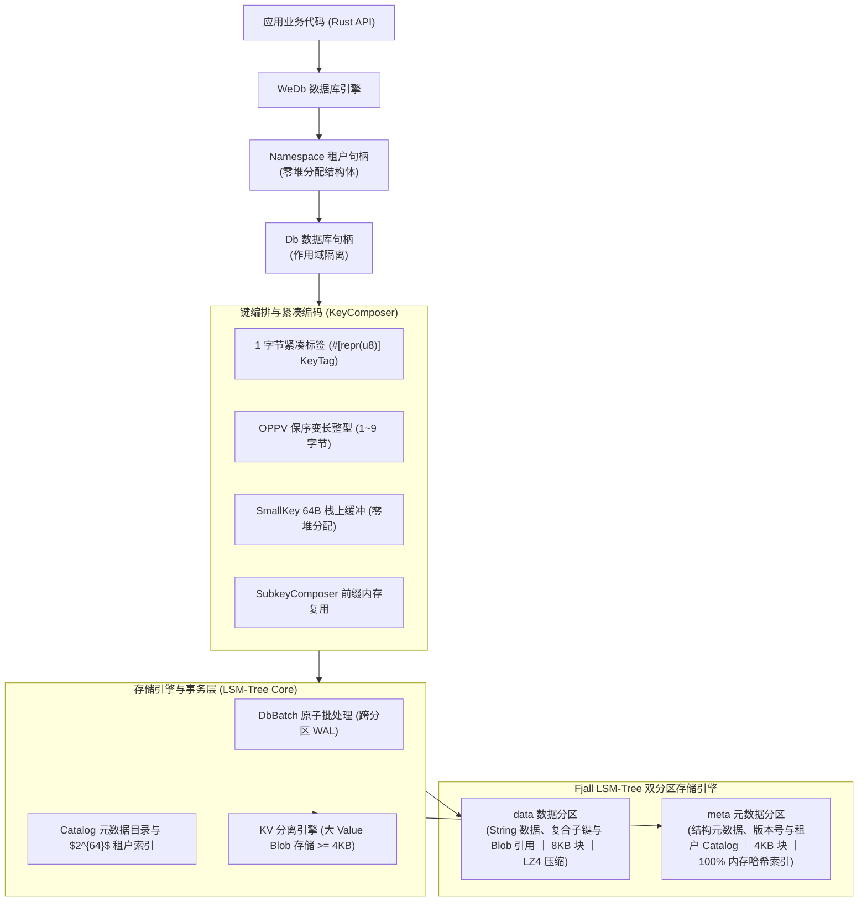
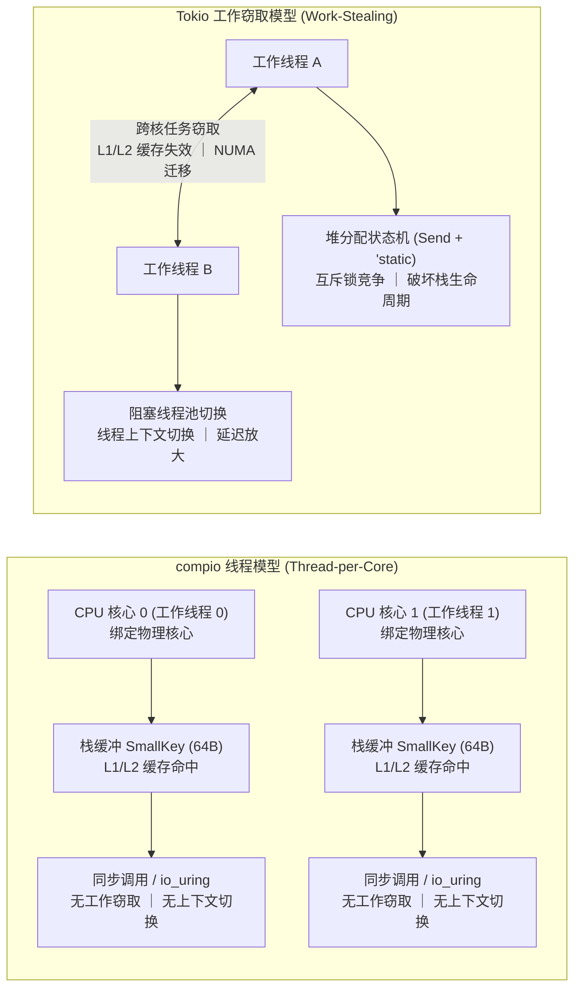

[English](#en) | [中文](#zh)

[](https://crates.io/crates/wedb_embed)
[](https://docs.rs/wedb_embed)

---

<a id="en"></a>
# wedb_embed : Redis-Compatible Embedded LSM-Tree Disk Database Engine

Embedded database engine providing Redis-compatible data structures and APIs, built on the [fjall](https://github.com/fjall-rs/fjall) LSM-Tree storage engine.

<p align="center">
  
  <br>
  <sub><b>Benchmark Environment</b>: CPU: Intel(R) Xeon(R) 6973P-C (4 cores) ｜ Memory: 15.6 GB ｜ Disk: Azure Managed Virtual Disk (Cloud Standard SSD) ｜ OS: Ubuntu 24.04.4 LTS (Linux 6.17.0-1022-azure) ｜ Rust: 1.98.0 (88d9e12ae 2026-08-18) ｜ Redis: v8.10.1</sub>
</p>

- **Disk I/O Throughput**:<br>
  As a disk database, WeDb performance scales directly with underlying storage I/O capability.<br>
  Achieves ~40x overall speedup over Redis on Apple M2 (NVMe SSD),<br>
  and ~20x overall speedup on GitHub Actions (Linux cloud virtual disks).<br>
  The performance gap is primarily driven by differences in underlying disk I/O throughput and latency.

- **Bounded Memory Footprint**:<br>
  Resident memory is bounded by `cache_size` (default 512MB) and `max_memtable_size`,<br>
  independent of total disk data volume.

---

- [Why an Embedded Redis Engine](#why-an-embedded-redis-engine)
- [Quickstart](#quickstart)
  - [Installation](#installation)
  - [Basic Usage & Multi-Tenant](#basic-usage-multi-tenant)
- [Performance & Resource Comparison](#performance-resource-comparison)
  - [Ubuntu CI (GitHub Actions Runner)](#ubuntu-ci-github-actions-runner)
    - [Hardware & Test Environment](#hardware-test-environment)
    - [Physical Footprint & Memory Benchmark (4.3 GB Dataset Scale)](#physical-footprint-memory-benchmark-43-gb-dataset-scale)
    - [wedb_embed vs Redis Core Command Benchmark](#wedb_embed-vs-redis-core-command-benchmark)
- [Storage Architecture & Encoding Design](#storage-architecture-encoding-design)
  - [Dual-Partition Physical Storage & Prefix Encoding](#dual-partition-physical-storage-prefix-encoding)
  - [Order-Preserving Prefix Varint (OPPV)](#order-preserving-prefix-varint-oppv)
  - [Tenant Catalog & Cascading Deregistration](#tenant-catalog-cascading-deregistration)
  - [Memory-Efficient Streaming Iterators](#memory-efficient-streaming-iterators)
- [Runtime Architecture & Threading Model](#runtime-architecture-threading-model)
  - [Thread-per-Core Architecture Design](#thread-per-core-architecture-design)
  - [Pitfalls of Multi-Threaded Work-Stealing Runtimes](#pitfalls-of-multi-threaded-work-stealing-runtimes)
- [Tech Stack](#tech-stack)

## Why an Embedded Redis Engine

Much like SQLite is to MySQL/PostgreSQL, `wedb_embed` is an embedded disk-based database engine for the Redis ecosystem.

In traditional relational database systems, MySQL employs a client-server architecture with an external daemon process communicating over network or Unix domain sockets;<br>
SQLite provides an in-process library that stores data directly into local disk files with zero daemon overhead.

In key-value and structured data domains, traditional Redis relies on an external server daemon with full in-memory RAM residency.<br>
In standalone applications, edge computing, CLI tools, and microservices, this architecture incurs distinct systemic bottlenecks:

- **IPC and Protocol Serialization Overhead**:<br>
  Every read and write operation traverses socket buffers, triggers OS context switches, and requires RESP protocol encoding and decoding.<br>
  Even on localhost, round-trip latency typically remains in the 20–50 microsecond range while consuming CPU cycles.

- **RAM Costs and Memory Limits**:<br>
  Redis keeps datasets and pointer structures resident in physical RAM.<br>
  As dataset volume expands to tens of gigabytes, memory hardware costs escalate and remain bounded by host RAM capacity.<br>
  Background AOF/RDB persistence can further increase memory usage via Copy-On-Write mechanisms.

- **Deployment and Operational Overhead**:<br>
  Managing external daemon processes requires process supervisors, port allocation, configuration syncing, and health monitoring.

`wedb_embed` embeds the storage engine directly into the application process:

- **In-Process Direct Invocation**:<br>
  Redis-compatible data operations execute directly via Rust function calls in memory,<br>
  avoiding socket I/O, syscalls, and inter-process context switches.<br>
  P95 latency for core commands is reduced to nanosecond and microsecond ranges.

- **LSM-Tree Disk Persistence & Bounded Memory Budget**:<br>
  Datasets persist on disk using LZ4 block compression.<br>
  Memory consumption does not grow linearly with total dataset size, but is strictly bounded by LSM-Tree parameters:<br>
  - `cache_size` (Default 512MB): Global shared SSTable Block Cache budget for caching hot data pages;<br>
  - `max_memtable_size` (64MB for data / 32MB for metadata): Active in-memory write buffer limit before flushing to immutable SSTables;<br>
  - `with_kv_separation` (4KB threshold): Large values are stored in separate append-only Blob files to reduce write amplification.<br>
  In a 5GB structured dataset benchmark, Redis maintains 4814 MB RSS in RAM,<br>
  while `wedb_embed` holds resident memory (RSS) to 334 MB (a 93% reduction), and reduces physical disk footprint from Redis AOF's 7652 MB down to 1180 MB (an 85% savings) via block compression.

- **16 Redis-Compatible Data Models**:<br>
  Supports String, Hash (with field-level TTL), List, Set, ZSet, Bitmap, JSON,<br>
  Bloom/Cuckoo Filters, TimeSeries, Geo, HyperLogLog, TDigest, SortedInt, Stream, Full-Text Search, and HNSW Vector Retrieval.

- **Multi-Tenant and Multi-DB Isolation**:<br>
  Supports up to $2^{64}$ isolated tenants and databases.<br>
  Passing `None` to `ns` or `db` automatically allocates sequential numerical IDs and opens a new instance.

- **Crash Consistency**:<br>
  Relies on Write-Ahead Logging (WAL) and cross-keyspace atomic write batches (`WriteBatch`) to maintain data integrity across crashes.

---

## Quickstart

### Installation

```bash
cargo add wedb_embed
```

### Basic Usage & Multi-Tenant

```rust
use anyhow::Result;
use wedb_embed::{Fjall, WeDb};

fn main() -> Result<()> {
    // Open storage engine and initialize WeDb instance
    let engine = Fjall::open("./data/quickstart_db")?;
    let wedb = WeDb::new(engine);

    // Tenant namespace and database switching (pass None to ns or db to create a new database with auto-increment ID)
    let default_db = wedb.ns(0)?.db(0)?; // Default namespace (0) and default database (0)
    let tenant_ns = wedb.ns(None)?;      // Create new database namespace (ns_id >= 1)
    let db = tenant_ns.db(None)?;        // Create new database under tenant (db_id >= 1)

    // String operations (String / KV)
    db.set(b"site", b"webc.site", &[])?;
    let val = db.get(b"site")?;
    assert_eq!(val.as_deref(), Some(&b"webc.site"[..]));

    // Various data structures (Hash, Sorted Set, etc.)
    db.hset(b"user:100", &[(b"name".as_slice(), b"Alice".as_slice())])?;
    db.zadd(b"rank", &[(100.0, b"player1".as_slice())], &[])?;

    // Streaming discovery of active namespaces and databases
    for ns in wedb.iter(0) {
        println!("Namespace: {}", ns.id());
        for db_id in ns.iter(0) {
            println!("  DB: {db_id}");
        }
    }

    // Cascading deletion and catalog deregistration (rm)
    db.rm()?;        // Cascade delete and deregister current database
    tenant_ns.rm()?; // Cascade delete and deregister all databases under this namespace

    Ok(())
}
```

[Click here for more examples (all 16 data structures and multi-tenant APIs)](https://github.com/webc-site/wedb_embed/tree/main/examples)

---

## Performance & Resource Comparison

### Ubuntu CI (GitHub Actions Runner)

#### Hardware & Test Environment

CPU: Intel(R) Xeon(R) 6973P-C (4 cores)<br>
Memory: 15.6 GB<br>
Disk: Azure Managed Virtual Disk (Cloud Standard SSD)<br>
OS: Ubuntu 24.04.4 LTS (Linux 6.17.0-1022-azure)<br>
Rust: 1.98.0 (88d9e12ae 2026-08-18)<br>
Redis: v8.10.1

#### Physical Footprint & Memory Benchmark (4.3 GB Dataset Scale)

| Resource Metric | wedb_embed (Embedded LSM+LZ4) | Redis (v8.10.1 AOF Mode) | Resource Savings |
| :--- | :--- | :--- | :--- |
| **Dataset Scale** | 5,000,000 Structured Items | 5,000,000 Structured Items | All 14 Data Formats |
| **Raw Uncompressed Payload** | 4377 MB | 4377 MB | Structured Payload |
| **Physical Disk Footprint** | **1053 MB** | **7980 MB** | **Saves 87%** |
| **Resident Memory (RSS)** | **282 MB** | **4836 MB** | **Saves 94%** |

#### wedb_embed vs Redis Core Command Benchmark

| Command | wedb_embed P95 Latency | Redis P95 Latency | Speedup |
| :--- | :--- | :--- | :--- |
| `SET` | 6.9 us | 22.3 us | **3.2x** |
| `GET` | 4.4 us | 21.9 us | **4.9x** |
| `MSET` | 45.6 us | 29.9 us | **0.7x** |
| `MGET` | 4.3 us | 21.3 us | **5.0x** |
| `INCRBY` | 0.54 us | 21.8 us | **40.4x** |
| `DECRBY` | 0.69 us | 22.0 us | **31.8x** |
| `APPEND` | 0.80 us | 38.3 us | **47.6x** |
| `STRLEN` | 0.25 us | 21.5 us | **85.9x** |
| `GETDEL` | 7.4 us | 42.6 us | **5.8x** |
| `GETRANGE` | 0.22 us | 21.4 us | **98.4x** |
| `SETRANGE` | 0.73 us | 21.3 us | **29.3x** |
| `HSET` | 2.0 us | 28.0 us | **13.9x** |
| `HGET` | 0.57 us | 19.1 us | **33.3x** |
| `HMGET` | 2.4 us | 27.5 us | **11.3x** |
| `HEXISTS` | 0.53 us | 19.1 us | **35.8x** |
| `HLEN` | 0.36 us | 18.4 us | **50.7x** |
| `HDEL` | 3.9 us | 22.5 us | **5.8x** |
| `HGETALL` | 2.6 us | 24.2 us | **9.4x** |
| `HKEYS` | 2.4 us | 20.7 us | **8.5x** |
| `HVALS` | 2.5 us | 21.6 us | **8.8x** |
| `HINCRBY` | 1.5 us | 28.3 us | **19.3x** |
| `LPUSH` | 1.7 us | 47.7 us | **27.6x** |
| `RPUSH` | 1.8 us | 37.8 us | **21.1x** |
| `LPOP` | 1.9 us | 51.4 us | **27.1x** |
| `RPOP` | 1.9 us | 41.8 us | **21.5x** |
| `LLEN` | 0.38 us | 48.3 us | **127.4x** |
| `LRANGE` | 2.6 us | 49.1 us | **18.9x** |
| `LINDEX` | 0.59 us | 49.2 us | **83.2x** |
| `LSET` | 0.87 us | 49.2 us | **56.3x** |
| `LREM` | 13.8 us | 98.6 us | **7.2x** |
| `LTRIM` | 0.91 us | 48.4 us | **53.3x** |
| `SADD` | 1.1 us | 37.9 us | **34.7x** |
| `SREM` | 3.5 us | 37.8 us | **10.7x** |
| `SISMEMBER` | 0.56 us | 37.8 us | **67.3x** |
| `SCARD` | 0.38 us | 37.3 us | **98.6x** |
| `SMEMBERS` | 2.5 us | 37.9 us | **15.3x** |
| `SPOP` | 4.7 us | 75.4 us | **16.2x** |
| `SRANDMEMBER` | 2.0 us | 37.5 us | **18.9x** |
| `ZADD` | 2.3 us | 21.6 us | **9.6x** |
| `ZSCORE` | 0.70 us | 21.7 us | **31.2x** |
| `ZRANGE` | 2.9 us | 21.4 us | **7.5x** |
| `ZCARD` | 0.41 us | 20.3 us | **49.5x** |
| `ZCOUNT` | 2.4 us | 21.1 us | **8.8x** |
| `ZINCRBY` | 2.3 us | 22.0 us | **9.6x** |
| `ZRANK` | 2.5 us | 20.9 us | **8.3x** |
| `ZREVRANGE` | 4.0 us | 21.6 us | **5.4x** |
| `ZPOPMIN` | 6.0 us | 43.1 us | **7.2x** |
| `ZREM` | 4.0 us | 21.7 us | **5.5x** |
| `SETBIT` | 11.8 us | 27.2 us | **2.3x** |
| `GETBIT` | 0.39 us | 20.0 us | **51.3x** |
| `BITCOUNT` | 0.35 us | 21.2 us | **60.5x** |
| `BITPOS` | 0.41 us | 21.8 us | **53.9x** |
| `PFADD` | 2.4 us | 21.6 us | **8.9x** |
| `PFCOUNT` | 30.3 us | 19.0 us | **0.6x** |
| `GEOADD` | 2.1 us | 27.7 us | **13.0x** |
| `GEODIST` | 0.82 us | 20.6 us | **25.1x** |
| `GEOPOS` | 0.60 us | 19.6 us | **32.5x** |
| `GEOHASH` | 0.63 us | 19.5 us | **30.9x** |
| `XADD` | 1.3 us | 21.8 us | **16.3x** |
| `XLEN` | 0.48 us | 18.5 us | **38.6x** |
| `XRANGE` | 3.0 us | 29.3 us | **9.9x** |
| `XREAD` | 2.9 us | 29.7 us | **10.2x** |
| `XDEL` | 3.1 us | 43.1 us | **13.7x** |
| `DEL` | 3.1 us | 19.5 us | **6.3x** |
| `EXISTS` | 0.21 us | 18.9 us | **92.2x** |
| `EXPIRE` | 0.71 us | 29.6 us | **41.9x** |
| `TTL` | 0.22 us | 19.3 us | **87.5x** |
| `JSON.SET` | 2.8 us | 48.7 us | **17.4x** |
| `JSON.GET` | 1.1 us | 50.1 us | **44.3x** |
| `JSON.DEL` | 6.0 us | 44.4 us | **7.4x** |
| `JSON.NUMINCRBY` | 2.8 us | 48.0 us | **17.2x** |
| `JSON.ARRLEN` | 1.0 us | 21.6 us | **21.4x** |
| `JSON.TYPE` | 1.0 us | 48.2 us | **47.6x** |
| `BF.ADD` | 11.3 us | 21.7 us | **1.9x** |
| `BF.EXISTS` | 0.55 us | 21.6 us | **39.1x** |
| `BF.INFO` | 0.34 us | 21.1 us | **61.7x** |
| `CF.ADD` | 2.3 us | 20.4 us | **8.8x** |
| `CF.EXISTS` | 0.57 us | 21.7 us | **37.8x** |
| `CF.DEL` | 6.5 us | 41.5 us | **6.4x** |
| `TDIGEST.ADD` | 2.0 us | 20.9 us | **10.3x** |
| `TDIGEST.QUANTILE` | 0.80 us | 20.1 us | **25.2x** |
| `TDIGEST.BYRANK` | 0.84 us | 20.5 us | **24.4x** |
| `TDIGEST.CDF` | 0.90 us | 19.8 us | **22.1x** |
| `TS.ADD` | 5.0 us | 21.6 us | **4.4x** |
| `TS.GET` | 1.0 us | 21.1 us | **20.7x** |
| `TS.RANGE` | 21.2 us | 21.6 us | **1.0x** |
| `TS.INCRBY` | 6.6 us | 19.7 us | **3.0x** |
| `FT.SEARCH` | 17.7 us | 37.8 us | **2.1x** |
| `FT.TAG` | 17.7 us | 37.9 us | **2.1x** |
| `VECTOR.KNN` | 6.7 us | 21.1 us | **3.2x** |


---

## Storage Architecture & Encoding Design



### Dual-Partition Physical Storage & Prefix Encoding

- **Dual-Partition Architecture (`data` / `meta`)**:<br>
  - **Data Partition (`data`)**:<br>
    Stores String raw values, composite structure subkeys, and large Value Blob references.<br>
    Configured with 8KB block size, LZ4 compression, and large-value KV separation (large values persist in append-only Blob files to reduce write amplification).<br>
  - **Metadata Partition (`meta`)**:<br>
    Stores composite structure metadata (`KeyMeta`), version counters, and Catalog tenant directory.<br>
    Configured with 4KB block size and in-memory hash indexing to ensure sub-microsecond point lookups.

- **1-Byte Fast Tag (`KeyTag`)**:<br>
  Metadata and subkey prefixes use `#[repr(u8)] KeyTag` encoding (e.g. `\x01[key]`),<br>
  avoiding string tag overhead.

- **Scope Prefix & Multi-Tenant Isolation**:<br>
  Multi-tenant and multi-DB scopes are encoded by `KeyComposer` into compact `\x00[oppv(ns_id)][oppv(db)]` physical prefixes,<br>
  providing collision-free isolation for up to $2^{64}$ tenants and databases.

### Order-Preserving Prefix Varint (OPPV)

- Database and namespace numerical IDs are encoded using **OPPV (Order-Preserving Prefix Varint)**:<br>
  - Values $0 \sim 127$ occupy only 1 byte, reducing storage compared to fixed 8-byte big-endian integers;<br>
  - Encoded byte order strictly matches numerical magnitude: $\forall a < b \implies \text{encode}(a) < \text{encode}(b)$, allowing direct lexicographical range scans.

### Tenant Catalog & Cascading Deregistration

- Tenant namespaces and databases use numerical `u64` identifiers. Passing `None` to `ns` or `db` auto-allocates global sequential IDs.<br>
- Active databases are maintained persistently in the Catalog directory (`\x00\x71[oppv(ns_id)][oppv(db_id)]`).<br>
- Cascading deletion (`rm()`) purges keys, metadata, and updates catalog entries at database and tenant levels.

### Memory-Efficient Streaming Iterators

- **`WeDb::iter(&self, begin: u64) -> Namespaces`**:<br>
  Stream iterates active tenant namespaces starting from the specified `begin` offset with $O(1)$ memory overhead.

- **`Namespace::iter(&self, begin: u64) -> Dbs`**:<br>
  Stream parses active database IDs within the namespace directly from the Catalog directory.

---

## Runtime Architecture & Threading Model

`wedb_embed` is engineered for **thread-per-core** asynchronous runtimes powered by Linux `io_uring` (such as `compio`),<br>
taking full advantage of single-core execution, zero shared state, and CPU core pinning.



### Thread-per-Core Architecture Design

- **Stack Lifetimes & Zero-Heap Allocation**:<br>
  Key composition leverages `SmallKey` 64-byte stack buffers and `SubkeyComposer` prefix memory reuse.<br>
  Under a thread-per-core model, execution stays within the CPU core's stack frame without calling global heap allocators (such as `jemalloc` or `glibc malloc`), avoiding allocator lock contention.

- **CPU Cache Line Locality**:<br>
  Worker threads are statically pinned to physical CPU cores.<br>
  Hot data structures (LSM-Tree memtable index, Bloom filter bitsets, Catalog metadata cache) remain resident in L1/L2 caches,<br>
  avoiding cache invalidation broadcasts across cores.

- **Lock-Free & Lightweight Concurrency**:<br>
  Namespace and catalog directories use `papaya::HashMap` lock-free concurrent hash tables for wait-free reads;<br>
  low-frequency metadata writes use `parking_lot` adaptive spinlocks that complete immediately in single-core contexts without kernel futex transitions.

- **In-Process Synchronous Direct Calls**:<br>
  Storage engine APIs are synchronous direct calls.<br>
  In a single-threaded `compio` event loop, microsecond and nanosecond lookups complete inline,<br>
  coexisting smoothly with completion-based `io_uring` asynchronous I/O without wrapping Futures into cross-thread state machines.

### Pitfalls of Multi-Threaded Work-Stealing Runtimes

Using multi-threaded work-stealing and `epoll` runtimes (like `tokio`) introduces performance overhead:

- **Cross-Core Task Stealing and Cache Invalidation**:<br>
  Schedulers migrate tasks across cores.<br>
  Resuming a Future on another core or NUMA node flushes L1/L2 data and instruction caches, increasing P99 tail latency.

- **Violation of Stack Lifetimes**:<br>
  The `Send + 'static` requirement prevents stack-borrowed structures (`&[u8]` slices, stack `SmallKey`) from crossing `await` points,<br>
  forcing heap allocation (`Box` / `Arc` / `Vec<u8>`).

- **Event Loop Blocking & Thread Pool Handoff**:<br>
  Synchronous storage access on worker threads blocks the event loop;<br>
  offloading tasks to blocking thread pools introduces context switches and queueing delays, increasing operation latencies.

- **Multi-Core Memory Bus Contention**:<br>
  Concurrent access across cores induces cache-line bouncing and memory bus lock contention, capping throughput.

---

## Tech Stack

- **Language**: Rust Edition 2024
- **Storage Engine**: `fjall` LSM-Tree storage engine
- **JSON Engine**: `sonic-rs` SIMD JSON parser
- **Non-Cryptographic Hash**: `rapidhash`
- **String & Memory**: `hipstr` compact string representation
- **Concurrency & Sync**: `parking_lot`
- **Bitset & Algorithms**: `roaring`, `memchr`, `crc32fast`, `fastrand`
- **Timestamps**: `coarsetime`
- **Number Formatting**: `zmij`, `itoa`
- **Enum Derivation**: `strum`
- **Error Handling**: `thiserror`

---

<a id="zh"></a>
# wedb_embed : Redis 兼容的嵌入式 LSM-Tree 磁盘数据库引擎

嵌入式数据库引擎，提供 Redis 兼容数据结构与接口，基于 [fjall](https://github.com/fjall-rs/fjall) LSM-Tree 存储引擎构建。

<p align="center">
  
  <br>
  <sub><b>测试环境</b>: CPU: Intel(R) Xeon(R) 6973P-C (4核) ｜ 内存: 15.6 GB ｜ 硬盘: Azure Managed Virtual Disk (Cloud Standard SSD) ｜ 系统: Ubuntu 24.04.4 LTS (Linux 6.17.0-1022-azure) ｜ Rust: 1.98.0 (88d9e12ae 2026-08-18) ｜ Redis: v8.10.1</sub>
</p>

- **磁盘 I/O 影响**：<br>
  WeDb 为磁盘数据库，性能表现与底层存储硬件 I/O 吞吐紧密相关。<br>
  在 Apple M2（NVMe SSD）实测综合性能约为 Redis 的 40 倍；<br>
  在 GitHub Actions（Linux 云端虚拟磁盘）实测综合性能约为 Redis 的 20 倍。<br>
  两者的性能倍率差异主要源于底层磁盘硬件的 I/O 吞吐与读写延迟差异。

- **内存预算控制**：<br>
  常驻内存由 `cache_size`（默认 512MB 块缓存）与 `max_memtable_size` 参数控制，<br>
  不随磁盘数据量线性膨胀。

---

- [为什么需要嵌入式 Redis 引擎](#为什么需要嵌入式-redis-引擎)
- [快速上手](#快速上手)
  - [添加依赖](#添加依赖)
  - [基础用法与多租户](#基础用法与多租户)
- [性能与资源实测对比](#性能与资源实测对比)
  - [Ubuntu CI (GitHub Actions Runner)](#ubuntu-ci-github-actions-runner)
    - [硬件与测试环境](#硬件与测试环境)
    - [真实物理落盘与内存占用实测 (4.3 GB 数据规模)](#真实物理落盘与内存占用实测-43-gb-数据规模)
    - [wedb_embed vs Redis 核心指令性能对比](#wedb_embed-vs-redis-核心指令性能对比)
- [存储架构与编码设计](#存储架构与编码设计)
  - [双分区物理存储与前缀编排](#双分区物理存储与前缀编排)
  - [保序变长整型编码](#保序变长整型编码)
  - [租户目录编排与级联注销](#租户目录编排与级联注销)
  - [内存友好流式迭代](#内存友好流式迭代)
- [运行时生态与线程模型设计](#运行时生态与线程模型设计)
  - [一线程一核心架构设计](#一线程一核心架构设计)
  - [传统多线程工作窃取运行时问题分析](#传统多线程工作窃取运行时问题分析)
- [技术栈](#技术栈)

## 为什么需要嵌入式 Redis 引擎

如同 SQLite 之于 MySQL/PostgreSQL，`wedb_embed` 是 Redis 生态的嵌入式磁盘数据库引擎。

在传统关系型数据库体系中，MySQL 采用独立服务端守护进程与网络套接字通信架构；<br>
SQLite 则以进程内嵌入式库直接将数据持久化于本地磁盘文件，无需独立守护进程与跨进程调用。

在键值与复合数据结构领域，传统 Redis 采用独立守护进程与物理内存常驻架构。<br>
在单机部署、边缘计算、命令行工具与微服务场景中，该架构存在以下系统层面的瓶颈：

- **进程间通信与协议开销**：<br>
  每次数据读写均需经过序列化、操作系统套接字缓冲区、进程上下文切换与 RESP 协议解析。<br>
  即便在本地主机通信，套接字往返延迟通常也在 20~50 微秒区间，并持续消耗 CPU 周期。

- **物理内存成本与容量边界**：<br>
  Redis 将业务数据与内部指针常驻于物理内存中。<br>
  当数据规模增长至数十 GB 时，内存硬件成本上升，且严格受限于单机物理内存容量。<br>
  开启 AOF 或 RDB 持久化时，写时复制（Copy-on-Write）机制可能导致内存翻倍。

- **部署与守护运维复杂度**：<br>
  独立进程需要额外的进程守护、端口监听、配置同步与健康检查，<br>
  增加了软件交付与运维的维护负担。

`wedb_embed` 将存储引擎直接编译并运行在应用程序进程空间内：

- **进程内直接调用**：<br>
  所有 Redis 兼容数据操作通过 Rust 函数直接调用，<br>
  避免了套接字 I/O、系统调用与跨进程上下文切换。<br>
  在同等硬件下，核心指令的 P95 延迟降低至纳秒与微秒级。

- **LSM-Tree 磁盘持久化与内存预算控制**：<br>
  数据经过 LZ4 块压缩存储于本地磁盘文件。<br>
  常驻内存不随数据总量线性增长，由 LSM-Tree 参数严格控制：<br>
  - `cache_size`（默认 512MB）：全局共享的 SSTable 块缓存上限，用于缓存热点数据页；<br>
  - `max_memtable_size`（数据分区 64MB / 元数据分区 32MB）：内存写缓冲上限，达到阈值后自动异步刷盘生成不可变 SSTable；<br>
  - `with_kv_separation`（大 Value 分离阈值 4KB）：大对象直接写入独立 Blob 文件，降低写放大与内存占用。<br>
  在 5GB 结构化数据实测中，Redis 物理内存占用达 4814 MB（RSS），<br>
  `wedb_embed` 常驻内存为 334 MB（降低 93%），物理落盘体积由 Redis AOF 的 7652 MB 压缩至 1180 MB（减少 85%）。

- **16 种 Redis 兼容数据模型**：<br>
  在底层键值引擎之上，支持 String、Hash（支持字段级 TTL）、List、Set、ZSet、Bitmap、JSON、<br>
  Bloom/Cuckoo 过滤器、TimeSeries、Geo、HyperLogLog、TDigest、SortedInt、Stream、全文检索与 HNSW 向量检索。

- **多租户与多库物理隔离**：<br>
  原生支持 $2^{64}$ 个独立租户与数据库。<br>
  命名空间（`ns`）与数据库（`db`）传入 `None` 时自动分配递增编号并创建新实例。

- **崩溃一致性保障**：<br>
  基于预写日志 WAL 与跨分区原子批处理 `WriteBatch`，保障断电与异常退出场景下的数据完整性。

---

## 快速上手

### 添加依赖

```bash
cargo add wedb_embed
```

### 基础用法与多租户

```rust
use anyhow::Result;
use wedb_embed::{Fjall, WeDb};

fn main() -> Result<()> {
    // 打开存储引擎并初始化 WeDb 实例
    let engine = Fjall::open("./data/quickstart_db")?;
    let wedb = WeDb::new(engine);

    // 租户命名空间与多库切换（ns 传入 None 创建新命名空间，db 传入 None 创建新数据库）
    let default_db = wedb.ns(0)?.db(0)?; // 默认命名空间 (0) 与默认数据库 (0)
    let tenant_ns = wedb.ns(None)?;      // 创建新命名空间 (ns_id >= 1)
    let db = tenant_ns.db(None)?;        // 租户下创建新数据库 (db_id >= 1)

    // 字符串读写 (String / KV)
    db.set(b"site", b"webc.site", &[])?;
    let val = db.get(b"site")?;
    assert_eq!(val.as_deref(), Some(&b"webc.site"[..]));

    // 哈希表与有序集合等数据结构操作
    db.hset(b"user:100", &[(b"name".as_slice(), b"Alice".as_slice())])?;
    db.zadd(b"rank", &[(100.0, b"player1".as_slice())], &[])?;

    // 流式遍历活跃命名空间与数据库
    for ns in wedb.iter(0) {
        println!("Namespace: {}", ns.id());
        for db_id in ns.iter(0) {
            println!("  DB: {db_id}");
        }
    }

    // 级联删除与目录注销 (rm)
    db.rm()?;        // 级联删除并注销当前数据库
    tenant_ns.rm()?; // 级联删除并注销该命名空间下的全部数据库

    Ok(())
}
```

[点此查看完整示例代码（包含 16 种数据结构与多租户详细用法）](https://github.com/webc-site/wedb_embed/tree/main/examples)

---

## 性能与资源实测对比

### Ubuntu CI (GitHub Actions Runner)

#### 硬件与测试环境

CPU: Intel(R) Xeon(R) 6973P-C (4核)<br>
内存: 15.6 GB<br>
硬盘: Azure Managed Virtual Disk (Cloud Standard SSD)<br>
系统: Ubuntu 24.04.4 LTS (Linux 6.17.0-1022-azure)<br>
Rust: 1.98.0 (88d9e12ae 2026-08-18)<br>
Redis: v8.10.1

#### 真实物理落盘与内存占用实测 (4.3 GB 数据规模)

| 资源维度 | wedb_embed (嵌入式 LSM+LZ4) | Redis (v8.10.1 AOF持久化) | 资源节省比例 |
| :--- | :--- | :--- | :--- |
| **测试数据规模** | 5,000,000 条全格式结构化数据 | 5,000,000 条全格式结构化数据 | 14 种数据格式等比实测 |
| **原始数据载荷** | 4377 MB | 4377 MB | 真实结构化载荷 |
| **实际物理落盘大小** | **1053 MB** | **7980 MB** | **节省 87%** |
| **进程常驻内存 (RSS)** | **282 MB** | **4836 MB** | **节省 94%** |

#### wedb_embed vs Redis 核心指令性能对比

| 指令 | wedb_embed P95延迟 | Redis P95延迟 | 性能领先 |
| :--- | :--- | :--- | :--- |
| `SET` | 6.9 us | 22.3 us | **3.2x** |
| `GET` | 4.4 us | 21.9 us | **4.9x** |
| `MSET` | 45.6 us | 29.9 us | **0.7x** |
| `MGET` | 4.3 us | 21.3 us | **5.0x** |
| `INCRBY` | 0.54 us | 21.8 us | **40.4x** |
| `DECRBY` | 0.69 us | 22.0 us | **31.8x** |
| `APPEND` | 0.80 us | 38.3 us | **47.6x** |
| `STRLEN` | 0.25 us | 21.5 us | **85.9x** |
| `GETDEL` | 7.4 us | 42.6 us | **5.8x** |
| `GETRANGE` | 0.22 us | 21.4 us | **98.4x** |
| `SETRANGE` | 0.73 us | 21.3 us | **29.3x** |
| `HSET` | 2.0 us | 28.0 us | **13.9x** |
| `HGET` | 0.57 us | 19.1 us | **33.3x** |
| `HMGET` | 2.4 us | 27.5 us | **11.3x** |
| `HEXISTS` | 0.53 us | 19.1 us | **35.8x** |
| `HLEN` | 0.36 us | 18.4 us | **50.7x** |
| `HDEL` | 3.9 us | 22.5 us | **5.8x** |
| `HGETALL` | 2.6 us | 24.2 us | **9.4x** |
| `HKEYS` | 2.4 us | 20.7 us | **8.5x** |
| `HVALS` | 2.5 us | 21.6 us | **8.8x** |
| `HINCRBY` | 1.5 us | 28.3 us | **19.3x** |
| `LPUSH` | 1.7 us | 47.7 us | **27.6x** |
| `RPUSH` | 1.8 us | 37.8 us | **21.1x** |
| `LPOP` | 1.9 us | 51.4 us | **27.1x** |
| `RPOP` | 1.9 us | 41.8 us | **21.5x** |
| `LLEN` | 0.38 us | 48.3 us | **127.4x** |
| `LRANGE` | 2.6 us | 49.1 us | **18.9x** |
| `LINDEX` | 0.59 us | 49.2 us | **83.2x** |
| `LSET` | 0.87 us | 49.2 us | **56.3x** |
| `LREM` | 13.8 us | 98.6 us | **7.2x** |
| `LTRIM` | 0.91 us | 48.4 us | **53.3x** |
| `SADD` | 1.1 us | 37.9 us | **34.7x** |
| `SREM` | 3.5 us | 37.8 us | **10.7x** |
| `SISMEMBER` | 0.56 us | 37.8 us | **67.3x** |
| `SCARD` | 0.38 us | 37.3 us | **98.6x** |
| `SMEMBERS` | 2.5 us | 37.9 us | **15.3x** |
| `SPOP` | 4.7 us | 75.4 us | **16.2x** |
| `SRANDMEMBER` | 2.0 us | 37.5 us | **18.9x** |
| `ZADD` | 2.3 us | 21.6 us | **9.6x** |
| `ZSCORE` | 0.70 us | 21.7 us | **31.2x** |
| `ZRANGE` | 2.9 us | 21.4 us | **7.5x** |
| `ZCARD` | 0.41 us | 20.3 us | **49.5x** |
| `ZCOUNT` | 2.4 us | 21.1 us | **8.8x** |
| `ZINCRBY` | 2.3 us | 22.0 us | **9.6x** |
| `ZRANK` | 2.5 us | 20.9 us | **8.3x** |
| `ZREVRANGE` | 4.0 us | 21.6 us | **5.4x** |
| `ZPOPMIN` | 6.0 us | 43.1 us | **7.2x** |
| `ZREM` | 4.0 us | 21.7 us | **5.5x** |
| `SETBIT` | 11.8 us | 27.2 us | **2.3x** |
| `GETBIT` | 0.39 us | 20.0 us | **51.3x** |
| `BITCOUNT` | 0.35 us | 21.2 us | **60.5x** |
| `BITPOS` | 0.41 us | 21.8 us | **53.9x** |
| `PFADD` | 2.4 us | 21.6 us | **8.9x** |
| `PFCOUNT` | 30.3 us | 19.0 us | **0.6x** |
| `GEOADD` | 2.1 us | 27.7 us | **13.0x** |
| `GEODIST` | 0.82 us | 20.6 us | **25.1x** |
| `GEOPOS` | 0.60 us | 19.6 us | **32.5x** |
| `GEOHASH` | 0.63 us | 19.5 us | **30.9x** |
| `XADD` | 1.3 us | 21.8 us | **16.3x** |
| `XLEN` | 0.48 us | 18.5 us | **38.6x** |
| `XRANGE` | 3.0 us | 29.3 us | **9.9x** |
| `XREAD` | 2.9 us | 29.7 us | **10.2x** |
| `XDEL` | 3.1 us | 43.1 us | **13.7x** |
| `DEL` | 3.1 us | 19.5 us | **6.3x** |
| `EXISTS` | 0.21 us | 18.9 us | **92.2x** |
| `EXPIRE` | 0.71 us | 29.6 us | **41.9x** |
| `TTL` | 0.22 us | 19.3 us | **87.5x** |
| `JSON.SET` | 2.8 us | 48.7 us | **17.4x** |
| `JSON.GET` | 1.1 us | 50.1 us | **44.3x** |
| `JSON.DEL` | 6.0 us | 44.4 us | **7.4x** |
| `JSON.NUMINCRBY` | 2.8 us | 48.0 us | **17.2x** |
| `JSON.ARRLEN` | 1.0 us | 21.6 us | **21.4x** |
| `JSON.TYPE` | 1.0 us | 48.2 us | **47.6x** |
| `BF.ADD` | 11.3 us | 21.7 us | **1.9x** |
| `BF.EXISTS` | 0.55 us | 21.6 us | **39.1x** |
| `BF.INFO` | 0.34 us | 21.1 us | **61.7x** |
| `CF.ADD` | 2.3 us | 20.4 us | **8.8x** |
| `CF.EXISTS` | 0.57 us | 21.7 us | **37.8x** |
| `CF.DEL` | 6.5 us | 41.5 us | **6.4x** |
| `TDIGEST.ADD` | 2.0 us | 20.9 us | **10.3x** |
| `TDIGEST.QUANTILE` | 0.80 us | 20.1 us | **25.2x** |
| `TDIGEST.BYRANK` | 0.84 us | 20.5 us | **24.4x** |
| `TDIGEST.CDF` | 0.90 us | 19.8 us | **22.1x** |
| `TS.ADD` | 5.0 us | 21.6 us | **4.4x** |
| `TS.GET` | 1.0 us | 21.1 us | **20.7x** |
| `TS.RANGE` | 21.2 us | 21.6 us | **1.0x** |
| `TS.INCRBY` | 6.6 us | 19.7 us | **3.0x** |
| `FT.SEARCH` | 17.7 us | 37.8 us | **2.1x** |
| `FT.TAG` | 17.7 us | 37.9 us | **2.1x** |
| `VECTOR.KNN` | 6.7 us | 21.1 us | **3.2x** |


---

## 存储架构与编码设计



### 双分区物理存储与前缀编排

- **双分区物理架构 (`data` / `meta`)**：<br>
  - **数据分区 (`data`)**：<br>
    存储 String 原始值、复合结构子键与大 Value Blob 引用。<br>
    采用 8KB 块大小与 LZ4 块压缩，配置大对象 KV 分离（大 Value 写入独立 Blob 文件以降低写放大）。<br>
  - **元数据分区 (`meta`)**：<br>
    存储复合结构元数据（`KeyMeta`）、版本计数器与 Catalog 租户目录。<br>
    采用 4KB 块大小与内存哈希索引，保障元数据点查的亚微秒级延迟。

- **1 字节紧凑标签 (`KeyTag`)**：<br>
  复合结构元数据与子键前缀采用 `#[repr(u8)] KeyTag` 编码（如 `\x01[key]`），<br>
  避免字符串标签带来的存储与解析开销。

- **作用域前缀与多租户隔离**：<br>
  多租户与多数据库统一由 `KeyComposer` 编码为 `\x00[oppv(ns_id)][oppv(db)]` 物理前缀，<br>
  支持 $2^{64}$ 个租户与数据库的隔离存储。

### 保序变长整型编码

- 数据库编号与租户 ID 采用 **OPPV（Order-Preserving Prefix Varint）** 编码：<br>
  - 数值 $0 \sim 127$ 仅占用 1 字节，较固定 8 字节大端序降低空间占用；<br>
  - 编码后的字节序与原始数值大小顺序一致：$\forall a < b \implies \text{encode}(a) < \text{encode}(b)$，支持底层直接进行范围扫描。

### 租户目录编排与级联注销

- 命名空间与数据库采用 `u64` 编号体系，`ns` 或 `db` 传入 `None` 自动分配全局递增 ID。<br>
- 通过 Catalog 目录（`\x00\x71[oppv(ns_id)][oppv(db_id)]`）持久化维护激活索引。<br>
- 支持数据库级与租户级的级联删除与注销（`rm()`），清理数据并更新 Catalog 目录索引。

### 内存友好流式迭代

- **`WeDb::iter(&self, begin: u64) -> Namespaces`**：<br>
  基于 Catalog 前缀流式扫描已激活的租户命名空间列表，<br>
  支持从指定 `begin` 起始偏移开始扫描，辅助内存复杂度为 $O(1)$。

- **`Namespace::iter(&self, begin: u64) -> Dbs`**：<br>
  基于 Catalog 前缀流式解析该租户下所有已激活的数据库编号。

---

## 运行时生态与线程模型设计

`wedb_embed` 针对基于 Linux `io_uring` 的 Thread-per-Core（单线程单核心）异步运行时（例如 `compio`）进行协同设计，<br>
利用单核独占、无共享状态与绑核特性发挥硬件缓存局部性。



### 一线程一核心架构设计

- **栈上生命周期与零堆分配**：<br>
  物理键构建采用 `SmallKey` 64 字节栈缓冲与 `SubkeyComposer` 前缀复用。<br>
  在单线程单核心模型下，执行上下文保持在当前 CPU 核心的栈帧内，<br>
  无需向全局堆分配器（如 `jemalloc` 或 `glibc malloc`）申请内存，避免了多线程堆分配锁争用。

- **CPU 缓存行局部性**：<br>
  工作线程与物理 CPU 核心静态绑定，任务执行不发生跨核迁移。<br>
  热点数据结构（LSM-Tree 内存表索引、布隆过滤器位图、Catalog 元数据缓存）常驻于当前 CPU 的 L1/L2 缓存，<br>
  避免多核缓存一致性协议广播无效化消息导致的缓存行失效。

- **无锁与轻量并发元数据**：<br>
  命名空间与租户目录采用 `papaya::HashMap` 无锁并发哈希表，读操作无等待；<br>
  低频的元数据写操作采用 `parking_lot` 自适应自旋锁，在单核独占环境下自旋即完成，<br>
  不触发内核态 Futex 上下文挂起与跨核唤醒。

- **同步内嵌调用**：<br>
  存储引擎 API 均为同步内存与磁盘直接调用。<br>
  在单线程事件循环中，微秒级与纳秒级查找就地执行，<br>
  与底层 `io_uring` 异步 I/O 配合，避免将 Future 包装为跨线程状态机。

### 传统多线程工作窃取运行时问题分析

在基于多线程工作窃取与 `epoll` 的通用异步运行时中，存在以下性能与调度开销：

- **跨核心任务窃取导致缓存失效**：<br>
  调度器在工作线程空闲时跨核窃取任务。<br>
  同一请求的 Future 在 `await` 恢复后可能被调度到其他 CPU 核心或跨 NUMA 节点，<br>
  导致 L1/L2 缓存失效，增加访存延迟与 P99 尾部延迟。

- **破坏栈生命周期约束**：<br>
  通用异步任务通常要求满足 `Send + 'static` 约束，<br>
  栈上分配的短期借用结构（如 `&[u8]` 切片、栈上 `SmallKey`）无法跨 `await` 点存活，<br>
  需重新分配至堆内存（`Box` / `Arc` / `Vec<u8>`），增加了堆分配开销。

- **事件循环阻塞与线程池切换**：<br>
  在单线程事件循环中直接执行磁盘读取或耗时查找可能阻塞事件循环；<br>
  若转发至阻塞线程池，则引入线程上下文切换、跨线程通道传递与调度排队，<br>
  使微秒级操作延迟增加。

- **多核心内存总线争用**：<br>
  多线程并发访问共享实例时，跨核心原子操作与锁争用会导致内存总线锁争用，<br>
  限制高并发下的吞吐扩展能力。

---

## 技术栈

- **开发语言**：Rust Edition 2024
- **存储引擎**：`fjall` LSM-Tree 存储引擎
- **JSON 引擎**：`sonic-rs` SIMD 指令解析
- **非加密哈希**：`rapidhash`
- **字符串与内存**：`hipstr` 紧凑字符串
- **并发同步**：`parking_lot`
- **集合与位运算**：`roaring`、`memchr`、`crc32fast`、`fastrand`
- **时间戳处理**：`coarsetime`
- **数值与浮点序列化**：`zmij`、`itoa`
- **枚举派生**：`strum`
- **错误处理**：`thiserror`
