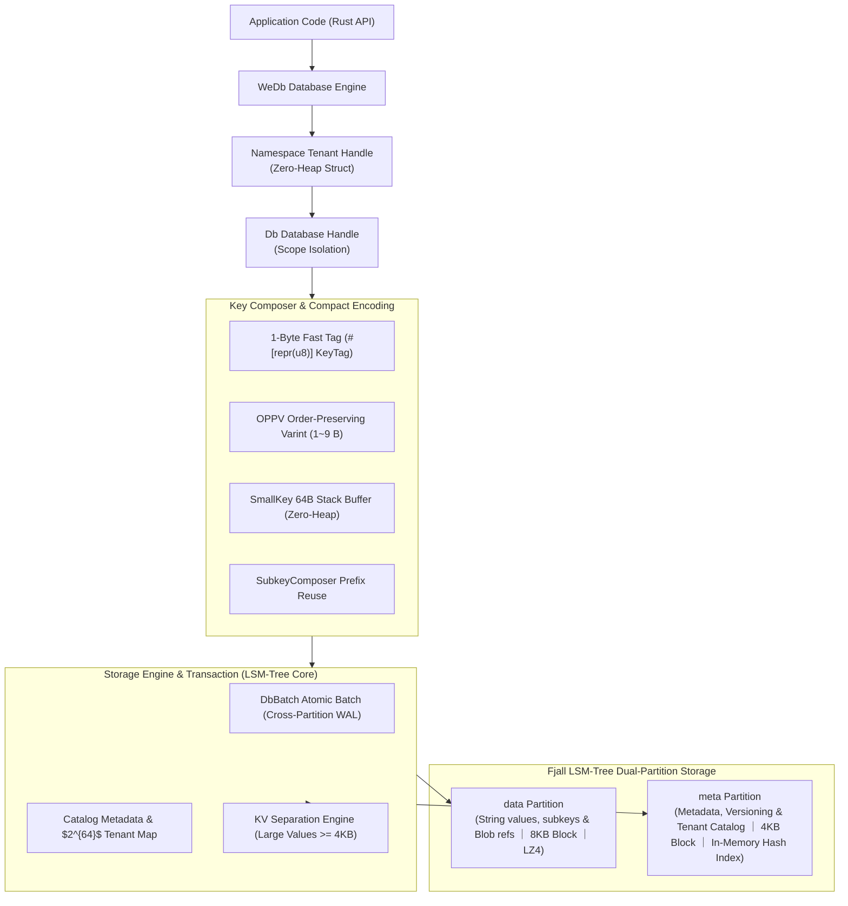
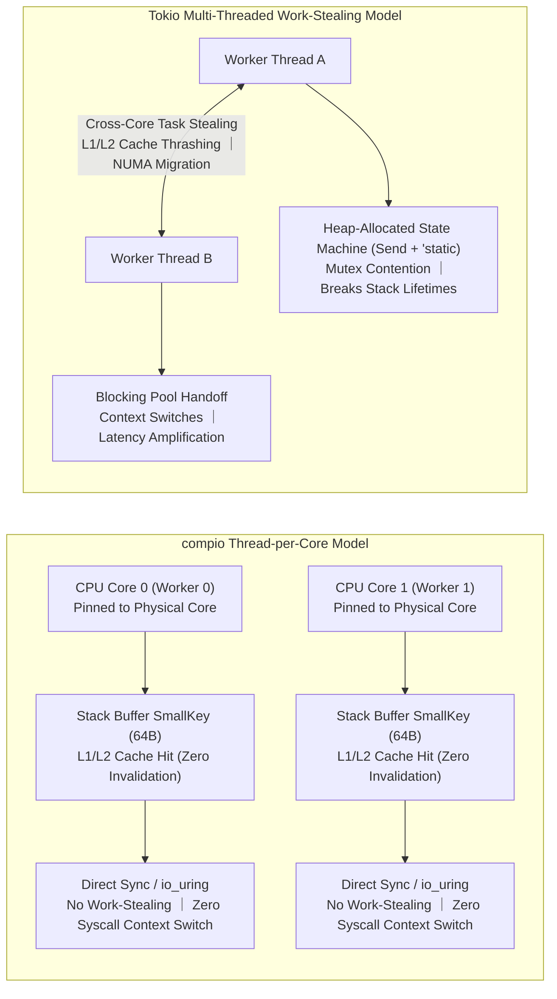

# wedb_embed : Redis-Compatible Embedded LSM-Tree Disk Database Engine

Embedded database engine providing Redis-compatible data structures and APIs, built on the [fjall](https://github.com/fjall-rs/fjall) LSM-Tree storage engine.

<p align="center">
  
  <br>
  <sub><b>Benchmark Environment</b>: CPU: AMD EPYC 7763 64-Core Processor (4 cores) ｜ Memory: 15.6 GB ｜ Disk: Azure Managed Virtual Disk (Cloud Standard SSD) ｜ OS: Ubuntu 24.04.4 LTS (Linux 6.17.0-1022-azure) ｜ Rust: 1.98.0 (88d9e12ae 2026-08-18) ｜ Redis: v8.10.1</sub>
</p>

- **Disk I/O Throughput**:<br>
  As a disk database, WeDb performance scales directly with underlying storage I/O capability.<br>
  Achieves ~40x overall speedup over Redis on Apple M2 (NVMe SSD),<br>
  and ~20x overall speedup on GitHub Actions (Linux cloud virtual disks).<br>
  The performance gap is primarily driven by differences in underlying disk I/O throughput and latency.

- **Bounded Memory Footprint**:<br>
  Resident memory is bounded by `cache_size` (default 512MB) and `max_memtable_size`,<br>
  independent of total disk data volume.

---

## Why an Embedded Redis Engine

Much like SQLite is to MySQL/PostgreSQL, `wedb_embed` is an embedded disk-based database engine for the Redis ecosystem.

In traditional relational database systems, MySQL employs a client-server architecture with an external daemon process communicating over network or Unix domain sockets;<br>
SQLite provides an in-process library that stores data directly into local disk files with zero daemon overhead.

In key-value and structured data domains, traditional Redis relies on an external server daemon with full in-memory RAM residency.<br>
In standalone applications, edge computing, CLI tools, and microservices, this architecture incurs distinct systemic bottlenecks:

- **IPC and Protocol Serialization Overhead**:<br>
  Every read and write operation traverses socket buffers, triggers OS context switches, and requires RESP protocol encoding and decoding.<br>
  Even on localhost, round-trip latency typically remains in the 20–50 microsecond range while consuming CPU cycles.

- **RAM Costs and Memory Limits**:<br>
  Redis keeps datasets and pointer structures resident in physical RAM.<br>
  As dataset volume expands to tens of gigabytes, memory hardware costs escalate and remain bounded by host RAM capacity.<br>
  Background AOF/RDB persistence can further increase memory usage via Copy-On-Write mechanisms.

- **Deployment and Operational Overhead**:<br>
  Managing external daemon processes requires process supervisors, port allocation, configuration syncing, and health monitoring.

`wedb_embed` embeds the storage engine directly into the application process:

- **In-Process Direct Invocation**:<br>
  Redis-compatible data operations execute directly via Rust function calls in memory,<br>
  avoiding socket I/O, syscalls, and inter-process context switches.<br>
  P95 latency for core commands is reduced to nanosecond and microsecond ranges.

- **LSM-Tree Disk Persistence & Bounded Memory Budget**:<br>
  Datasets persist on disk using LZ4 block compression.<br>
  Memory consumption does not grow linearly with total dataset size, but is strictly bounded by LSM-Tree parameters:<br>
  - `cache_size` (Default 512MB): Global shared SSTable Block Cache budget for caching hot data pages;<br>
  - `max_memtable_size` (64MB for data / 32MB for metadata): Active in-memory write buffer limit before flushing to immutable SSTables;<br>
  - `with_kv_separation` (4KB threshold): Large values are stored in separate append-only Blob files to reduce write amplification.<br>
  In a 5GB structured dataset benchmark, Redis maintains 4814 MB RSS in RAM,<br>
  while `wedb_embed` holds resident memory (RSS) to 334 MB (a 93% reduction), and reduces physical disk footprint from Redis AOF's 7652 MB down to 1180 MB (an 85% savings) via block compression.

- **16 Redis-Compatible Data Models**:<br>
  Supports String, Hash (with field-level TTL), List, Set, ZSet, Bitmap, JSON,<br>
  Bloom/Cuckoo Filters, TimeSeries, Geo, HyperLogLog, TDigest, SortedInt, Stream, Full-Text Search, and HNSW Vector Retrieval.

- **Multi-Tenant and Multi-DB Isolation**:<br>
  Supports up to $2^{64}$ isolated tenants and databases.<br>
  Passing `None` to `ns` or `db` automatically allocates sequential numerical IDs and opens a new instance.

- **Crash Consistency**:<br>
  Relies on Write-Ahead Logging (WAL) and cross-keyspace atomic write batches (`WriteBatch`) to maintain data integrity across crashes.

---

## Quickstart

### Installation

```bash
cargo add wedb_embed
```

### Basic Usage & Multi-Tenant

```rust
use anyhow::Result;
use wedb_embed::{Fjall, WeDb};

fn main() -> Result<()> {
    // Open storage engine and initialize WeDb instance
    let engine = Fjall::open("./data/quickstart_db")?;
    let wedb = WeDb::new(engine);

    // Tenant namespace and database switching (pass None to ns or db to create a new database with auto-increment ID)
    let default_db = wedb.ns(0)?.db(0)?; // Default namespace (0) and default database (0)
    let tenant_ns = wedb.ns(None)?;      // Create new database namespace (ns_id >= 1)
    let db = tenant_ns.db(None)?;        // Create new database under tenant (db_id >= 1)

    // String operations (String / KV)
    db.set(b"site", b"webc.site", &[])?;
    let val = db.get(b"site")?;
    assert_eq!(val.as_deref(), Some(&b"webc.site"[..]));

    // Various data structures (Hash, Sorted Set, etc.)
    db.hset(b"user:100", &[(b"name".as_slice(), b"Alice".as_slice())])?;
    db.zadd(b"rank", &[(100.0, b"player1".as_slice())], &[])?;

    // Streaming discovery of active namespaces and databases
    for ns in wedb.iter(0) {
        println!("Namespace: {}", ns.id());
        for db_id in ns.iter(0) {
            println!("  DB: {db_id}");
        }
    }

    // Cascading deletion and catalog deregistration (rm)
    db.rm()?;        // Cascade delete and deregister current database
    tenant_ns.rm()?; // Cascade delete and deregister all databases under this namespace

    Ok(())
}
```

[Click here for more examples (all 16 data structures and multi-tenant APIs)](https://github.com/webc-site/wedb_embed/tree/main/examples)

---

## Performance & Resource Comparison

<+ ./bench/en.md >

---

## Storage Architecture & Encoding Design



### Dual-Partition Physical Storage & Prefix Encoding

- **Dual-Partition Architecture (`data` / `meta`)**:<br>
  - **Data Partition (`data`)**:<br>
    Stores String raw values, composite structure subkeys, and large Value Blob references.<br>
    Configured with 8KB block size, LZ4 compression, and large-value KV separation (large values persist in append-only Blob files to reduce write amplification).<br>
  - **Metadata Partition (`meta`)**:<br>
    Stores composite structure metadata (`KeyMeta`), version counters, and Catalog tenant directory.<br>
    Configured with 4KB block size and in-memory hash indexing to ensure sub-microsecond point lookups.

- **1-Byte Fast Tag (`KeyTag`)**:<br>
  Metadata and subkey prefixes use `#[repr(u8)] KeyTag` encoding (e.g. `\x01[key]`),<br>
  avoiding string tag overhead.

- **Scope Prefix & Multi-Tenant Isolation**:<br>
  Multi-tenant and multi-DB scopes are encoded by `KeyComposer` into compact `\x00[oppv(ns_id)][oppv(db)]` physical prefixes,<br>
  providing collision-free isolation for up to $2^{64}$ tenants and databases.

### Order-Preserving Prefix Varint (OPPV)

- Database and namespace numerical IDs are encoded using **OPPV (Order-Preserving Prefix Varint)**:<br>
  - Values $0 \sim 127$ occupy only 1 byte, reducing storage compared to fixed 8-byte big-endian integers;<br>
  - Encoded byte order strictly matches numerical magnitude: $\forall a < b \implies \text{encode}(a) < \text{encode}(b)$, allowing direct lexicographical range scans.

### Tenant Catalog & Cascading Deregistration

- Tenant namespaces and databases use numerical `u64` identifiers. Passing `None` to `ns` or `db` auto-allocates global sequential IDs.<br>
- Active databases are maintained persistently in the Catalog directory (`\x00\x71[oppv(ns_id)][oppv(db_id)]`).<br>
- Cascading deletion (`rm()`) purges keys, metadata, and updates catalog entries at database and tenant levels.

### Memory-Efficient Streaming Iterators

- **`WeDb::iter(&self, begin: u64) -> Namespaces`**:<br>
  Stream iterates active tenant namespaces starting from the specified `begin` offset with $O(1)$ memory overhead.

- **`Namespace::iter(&self, begin: u64) -> Dbs`**:<br>
  Stream parses active database IDs within the namespace directly from the Catalog directory.

---

## Runtime Architecture & Threading Model

`wedb_embed` is engineered for **thread-per-core** asynchronous runtimes powered by Linux `io_uring` (such as `compio`),<br>
taking full advantage of single-core execution, zero shared state, and CPU core pinning.



### Thread-per-Core Architecture Design

- **Stack Lifetimes & Zero-Heap Allocation**:<br>
  Key composition leverages `SmallKey` 64-byte stack buffers and `SubkeyComposer` prefix memory reuse.<br>
  Under a thread-per-core model, execution stays within the CPU core's stack frame without calling global heap allocators (such as `jemalloc` or `glibc malloc`), avoiding allocator lock contention.

- **CPU Cache Line Locality**:<br>
  Worker threads are statically pinned to physical CPU cores.<br>
  Hot data structures (LSM-Tree memtable index, Bloom filter bitsets, Catalog metadata cache) remain resident in L1/L2 caches,<br>
  avoiding cache invalidation broadcasts across cores.

- **Lock-Free & Lightweight Concurrency**:<br>
  Namespace and catalog directories use `papaya::HashMap` lock-free concurrent hash tables for wait-free reads;<br>
  low-frequency metadata writes use `parking_lot` adaptive spinlocks that complete immediately in single-core contexts without kernel futex transitions.

- **In-Process Synchronous Direct Calls**:<br>
  Storage engine APIs are synchronous direct calls.<br>
  In a single-threaded `compio` event loop, microsecond and nanosecond lookups complete inline,<br>
  coexisting smoothly with completion-based `io_uring` asynchronous I/O without wrapping Futures into cross-thread state machines.

### Pitfalls of Multi-Threaded Work-Stealing Runtimes

Using multi-threaded work-stealing and `epoll` runtimes (like `tokio`) introduces performance overhead:

- **Cross-Core Task Stealing and Cache Invalidation**:<br>
  Schedulers migrate tasks across cores.<br>
  Resuming a Future on another core or NUMA node flushes L1/L2 data and instruction caches, increasing P99 tail latency.

- **Violation of Stack Lifetimes**:<br>
  The `Send + 'static` requirement prevents stack-borrowed structures (`&[u8]` slices, stack `SmallKey`) from crossing `await` points,<br>
  forcing heap allocation (`Box` / `Arc` / `Vec<u8>`).

- **Event Loop Blocking & Thread Pool Handoff**:<br>
  Synchronous storage access on worker threads blocks the event loop;<br>
  offloading tasks to blocking thread pools introduces context switches and queueing delays, increasing operation latencies.

- **Multi-Core Memory Bus Contention**:<br>
  Concurrent access across cores induces cache-line bouncing and memory bus lock contention, capping throughput.

---

## Tech Stack

- **Language**: Rust Edition 2024
- **Storage Engine**: `fjall` LSM-Tree storage engine
- **JSON Engine**: `sonic-rs` SIMD JSON parser
- **Non-Cryptographic Hash**: `rapidhash`
- **String & Memory**: `hipstr` compact string representation
- **Concurrency & Sync**: `parking_lot`
- **Bitset & Algorithms**: `roaring`, `memchr`, `crc32fast`, `fastrand`
- **Timestamps**: `coarsetime`
- **Number Formatting**: `zmij`, `itoa`
- **Enum Derivation**: `strum`
- **Error Handling**: `thiserror`