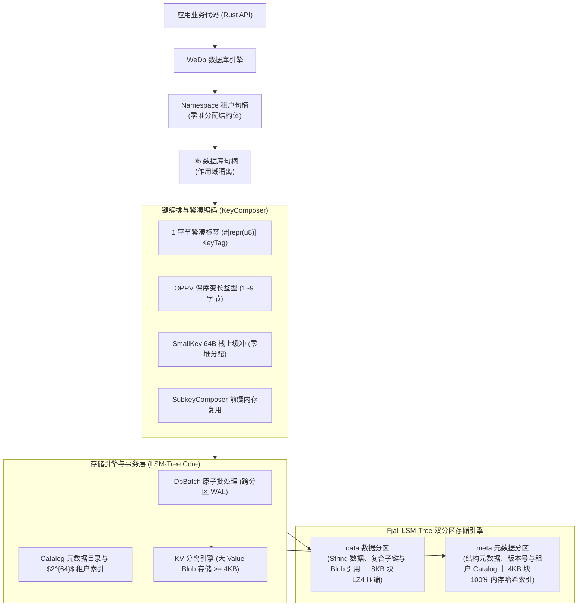
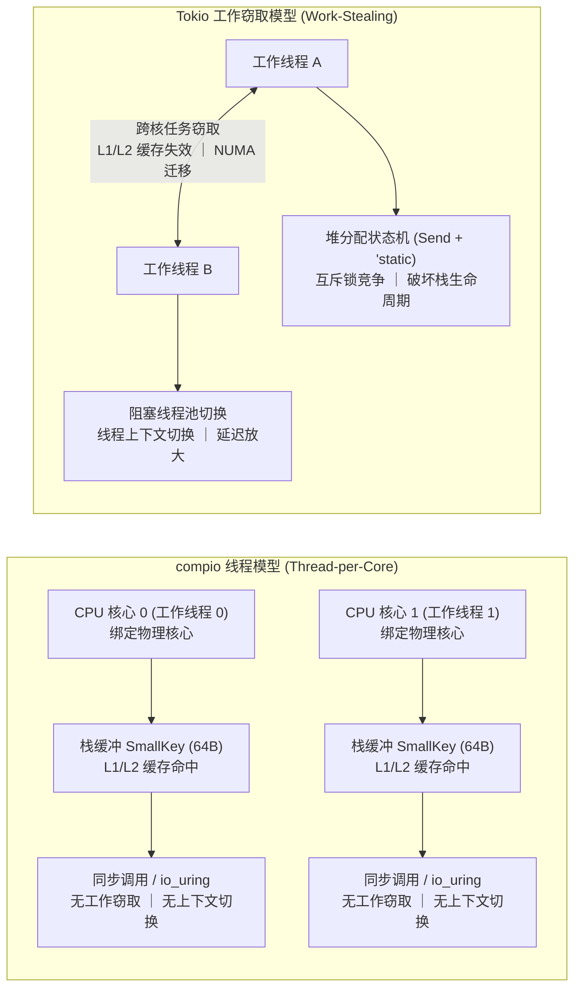

# wedb_embed : Redis 兼容的嵌入式 LSM-Tree 磁盘数据库引擎

嵌入式数据库引擎，提供 Redis 兼容数据结构与接口，基于 [fjall](https://github.com/fjall-rs/fjall) LSM-Tree 存储引擎构建。

<p align="center">
  
  <br>
  <sub><b>测试环境</b>: CPU: AMD EPYC 7763 64-Core Processor (4核) ｜ 内存: 15.6 GB ｜ 硬盘: Azure Managed Virtual Disk (Cloud Standard SSD) ｜ 系统: Ubuntu 24.04.4 LTS (Linux 6.17.0-1022-azure) ｜ Rust: 1.98.0 (88d9e12ae 2026-08-18) ｜ Redis: v8.10.1</sub>
</p>

- **磁盘 I/O 影响**：<br>
  WeDb 为磁盘数据库，性能表现与底层存储硬件 I/O 吞吐紧密相关。<br>
  在 Apple M2（NVMe SSD）实测综合性能约为 Redis 的 40 倍；<br>
  在 GitHub Actions（Linux 云端虚拟磁盘）实测综合性能约为 Redis 的 20 倍。<br>
  两者的性能倍率差异主要源于底层磁盘硬件的 I/O 吞吐与读写延迟差异。

- **内存预算控制**：<br>
  常驻内存由 `cache_size`（默认 512MB 块缓存）与 `max_memtable_size` 参数控制，<br>
  不随磁盘数据量线性膨胀。

---

## 为什么需要嵌入式 Redis 引擎

如同 SQLite 之于 MySQL/PostgreSQL，`wedb_embed` 是 Redis 生态的嵌入式磁盘数据库引擎。

在传统关系型数据库体系中，MySQL 采用独立服务端守护进程与网络套接字通信架构；<br>
SQLite 则以进程内嵌入式库直接将数据持久化于本地磁盘文件，无需独立守护进程与跨进程调用。

在键值与复合数据结构领域，传统 Redis 采用独立守护进程与物理内存常驻架构。<br>
在单机部署、边缘计算、命令行工具与微服务场景中，该架构存在以下系统层面的瓶颈：

- **进程间通信与协议开销**：<br>
  每次数据读写均需经过序列化、操作系统套接字缓冲区、进程上下文切换与 RESP 协议解析。<br>
  即便在本地主机通信，套接字往返延迟通常也在 20~50 微秒区间，并持续消耗 CPU 周期。

- **物理内存成本与容量边界**：<br>
  Redis 将业务数据与内部指针常驻于物理内存中。<br>
  当数据规模增长至数十 GB 时，内存硬件成本上升，且严格受限于单机物理内存容量。<br>
  开启 AOF 或 RDB 持久化时，写时复制（Copy-on-Write）机制可能导致内存翻倍。

- **部署与守护运维复杂度**：<br>
  独立进程需要额外的进程守护、端口监听、配置同步与健康检查，<br>
  增加了软件交付与运维的维护负担。

`wedb_embed` 将存储引擎直接编译并运行在应用程序进程空间内：

- **进程内直接调用**：<br>
  所有 Redis 兼容数据操作通过 Rust 函数直接调用，<br>
  避免了套接字 I/O、系统调用与跨进程上下文切换。<br>
  在同等硬件下，核心指令的 P95 延迟降低至纳秒与微秒级。

- **LSM-Tree 磁盘持久化与内存预算控制**：<br>
  数据经过 LZ4 块压缩存储于本地磁盘文件。<br>
  常驻内存不随数据总量线性增长，由 LSM-Tree 参数严格控制：<br>
  - `cache_size`（默认 512MB）：全局共享的 SSTable 块缓存上限，用于缓存热点数据页；<br>
  - `max_memtable_size`（数据分区 64MB / 元数据分区 32MB）：内存写缓冲上限，达到阈值后自动异步刷盘生成不可变 SSTable；<br>
  - `with_kv_separation`（大 Value 分离阈值 4KB）：大对象直接写入独立 Blob 文件，降低写放大与内存占用。<br>
  在 5GB 结构化数据实测中，Redis 物理内存占用达 4814 MB（RSS），<br>
  `wedb_embed` 常驻内存为 334 MB（降低 93%），物理落盘体积由 Redis AOF 的 7652 MB 压缩至 1180 MB（减少 85%）。

- **16 种 Redis 兼容数据模型**：<br>
  在底层键值引擎之上，支持 String、Hash（支持字段级 TTL）、List、Set、ZSet、Bitmap、JSON、<br>
  Bloom/Cuckoo 过滤器、TimeSeries、Geo、HyperLogLog、TDigest、SortedInt、Stream、全文检索与 HNSW 向量检索。

- **多租户与多库物理隔离**：<br>
  原生支持 $2^{64}$ 个独立租户与数据库。<br>
  命名空间（`ns`）与数据库（`db`）传入 `None` 时自动分配递增编号并创建新实例。

- **崩溃一致性保障**：<br>
  基于预写日志 WAL 与跨分区原子批处理 `WriteBatch`，保障断电与异常退出场景下的数据完整性。

---

## 快速上手

### 添加依赖

```bash
cargo add wedb_embed
```

### 基础用法与多租户

```rust
use anyhow::Result;
use wedb_embed::{Fjall, WeDb};

fn main() -> Result<()> {
    // 打开存储引擎并初始化 WeDb 实例
    let engine = Fjall::open("./data/quickstart_db")?;
    let wedb = WeDb::new(engine);

    // 租户命名空间与多库切换（ns 传入 None 创建新命名空间，db 传入 None 创建新数据库）
    let default_db = wedb.ns(0)?.db(0)?; // 默认命名空间 (0) 与默认数据库 (0)
    let tenant_ns = wedb.ns(None)?;      // 创建新命名空间 (ns_id >= 1)
    let db = tenant_ns.db(None)?;        // 租户下创建新数据库 (db_id >= 1)

    // 字符串读写 (String / KV)
    db.set(b"site", b"webc.site", &[])?;
    let val = db.get(b"site")?;
    assert_eq!(val.as_deref(), Some(&b"webc.site"[..]));

    // 哈希表与有序集合等数据结构操作
    db.hset(b"user:100", &[(b"name".as_slice(), b"Alice".as_slice())])?;
    db.zadd(b"rank", &[(100.0, b"player1".as_slice())], &[])?;

    // 流式遍历活跃命名空间与数据库
    for ns in wedb.iter(0) {
        println!("Namespace: {}", ns.id());
        for db_id in ns.iter(0) {
            println!("  DB: {db_id}");
        }
    }

    // 级联删除与目录注销 (rm)
    db.rm()?;        // 级联删除并注销当前数据库
    tenant_ns.rm()?; // 级联删除并注销该命名空间下的全部数据库

    Ok(())
}
```

[点此查看完整示例代码（包含 16 种数据结构与多租户详细用法）](https://github.com/webc-site/wedb_embed/tree/main/examples)

---

## 性能与资源实测对比

<+ ./bench/zh.md >

---

## 存储架构与编码设计



### 双分区物理存储与前缀编排

- **双分区物理架构 (`data` / `meta`)**：<br>
  - **数据分区 (`data`)**：<br>
    存储 String 原始值、复合结构子键与大 Value Blob 引用。<br>
    采用 8KB 块大小与 LZ4 块压缩，配置大对象 KV 分离（大 Value 写入独立 Blob 文件以降低写放大）。<br>
  - **元数据分区 (`meta`)**：<br>
    存储复合结构元数据（`KeyMeta`）、版本计数器与 Catalog 租户目录。<br>
    采用 4KB 块大小与内存哈希索引，保障元数据点查的亚微秒级延迟。

- **1 字节紧凑标签 (`KeyTag`)**：<br>
  复合结构元数据与子键前缀采用 `#[repr(u8)] KeyTag` 编码（如 `\x01[key]`），<br>
  避免字符串标签带来的存储与解析开销。

- **作用域前缀与多租户隔离**：<br>
  多租户与多数据库统一由 `KeyComposer` 编码为 `\x00[oppv(ns_id)][oppv(db)]` 物理前缀，<br>
  支持 $2^{64}$ 个租户与数据库的隔离存储。

### 保序变长整型编码

- 数据库编号与租户 ID 采用 **OPPV（Order-Preserving Prefix Varint）** 编码：<br>
  - 数值 $0 \sim 127$ 仅占用 1 字节，较固定 8 字节大端序降低空间占用；<br>
  - 编码后的字节序与原始数值大小顺序一致：$\forall a < b \implies \text{encode}(a) < \text{encode}(b)$，支持底层直接进行范围扫描。

### 租户目录编排与级联注销

- 命名空间与数据库采用 `u64` 编号体系，`ns` 或 `db` 传入 `None` 自动分配全局递增 ID。<br>
- 通过 Catalog 目录（`\x00\x71[oppv(ns_id)][oppv(db_id)]`）持久化维护激活索引。<br>
- 支持数据库级与租户级的级联删除与注销（`rm()`），清理数据并更新 Catalog 目录索引。

### 内存友好流式迭代

- **`WeDb::iter(&self, begin: u64) -> Namespaces`**：<br>
  基于 Catalog 前缀流式扫描已激活的租户命名空间列表，<br>
  支持从指定 `begin` 起始偏移开始扫描，辅助内存复杂度为 $O(1)$。

- **`Namespace::iter(&self, begin: u64) -> Dbs`**：<br>
  基于 Catalog 前缀流式解析该租户下所有已激活的数据库编号。

---

## 运行时生态与线程模型设计

`wedb_embed` 针对基于 Linux `io_uring` 的 Thread-per-Core（单线程单核心）异步运行时（例如 `compio`）进行协同设计，<br>
利用单核独占、无共享状态与绑核特性发挥硬件缓存局部性。



### 一线程一核心架构设计

- **栈上生命周期与零堆分配**：<br>
  物理键构建采用 `SmallKey` 64 字节栈缓冲与 `SubkeyComposer` 前缀复用。<br>
  在单线程单核心模型下，执行上下文保持在当前 CPU 核心的栈帧内，<br>
  无需向全局堆分配器（如 `jemalloc` 或 `glibc malloc`）申请内存，避免了多线程堆分配锁争用。

- **CPU 缓存行局部性**：<br>
  工作线程与物理 CPU 核心静态绑定，任务执行不发生跨核迁移。<br>
  热点数据结构（LSM-Tree 内存表索引、布隆过滤器位图、Catalog 元数据缓存）常驻于当前 CPU 的 L1/L2 缓存，<br>
  避免多核缓存一致性协议广播无效化消息导致的缓存行失效。

- **无锁与轻量并发元数据**：<br>
  命名空间与租户目录采用 `papaya::HashMap` 无锁并发哈希表，读操作无等待；<br>
  低频的元数据写操作采用 `parking_lot` 自适应自旋锁，在单核独占环境下自旋即完成，<br>
  不触发内核态 Futex 上下文挂起与跨核唤醒。

- **同步内嵌调用**：<br>
  存储引擎 API 均为同步内存与磁盘直接调用。<br>
  在单线程事件循环中，微秒级与纳秒级查找就地执行，<br>
  与底层 `io_uring` 异步 I/O 配合，避免将 Future 包装为跨线程状态机。

### 传统多线程工作窃取运行时问题分析

在基于多线程工作窃取与 `epoll` 的通用异步运行时中，存在以下性能与调度开销：

- **跨核心任务窃取导致缓存失效**：<br>
  调度器在工作线程空闲时跨核窃取任务。<br>
  同一请求的 Future 在 `await` 恢复后可能被调度到其他 CPU 核心或跨 NUMA 节点，<br>
  导致 L1/L2 缓存失效，增加访存延迟与 P99 尾部延迟。

- **破坏栈生命周期约束**：<br>
  通用异步任务通常要求满足 `Send + 'static` 约束，<br>
  栈上分配的短期借用结构（如 `&[u8]` 切片、栈上 `SmallKey`）无法跨 `await` 点存活，<br>
  需重新分配至堆内存（`Box` / `Arc` / `Vec<u8>`），增加了堆分配开销。

- **事件循环阻塞与线程池切换**：<br>
  在单线程事件循环中直接执行磁盘读取或耗时查找可能阻塞事件循环；<br>
  若转发至阻塞线程池，则引入线程上下文切换、跨线程通道传递与调度排队，<br>
  使微秒级操作延迟增加。

- **多核心内存总线争用**：<br>
  多线程并发访问共享实例时，跨核心原子操作与锁争用会导致内存总线锁争用，<br>
  限制高并发下的吞吐扩展能力。

---

## 技术栈

- **开发语言**：Rust Edition 2024
- **存储引擎**：`fjall` LSM-Tree 存储引擎
- **JSON 引擎**：`sonic-rs` SIMD 指令解析
- **非加密哈希**：`rapidhash`
- **字符串与内存**：`hipstr` 紧凑字符串
- **并发同步**：`parking_lot`
- **集合与位运算**：`roaring`、`memchr`、`crc32fast`、`fastrand`
- **时间戳处理**：`coarsetime`
- **数值与浮点序列化**：`zmij`、`itoa`
- **枚举派生**：`strum`
- **错误处理**：`thiserror`