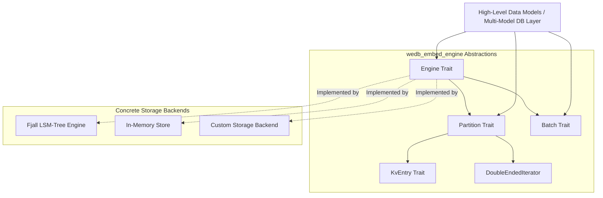

# wedb_embed_engine : Storage Engine Trait Abstractions for Embedded Key-Value Stores

`wedb_embed_engine` provides unified, zero-overhead trait abstractions for embedded key-value storage engines.

By abstracting storage partitions, entry lifetimes, bidirectional range scanning, and cross-partition atomic batch writes,<br>
it enables higher-level multi-model databases (such as Redis-compatible data structures, vector indexes, and search engines) to decouple cleanly from physical storage engines (such as LSM-Trees, B+Trees, or in-memory engines).

---

## Features

In embedded database architecture, decoupling storage engine implementations from higher-level data structures ensures modularity, testability, and backend flexibility.

`wedb_embed_engine` delivers:

- **Unified Storage Interface**:<br>
  Standardizes partition lifecycle, point queries, range scans, and persistence.

- **Zero-Copy Data Access**:<br>
  Utilizes `Deref<Target = [u8]>` associated types to allow zero-copy borrowing from underlying storage buffers.

- **Atomic Multi-Partition Writes**:<br>
  Coordinates write batches spanning multiple keyspaces to guarantee atomic commits across partitions.

- **Bidirectional Range Scans**:<br>
  Provides consistent forward and reverse range iterators with prefix filtering.

---

## Usage Example

The following example demonstrates interacting with storage components via `wedb_embed_engine` traits:

```rust
use std::ops::Bound;
use wedb_embed_engine::{Batch, Engine, KvEntry, Partition};

fn demo<E: Engine>(engine: &E) -> Result<(), E::Error> {
  // Open or create storage partitions
  let data_part = engine.partition("data")?;
  let index_part = engine.partition("index")?;

  // Point read and write operations
  data_part.insert(b"user:001", b"Alice")?;
  if let Some(val) = data_part.get(b"user:001")? {
    assert_eq!(&*val, b"Alice");
  }

  // Bidirectional prefix scan
  data_part.insert(b"user:002", b"Bob")?;
  data_part.insert(b"user:003", b"Charlie")?;

  let mut iter = data_part.prefix(b"user:");
  while let Some(res) = iter.next() {
    let entry = res?;
    println!("Key: {:?}, Val: {:?}", &*entry.key(), &*entry.value());
  }

  // Bounded range scan
  let range_iter = data_part.range((
    Bound::Included(b"user:001"),
    Bound::Excluded(b"user:003"),
  ));
  for res in range_iter {
    let entry = res?;
    println!("Range Entry: {:?} => {:?}", &*entry.key(), &*entry.value());
  }

  // Cross-partition atomic write batch
  let mut batch = engine.batch();
  batch.insert(&data_part, b"user:004", b"David");
  batch.insert(&index_part, b"idx:david", b"user:004");
  batch.rm(&data_part, b"user:001");
  batch.commit()?;

  // Persistence and space inspection
  engine.persist()?;
  let _bytes = engine.disk_space()?;

  Ok(())
}
```

---

## Core Features

- **Zero-Copy Borrowing**:<br>
  All keys and values expose `Deref<Target = [u8]>`, avoiding heap allocations when reading from underlying page caches or memory-mapped regions.

- **Blanket Tuple Implementation**:<br>
  Automatically implements `KvEntry` for any standard tuple `(K, V)` where both types dereference to `[u8]`.

- **Partitioned Keyspaces**:<br>
  Native support for named partitions (`Keyspace`) providing physical isolation between metadata and user data.

- **Atomic Multi-Partition Batching**:<br>
  `Batch` trait provides atomic writes across different partitions, ensuring consistency during crash recovery.

- **Bidirectional Range Scans**:<br>
  `Partition::iter`, `Partition::prefix`, and `Partition::range` return `DoubleEndedIterator` instances for forward and backward traversal.

- **Extensible Metadata Inspection**:<br>
  Built-in methods for checking partition size, emptiness, entry count, SST/Blob file statistics, and physical disk consumption.

---

## Architecture & Design

`wedb_embed_engine` defines an abstraction boundary between high-level database operations and concrete storage backends:



### Module Call Flow

- **Initialization**:<br>
  The caller instantiates a concrete `Engine` implementation.

- **Partition Retrieval**:<br>
  `engine.partition(name)` retrieves a handle implementing `Partition`.

- **Point / Scan Reads**:<br>
  Callers issue point lookups (`get`, `contains_key`, `size_of`) or range queries (`prefix`, `range`, `iter`) directly on the partition handle.

- **Batch Mutations**:<br>
  Callers instantiate a `Batch` via `engine.batch()`, queue cross-partition mutations (`insert`, `rm`, `rm_weak`), and commit atomically via `batch.commit()`.

- **Persistence**:<br>
  Callers invoke `engine.persist()` to flush dirty buffers and write-ahead logs to durable storage.

---

## Tech Stack

- **Language**: Rust Edition 2024
- **Dependencies**: Rust Standard Library (`std::ops::{Bound, Deref}`, `std::error::Error`)
- **Runtime Footprint**: Zero external runtime dependencies

---

## Directory Structure

```
wedb_embed_engine/
├── Cargo.toml
├── README.md
├── README.mdt
├── readme/
│   ├── en.md
│   └── zh.md
├── src/
│   ├── lib.rs
│   └── traits.rs
├── test.sh
└── tests/
    └── main.rs
```

---

## Core API Reference

### `KvEntry`

Trait representing a key-value entry returned by storage iterators.

- **Blanket Implementation**:<br>
  `impl<K, V> KvEntry for (K, V) where K: Deref<Target = [u8]>, V: Deref<Target = [u8]>`
- **Associated Types**:<br>
  - `type Key: Deref<Target = [u8]>`: Key type implementing byte slice dereferencing.<br>
  - `type Value: Deref<Target = [u8]>`: Value type implementing byte slice dereferencing.
- **Methods**:<br>
  - `fn key(&self) -> &Self::Key`: Returns a reference to the entry key.<br>
  - `fn value(&self) -> &Self::Value`: Returns a reference to the entry value.

### `Partition`

Trait representing an isolated keyspace / partition with read and write capabilities.

- **Super Traits**: `Clone + Send + Sync + 'static`
- **Associated Types**:<br>
  - `type Error: StdError + Send + Sync + 'static`: Partition error type.<br>
  - `type Value: Deref<Target = [u8]>`: Value type returned by queries.<br>
  - `type Entry<'a>: KvEntry where Self: 'a`: Entry type yielded by iterators.<br>
  - `type Iter<'a>: Iterator<Item = Result<Self::Entry<'a>, Self::Error>> + DoubleEndedIterator where Self: 'a`: Bidirectional iterator type.
- **Methods**:<br>
  - `fn get(&self, key: &[u8]) -> Result<Option<Self::Value>, Self::Error>`: Retrieves the value associated with the specified key.<br>
  - `fn size_of(&self, key: &[u8]) -> Result<Option<usize>, Self::Error>`: Returns the byte size of the value without fetching its payload.<br>
  - `fn contains_key(&self, key: &[u8]) -> Result<bool, Self::Error>`: Checks whether the key exists.<br>
  - `fn is_empty(&self) -> Result<bool, Self::Error>`: Checks if the partition contains no entries.<br>
  - `fn len(&self) -> Result<usize, Self::Error>`: Returns the number of entries in the partition.<br>
  - `fn approximate_len(&self) -> Result<usize, Self::Error>`: Returns approximate entry count in O(1) time.<br>
  - `fn insert(&self, key: &[u8], value: &[u8]) -> Result<(), Self::Error>`: Inserts a key-value pair.<br>
  - `fn rm(&self, key: &[u8]) -> Result<(), Self::Error>`: Removes a key from the partition.<br>
  - `fn rm_weak(&self, key: &[u8]) -> Result<(), Self::Error>`: Removes a key leaving a weak tombstone.<br>
  - `fn clear(&self) -> Result<(), Self::Error>`: Clears all entries in the partition.<br>
  - `fn iter(&self) -> Self::Iter<'_>`: Returns a bidirectional iterator over all entries in the partition.<br>
  - `fn prefix(&self, prefix: &[u8]) -> Self::Iter<'_>`: Returns a bidirectional iterator over entries matching the given prefix.<br>
  - `fn range(&self, range: (Bound<&[u8]>, Bound<&[u8]>)) -> Self::Iter<'_>`: Returns a bidirectional iterator over entries within the specified byte range.<br>
  - `fn first_entry(&self) -> Result<Option<Self::Entry<'_>>, Self::Error>`: Retrieves the first key-value entry in the partition.<br>
  - `fn last_entry(&self) -> Result<Option<Self::Entry<'_>>, Self::Error>`: Retrieves the last key-value entry in the partition.<br>
  - `fn is_kv_separated(&self) -> bool`: Returns whether key-value separation for large blobs is enabled.<br>
  - `fn fragmented_blob_bytes(&self) -> u64`: Returns unreferenced stale blob bytes.<br>
  - `fn disk_space(&self) -> Result<u64, Self::Error>`: Returns approximate physical disk usage in bytes.<br>
  - `fn table_count(&self) -> usize`: Returns the number of SST table files in the partition.<br>
  - `fn blob_file_count(&self) -> usize`: Returns the number of blob files in the partition.<br>
  - `fn compact(&self) -> Result<(), Self::Error>`: Triggers manual major compaction and GC for this partition.

### `Batch`

Trait representing an atomic write batch spanning one or more partitions.

- **Super Traits**: `Send`
- **Associated Types**:<br>
  - `type Error: StdError + Send + Sync + 'static`: Batch error type.<br>
  - `type Partition: Partition<Error = Self::Error>`: Target partition type.
- **Methods**:<br>
  - `fn insert(&mut self, partition: &Self::Partition, key: &[u8], value: &[u8])`: Queues an insert operation.<br>
  - `fn rm(&mut self, partition: &Self::Partition, key: &[u8])`: Queues a remove operation.<br>
  - `fn rm_weak(&mut self, partition: &Self::Partition, key: &[u8])`: Queues a weak tombstone remove operation.<br>
  - `fn len(&self) -> usize`: Returns the number of queued operations.<br>
  - `fn is_empty(&self) -> bool`: Checks if the write batch contains no operations.<br>
  - `fn commit(self) -> Result<(), Self::Error>`: Atomically commits all queued mutations to underlying storage.

### `Engine`

Trait representing a storage engine instance providing partition management and transactions.

- **Super Traits**: `Send + Sync + 'static`
- **Associated Types**:<br>
  - `type Error: StdError + Send + Sync + 'static`: Storage engine error type.<br>
  - `type Partition: Partition<Error = Self::Error>`: Partition type produced by the engine.<br>
  - `type Batch: Batch<Partition = Self::Partition, Error = Self::Error>`: Batch type produced by the engine.
- **Methods**:<br>
  - `fn partition(&self, name: &str) -> Result<Self::Partition, Self::Error>`: Opens or creates a named partition.<br>
  - `fn partition_exists(&self, name: &str) -> bool`: Checks if a named partition exists.<br>
  - `fn list_partitions(&self) -> Result<Vec<String>, Self::Error>`: Lists all partition names.<br>
  - `fn rm_partition(&self, partition: &Self::Partition) -> Result<(), Self::Error>`: Destroys and removes a partition.<br>
  - `fn write_buffer_size(&self) -> u64`: Returns total write buffer memory usage in bytes.<br>
  - `fn cache_size(&self) -> u64`: Returns current block cache memory usage in bytes.<br>
  - `fn cache_capacity(&self) -> u64`: Returns configured block cache capacity in bytes.<br>
  - `fn outstanding_flushes(&self) -> usize`: Returns the number of pending flush tasks.<br>
  - `fn active_compactions(&self) -> usize`: Returns the number of active background compactions.<br>
  - `fn compactions_completed(&self) -> usize`: Returns the total number of completed compactions.<br>
  - `fn journal_count(&self) -> usize`: Returns the number of WAL journal files on disk.<br>
  - `fn journal_disk_space(&self) -> Result<u64, Self::Error>`: Returns WAL journal disk usage in bytes.<br>
  - `fn batch(&self) -> Self::Batch`: Instantiates a new atomic write batch.<br>
  - `fn batch_with_capacity(&self, capacity: usize) -> Self::Batch`: Instantiates a new atomic write batch with pre-allocated capacity.<br>
  - `fn persist(&self) -> Result<(), Self::Error>`: Persists in-memory memtables and write-ahead logs to durable storage.<br>
  - `fn disk_space(&self) -> Result<u64, Self::Error>`: Returns approximate total physical disk usage in bytes.<br>
  - `fn compact(&self) -> Result<(), Self::Error>`: Triggers major compaction across all partitions.