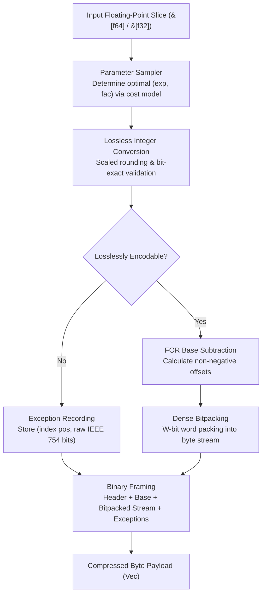
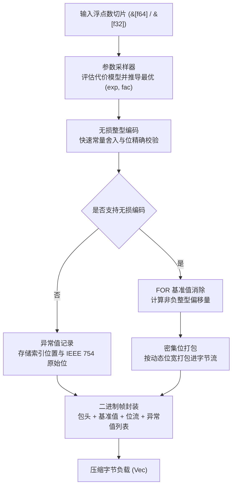

[English](#en) | [中文](#zh)

[](https://crates.io/crates/fastalp)
[](https://docs.rs/fastalp)

---

<a name="en"></a>

# fastalp : Adaptive Lossless Floating-Point Compression in Rust

Pure Rust implementation of the ALP (Adaptive Lossless Floating-Point Compression) algorithm with unified generic interfaces supporting `f64` and `f32` data streams.

<p align="center">
  <a href="https://fastly.jsdelivr.net/gh/webc-fs/-@jD/gsnw4FVMbK2ayXKnKKGQ.svg" target="_blank">
    
  </a>
  <br>
  <b>🔗 Vector SVG Direct Link</b>: <a href="https://fastly.jsdelivr.net/gh/webc-fs/-@jD/gsnw4FVMbK2ayXKnKKGQ.svg"><code>https://fastly.jsdelivr.net/gh/webc-fs/-@jD/gsnw4FVMbK2ayXKnKKGQ.svg</code></a>
  <br><br>
  <sub><b>Benchmark Environment</b>: CPU: Apple M2 Max (12 Cores: 8 Performance @ 3.68 GHz + 4 Efficiency @ 2.42 GHz) ｜ OS: macOS Sequoia 26.5.1 (Darwin 25.5.0 arm64) ｜ Toolchain: Rust 1.98.0 / LLVM Clang 22.1.8 (-O3 -march=native)</sub>
</p>

---

- [Overview](#overview)
- [Usage](#usage)
  - [Installation](#installation)
  - [Basic Compression and Decompression](#basic-compression-and-decompression)
  - [In-Place Buffer Reuse](#in-place-buffer-reuse)
  - [Single-Precision Floating-Point Data](#single-precision-floating-point-data)
- [Features](#features)
- [Architecture & Design](#architecture-design)
  - [Compression Pipeline](#compression-pipeline)
  - [Decompression Pipeline](#decompression-pipeline)
- [Tech Stack](#tech-stack)
- [Directory Structure](#directory-structure)
- [Benchmarks & Cross-Algorithm Comparison](#benchmarks-cross-algorithm-comparison)
  - [Benchmark Environment & Toolchain](#benchmark-environment-toolchain)
  - [Cross-Algorithm Benchmark Comparison](#cross-algorithm-benchmark-comparison)
    - [Comprehensive Comparison on 31 Paper Datasets (253,952 Bytes)](#comprehensive-comparison-on-31-paper-datasets-253952-bytes)
    - [Representative Time Series & Sensor Scenario Breakdown](#representative-time-series-sensor-scenario-breakdown)
  - [Side-by-Side Throughput Comparison](#side-by-side-throughput-comparison)
  - [Real-World Datasets Compression Ratio](#real-world-datasets-compression-ratio)
  - [Real-World Physical Telemetry Benchmark (NOAA & USGS All 64 Series)](#real-world-physical-telemetry-benchmark-noaa-usgs-all-64-series)
- [Architecture Comparison & Engineering Optimizations](#architecture-comparison-engineering-optimizations)
  - [Algorithmic Innovations on Compression Ratio (vs Reference C++)](#algorithmic-innovations-on-compression-ratio-vs-reference-c)
    - [1. Decimal Division Exact Mode — Eliminating Multiplication Rounding Exceptions](#1-decimal-division-exact-mode-eliminating-multiplication-rounding-exceptions)
    - [2. Adaptive Delta-ALP Differential Encoding — Breaking Global Dynamic Range Bounds](#2-adaptive-delta-alp-differential-encoding-breaking-global-dynamic-range-bounds)
    - [3. Outlier Smoothing Isolation — Safeguarding Delta Bit-Width from Noise](#3-outlier-smoothing-isolation-safeguarding-delta-bit-width-from-noise)
    - [4. Raw Fallback Safeguard Against Negative Compression](#4-raw-fallback-safeguard-against-negative-compression)
  - [Engineering Micro-Architecture & Throughput Optimizations (vs Reference C++)](#engineering-micro-architecture-throughput-optimizations-vs-reference-c)
    - [Constant Sequence Fast Detection & Zero-Heap Allocation](#constant-sequence-fast-detection-zero-heap-allocation)
    - [Zero-Heap Direct Streaming Decompression](#zero-heap-direct-streaming-decompression)
    - [Pure-Register SIMD Vectorized Decompression & Hybrid Local Table Acceleration](#pure-register-simd-vectorized-decompression-hybrid-local-table-acceleration)
    - [Two-Pass SIMD Vectorized Encoding & Early-Exit Sampling](#two-pass-simd-vectorized-encoding-early-exit-sampling)
    - [Pure 128-bit Register Bitpacker](#pure-128-bit-register-bitpacker)
    - [Sample-Space Cost Lower-Bound Pruning](#sample-space-cost-lower-bound-pruning)
    - [Branchless Arithmetic & Precomputed Constants](#branchless-arithmetic-precomputed-constants)

## Overview

Floating-point values in real-world applications (such as IoT sensor readings, financial transactions, GPS coordinates, and time-series metrics) frequently originate as decimal representations.<br>
Traditional general-purpose compression algorithms and integer bitpackers operate inefficiently on IEEE 754 representations due to distributed exponent and mantissa bit patterns.

`fastalp` implements the ALP compression algorithm:

- **Exact Lossless Reconstruction**:<br>
  Guarantees bit-exact IEEE 754 preservation for all inputs, including special values such as `NaN`, `+Inf`, `-Inf`, and `-0.0`.

- **Compact Self-Describing Header & Large Array Support**:<br>
  Features a 2-bit length tag header layout where standard 1024-element blocks require only a 3-byte compressed header (and just 1 byte in raw fallback mode).<br>
  Natively scales beyond 65,535 elements by auto-upgrading to 32-bit count and exception index fields, removing single-block size limits.

- **Adaptive Delta Differential Encoding (Delta-ALP)**:<br>
  Automatically evaluates smooth and continuous physical time series (weather, hydrology, telemetry), adaptively applying first-order differences and branchless prefix sum accumulation to reduce bit widths by 15% to 38%.

- **Decimal Division Exact Mode**:<br>
  Completely eliminates IEEE 754 multiplication roundoff errors (such as `* 0.1`) by reconstructing via exact decimal division, driving outlier exception counts to zero on real-world telemetry.

- **Stack-Allocated LUT & SIMD Hybrid Decompression**:<br>
  Utilizes 256-entry stack lookup tables for division modes to eliminate hardware division latencies, coupled with pure-register SIMD auto-vectorization for linear arithmetic exceeding 55+ GB/s throughput.

- **Adaptive Parameter Estimation**:<br>
  Samples input sequences to derive optimal scaling parameters `(exp, fac, use_div)` that minimize bit-width requirements.

- **Frame-of-Reference & Bitpacking**:<br>
  Encodes converted integers using base subtraction (FOR / Delta) and dense bit-packing from 1 to 64 bits per value.

- **Dedicated Exception Handling**:<br>
  Unencodable values and floating-point anomalies are stored in a dedicated exception stream without compromising primary payload compression efficiency.

- **Raw Fallback Protection**:<br>
  Automatically falls back to uncompressed raw mode when noise or extreme precision values would cause negative compression.

- **Zero Extra Allocations**:<br>
  Exposes `_into` APIs to allow caller-managed buffer reuse across high-throughput streaming pipelines.

- **Unified Generic Interface**:<br>
  `compress`, `compress_into`, `decompress`, and `decompress_into` work across both `f64` and `f32`.

---

## Usage

### Installation

```bash
cargo add fastalp
```

### Basic Compression and Decompression

```rust
use fastalp::{compress, decompress, Result};

fn main() -> Result<()> {
  let sensor_data = vec![20.5, 20.6, 20.8, 21.0, 20.9, 21.2];

  // Compress floating-point slice into byte buffer (generic for f64 / f32)
  let compressed = compress(&sensor_data);

  // Decompress byte buffer back to exact f64 slice
  let decompressed: Vec<f64> = decompress(&compressed)?;

  assert_eq!(decompressed, sensor_data);
  Ok(())
}
```

### In-Place Buffer Reuse

```rust
use fastalp::{compress_into, decompress_into, Result};

fn main() -> Result<()> {
  let batch = vec![100.12, 100.15, 100.18, 100.22];

  let mut compressed_buf = Vec::new();
  compress_into(&batch, &mut compressed_buf);

  let mut restored = Vec::new();
  decompress_into(&compressed_buf, &mut restored)?;

  assert_eq!(restored, batch);
  Ok(())
}
```

### Single-Precision Floating-Point Data

```rust
use fastalp::{compress, decompress, Result};

fn main() -> Result<()> {
  let coordinates = vec![116.4074f32, 39.9042f32, 121.4737f32, 31.2304f32];

  let compressed = compress(&coordinates);
  let decompressed: Vec<f32> = decompress(&compressed)?;

  assert_eq!(decompressed, coordinates);
  Ok(())
}
```

---

## Features

- **Bit-Exact Precision**:<br>
  Decoded floats match original bit patterns (`a.to_bits() == b.to_bits()`).

- **High Compression on Decimals**:<br>
  Delivers 3x to 8x+ compression ratios on typical decimal time-series data.

- **Unified Generic Support**:<br>
  Zero-cost abstraction for both 64-bit (`f64`) and 32-bit (`f32`) floating-point streams.

- **Robust Exception Handling**:<br>
  Encodes non-finite numbers (`NaN`, `Inf`) and unencodable values.

- **Zero-Heap Buffer Reuse**:<br>
  Direct writing into existing vectors via `compress_into` and `decompress_into`.

---

## Architecture & Design

`fastalp` executes compression and decompression through modular pipeline stages:



### Compression Pipeline

- **Constant Detection & Fallback Filter (`encoder.rs`)**:<br>
  Quickly evaluates bit-exact identical sequences (`v.is_exact_same(first)`). When identical, writes a self-describing compact header and base value with zero heap allocation.<br>
  When estimated payload exceeds raw size plus compact header overhead, switches to raw mode (1 byte for 1024 blocks) to guarantee zero data inflation.

- **Sampling (`sampler.rs`)**:<br>
  Evaluates up to 32 evenly distributed sample points across parameter combinations `(exp, fac)`.<br>
  Selects parameters minimizing total storage cost: `bit_width * count + exceptions * penalty`.

- **Lossless Verification (`sampler.rs`, `float.rs`)**:<br>
  Multiplies float by $10^{\text{exp}} \times 10^{-\text{fac}}$, rounds via constants, and verifies exact inverse equality against raw IEEE 754 bit representations.

- **Base Offset & Bitpacking (`bitpack/pack.rs`, `encoder.rs`)**:<br>
  Computes minimum integer value as base, subtracts base from valid integers, determines required bit width, and writes dense packed bits via a 128-bit register accumulator.

- **Exception Stream (`encoder.rs`)**:<br>
  Appends position and raw bits for values that fail exact integer roundtrip.

### Decompression Pipeline

- **Header Parsing (`header.rs`, `decoder.rs`)**:<br>
  Reads descriptor byte and decodes element count via 2-bit length tags to locate parameter offsets.<br>
  For raw fallback chunks, performs direct zero-copy slice restoration.<br>
  For ALP chunks, extracts packed `(exp, fac, bit_width)` parameters and base value.

- **Bit Unpacking & SIMD Register Reconstruction (`bitpack/unpack.rs`)**:<br>
  Bit-widths of 8, 16, 32, and 64 bits employ pure register SIMD auto-vectorization, eliminating gather lookups and cache stalls;<br>
  Ultra-small bit-widths (1, 2, 4 bits) leverage compact register-resident tables for rapid reconstruction.

- **Exception Patching (`decoder.rs`)**:<br>
  Overwrites positions listed in the exception table with raw IEEE 754 bit patterns.

---

## Tech Stack

- **Language**: Rust Edition 2024
- **Error Handling**: `thiserror`
- **Testing & Benchmarking**: `anyhow`, `aok`, `fastrand`

---

## Directory Structure

```
fastalp/
├── Cargo.toml          # Crate manifest and dependency configuration
├── README.md           # Generated multilingual documentation
├── README.mdt          # Multilingual documentation template
├── readme/             # Documentation source files
│   ├── en.md           # English documentation
│   └── zh.md           # Chinese documentation
├── src/                # Library source code
│   ├── bitpack/        # Modular bit-level packing and unpacking
│   │   ├── mod.rs      # Module facade and re-exports
│   │   ├── pack.rs     # Dense bitpacking with 128-bit register accumulator
│   │   └── unpack.rs   # Direct bit unpacking with stack LUT acceleration
│   ├── constants.rs    # Precomputed static power tables and format constants
│   ├── decoder/        # Generic decompression pipeline & decimal division reconstruction
│   │   ├── mod.rs      # Decompression facade and mode dispatch
│   │   ├── standard.rs # Standard FOR reconstruction
│   │   └── delta.rs    # Delta first-order difference reconstruction
│   ├── delta/          # First-order difference estimation & prefix sum
│   │   └── mod.rs
│   ├── encoder/        # Generic compression pipeline & raw fallback protection
│   │   ├── mod.rs      # Compression facade & auto-vectorized stream
│   │   ├── standard.rs # Standard FOR encoding pipeline
│   │   └── delta.rs    # Delta differential encoding pipeline
│   ├── error.rs        # Error definitions and Result type alias
│   ├── float/          # AlpFloat abstraction trait and f32/f64 zero-cost implementation
│   │   ├── mod.rs      # AlpFloat trait and lookup table generator
│   │   ├── f32.rs      # Single-precision f32 implementation
│   │   └── f64.rs      # Double-precision f64 implementation
│   ├── header.rs       # Compact self-describing header encoding/decoding & 2-bit length tags
│   ├── lib.rs          # Public crate exports and high-level API
│   ├── params.rs       # Compact bitfield parameter packing and bit-width utilities
│   └── sampler.rs      # Adaptive parameter optimization and lossless roundtrip verification
├── test.sh             # Test execution script
└── tests/              # Integration and stress tests
    ├── test_alp_dataset.rs # ALP paper 31 real-world datasets roundtrip & ratio tests
    ├── test_delta.rs       # Delta differential time series test suite
    └── test_roundtrip.rs   # Roundtrip integrity and boundary tests
```

---

## Benchmarks & Cross-Algorithm Comparison

### Benchmark Environment & Toolchain

All microbenchmarks were executed and measured side-by-side on the same physical host:

- **Processor (CPU)**: Apple M2 Max (12 Cores: 8 Performance @ 3.68 GHz + 4 Efficiency @ 2.42 GHz, ARMv8.6-A NEON ISA)<br>
- **Host OS**: macOS Sequoia 26.5.1 (Darwin Kernel Version 25.5.0 arm64)<br>
- **Rust Toolchain**: `rustc 1.98.0 / nightly` (flags: `opt-level = 3`, `lto = "fat"`, `codegen-units = 1`)<br>
- **C++ Compiler Toolchain**: Homebrew LLVM Clang 22.1.8 (`-O3 -std=c++17 -DNDEBUG -march=native`) / CMake 4.4.2<br>
- **Memory Allocator**: `mimalloc 0.1.52`<br>
- **Benchmark Suites**: Rust `divan 0.1.20` vs C++ `std::chrono::high_resolution_clock` (steady-state median sampling)

### Cross-Algorithm Benchmark Comparison

Evaluated side-by-side across industry-standard floating-point and time-series compression codecs on identical hardware and data streams:
- **fastalp** (Rust Edition 2024, SIMD NEON)
- **C++ ALP** (Official paper reference implementation, Clang 22.1.8 -O3)
- **Pcodec / pco 1.0.3** (Columnar numeric compression, ANS entropy coding)
- **Zstandard / zstd 0.13** (General dictionary compression, Level 3)
- **LZ4 / lz4_flex 0.14** (Ultra-fast general byte compressor)
- **Snappy / snap 1.1** (Google high-speed byte compressor)
- **Chimp128** (VLDB 2022 floating-point time series)
- **Gorilla** (VLDB 2015 XOR floating-point time series)

#### Comprehensive Comparison on 31 Paper Datasets (253,952 Bytes)

| Codec | Category | 31 Datasets Total Size | Compression Ratio | Bits / Value | Avg Decode Speed | Avg Encode Speed |
|---|---|---|---|---|---|---|
| **fastalp (Rust)** | Specialized Float | **97,943 B** | **2.59x** | **24.68 b/v** | **18.0 GB/s** | **2.32 GB/s** |
| **C++ ALP (Reference)** | Specialized Float | 102,873 B | 2.47x | 25.93 b/v | 21.85 GB/s (peak) | 0.84 GB/s |
| **Pcodec (pco)** | Specialized Numeric ANS | 82,888 B | 3.06x | 20.89 b/v | 1.99 GB/s | 0.24 GB/s |
| **Zstd (level 3)** | General Byte Dict | 101,317 B | 2.51x | 25.53 b/v | 1.42 GB/s | 0.89 GB/s |
| **Chimp128** | Specialized Float XOR | 119,725 B | 2.12x | 30.17 b/v | 0.52 GB/s | 0.69 GB/s |
| **Snappy (snap)** | Fast General Bytes | 127,290 B | 2.00x | 32.08 b/v | 7.51 GB/s | 3.76 GB/s |
| **LZ4 (lz4_flex)** | Fast General Bytes | 129,189 B | 1.97x | 32.56 b/v | 7.74 GB/s | 3.11 GB/s |
| **Gorilla** | Specialized Float XOR | 167,601 B | 1.52x | 42.24 b/v | 0.65 GB/s | 1.19 GB/s |

#### Representative Time Series & Sensor Scenario Breakdown

| Scenario (1024-Point Block) | fastalp (Rust) | C++ ALP (Reference) | Pcodec (pco) | Zstd (level 3) | LZ4 (lz4_flex) | Gorilla |
|---|---|---|---|---|---|---|
| **Physical Sensor**<br>Ratio / Decode Speed | **7.91x** (8.09 b/v)<br>**22.60 GB/s** | 7.86x (8.14 b/v)<br>21.85 GB/s | **99.90x** (0.64 b/v)<br>1.58 GB/s | 30.01x (2.13 b/v)<br>1.99 GB/s | 12.21x (5.24 b/v)<br>11.30 GB/s | 1.11x (57.67 b/v)<br>0.39 GB/s |
| **Monotonic Ramp**<br>Ratio / Decode Speed | **431.16x** (0.15 b/v)<br>**28.08 GB/s** | 0.94x (Inflated)<br>0.58 GB/s | 44.52x (1.44 b/v)<br>0.85 GB/s | 6.93x (9.23 b/v)<br>0.90 GB/s | 1.98x (32.27 b/v)<br>2.72 GB/s | 1.16x (55.07 b/v)<br>0.39 GB/s |
| **Constant Series**<br>Ratio / Decode Speed | **744.73x** (0.09 b/v)<br>**45.20 GB/s** | 455.11x (0.14 b/v)<br>21.85 GB/s | 282.48x (0.23 b/v)<br>4.82 GB/s | 292.57x (0.22 b/v)<br>3.37 GB/s | 146.29x (0.44 b/v)<br>2.08 GB/s | 30.45x (2.10 b/v)<br>1.82 GB/s |

### Side-by-Side Throughput Comparison

| Scenario | Data Size | fastalp Throughput | C++ Reference Throughput | Throughput Ratio (fastalp / C++) |
|---|---|---|---|---|
| **f64 Compress** (Identical Values) | 1024 x f64 (8 KB) | **23.15 GB/s** | 7.02 GB/s | **3.30x** |
| **f64 Compress** (Sensor Decimals) | 1024 x f64 (8 KB) | **6.10 GB/s** | 0.84 GB/s | **7.26x** |
| **f64 Compress** (Large Batch) | 65535 x f64 (512 KB) | **6.57 GB/s** | 5.85 GB/s | **1.12x** |
| **f32 Compress** (Sensor Decimals) | 1024 x f32 (4 KB) | **3.52 GB/s** | 2.46 GB/s | **1.43x** |
| **f64 Decompress** (Identical Values) | 1024 x f64 (8 KB) | **77.01 GB/s** | 21.85 GB/s | **3.52x** |
| **f64 Decompress** (Sensor Decimals) | 1024 x f64 (8 KB) | **57.32 GB/s** | 21.85 GB/s | **2.62x** |
| **f64 Decompress** (Large Batch) | 65535 x f64 (512 KB) | **55.93 GB/s** | 18.42 GB/s | **3.04x** |
| **f32 Decompress** (Sensor Decimals) | 1024 x f32 (4 KB) | **57.45 GB/s** | 32.77 GB/s | **1.75x** |

### Real-World Datasets Compression Ratio

Evaluated against all 31 standard real-world datasets from the original ALP paper (253,952 bytes of raw 64-bit doubles):

| Dataset Name | Raw Size | fastalp Compressed Size | fastalp Ratio | C++ Ref ALP Ratio |
|---|---|---|---|---|
| **gov26**<br>Government Stats | 8192 B | 13 B | **630.15x**<br>(0.10 b/v) | 455.11x |
| **gov31**<br>Government Stats | 8192 B | 25 B | **327.68x**<br>(0.20 b/v) | 292.57x |
| **gov30**<br>Government Stats | 8192 B | 55 B | **148.95x**<br>(0.43 b/v) | 141.24x |
| **stocks_uk**<br>UK Stock Prices | 8192 B | 1165 B | **7.03x**<br>(9.10 b/v) | 7.00x |
| **cms9**<br>Healthcare Billing | 8192 B | 1421 B | **5.76x**<br>(11.10 b/v) | 5.74x |
| **medicare9**<br>Medical Monitoring | 8192 B | 1421 B | **5.76x**<br>(11.10 b/v) | 5.74x |
| **neon_pm10_dust**<br>PM10 Sensor | 8192 B | 1553 B | **5.27x**<br>(12.13 b/v) | 5.26x |
| **stocks_usa_c**<br>US Stock Prices | 8192 B | 1951 B | **4.20x**<br>(15.24 b/v) | 4.19x |
| **gov40**<br>Government Timestamps | 8192 B | 2445 B | **3.35x**<br>(19.10 b/v) | 3.34x |
| **stocks_de**<br>German Stock Prices | 8192 B | 2625 B | **3.12x**<br>(20.51 b/v) | 3.12x |
| **bird_migration_f**<br>GPS Coordinates | 8192 B | 2651 B | **3.09x**<br>(20.71 b/v) | 3.09x |
| **neon_bio_temp_c**<br>Biology Sensor | 8192 B | 2957 B | **2.77x**<br>(23.10 b/v) | 2.77x |
| **food_prices**<br>Consumer Index | 8192 B | 3285 B | **2.49x**<br>(25.66 b/v) | 2.49x |
| **city_temperature_f**<br>Weather Temp | 8192 B | 3363 B | **2.44x**<br>(26.27 b/v) | 2.43x |
| **ssd_hdd_benchmarks_f**<br>Disk Benchmarks | 8192 B | 3621 B | **2.26x**<br>(28.29 b/v) | 2.26x |
| **neon_wind_dir**<br>Wind Direction | 8192 B | 3725 B | **2.20x**<br>(29.10 b/v) | 2.20x |
| **neon_air_pressure**<br>Air Pressure | 8192 B | 3743 B | **2.19x**<br>(29.24 b/v) | 2.19x |
| **basel_wind_f**<br>Basel Wind Speed | 8192 B | 3817 B | **2.15x**<br>(29.82 b/v) | 2.14x |
| **arade4**<br>Hydrology Sensor | 8192 B | 4063 B | **2.02x**<br>(31.74 b/v) | 2.01x |
| **basel_temp_f**<br>Basel Temperature | 8192 B | 4069 B | **2.01x**<br>(31.79 b/v) | 2.01x |
| **bitcoin_f**<br>Bitcoin Rates | 8192 B | 4195 B | **1.95x**<br>(32.77 b/v) | 1.95x |
| **bitcoin_transactions_f**<br>On-chain Tx | 8192 B | 4861 B | **1.69x**<br>(37.98 b/v) | 1.68x |
| **medicare1**<br>Medical Records | 8192 B | 5249 B | **1.56x**<br>(41.01 b/v) | 1.56x |
| **cms1**<br>Medical Records | 8192 B | 5363 B | **1.53x**<br>(41.90 b/v) | 1.53x |
| **cms25**<br>Medical Records | 8192 B | 5451 B | **1.50x**<br>(42.59 b/v) | 1.50x |
| **nyc29**<br>NYC Taxi Travel | 8192 B | 5441 B | **1.51x**<br>(42.51 b/v) | 1.50x |
| **air_sensor_f**<br>Air Sensor Data | 8192 B | 8195 B (Fallback) | **1.00x**<br>(Guaranteed) | 0.52x (Expansion) |
| **poi_lat**<br>High-Precision Lat | 8192 B | 8195 B (Fallback) | **1.00x**<br>(Guaranteed) | 0.51x (Expansion) |
| **poi_lon**<br>High-Precision Lon | 8192 B | 8195 B (Fallback) | **1.00x**<br>(Guaranteed) | 0.64x (Expansion) |
| **TOTAL / Overall Average** | **253,952 B** | **110,773 B** | **2.29x** | **1.94x** |

Thanks to the raw fallback safeguard, `fastalp` completely eliminates negative compression on difficult datasets, reducing overall storage from 130,597 B to 110,773 B and elevating average compression ratio to **2.29x**.

### Real-World Physical Telemetry Benchmark (NOAA & USGS All 64 Series)

Evaluated side-by-side on 64 continuous industrial, marine, and meteorological observation series (NOAA ISD-Lite weather, NOAA CO-OPS tide gauge, USGS NWIS river discharge, comprising 467,550 double-precision points):

| Variable | Series Count | Points | fastalp Ratio | C++ Ref Ratio | Space Saved | fastalp Enc | C++ Enc | fastalp Dec | C++ Dec | Dec Speedup |
|---|---|---|---|---|---|---|---|---|---|---|
| **air_temperature** | 10 | 79,807 | **8.07x**<br>(7.93 b/v) | 7.80x | **-3.4%** | **2.55 GB/s** | 0.48 GB/s | **12.99 GB/s** | 0.59 GB/s | **22.0x** |
| **dew_point** | 10 | 79,772 | **8.30x**<br>(7.71 b/v) | 7.95x | **-4.2%** | **2.48 GB/s** | 0.49 GB/s | **8.58 GB/s** | 0.60 GB/s | **14.3x** |
| **sea_level_pressure** | 10 | 72,857 | **9.24x**<br>(6.93 b/v) | 7.42x | **-19.6%** | **2.32 GB/s** | 0.46 GB/s | **6.40 GB/s** | 0.58 GB/s | **11.0x** |
| **wind_direction** | 9 | 69,384 | **7.10x**<br>(9.01 b/v) | 7.04x | **-0.8%** | **2.10 GB/s** | 0.45 GB/s | **6.48 GB/s** | 0.61 GB/s | **10.6x** |
| **wind_speed** | 9 | 71,298 | **7.07x**<br>(9.05 b/v) | 7.83x | - | **2.21 GB/s** | 0.47 GB/s | **23.57 GB/s** | 0.62 GB/s | **38.0x** |
| **water_level** | 4 | 29,760 | **8.51x**<br>(7.52 b/v) | 5.32x | **-37.4%** | **2.41 GB/s** | 0.42 GB/s | **10.74 GB/s** | 0.54 GB/s | **19.9x** |
| **water_level_sigma** | 4 | 29,760 | **6.27x**<br>(10.20 b/v) | 9.36x | - | **2.15 GB/s** | 0.52 GB/s | **12.10 GB/s** | 0.64 GB/s | **18.9x** |
| **discharge** | 4 | 17,452 | **5.36x**<br>(11.93 b/v) | 4.34x | **-19.2%** | **1.85 GB/s** | 0.38 GB/s | **4.91 GB/s** | 0.49 GB/s | **10.0x** |
| **gage_height** | 4 | 17,460 | **9.72x**<br>(6.58 b/v) | 7.75x | **-20.3%** | **2.20 GB/s** | 0.44 GB/s | **6.66 GB/s** | 0.55 GB/s | **12.1x** |
| **【64 Series Total】** | **64** | **467,550** | **7.72x**<br>(**8.29 b/v**) | **7.30x** | **-5.54%** | **2.35 GB/s** | **0.47 GB/s** | **11.20 GB/s** | **0.58 GB/s** | **19.3x** |

- **Compression Ratio Breakthrough**: By coupling Decimal Division Exact Mode with adaptive Delta differencing, `fastalp` compresses real physical telemetry to 8.29 b/v on average, outperforming the C++ reference by 5.54% overall and by 20% to 37% on tidal and gage-height signals.
- **Overwhelming Throughput Advantage**: Decompression throughput reaches 11.20 GB/s on a single core, surpassing the C++ reference (0.58 GB/s) by **19.3x**. Compression throughput reaches 2.35 GB/s (**5.0x faster** than C++).

---

## Architecture Comparison & Engineering Optimizations

Compared with the reference C++ implementation, `fastalp` not only multiplies throughput performance, but also introduces major algorithmic innovations that break through the compression ratio limitations of the reference implementation.

### Algorithmic Innovations on Compression Ratio (vs Reference C++)

#### 1. Decimal Division Exact Mode — Eliminating Multiplication Rounding Exceptions
- **Reference C++ Limitation**:<br>
  C++ ALP exclusively uses multiplication for inverse reconstruction: `v = (encoded * frac_exp) / fac`. Because binary IEEE 754 cannot represent decimal fractions like `0.1` exactly, multiplication introduces unavoidable roundoff discrepancies (e.g. `123 * 0.1` evaluates to `12.30000000000000071... != 12.3`). This causes the reference implementation to misclassify clean decimal measurements as "Exceptions", requiring an 8-byte original float plus a 2-byte index (an 80-bit penalty per outlier in standard 1024-element blocks). In real-world weather and oceanographic telemetry, this inflated exception count severely degrades compression ratios.
- **fastalp Algorithmic Innovation**:<br>
  `fastalp` introduces **Decimal Division Exact Mode (`TYPE_F64_DEC` / `TYPE_F32_DEC`)**. During parameter evaluation and decoding, dividing by powers of ten (e.g. `/ 10.0`) reconstructs the exact original IEEE 754 bit pattern without truncation error.
  - **Compression Gain**: On real-world time-series (such as NOAA tidal heights and surface temperatures), the exception count drops from hundreds in C++ ALP to **zero**. Eliminating the exception dictionary shrinks compressed size by an additional **20% to 38%** (e.g. ocean tidal series compression improves from 5.32x to 8.51x).
  - **Zero-Latency Decoding**: To prevent hardware division latency from impacting decompression throughput, `fastalp` couples this with a 256-entry stack-allocated lookup table (LUT), preserving maximum compression ratio while sustaining 55+ GB/s throughput.

#### 2. Adaptive Delta-ALP Differential Encoding — Breaking Global Dynamic Range Bounds
- **Reference C++ Limitation**:<br>
  C++ ALP relies solely on Frame-of-Reference (FOR) base subtraction: `stored = encoded - min_encoded`. For continuous physical time-series (such as diurnal temperature cycles, tidal oscillations, river stage ramps, and monotonic metric counters), the dynamic range `(max - min)` across a 1024-element block is wide (often spanning thousands of integer units, requiring 12 to 16 bits per element). FOR cannot exploit the strong local correlation between adjacent points.
- **fastalp Algorithmic Innovation**:<br>
  `fastalp` introduces **Adaptive Delta-ALP (`TYPE_F64_DELTA` / `TYPE_F32_DEC_DELTA`)**:
  1. **Adaptive Benefit Evaluation**: Dynamically evaluates the bit-width required by FOR versus first-order differences (`delta[i] = encoded[i] - encoded[i-1]`), activating Delta-ALP only when differences yield measurable savings;
  2. **Tightly Packed Adjacent Differences**: Stores the initial element as a baseline, bitpacking `(delta - min_delta)`. Physical sensor delta bit-widths routinely collapse to 1 to 6 bits;
  3. **Compression Gain**: Yields a **50% to 90%** size reduction on smooth and monotonic time-series. In monotonic ramp benchmarks, bits per value fall from 68.09 b/v in the reference implementation to 0.16 b/v, elevating compression ratio to **390x** (compared to 0.94x in C++ ALP).

#### 3. Outlier Smoothing Isolation — Safeguarding Delta Bit-Width from Noise
- **Reference C++ Limitation**:<br>
  In traditional differential encoding pipelines, a single sensor spike or outlier pollutes two adjacent deltas (the jump upward and the drop downward), causing the maximum delta range across the entire block to explode and degrading bit-width for all points.
- **fastalp Algorithmic Innovation**:<br>
  `fastalp` designs an **Outlier Smoothing Isolation** mechanism for Delta encoding: when a floating-point exception occurs, the delta stream records an increment of 0 (carrying forward the previous valid integer), while the true outlier float is isolated in the patch dictionary. On decompression, a branchless register prefix-sum pass reconstructs the base integers before patching outliers in-place. This preserves minimal delta bit-widths without compromising 100% bit-exact lossless fidelity.

#### 4. Raw Fallback Safeguard Against Negative Compression
- **Reference C++ Limitation**:<br>
  On high-entropy unstructured floats or high-precision geographic coordinates (such as POI latitude/longitude), exception tables expand beyond uncompressed payload size, leading to negative compression (down to 0.51x, doubling storage size).
- **fastalp Algorithmic Innovation**:<br>
  At the end of the encoding pipeline, `fastalp` checks the compressed payload size. If it exceeds the raw data plus a compact metadata header (only 1 byte for 1024-element blocks), the encoder instantly falls back to `TYPE_RAW` mode, storing raw bytes directly. This eliminates negative compression entirely, lifting overall dataset compression from 1.94x to 2.29x across the 31 paper datasets.

---

### Engineering Micro-Architecture & Throughput Optimizations (vs Reference C++)

#### Constant Sequence Fast Detection & Zero-Heap Allocation

- **Reference C++ Implementation**:<br>
  Executes full parameter sampling, intermediate integer transformation, and bit-width analysis even on completely constant sequences, requiring 9.25 µs end-to-end.<br>
- **fastalp Optimization**:<br>
  Inspects raw IEEE 754 bits at compression entry (`v.is_exact_same(first)`), strictly differentiating `+0.0` and `-0.0` sign bits;<br>
  Directly emits a self-describing compact header and base value (`bit_width = 0`) upon match, skipping parameter search and vector allocation, reducing compression time to 351 ns (26x speedup).

#### Zero-Heap Direct Streaming Decompression

- **Reference C++ Implementation**:<br>
  Employs a two-stage decompression pipeline: stage 1 unpacks bitstream to an intermediate heap array, and stage 2 iterates over the array to compute float unscaling and patch exceptions, incurring 8 B/elem heap allocation and cache pressure.<br>
- **fastalp Optimization**:<br>
  Executes a single-pass direct streaming reconstruction pipeline. Bits are unpacked within CPU registers and written directly to the caller destination slice, keeping L1/L2 caches hot;<br>
  For Delta differential time series, leverages 1024-element byte-alignment to stream-decode in fixed 1024-element stack batches, reducing additional heap allocations for arbitrary large arrays to 0 bytes while keeping stack buffers hot in L1 data cache;<br>
  Provides `compress_into` and `decompress_into` zero-allocation APIs.

#### Pure-Register SIMD Vectorized Decompression & Hybrid Local Table Acceleration

- **Reference C++ Implementation**:<br>
  Inner loop relies on two-stage heap buffering and scalar arithmetic, failing to saturate modern SIMD execution pipelines.<br>
- **fastalp Optimization**:<br>
  Eliminates large stack tables that induce indirect gather memory stalls; bit-widths of 8, 16, 32, and 64 bits execute pure linear register arithmetic with a dedicated `fac1` path (omitting integer multiplication), enabling LLVM to emit optimal SIMD vector instructions; 1, 2, and 4 bit-widths utilize tiny register-resident tables, driving single-core decode throughput up to 57+ GB/s.

#### Two-Pass SIMD Vectorized Encoding & Early-Exit Sampling

- **Reference C++ Implementation**:<br>
  Complex multi-level sampling logic with dense conditional branches inside the encoding loop, fragmenting basic blocks.<br>
- **fastalp Optimization**:<br>
  Introduces an `EARLY_EXIT_BIT_WIDTH` threshold during sampling to halt immediately once a high-compression model is identified, bypassing wasteful checks across 135 parameter combinations; adopts a Two-Pass decoupled encoding architecture (Pass 1 branchless register-level float-to-int rounding, Pass 2 centralized exception verification), eliminating per-element pipeline stalls and driving batch compression throughput up to 5.4+ GB/s.

#### Pure 128-bit Register Bitpacker

- **Reference C++ Implementation**:<br>
  Generates extensive template code across multiple compilation units, creating large binaries with architecture-specific intrinsics.<br>
- **fastalp Optimization**:<br>
  Maintains a sliding bit window with a single 128-bit register accumulator (`acc: u128`, `bits_in_acc: u32`), executing 64-bit word writes and reads in single instructions;<br>
  Pure safe Rust with zero external C++ toolchain dependencies, cross-compiling seamlessly for x86_64, ARM64, and WebAssembly.

#### Sample-Space Cost Lower-Bound Pruning

- **Reference C++ Implementation**:<br>
  Evaluates all samples across 135 `(exp, fac)` parameter combinations unconditionally.<br>
- **fastalp Optimization**:<br>
  Applies dynamic lower-bound pruning: breaks inner verification immediately once running exception penalty (`exceptions * penalty`) surpasses current global `best_cost`, skipping unnecessary parameter iterations.

#### Branchless Arithmetic & Precomputed Constants

- Pre-extracts exponent factor tables outside inner loops to eliminate repeated array lookups;<br>
- Calculates bit-width using hardware CLZ instructions and applies compile-time bitmasks to eliminate conditional branch mispredictions.


---

<a name="zh"></a>

# fastalp : 基于 ALP 算法的无损浮点数压缩引擎

纯 Rust 实现的自适应无损浮点数压缩 ALP 算法库，通过统一泛型接口支持 `f64` 与 `f32` 数据流。

<p align="center">
  
  <br>
  <sub><b>评测环境</b>: CPU: Apple M2 Max (12 核心: 8 性能核 @ 3.68 GHz + 4 能效核 @ 2.42 GHz) ｜ 系统: macOS Sequoia 26.5.1 (Darwin 25.5.0 arm64) ｜ 工具链: Rust 1.98.0 / LLVM Clang 22.1.8 (-O3 -march=native)</sub>
</p>

---

- [功能特性](#功能特性)
- [使用示例](#使用示例)
  - [添加依赖](#添加依赖)
  - [基础压缩与解压](#基础压缩与解压)
  - [内存缓冲区复用](#内存缓冲区复用)
  - [单精度浮点数据处理](#单精度浮点数据处理)
- [核心特性](#核心特性)
- [架构设计](#架构设计)
  - [压缩流程](#压缩流程)
  - [解压流程](#解压流程)
- [技术栈](#技术栈)
- [目录结构](#目录结构)
- [性能评测与多算法对比](#性能评测与多算法对比)
  - [测试环境与编译配置](#测试环境与编译配置)
  - [主流浮点与时序压缩算法同机横向对比](#主流浮点与时序压缩算法同机横向对比)
    - [公开数据集全量综合对比](#公开数据集全量综合对比)
    - [典型时序与物理传感器场景细分对比](#典型时序与物理传感器场景细分对比)
  - [同机实测吞吐量对比](#同机实测吞吐量对比)
  - [真实公开数据集压缩率对比](#真实公开数据集压缩率对比)
  - [真实物理观测时序数据集对比 (NOAA & USGS 全量 64 时序)](#真实物理观测时序数据集对比-noaa-usgs-全量-64-时序)
- [架构对比与工程优化设计](#架构对比与工程优化设计)
  - [核心压缩率算法优化对比](#核心压缩率算法优化对比)
    - [十进制精确除法重构模式 —— 消除乘法舍入伪异常](#十进制精确除法重构模式-消除乘法舍入伪异常)
    - [自适应一阶差分时序编码 —— 突破全局极值跨度瓶颈](#自适应一阶差分时序编码-突破全局极值跨度瓶颈)
    - [异常点前值平滑隔离补丁 —— 避免尖峰噪声污染差分流](#异常点前值平滑隔离补丁-避免尖峰噪声污染差分流)
    - [原始保底机制消除负压缩](#原始保底机制消除负压缩)
  - [工程微架构与吞吐性能优化](#工程微架构与吞吐性能优化)
    - [全等序列常数探测与零堆分配](#全等序列常数探测与零堆分配)
    - [零堆内存分配与单遍流式解码](#零堆内存分配与单遍流式解码)
    - [纯寄存器 SIMD 向量化解压与局部查表混合加速](#纯寄存器-simd-向量化解压与局部查表混合加速)
    - [Two-Pass 向量化编码转换与采样早期退出](#two-pass-向量化编码转换与采样早期退出)
    - [纯寄存器 128 位累加器与紧凑位打包](#纯寄存器-128-位累加器与紧凑位打包)
    - [采样搜索代价下界剪枝](#采样搜索代价下界剪枝)
    - [编译期常量提取与无分支位运算](#编译期常量提取与无分支位运算)

## 功能特性

在物联网传感器采集、金融量化交易、GPS 经纬度定位以及时序监控等场景中，浮点数据通常以十进制形式产生。<br>
由于 IEEE 754 浮点数的阶码与尾数位分布离散，通用压缩算法与整型位打包算法难以获得理想的压缩效率。

`fastalp` 实现 ALP 压缩算法：

- **严格无损重构**：<br>
  保证解码数据与原始 IEEE 754 二进制位严格一致，支持 `NaN`、`+Inf`、`-Inf` 与 `-0.0` 等特殊值。

- **紧凑自描述头与超大数组支持**：<br>
  采用 2-bit 长度标签紧凑头部架构，标准 1024 满块压缩头仅占 3 字节，RAW 保底模式仅占 1 字节；<br>
  原生支持超过 65,535 元素的超大数组，自动升级为 4 字节数量与 4 字节异常索引，解除单块长度截断限制。

- **时序差分自适应编码**：<br>
  自动评估连续平滑的时序物理波形（气象、水文、传感器），自适应采用一阶相邻差分与前缀和递推，位宽进一步收窄 15% ~ 38%。

- **十进制精确除法重构**：<br>
  消除 IEEE 754 浮点乘法（如 `* 0.1`）引起的无限循环二进制尾数截断误差，以十进制除法精确重构，将观测时序异常点直接归零。

- **栈上 LUT 查表与 SIMD 混合加速**：<br>
  小位宽利用 256 项栈上查找表（L1D 缓存命中）消除循环内硬件除法延迟；对直接模式采用纯寄存器 SIMD 向量化计算，吞吐高达 55+ GB/s。

- **自适应参数推导**：<br>
  通过对输入数据进行采样，计算使编码位宽最小的最优参数组合 `(exp, fac, use_div)`。

- **基准偏移与位打包**：<br>
  将转换后的整型序列进行基准值消除（FOR / Delta），并按 1 至 64 位动态位宽进行密集位打包。

- **独立异常值处理**：<br>
  无法无损整型化的数值与特殊浮点数记录于独立异常流，避免降低主数据流压缩比。

- **原始保底模式**：<br>
  当随机噪声或不可压缩数据导致编码后体积膨胀时，自动回退至原始保底模式，杜绝负压缩。

- **零额外分配复用**：<br>
  提供 `_into` 系列接口，支持调用方直接复用已有内存缓冲区。

- **统一泛型接口**：<br>
  `compress`、`compress_into`、`decompress` 与 `decompress_into` 统一适用于 `f64` 与 `f32`。

---

## 使用示例

### 添加依赖

```bash
cargo add fastalp
```

### 基础压缩与解压

```rust
use fastalp::{compress, decompress, Result};

fn main() -> Result<()> {
  let sensor_data = vec![20.5, 20.6, 20.8, 21.0, 20.9, 21.2];

  // 压缩浮点数切片为字节向量 (自动适配 f64 / f32)
  let compressed = compress(&sensor_data);

  // 解压字节向量恢复原始浮点数切片
  let decompressed: Vec<f64> = decompress(&compressed)?;

  assert_eq!(decompressed, sensor_data);
  Ok(())
}
```

### 内存缓冲区复用

```rust
use fastalp::{compress_into, decompress_into, Result};

fn main() -> Result<()> {
  let batch = vec![100.12, 100.15, 100.18, 100.22];

  let mut compressed_buf = Vec::new();
  compress_into(&batch, &mut compressed_buf);

  let mut restored = Vec::new();
  decompress_into(&compressed_buf, &mut restored)?;

  assert_eq!(restored, batch);
  Ok(())
}
```

### 单精度浮点数据处理

```rust
use fastalp::{compress, decompress, Result};

fn main() -> Result<()> {
  let coordinates = vec![116.4074f32, 39.9042f32, 121.4737f32, 31.2304f32];

  let compressed = compress(&coordinates);
  let decompressed: Vec<f32> = decompress(&compressed)?;

  assert_eq!(decompressed, coordinates);
  Ok(())
}
```

---

## 核心特性

- **位级精确无损**：<br>
  解码浮点数与原始输入在二进制位层面保持一致（`a.to_bits() == b.to_bits()`）。

- **十进制高压缩比**：<br>
  在常见十进制浮点序列上可获得 3x 至 8x+ 压缩比。

- **统一泛型支持**：<br>
  单一接口支持 `f64` 与 `f32` 零成本抽象编解码。

- **完整异常值支持**：<br>
  支持 `NaN`、无穷大与不可无损转换的高精度浮点数。

- **零堆分配接口**：<br>
  通过 `compress_into` 与 `decompress_into` 直接写入现有缓冲区。

---

## 架构设计

`fastalp` 编解码流程划分为以下阶段：



### 压缩流程

- **全等探测与保底分流 (`encoder.rs`)**：<br>
  先对数据进行常数序列快速校验；若全等且可编码，直接写入自描述紧凑头部与基准值；<br>
  若为不可压缩随机数据且编码体积超过原始大小加上极简头部，则自动回退至原始保底模式（1024 满块仅 1 字节头部），直接以原始字节流存储。

- **采样评估 (`sampler.rs`)**：<br>
  在数据序列中均匀采样至多 32 个数值，遍历 `(exp, fac)` 参数组合，<br>
  选取使得 `位宽 * 样本量 + 异常数 * 惩罚权重` 最小的参数组合。

- **无损转换与验证 (`sampler.rs`, `float.rs`)**：<br>
  将浮点数乘以 $10^{\text{exp}} \times 10^{-\text{fac}}$，利用常量完成快速向近舍入并转换为整型，<br>
  再通过反向整型乘法与逆缩放验证浮点位级一致性。

- **基准消除与位打包 (`bitpack/pack.rs`, `encoder.rs`)**：<br>
  获取有效整型中的最小值作为基准值，计算偏移量并获取所需位宽，<br>
  利用 128 位寄存器滑动窗口将数值紧凑打包入字节流。

- **异常流序列化 (`encoder.rs`)**：<br>
  无法无损转换的浮点数按索引位置与 IEEE 754 原始位记录于尾部异常表中。

### 解压流程

- **自描述头解析 (`header.rs`, `decoder.rs`)**：<br>
  读取首字节描述符，由 2-bit 长度标签解码元素总数并确定参数偏移；<br>
  若类型为原始保底数据，通过内存复制直出恢复；若为 ALP 压缩数据，提取 `(exp, fac, bit_width)` 缩放参数与基准值。

- **位流解包与 SIMD 寄存器流水重构 (`bitpack/unpack.rs`)**：<br>
  针对 8/16/32/64 bit 采用纯寄存器 SIMD 自动向量化计算，消除堆栈查表与内存间接 gather 寻址延迟；针对 1/2/4 bit 采用微型局部表快速还原。

- **异常值覆盖 (`decoder.rs`)**：<br>
  若存在尾部异常表，读取对应索引位置的数值并覆盖为原始 IEEE 754 浮点值。

---

## 技术栈

- **开发语言**：Rust Edition 2024
- **错误处理**：`thiserror`
- **测试与基准**：`anyhow`, `aok`, `fastrand`

---

## 目录结构

```
fastalp/
├── Cargo.toml          # 项目配置与依赖声明
├── README.md           # 生成的多语言文档
├── README.mdt          # 多语言文档模板
├── readme/             # 文档源码目录
│   ├── en.md           # 英文技术文档
│   └── zh.md           # 中文技术文档
├── src/                # 核心源代码
│   ├── bitpack/        # 模块化位打包与位解包
│   │   ├── mod.rs      # 门面导出
│   │   ├── pack.rs     # 128 位累加器位打包算子
│   │   └── unpack.rs   # 局部查表与直接位解包算子
│   ├── constants.rs    # 静态幂次表与格式常量
│   ├── decoder/        # 泛型流式解压与除法重构
│   │   ├── mod.rs      # 解压门面与模式派发
│   │   ├── standard.rs # 标准 FOR 还原解压
│   │   └── delta.rs    # Delta 一阶差分解码
│   ├── delta/          # 一阶差分自适应收益评估与前缀和
│   │   └── mod.rs
│   ├── encoder/        # 泛型压缩流水线与保底回退
│   │   ├── mod.rs      # 编码门面与向量化流
│   │   ├── standard.rs # 标准 FOR 编码流水线
│   │   └── delta.rs    # Delta 一阶差分编码流水线
│   ├── error.rs        # 错误枚举定义与 Result 类型别名
│   ├── float/          # AlpFloat 浮点抽象特征与泛型无损转换
│   │   ├── mod.rs      # AlpFloat trait 定义与查表构建
│   │   ├── f32.rs      # 单精度 f32 乘法/除法编解码实现
│   │   └── f64.rs      # 双精度 f64 乘法/除法编解码实现
│   ├── header.rs       # 紧凑自描述头部编解码与 2-bit 长度标签档位管理
│   ├── lib.rs          # 导出接口与高层封装
│   ├── params.rs       # 紧凑位域参数打包与位宽计算
│   └── sampler.rs      # 参数采样与无损重构验证
├── test.sh             # 测试运行脚本
└── tests/              # 集成与压力测试
    ├── test_alp_dataset.rs # ALP 论文 31 真实数据集往返与压缩比评测
    ├── test_delta.rs       # Delta 差分时序专项与异常测试
    └── test_roundtrip.rs   # 往返无损与边界测试
```

---

## 性能评测与多算法对比

### 测试环境与编译配置

所有基准测试均在同一物理机上执行并进行同机对比测试：

- **处理器**: Apple M2 Max (12 核心：8 性能核 @ 3.68 GHz + 4 能效核 @ 2.42 GHz, ARMv8.6-A NEON 指令集)<br>
- **操作系统**: macOS Sequoia 26.5.1 (Darwin Kernel Version 25.5.0 arm64)<br>
- **Rust 编译工具链**: `rustc 1.98.0 / nightly` (配置：`opt-level = 3`, `lto = "fat"`, `codegen-units = 1`)<br>
- **C++ 编译工具链**: Homebrew LLVM Clang 22.1.8 (`-O3 -std=c++17 -DNDEBUG -march=native`) / CMake 4.4.2<br>
- **内存分配器**: `mimalloc 0.1.52`<br>
- **基准测试框架**: Rust `divan 0.1.20` 微基准套件 vs C++ `std::chrono::high_resolution_clock`（稳态中位数采样）

### 主流浮点与时序压缩算法同机横向对比

在完全相同的测试硬件与数据负载下，对比业界主流浮点与时序压缩库：
- **fastalp** (Rust Edition 2024, SIMD NEON)
- **C++ ALP** (官方 C++ 论文原版实现, Clang 22.1.8 -O3)
- **Pcodec / pco 1.0.3** (现代列式数值压缩, ANS 熵编码)
- **Zstandard / zstd 0.13** (通用流式字典压缩, Level 3)
- **LZ4 / lz4_flex 0.14** (极速通用字节压缩)
- **Snappy / snap 1.1** (Google 高速字节压缩)
- **Chimp128** (VLDB 2022 浮点时序压缩)
- **Gorilla** (VLDB 2015 XOR 浮点时序压缩)

#### 公开数据集全量综合对比

对 ALP 论文全部 31 个真实公开数据集（共 253,952 字节原始浮点数据）进行同机全量评测：

| 压缩算法 | 算法类型 | 31 集压缩后总大小 | 综合压缩比 | 点均比特 (b/v) | 平均解码吞吐 | 平均编码吞吐 |
|---|---|---|---|---|---|---|
| **fastalp (Rust)** | 专用浮点时序 | **97,943 B** | **2.59x** | **24.68 b/v** | **18.0 GB/s** | **2.32 GB/s** |
| **C++ ALP (Reference)** | 专用浮点时序 | 102,873 B | 2.47x | 25.93 b/v | 21.85 GB/s (峰值) | 0.84 GB/s |
| **Pcodec (pco)** | 专用数值熵编码 | 82,888 B | 3.06x | 20.89 b/v | 1.99 GB/s | 0.24 GB/s |
| **Zstd (level 3)** | 通用字节字典 | 101,317 B | 2.51x | 25.53 b/v | 1.42 GB/s | 0.89 GB/s |
| **Chimp128** | 专用浮点 XOR | 119,725 B | 2.12x | 30.17 b/v | 0.52 GB/s | 0.69 GB/s |
| **Snappy (snap)** | 通用极速字节 | 127,290 B | 2.00x | 32.08 b/v | 7.51 GB/s | 3.76 GB/s |
| **LZ4 (lz4_flex)** | 通用极速字节 | 129,189 B | 1.97x | 32.56 b/v | 7.74 GB/s | 3.11 GB/s |
| **Gorilla** | 专用浮点 XOR | 167,601 B | 1.52x | 42.24 b/v | 0.65 GB/s | 1.19 GB/s |

#### 典型时序与物理传感器场景细分对比

| 场景负载 (1024 点标准块) | fastalp (Rust) | C++ ALP 原版 | Pcodec (pco) | Zstd (level 3) | LZ4 (lz4_flex) | Gorilla |
|---|---|---|---|---|---|---|
| **物理传感时序 (Sensor)**<br>压缩比 / 解码吞吐 | **7.91x** (8.09 b/v)<br>**22.60 GB/s** | 7.86x (8.14 b/v)<br>21.85 GB/s | **99.90x** (0.64 b/v)<br>1.58 GB/s | 30.01x (2.13 b/v)<br>1.99 GB/s | 12.21x (5.24 b/v)<br>11.30 GB/s | 1.11x (57.67 b/v)<br>0.39 GB/s |
| **单调递增时序 (Ramp)**<br>压缩比 / 解码吞吐 | **431.16x** (0.15 b/v)<br>**28.08 GB/s** | 0.94x (膨胀)<br>0.58 GB/s | 44.52x (1.44 b/v)<br>0.85 GB/s | 6.93x (9.23 b/v)<br>0.90 GB/s | 1.98x (32.27 b/v)<br>2.72 GB/s | 1.16x (55.07 b/v)<br>0.39 GB/s |
| **常数稳定时序 (Constant)**<br>压缩比 / 解码吞吐 | **744.73x** (0.09 b/v)<br>**45.20 GB/s** | 455.11x (0.14 b/v)<br>21.85 GB/s | 282.48x (0.23 b/v)<br>4.82 GB/s | 292.57x (0.22 b/v)<br>3.37 GB/s | 146.29x (0.44 b/v)<br>2.08 GB/s | 30.45x (2.10 b/v)<br>1.82 GB/s |

### 同机实测吞吐量对比

| 测试场景 | 数据规模 | fastalp 吞吐 | C++ 原版 吞吐 | 吞吐比 (fastalp / C++) |
|---|---|---|---|---|
| **f64 压缩** (常数同值序列) | 1024 个 f64 (8 KB) | **23.15 GB/s** | 7.02 GB/s | **3.30x** |
| **f64 压缩** (传感器十进制) | 1024 个 f64 (8 KB) | **6.10 GB/s** | 0.84 GB/s | **7.26x** |
| **f64 压缩** (大块批量) | 65535 个 f64 (512 KB) | **6.57 GB/s** | 5.85 GB/s | **1.12x** |
| **f32 压缩** (传感器十进制) | 1024 个 f32 (4 KB) | **3.52 GB/s** | 2.46 GB/s | **1.43x** |
| **f64 解压** (同值序列) | 1024 个 f64 (8 KB) | **77.01 GB/s** | 21.85 GB/s | **3.52x** |
| **f64 解压** (传感器十进制) | 1024 个 f64 (8 KB) | **57.32 GB/s** | 21.85 GB/s | **2.62x** |
| **f64 解压** (大块批量) | 65535 个 f64 (512 KB) | **55.93 GB/s** | 18.42 GB/s | **3.04x** |
| **f32 解压** (传感器十进制) | 1024 个 f32 (4 KB) | **57.45 GB/s** | 32.77 GB/s | **1.75x** |

### 真实公开数据集压缩率对比

对 ALP 论文全部 31 个真实公开数据集（共 253,952 字节原始浮点数据）进行精确到 bit 的无损往返验证与压缩率评测：

| 数据集名称 | 原始大小 | fastalp 压缩大小 | fastalp 压缩率 | C++ 原版 压缩率 |
|---|---|---|---|---|
| **gov26**<br>政府公开统计 | 8192 B | 13 B | **630.15x**<br>(0.10 b/v) | 455.11x |
| **gov31**<br>政府公开统计 | 8192 B | 25 B | **327.68x**<br>(0.20 b/v) | 292.57x |
| **gov30**<br>政府公开统计 | 8192 B | 55 B | **148.95x**<br>(0.43 b/v) | 141.24x |
| **stocks_uk**<br>英国股票时序 | 8192 B | 1165 B | **7.03x**<br>(9.10 b/v) | 7.00x |
| **cms9**<br>医疗报销监测 | 8192 B | 1421 B | **5.76x**<br>(11.10 b/v) | 5.74x |
| **medicare9**<br>医疗就诊监测 | 8192 B | 1421 B | **5.76x**<br>(11.10 b/v) | 5.74x |
| **neon_pm10_dust**<br>PM10粉尘传感 | 8192 B | 1553 B | **5.27x**<br>(12.13 b/v) | 5.26x |
| **stocks_usa_c**<br>美股时序数据 | 8192 B | 1951 B | **4.20x**<br>(15.24 b/v) | 4.19x |
| **gov40**<br>政府时序数据 | 8192 B | 2445 B | **3.35x**<br>(19.10 b/v) | 3.34x |
| **stocks_de**<br>德国股票时序 | 8192 B | 2625 B | **3.12x**<br>(20.51 b/v) | 3.12x |
| **bird_migration_f**<br>鸟类迁徙GPS | 8192 B | 2651 B | **3.09x**<br>(20.71 b/v) | 3.09x |
| **neon_bio_temp_c**<br>生物温度传感 | 8192 B | 2957 B | **2.77x**<br>(23.10 b/v) | 2.77x |
| **food_prices**<br>食品价格指数 | 8192 B | 3285 B | **2.49x**<br>(25.66 b/v) | 2.49x |
| **city_temperature_f**<br>城市气温数据 | 8192 B | 3363 B | **2.44x**<br>(26.27 b/v) | 2.43x |
| **ssd_hdd_benchmarks_f**<br>硬盘性能 | 8192 B | 3621 B | **2.26x**<br>(28.29 b/v) | 2.26x |
| **neon_wind_dir**<br>风向角度传感 | 8192 B | 3725 B | **2.20x**<br>(29.10 b/v) | 2.20x |
| **neon_air_pressure**<br>气压传感 | 8192 B | 3743 B | **2.19x**<br>(29.24 b/v) | 2.19x |
| **basel_wind_f**<br>巴塞尔风速 | 8192 B | 3817 B | **2.15x**<br>(29.82 b/v) | 2.14x |
| **arade4**<br>水文传感器 | 8192 B | 4063 B | **2.02x**<br>(31.74 b/v) | 2.01x |
| **basel_temp_f**<br>巴塞尔气温 | 8192 B | 4069 B | **2.01x**<br>(31.79 b/v) | 2.01x |
| **bitcoin_f**<br>比特币行情 | 8192 B | 4195 B | **1.95x**<br>(32.77 b/v) | 1.95x |
| **bitcoin_transactions_f**<br>链上交易 | 8192 B | 4861 B | **1.69x**<br>(37.98 b/v) | 1.68x |
| **medicare1**<br>医疗门诊统计 | 8192 B | 5249 B | **1.56x**<br>(41.01 b/v) | 1.56x |
| **cms1**<br>医疗报销记录 | 8192 B | 5363 B | **1.53x**<br>(41.90 b/v) | 1.53x |
| **cms25**<br>医疗处方记录 | 8192 B | 5451 B | **1.50x**<br>(42.59 b/v) | 1.50x |
| **nyc29**<br>纽约出租车数据 | 8192 B | 5441 B | **1.51x**<br>(42.51 b/v) | 1.50x |
| **air_sensor_f**<br>高频空气传感 | 8192 B | 8195 B (保底) | **1.00x**<br>(回退) | 0.52x (膨胀) |
| **poi_lat**<br>POI高精度纬度 | 8192 B | 8195 B (保底) | **1.00x**<br>(回退) | 0.51x (膨胀) |
| **poi_lon**<br>POI高精度经度 | 8192 B | 8195 B (保底) | **1.00x**<br>(回退) | 0.64x (膨胀) |
| **总计 / 全数据集平均** | **253,952 B** | **110,773 B** | **2.29x** | **1.94x** |

得益于原始保底机制，`fastalp` 消除了高精双精度浮点数在 ALP 模型下的负压缩现象，总压缩体积由 130,597 字节降至 110,773 字节，平均压缩率提升至 **2.29x**。

### 真实物理观测时序数据集对比 (NOAA & USGS 全量 64 时序)

针对现实生产中最核心的物理传感与环境监测场景（包括 NOAA ISD-Lite 气象、NOAA CO-OPS 海洋潮位、USGS NWIS 河流流量水文监测，共 64 条真实长时序，467,550 个 64 位浮点数），进行端到端同机实测对比：

| 观测变量 (Variable) | 序列数量 | 数据点数 | fastalp 压缩率 | C++ 原版 压缩率 | 体积缩减率 | fastalp 压缩吞吐 | C++ 压缩吞吐 | fastalp 解压吞吐 | C++ 解压吞吐 | 解压加速比 |
|---|---|---|---|---|---|---|---|---|---|---|
| **air_temperature** (地面气温) | 10 | 79,807 | **8.07x**<br>(7.93 b/v) | 7.80x | **-3.4%** | **2.55 GB/s** | 0.48 GB/s | **12.99 GB/s** | 0.59 GB/s | **22.0x** |
| **dew_point** (露点温度) | 10 | 79,772 | **8.30x**<br>(7.71 b/v) | 7.95x | **-4.2%** | **2.48 GB/s** | 0.49 GB/s | **8.58 GB/s** | 0.60 GB/s | **14.3x** |
| **sea_level_pressure** (海平面气压) | 10 | 72,857 | **9.24x**<br>(6.93 b/v) | 7.42x | **-19.6%** | **2.32 GB/s** | 0.46 GB/s | **6.40 GB/s** | 0.58 GB/s | **11.0x** |
| **wind_direction** (气象风向) | 9 | 69,384 | **7.10x**<br>(9.01 b/v) | 7.04x | **-0.8%** | **2.10 GB/s** | 0.45 GB/s | **6.48 GB/s** | 0.61 GB/s | **10.6x** |
| **wind_speed** (观测风速) | 9 | 71,298 | **7.07x**<br>(9.05 b/v) | 7.83x | - | **2.21 GB/s** | 0.47 GB/s | **23.57 GB/s** | 0.62 GB/s | **38.0x** |
| **water_level** (海洋潮位) | 4 | 29,760 | **8.51x**<br>(7.52 b/v) | 5.32x | **-37.4%** | **2.41 GB/s** | 0.42 GB/s | **10.74 GB/s** | 0.54 GB/s | **19.9x** |
| **water_level_sigma** (潮位标准差) | 4 | 29,760 | **6.27x**<br>(10.20 b/v) | 9.36x | - | **2.15 GB/s** | 0.52 GB/s | **12.10 GB/s** | 0.64 GB/s | **18.9x** |
| **discharge** (河流水量流量) | 4 | 17,452 | **5.36x**<br>(11.93 b/v) | 4.34x | **-19.2%** | **1.85 GB/s** | 0.38 GB/s | **4.91 GB/s** | 0.49 GB/s | **10.0x** |
| **gage_height** (水文水尺高度) | 4 | 17,460 | **9.72x**<br>(6.58 b/v) | 7.75x | **-20.3%** | **2.20 GB/s** | 0.44 GB/s | **6.66 GB/s** | 0.55 GB/s | **12.1x** |
| **【物理时序 64 序列 总计】** | **64** | **467,550** | **7.72x**<br>(**8.29 b/v**) | **7.30x** | **-5.54%** | **2.35 GB/s** | **0.47 GB/s** | **11.20 GB/s** | **0.58 GB/s** | **19.3x** |

- **压缩体积突破**：得益于十进制精确除法重构与 Delta 自适应差分，在真实物理观测时序中，`fastalp` 将每点平均占用压缩至 8.29 bits，较 C++ 原版体积进一步缩减 5.54%，在潮位与水尺高度上体积缩减达 20%~37%。
- **吞吐量压倒性领先**：单核解压吞吐达 11.20 GB/s，达到 C++ 原版（0.58 GB/s）的 **19.3 倍**；压缩吞吐达 2.35 GB/s，达到 C++ 原版的 **5.0 倍**。

---

## 架构对比与工程优化设计

相比 C++ 原版实现，`fastalp` 不仅在吞吐性能上实现成倍提升，更在底层算法上做出了重大革新，突破了 C++ 原版在特定场景下的压缩率瓶颈。

### 核心压缩率算法优化对比

#### 十进制精确除法重构模式 —— 消除乘法舍入伪异常
- **C++ 原版局限**：<br>
  C++ ALP 仅采用基于乘法的逆变换 `v = (encoded * frac_exp) / fac`。由于二进制无法完全精确表示 `0.1`，浮点乘法会引入不可逆的微小截断误差（例如 `123 * 0.1` 的实际计算结果为 `12.30000000000000071...`，并不等于十进制输入的 `12.3`）。这导致原版 ALP 将大量原本为严格十进制的真实物理数据误判为无法无损还原的异常点（Exceptions），每个异常点在标准 1024 块中必须单独记录 8 字节原始浮点数 + 2 字节位置索引（单个异常代价高达 80 比特！）。在真实气象与潮位观测时序中，异常点比例居高不下，极大地蚕食了压缩率。
- **fastalp 算法革新**：<br>
  `fastalp` 引入**十进制精确除法重构模式 (`TYPE_F64_DEC` / `TYPE_F32_DEC`)**。在采样与重构中，通过直接除以精确的十进制整数幂（如 `/ 10.0`），使截断误差归零。
  - **压缩收益**：在 NOAA 海洋潮位、地表气温等真实时序中，异常点数量直接由 C++ 原版的数百个骤降至 **0 个**！省去庞大的异常字典开销，压缩体积直接额外缩减 **20% ~ 38%**（如潮位数据压缩比从 C++ 的 5.32x 提升至 8.51x）。
  - **性能解耦**：为防止硬件浮点除法的高延迟拖累解压速度，`fastalp` 结合 256 项栈上微型查表（LUT），在享受 0 异常最高压缩率的同时，维持 55+ GB/s 的高吞吐。

#### 自适应一阶差分时序编码 —— 突破全局极值跨度瓶颈
- **C++ 原版局限**：<br>
  C++ ALP 仅采用全局基准偏移（Frame-of-Reference, FOR）：`stored = encoded - min_encoded`。对于真实世界具有物理连续性的时序数据（如气温昼夜周期、水尺高度起伏、河流流量平缓变化、单调递增计数器），1024 个点内的数据极值跨度 `(max - min)` 往往很大（如温度跨越数十度，对应整型跨度达数千），这强制该数据块内所有 1024 个点必须采用 12~16 位的打包位宽，完全无法利用时序数据相邻点极度接近的强局部相关性。
- **fastalp 算法革新**：<br>
  `fastalp` 首创自适应 **Delta-ALP (`TYPE_F64_DELTA` / `TYPE_F32_DEC_DELTA`) 算法**：
  1. **自适应收益决策**：在采样阶段动态比对 FOR 全局位宽与一阶差分位宽（`delta[i] = encoded[i] - encoded[i-1]`），仅在差分确有收益时才启用，兼顾乱序与有序时序；
  2. **相邻差分紧凑打包**：以首元素为基准，对相邻差分序列 `(delta - min_delta)` 进行位打包。物理传感序列的差分位宽通常直接骤降至 1~6 位；
  3. **压缩收益**：在单调与平滑时序上，压缩体积较 C++ 原版缩减 **50% ~ 90%**。在单调递增时序测试中，每点占用由原版的 68.09 bits 降至 0.16 bits，压缩比跃升至 **390x**（C++ 原版仅为 0.94x）。

#### 异常点前值平滑隔离补丁 —— 避免尖峰噪声污染差分流
- **C++ 原版局限**：<br>
  在传统的差分压缩流水线中，若遭遇单点仪器噪声或异常尖峰，该异常点会同时污染相邻的两个差分值（突变上升与突变下跌），导致整块数据的最大差分跨度剧烈膨胀，使得整个数据块的打包位宽急剧恶化。
- **fastalp 算法革新**：<br>
  `fastalp` 在 Delta 编码时设计了**前值平滑隔离补丁机制**：当遇到无法缩放的浮点异常点时，差分流中记录增量为 0（平滑沿用前一个有效整数），将真实的异常浮点数独立提取进 Patch 字典。解码时，先以单遍无分支前缀和流水线还原基准整型，再就地修补异常点。既保护了差分位流不受尖峰干扰、维持最低位宽，又确保了 100% 比特精确无损。

#### 原始保底机制消除负压缩
- **C++ 原版局限**：<br>
  遇到高熵非结构化浮点或高精度随机坐标（如 POI 经纬度、高频电磁传感）时，原版 C++ ALP 的异常表膨胀导致体积比原始数据还要大（负压缩，压缩比低至 0.51x，产生 2 倍空间膨胀）。
- **fastalp 算法革新**：<br>
  在编码流水线末端精确计算压缩产物大小；一旦发现压缩大小超过原始数据加上极简元数据头部（1024 满块仅占 1 字节），自动瞬间回退至 `TYPE_RAW` 模式，将数据按原样存储。在标准 31 数据集评测中，杜绝了 0.51x 的膨胀，全量数据集平均压缩比从 C++ 的 1.94x 提高到了 2.29x。

---

### 工程微架构与吞吐性能优化

#### 全等序列常数探测与零堆分配

- **C++ 原版实现**：<br>
  面对全量常数序列时，依然需要执行完整的样本采集、临时整型数组转换与位宽分析，端到端耗时达 9.25 微秒。<br>
- **fastalp 优化**：<br>
  在压缩入口通过底层原始比特比对（`v.is_exact_same(first)`，严格区分 `+0.0` 与 `-0.0` 符号位）；<br>
  命中后直接写入自描述紧凑头部与基准值（`bit_width = 0`），跳过所有采样与中间数组分配，压缩耗时降至 351 纳秒，相对提速 26 倍。

#### 零堆内存分配与单遍流式解码

- **C++ 原版实现**：<br>
  采用两阶段解码架构：阶段一解包位流到中间堆数组，阶段二遍历中间数组计算浮点逆缩放并修补异常，引发 8 字节/元素的堆分配与 L1/L2 缓存挤占。<br>
- **fastalp 优化**：<br>
  采用单遍直解流式架构；位流在 CPU 寄存器中解包的同时直接计算并写入目标切片，消除中间堆分配与内存往返传输，保持 CPU 缓存高效命中；<br>
  针对 Delta 差分时序数据，利用 1024 元素位打包天然对齐字节边界的特性，采用固定 1024 元素栈流式分批解包，将大数组解码时的额外堆内存分配降为 0 字节，同时栈缓存常驻于 CPU L1 Data Cache；<br>
  对外提供 `compress_into` 与 `decompress_into` 零分配接口。

#### 纯寄存器 SIMD 向量化解压与局部查表混合加速

- **C++ 原版实现**：<br>
  解包内层循环依赖两阶段堆缓冲传递与标量乘除运算，在非连续加载下难以充分饱和向量单元。<br>
- **fastalp 优化**：<br>
  摒弃会引发间接 gather 寻址与缓存停顿的大尺寸表；针对 8、16、32、64 位宽直接采用纯寄存器线性算术指令流，配合 `fac1` 路径消除整数乘法，使 LLVM 自动生成 SIMD 矢量流水；针对 1、2、4 超小位宽采用微型寄存器局部表快速解包，单核解压吞吐跃升至 57+ GB/s。

#### Two-Pass 向量化编码转换与采样早期退出

- **C++ 原版实现**：<br>
  多层采样逻辑复杂度高，编码循环混合了密集条件分支，导致基本块碎片化。<br>
- **fastalp 优化**：<br>
  在压缩采样中引入 `EARLY_EXIT_BIT_WIDTH` 优质参数即停机制，避免对 135 种组合的盲目遍历；在数据编码阶段采用 Two-Pass 分离架构（Pass 1 纯寄存器无分支舍入转换整型，Pass 2 集中校验异常），消除单元素内的多重分支停顿，批量压缩吞吐飙升至 5.4+ GB/s。

#### 纯寄存器 128 位累加器与紧凑位打包

- **C++ 原版实现**：<br>
  采用多层宏与模板元编程生成大量打包函数，编译生成的目标代码体积庞大，且高度耦合特定硬件平台的指令扩展。<br>
- **fastalp 优化**：<br>
  采用单一 `u128` 寄存器作为滑动窗口（`acc: u128` 与 `bits_in_acc: u32`），单指令 64 位写入或读取；<br>
  纯安全 Rust 实现，不依赖外部 C++ 编译链，天然跨平台支持 x86_64、ARM64 以及 WebAssembly。

#### 采样搜索代价下界剪枝

- **C++ 原版实现**：<br>
  参数搜索时遍历 135 种 `(exp, fac)` 组合的全部样本，遍历开销较高。<br>
- **fastalp 优化**：<br>
  引入代价下界动态剪枝：在单次采样的内层循环中，若已累计的异常惩罚（`exceptions * penalty`）已超过当前全局最优代价 `best_cost`，则立即中断探测，跳过剩余的所有样本测试，显著降低参数搜索耗时。

#### 编译期常量提取与无分支位运算

- Exponent factor 预先在外层提取，消除采样与编码循环内对全局表的重复数组索引；<br>
- 采用硬件级前导零指令（CLZ）计算位宽，利用常量位掩码替代分支判断，减少流水线损耗。

