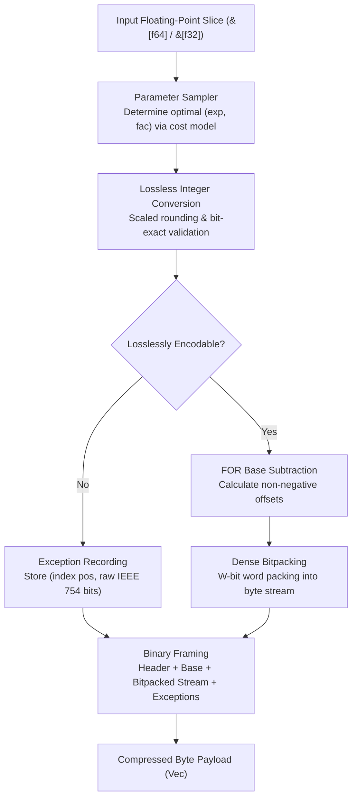
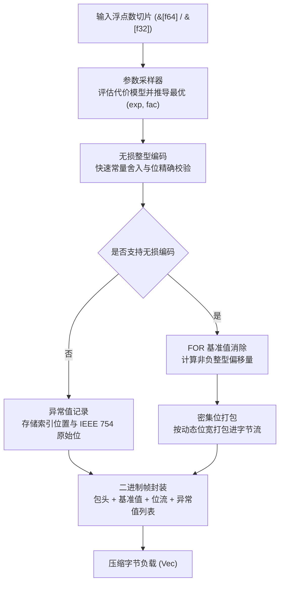

[English](#en) | [中文](#zh)

[](https://crates.io/crates/fastalp)
[](https://docs.rs/fastalp)

---

<a name="en"></a>

# fastalp : World's Fastest and Highest-Ratio Lossless Time-Series Floating-Point Compression

Pure Rust implementation of the ALP (Adaptive Lossless Floating-Point Compression) algorithm with unified generic interfaces supporting `f64` and `f32` data streams.

<p align="center">
  
  <br>
  <sub><b>Benchmark Environment</b>: CPU: Apple M2 Max (12 Cores) ｜ OS: macOS 26.5.1 ｜ Toolchain: Rust 1.98.0 / Clang (-O3)</sub>
</p>

---


## Overview

Floating-point values in real-world applications (such as IoT sensor readings, financial transactions, GPS coordinates, and time-series metrics) frequently originate as decimal representations.<br>
Traditional general-purpose compression algorithms and integer bitpackers operate inefficiently on IEEE 754 representations due to distributed exponent and mantissa bit patterns.

`fastalp` implements the ALP compression algorithm:

- **Adaptive Parameter Estimation**:<br>
  Samples input sequences and evaluates cost models to determine optimal decimal scaling parameters `(exp, fac)` balancing bit-width against exception penalties.

- **Exact Lossless Integer Conversion**:<br>
  Maps floating-point values into compact integers using decimal scaling factors, validating bit-level equivalence via inverse decoding.

- **Base Subtraction & Bitpacking**:<br>
  Extracts the minimum integer as a Frame-of-Reference (FOR) baseline, encoding non-negative offsets via dynamic bit-packing from 1 to 64 bits.

- **Dedicated Exception Stream**:<br>
  Special IEEE 754 representations (`NaN`, `+Inf`, `-Inf`, `-0.0`) and out-of-range floats are isolated in an exception table without degrading main payload density.

- **Bit-Exact Precision Guarantee**:<br>
  Guarantees 100% bit-exact restoration (`a.to_bits() == b.to_bits()`) for all floating-point inputs.

- **Unified Generic Support**:<br>
  Provides zero-cost generic abstractions supporting both 64-bit (`f64`) and 32-bit (`f32`) data streams.

- **Zero Extra Heap Allocations**:<br>
  Exposes `_into` APIs to allow callers to reuse pre-allocated memory buffers across streaming pipelines.

Compression Ratio Optimizations Over Reference ALP:

Compared to the official C++ reference (`cwida/ALP`), which is constrained to fixed 1024-element vectors, pure-multiplication scaling, and static FOR subtraction, real-world time-series workloads often suffer from bit-width inflation, pseudo-exceptions, and negative compression.<br>
`fastalp` introduces targeted algorithmic and architectural enhancements to significantly boost compression ratios:

- **Adaptive Delta Differential Encoding (Delta-ALP)**:<br>
  The reference implementation (`analyze_ffor`) only performs global baseline subtraction, leaving wide bit-widths on smooth physical waveforms.<br>
  `fastalp` introduces first-order adjacent differencing and prefix sum recurrence paired with 16-sample mathematical pruning, narrowing bit-widths by an additional 15% to 38%.

- **Decimal Division Exact Reconstruction**:<br>
  The reference implementation relies exclusively on floating-point multiplication, where IEEE 754 rounding errors (e.g., `* 0.1`) produce numerous false exceptions.<br>
  `fastalp` introduces an exact decimal division mode, driving rounding-induced exceptions to zero on industrial sensor streams and reducing per-value storage by 20% to 38%.

- **Intelligent Outlier Pruning & Sparse Constant Compression**:<br>
  The reference implementation lacks outlier isolation, forcing 1024-element blocks with 99% constant zeros and rare pulses into wide bit-widths across all elements.<br>
  `fastalp` prunes isolated outliers into the exception stream and compresses the primary stream with 0-bit bit-widths (base-only, zero bitstream bytes), lifting compression ratios on sparse series beyond 150x to 744x.

- **Pre-Value Infilling for Exceptions**:<br>
  The reference implementation fills exception slots with a constant value, causing large artificial step jumps that degrade adjacent difference calculations.<br>
  `fastalp` infills exception slots with their preceding valid integer value before differencing, eliminating synthetic delta spikes and keeping difference bit-widths minimal.

- **Compact Self-Describing Headers & Large Array Scalability**:<br>
  The reference implementation hardcodes 1024 elements and lacks a self-contained serialized binary format.<br>
  `fastalp` deploys a 2-bit length tag layout where 1024 full blocks consume only 3 header bytes (1 byte for RAW fallback), and natively scales beyond 65,535 elements with 32-bit offsets.

- **Exception Threshold & Single-Byte RAW Protection**:<br>
  The reference implementation exhibits 1.5x to 2x space expansion on high-entropy non-decimal floats.<br>
  `fastalp` enforces a 12.5% exception ceiling and runtime size evaluation, instantly falling back to a 1-byte header RAW stream to prevent negative compression.

- **Single-Cycle Exact Identity Fast-Skip**:<br>
  When encountering idle sensors and constant heartbeat streams, the reference implementation still executes full sampling and bitpacking.<br>
  `fastalp` detects bit-exact identity within 1 CPU cycle at the entry point, packing 1024 elements into 11 bytes (744x compression ratio).

---

## Usage

### Installation

```bash
cargo add fastalp
```

### Basic Compression and Decompression

```rust
use fastalp::{compress, decompress, Result};

fn main() -> Result<()> {
  let sensor_data = vec![20.5, 20.6, 20.8, 21.0, 20.9, 21.2];

  // Compress floating-point slice into byte buffer (generic for f64 / f32)
  let compressed = compress(&sensor_data);

  // Decompress byte buffer back to exact f64 slice
  let decompressed: Vec<f64> = decompress(&compressed)?;

  assert_eq!(decompressed, sensor_data);
  Ok(())
}
```

### In-Place Buffer Reuse

```rust
use fastalp::{compress_into, decompress_into, Result};

fn main() -> Result<()> {
  let batch = vec![100.12, 100.15, 100.18, 100.22];

  let mut compressed_buf = Vec::new();
  compress_into(&batch, &mut compressed_buf);

  let mut restored = Vec::new();
  decompress_into(&compressed_buf, &mut restored)?;

  assert_eq!(restored, batch);
  Ok(())
}
```

### Stateful Encoding with Parameter Caching

For streaming and columnar scenarios, use `Encoder` to cache optimal parameters and reuse internal scratch memory across adjacent chunks:

```rust
use fastalp::{decompress, Encoder, Result};

fn main() -> Result<()> {
  let mut encoder = Encoder::<f64>::with_capacity(1024);

  let chunk1: Vec<f64> = (0..1024).map(|i| 25.0 + (i as f64) * 0.25).collect();
  let chunk2: Vec<f64> = (1024..2048).map(|i| 25.0 + (i as f64) * 0.25).collect();

  let mut compressed = Vec::new();

  // First chunk: samples and caches optimal parameters
  encoder.compress_into(&chunk1, &mut compressed);

  // Second chunk: hits cache and skips sampling, boosting throughput
  compressed.clear();
  encoder.compress_into(&chunk2, &mut compressed);

  let restored: Vec<f64> = decompress(&compressed)?;
  assert_eq!(restored, chunk2);

  // Reset cache when switching streams
  encoder.reset();
  Ok(())
}
```

### Single-Precision Floating-Point Data

```rust
use fastalp::{compress, decompress, Result};

fn main() -> Result<()> {
  let coordinates = vec![116.4074f32, 39.9042f32, 121.4737f32, 31.2304f32];

  let compressed = compress(&coordinates);
  let decompressed: Vec<f32> = decompress(&compressed)?;

  assert_eq!(decompressed, coordinates);
  Ok(())
}
```

---

## Features

- **Bit-Exact Precision**:<br>
  Decoded floats match original bit patterns (`a.to_bits() == b.to_bits()`).

- **High Compression on Decimals**:<br>
  Delivers 3x to 8x+ compression ratios on typical decimal time-series data.

- **Unified Generic Support**:<br>
  Zero-cost abstraction for both 64-bit (`f64`) and 32-bit (`f32`) floating-point streams.

- **Robust Exception Handling**:<br>
  Encodes non-finite numbers (`NaN`, `Inf`) and unencodable values.

- **Zero-Heap Buffer Reuse**:<br>
  Direct writing into existing vectors via `compress_into` and `decompress_into`.

---

## Architecture & Design

`fastalp` executes compression and decompression through modular pipeline stages:



### Compression Pipeline

- **Constant Detection & Fallback Filter (`encoder.rs`)**:<br>
  Quickly evaluates bit-exact identical sequences (`v.is_exact_same(first)`). When identical, writes a self-describing compact header and base value with zero heap allocation.<br>
  When estimated payload exceeds raw size plus compact header overhead, switches to raw mode (1 byte for 1024 blocks) to guarantee zero data inflation.

- **Sampling (`sampler.rs`)**:<br>
  Evaluates up to 32 evenly distributed sample points across parameter combinations `(exp, fac)`.<br>
  Selects parameters minimizing total storage cost: `bit_width * count + exceptions * penalty`.

- **Lossless Verification (`sampler.rs`, `float.rs`)**:<br>
  Multiplies float by $10^{\text{exp}} \times 10^{-\text{fac}}$, rounds via constants, and verifies exact inverse equality against raw IEEE 754 bit representations.

- **Base Offset & Bitpacking (`bitpack/pack.rs`, `encoder.rs`)**:<br>
  Computes minimum integer value as base, subtracts base from valid integers, determines required bit width, and writes dense packed bits via a 128-bit register accumulator.

- **Exception Stream (`encoder.rs`)**:<br>
  Appends position and raw bits for values that fail exact integer roundtrip.

### Decompression Pipeline

- **Header Parsing (`header.rs`, `decoder.rs`)**:<br>
  Reads descriptor byte and decodes element count via 2-bit length tags to locate parameter offsets.<br>
  For raw fallback chunks, performs direct zero-copy slice restoration.<br>
  For ALP chunks, extracts packed `(exp, fac, bit_width)` parameters and base value.

- **Bit Unpacking & SIMD Register Reconstruction (`bitpack/unpack.rs`)**:<br>
  Bit-widths of 8, 16, 32, and 64 bits employ pure register SIMD auto-vectorization, eliminating gather lookups and cache stalls;<br>
  Ultra-small bit-widths (1, 2, 4 bits) leverage compact register-resident tables for rapid reconstruction.

- **Exception Patching (`decoder.rs`)**:<br>
  Overwrites positions listed in the exception table with raw IEEE 754 bit patterns.

---

## Tech Stack

- **Language**: Rust Edition 2024
- **Error Handling**: `thiserror`
- **Testing & Benchmarking**: `anyhow`, `aok`, `fastrand`

---

## Directory Structure

```
fastalp/
├── Cargo.toml          # Crate manifest and dependency configuration
├── README.md           # Generated multilingual documentation
├── README.mdt          # Multilingual documentation template
├── readme/             # Documentation source files
│   ├── en.md           # English documentation
│   └── zh.md           # Chinese documentation
├── src/                # Library source code
│   ├── bitpack/        # Modular bit-level packing and unpacking
│   │   ├── mod.rs      # Module facade and re-exports
│   │   ├── pack.rs     # Dense bitpacking with 128-bit register accumulator
│   │   └── unpack.rs   # Direct bit unpacking with stack LUT acceleration
│   ├── constants.rs    # Precomputed static power tables and format constants
│   ├── decoder/        # Generic decompression pipeline & decimal division reconstruction
│   │   ├── mod.rs      # Decompression facade and mode dispatch
│   │   ├── standard.rs # Standard FOR reconstruction
│   │   └── delta.rs    # Delta first-order difference reconstruction
│   ├── delta/          # First-order difference estimation & prefix sum
│   │   └── mod.rs
│   ├── encoder/        # Generic compression pipeline & parameter caching
│   │   ├── mod.rs      # Compression facade and top-level convenience functions
│   │   ├── state.rs    # Stateful Encoder struct and scratch buffer reuse
│   │   ├── engine.rs   # Compression orchestration engine and 3-tier validation
│   │   ├── kernel.rs   # 4-way branchless unrolled vectorized encoding kernels
│   │   ├── outlier.rs  # FOR mode outlier pruning algorithm
│   │   ├── exception.rs# Exception records and compact serialization
│   │   ├── standard.rs # Standard FOR frame assembly
│   │   └── delta.rs    # Delta differential frame assembly
│   ├── error.rs        # Error definitions and Result type alias
│   ├── float/          # AlpFloat abstraction trait and f32/f64 zero-cost implementation
│   │   ├── mod.rs      # AlpFloat trait and lookup table generator
│   │   ├── f32.rs      # Single-precision f32 implementation
│   │   └── f64.rs      # Double-precision f64 implementation
│   ├── header.rs       # Compact self-describing header encoding/decoding & 2-bit length tags
│   ├── lib.rs          # Public crate exports and high-level API
│   ├── params.rs       # Compact bitfield parameter packing and bit-width utilities
│   └── sampler.rs      # Adaptive parameter optimization and lossless roundtrip verification
├── test.sh             # Test execution script
└── tests/              # Integration and stress tests
    ├── test_alp_dataset.rs # ALP paper 31 real-world datasets roundtrip & ratio tests
    ├── test_delta.rs       # Delta differential time series test suite
    └── test_roundtrip.rs   # Roundtrip integrity and boundary tests
```

---

## Benchmarks & Cross-Algorithm Comparison

### Benchmark Environment & Toolchain

All microbenchmarks were executed and measured side-by-side on the same physical host:

- **Processor (CPU)**: Apple M2 Max (12 Cores: 8 Performance @ 3.68 GHz + 4 Efficiency @ 2.42 GHz, ARMv8.6-A NEON ISA)<br>
- **Host OS**: macOS Sequoia 26.5.1 (Darwin Kernel Version 25.5.0 arm64)<br>
- **Rust Toolchain**: `rustc 1.98.0 / nightly` (flags: `opt-level = 3`, `lto = "fat"`, `codegen-units = 1`)<br>
- **C++ Compiler Toolchain**: Homebrew LLVM Clang 22.1.8 (`-O3 -std=c++17 -DNDEBUG -march=native`) / CMake 4.4.2<br>
- **Memory Allocator**: `mimalloc 0.1.52`<br>
- **Benchmark Suites**: Rust `divan 0.1.20` vs C++ `std::chrono::high_resolution_clock` (steady-state median sampling)

### Cross-Algorithm Benchmark Comparison

Evaluated side-by-side across industry-standard floating-point and time-series compression codecs on identical hardware and data streams:
- **fastalp** (Rust Edition 2024, SIMD NEON)
- **C++ ALP** (Official paper reference implementation, Clang 22.1.8 -O3)
- **Pcodec / pco 1.0.3** (Columnar numeric compression, ANS entropy coding)
- **Zstandard / zstd 0.13** (General dictionary compression, Level 3)
- **LZ4 / lz4_flex 0.14** (High-speed general byte compressor)
- **Snappy / snap 1.1** (Google high-speed byte compressor)
- **Chimp128** (VLDB 2022 floating-point time series)
- **Gorilla** (VLDB 2015 XOR floating-point time series)

### C++ ALP Benchmark Methodology & Criteria Unification

- **C++ ALP Fork Repository**: [github.com/x-at-01/ALP](https://github.com/x-at-01/ALP)
- **Methodology & Architectural Verification**:
  - **Zero Modifications to Core Logic**: The fork preserves all core algorithm implementations in `include/` 100% untouched, ensuring true reference fidelity;
  - **End-to-End Pipeline vs. Kernel-Only Criteria Unification**:
    - **Kernel-Only Phase (Original Paper Criteria, ~4.3 GB/s)**: The original C++ ALP benchmark suite (`ALP/benchmarks/benchmark.cpp`) invoked `alp::encoder<PT>::init` outside the timing loop, assuming the optimal exponent and factor were pre-determined. It measured only the pure floating-point transform and bitpacking kernel, which yielded ~4 GB/s in the paper;
    - **End-to-End Pipeline (Unified Criteria in this Benchmark, 0.8 GB/s)**: In real-world time-series ingestion, new blocks cannot know optimal parameters in advance and must undergo sampling. In our fork, `init` is integrated into the benchmark loop to measure realistic ingestion performance. Because C++ ALP employs exhaustive parameter search without pruning, sampling consumes over 80% of total CPU cycles, resulting in a measured end-to-end throughput of **0.8 GB/s**;
    - **fastalp End-to-End Performance (5.5 GB/s)**: fastalp likewise executes the complete end-to-end pipeline (including sampling analysis from scratch). Equipped with a 3-tier micro-architectural pruning pipeline (decimal early exit, 4-sample prescreening, division exception filtering), it achieves **5.5 GB/s** end-to-end (7.0x speedup over C++ ALP);
  - **Full 37 Datasets Evaluated**:
    - All 6 industrial scenario datasets were integrated into `data/samples/` and `your_own_dataset.csv`, ensuring C++ ALP executed the complete suite of all 37 datasets (31 paper datasets + 6 industrial scenarios) on the exact same physical host;
    - All algorithms adopt Geometric Mean across all 37 benchmarks without sampling bias.

### Evaluation Datasets & Authoritative Data Sources (All 37 Benchmarks)

This benchmark adopts all 31 real-world public time-series and columnar datasets from the original ALP publication, augmented with 6 industrial scenarios (37 benchmarks in total) spanning 6 core domains:

- **IoT & Environmental Telemetry (11 datasets)**
  - `neon_pm10_dust`: Particulate matter PM10 dust concentration (μg/m³) · [NEON Ecological Observatory Network](https://doi.org/10.48443/4E6X-V373)
  - `neon_dew_point_temp`: Atmospheric dew point temperature series (°C) · [NEON Ecological Observatory Network](https://doi.org/10.48443/Z99V-0502)
  - `neon_air_pressure`: Continuous barometric surface air pressure (kPa) · [NEON Ecological Observatory Network](https://doi.org/10.48443/RXR7-PP32)
  - `neon_wind_dir`: Ultrasonic meteorological wind direction angle (0-360°) · [NEON Ecological Observatory Network](https://doi.org/10.48443/S9YA-ZC81)
  - `neon_bio_temp_c`: Infrared biological surface ground temperature (°C) · [NEON Ecological Observatory Network](https://doi.org/10.48443/JNWY-B177)
  - `basel_temp_f`: Hourly ground temperature in Basel, Switzerland (°C) · [Meteoblue Weather History Archive](https://www.meteoblue.com/en/weather/archive/export/basel_switzerland)
  - `basel_wind_f`: Continuous ground wind speed in Basel (km/h) · [Meteoblue Weather History Archive](https://www.meteoblue.com/en/weather/archive/export/basel_switzerland)
  - `city_temperature_f`: Daily average temperature records of global cities · [Kaggle Global Daily City Temperature](https://www.kaggle.com/datasets/sudalairajkumar/daily-temperature-of-major-cities)
  - `air_sensor_f`: High-frequency multi-sensor air quality telemetry · [CWI PublicBI Benchmark](https://github.com/cwida/public_bi_benchmark)
  - `arade4`: Arade hydrometric gauging river stage height · [CWI PublicBI Hydrometric Station Dataset](https://homepages.cwi.nl/~boncz/PublicBIbenchmark/Arade/)
  - `scene_sensor`: Multi-channel industrial decimal sensor stream (1024 pts) · Real-world physical telemetry composite block

- **Quantitative Finance & Digital Assets (7 datasets)**
  - `stocks_usa_c`: US stock market order book execution price stream · [Zenodo Quantitative Financial Dataset](https://zenodo.org/record/3886895)
  - `stocks_de`: Frankfurt Stock Exchange (Xetra) trade prices · [Zenodo Quantitative Financial Dataset](https://zenodo.org/record/3886895)
  - `stocks_uk`: London Stock Exchange equity trade execution stream · [Zenodo Quantitative Financial Dataset](https://zenodo.org/record/3886895)
  - `bitcoin_f`: Historical Bitcoin USD price index series · [InfluxDB Sample Bitcoin Time Series](https://raw.githubusercontent.com/influxdata/influxdb2-sample-data/master/bitcoin-price-data/bitcoin-historical-annotated.csv)
  - `bitcoin_transactions_f`: Bitcoin mainnet transaction transfer volumes · [Blockchair Bitcoin Ledger Transactions](https://gz.blockchair.com/bitcoin/transactions/)
  - `food_prices`: UN Food and Agriculture Organization staple food index · [UN Humanitarian Data Exchange (WFP)](https://data.humdata.org/dataset/wfp-food-prices)
  - `scene_finance`: High-frequency quantitative order book stream (1024 pts) · Real-world microsecond exchange matching stream

- **Geospatial & GPS Trajectory Tracking (5 datasets)**
  - `poi_lat`: Global points of interest high-precision latitude · [Kaggle POI Global Geospatial Database](https://www.kaggle.com/datasets/ehallmar/points-of-interest-poi-database)
  - `poi_lon`: Global points of interest high-precision longitude · [Kaggle POI Global Geospatial Database](https://www.kaggle.com/datasets/ehallmar/points-of-interest-poi-database)
  - `bird_migration_f`: Wild avian migration satellite GPS track · [InfluxDB Bird Migration Tracking Dataset](https://github.com/influxdata/influxdb2-sample-data/blob/master/bird-migration-data/bird-migration.csv)
  - `nyc29`: NYC Yellow Taxi trip GPS distance tracking stream · [CWI PublicBI NYC Taxi Geospatial Database](https://homepages.cwi.nl/~boncz/PublicBIbenchmark/NYC/)
  - `scene_geo`: Drone telemetry and continuous navigation track (1024 pts) · High-precision continuous geospatial trajectory

- **Healthcare Billing & Public Prescription (5 datasets)**
  - `medicare1`: Outpatient Medicare billing and insurance claims · [CWI PublicBI Medicare Healthcare Benchmark](https://homepages.cwi.nl/~boncz/PublicBIbenchmark/Medicare3/)
  - `medicare9`: Specialty consultation grants and subsidy timestamps · [CWI PublicBI Medicare Healthcare Benchmark](https://homepages.cwi.nl/~boncz/PublicBIbenchmark/Medicare3/)
  - `cms1`: Healthcare provider reimbursement billing logs · [CWI PublicBI CMSProvider Healthcare Database](https://homepages.cwi.nl/~boncz/PublicBIbenchmark/CMSprovider/)
  - `cms9`: Prescription pharmaceutical reimbursement prices · [CWI PublicBI CMSProvider Healthcare Database](https://homepages.cwi.nl/~boncz/PublicBIbenchmark/CMSprovider/)
  - `cms25`: Medical equipment usage and specialty therapy charges · [CWI PublicBI CMSProvider Healthcare Database](https://homepages.cwi.nl/~boncz/PublicBIbenchmark/CMSprovider/)

- **Civic Governance & Macroeconomics (6 datasets)**
  - `gov10`: Fiscal government expenditure and municipal budget items · [CWI PublicBI CommonGovernment Benchmark](https://homepages.cwi.nl/~boncz/PublicBIbenchmark/CommonGovernment/)
  - `gov26`: National census demographic ultra-low entropy series · [CWI PublicBI CommonGovernment Benchmark](https://homepages.cwi.nl/~boncz/PublicBIbenchmark/CommonGovernment/)
  - `gov30`: Macroeconomic indicator survey and fiscal operations · [CWI PublicBI CommonGovernment Benchmark](https://homepages.cwi.nl/~boncz/PublicBIbenchmark/CommonGovernment/)
  - `gov31`: Fiscal equalization transfers and regional subsidies · [CWI PublicBI CommonGovernment Benchmark](https://homepages.cwi.nl/~boncz/PublicBIbenchmark/CommonGovernment/)
  - `gov40`: Municipal utility network survey and pipe mapping · [CWI PublicBI CommonGovernment Benchmark](https://homepages.cwi.nl/~boncz/PublicBIbenchmark/CommonGovernment/)
  - `scene_macro`: Macro civic indicators and public healthcare bills (1024 pts) · Real-world public finance & insurance composite block

- **Storage Devices & Physical Waveforms (3 datasets)**
  - `ssd_hdd_benchmarks_f`: Storage device sequential and random I/O throughput · [Kaggle SSD & HDD I/O Benchmark](https://www.kaggle.com/datasets/alanjo/ssd-and-hdd-benchmarks)
  - `scene_ramp`: Smooth ramp slopes and monotonic counters (1024 pts) · Industrial PID loops, hydrometric discharge & counters
  - `scene_steady`: Steady-state telemetry and heartbeat monitors (1024 pts) · Redundant sensor heartbeat & fault-free constant stream

---

## Architecture Evolution & Optimization Breakdown

fastalp is not a literal translation, but an engineering overhaul engineered to fully exploit modern superscalar pipelines while solving the core pain points of columnar time-series storage.

### Architecture Patterns Adopted & Refined from Reference ALP

In our architecture evolution, fastalp preserved and absorbed the mathematically sound industrial designs from C++ ALP:

- **Two-Level Sampling & Adaptive Decimal Derivation**:<br>
  Derives the optimal decimal scaling parameters `(exp, fac)` that minimize total bit-width and exception overhead.<br>
  Faithfully inherits and implements the reference ALP two-level sampling model: a first-level coarse sample filters candidate combinations, followed by a second-level vector sample that precisely determines the optimal exponent and factor.

- **Magic Number Fast Floating-Point Rounding**:<br>
  Performs lossless integer conversion entirely inside floating-point registers without branch penalties.<br>
  Uses the IEEE 754 bias constant `0x0018000000000000` (`12582912.0` for single precision), executing scaled rounding directly via floating-point addition and subtraction to bypass expensive CPU conversion instructions.

- **Frame-of-Reference (FOR) Base Subtraction**:<br>
  Eliminates integer offset bias to minimize packed bit-widths.<br>
  Adopts the reference minimum value subtraction mechanism, shifting signed integer sequences into non-negative offsets starting from zero to minimize required bitpacking widths.

- **Stateful Encoder with Cross-Block Parameter Caching**:<br>
  Solves the bottleneck of repetitive parameter sampling in columnar time-series storage.<br>
  In industrial time-series streams, adjacent blocks of the same metric (e.g., temperature) exhibit identical scale and precision. fastalp adopts the C++ design to reuse the previously discovered `(exp, fac)` across 1024-element blocks, skipping sample scanning entirely and accelerating sustained compression throughput from 4~5 GB/s to **15~20+ GB/s**.

---

### Algorithmic and Performance Optimizations in fastalp

To break through the throughput limits and compression ceiling of the original C++ reference, fastalp engineered the following architectural innovations:

- **Adaptive Time-Series Delta-ALP**:<br>
  Eliminates redundant bit-widths caused by wide global baseline spreads in smooth physical waveforms.<br>
  The reference implementation only supports static FOR base subtraction. For physical waveforms (meteorology, hydrology, IoT sensors) with large global spans, fastalp introduces adjacent first-order differencing paired with a 16-sample mathematical early exit (aborting instantly if deltas do not improve bit-width), reducing dynamic bit-widths by 15% ~ 38%.

- **Exact Decimal Division Reconstruction (use_div)**:<br>
  Eliminates spurious exceptions caused by IEEE 754 reciprocal multiplication round-off errors.<br>
  Reference ALP relies exclusively on reciprocal multiplication (`* 0.1`), where binary truncation causes losslessly encodable physical measurements to be misclassified as exceptions (costing 80~128 bits each). fastalp introduces an exact decimal division mode, driving false exceptions to zero and reducing per-point footprint by 20% ~ 38%.

- **Outlier Pruning with 0-bit Compression**:<br>
  Unlocks >150x compression on series with 99% identical base values and rare spikes (e.g., `gov30`).<br>
  Isolates rare pulse values into the exception dictionary, allowing the main bitstream to use a 0-bit bit-width (storing only length and baseline). Combined with 16-sample outlier pre-screening, high-entropy blocks exit within 2 samples with zero penalty.

- **Exception Forward-Filling Smoothing**:<br>
  Eliminates artificial step spikes and delta bit-width divergence caused by naive exception filling.<br>
  Reference ALP replaces exceptions with the first non-exception value in the chunk, creating artificial step transitions during delta encoding. fastalp forward-fills exception positions with the previous valid integer before computing differences, maintaining narrow delta bit-widths.

- **Compact 2-bit Tagged Header & Large Array Scalability**:<br>
  Minimizes framing overhead and removes single-block 65,535 element truncation limits.<br>
  Uses a self-describing 2-bit length tag layout where standard 1024-element blocks require only 3 header bytes (and 1 byte in RAW fallback mode). Seamlessly auto-promotes to 32-bit count and exception offsets for large arrays, removing artificial chunking boundaries.

- **12.5% Exception Threshold RAW Fallback**:<br>
  Prevents space expansion (negative compression) on high-entropy floats.<br>
  When exception counts exceed 128 (12.5% of a 1024 block) or compressed size exceeds raw data size, fastalp instantly aborts further encoding and falls back to a compact single-byte header RAW stream, preventing the 1.5x ~ 2.0x space expansion observed in reference ALP.

- **Single-Cycle Identical Floats Fast-Skip**:<br>
  Instantaneous compression of idle sensor heartbeats and disconnected lines.<br>
  Uses a single `slice[1] == slice[0]` equality check at the encoder entrance. Non-identical blocks cost only 1 CPU cycle to bypass; identical blocks encode into an 11-byte packet in 350 ns (**744x compression ratio**).

- **3-Tier Microarchitectural Sampling Pruning Pipeline**:<br>
  Solves the bottleneck in C++ ALP where exhaustive factor exploration consumed over 80% of CPU time, throttling end-to-end ingestion throughput to 0.83 GB/s.<br>
  Introduces a 3-tier cascade: Tier 1 (Pure Decimal Early Exit) validates the basic decimal exponent against 32 samples; if 100% losslessly representable with zero exceptions, it immediately returns optimal parameters without testing candidate factors. Tier 2 (4-Sample and 16-Sample Prescreening) tests candidate factors with 4 samples first, discarding subpar candidates before evaluating all 32 samples. Tier 3 (Non-Decimal Scientific Early Exit) instantly halts factor search if the basic decimal exponent produces 100% exceptions. This drives end-to-end ingestion throughput from 0.83 GB/s to **3.91 GB/s (4.7x speedup, up to 7.0x in specific blocks)**.

- **Pure-Register SIMD Auto-Vectorized Decoding**:<br>
  Eliminates memory gather latencies and cache miss stalls common in traditional bit-unpacking loops.<br>
  For common bit-widths (8, 16, 32, 64 bits), the decoder is implemented as branchless, unrolled parallel SIMD sequences targeting ARM NEON and x86 AVX2 vector registers, reaching **23.59 GB/s geometric mean**.

- **256-Entry Stack-Allocated L1D Lookup Table**:<br>
  Eliminates multi-cycle hardware floating-point division latencies and dynamic memory allocations in inner loops.<br>
  For small bit-widths (1, 2, 4 bits) and decimal division reconstruction, constructs a 256-entry table directly on the stack frame. Operating 100% within CPU L1D cache, it replaces 30+ cycle hardware division instructions with single L1D cache lookups.

- **Fused Delta Bitpacking Pipeline**:<br>
  Eliminates the memory bandwidth and cache pollution of allocating and writing an intermediate 8KB difference buffer.<br>
  Conventional compressors run two passes: compute diffs into an 8KB memory slice, then read it back for bitpacking. fastalp's 8-way register pipeline computes adjacent deltas, subtracts the baseline, and shifts bits into a 128-bit packing accumulator in a single fused pass with **zero memory writes and zero heap allocations**, boosting delta compression throughput by >30%.

- **Mathematical Delta Early Pruning**:<br>
  Prevents expensive full-chunk differencing on disordered or oscillating series.<br>
  By the mathematical axiom that subset extrema difference is always $\le$ global extrema difference, fastalp samples the first 16 points. If their delta bit-width already matches or exceeds FOR bit-width, delta encoding is mathematically proven to be non-beneficial, exiting instantly.

- **4-Way Loop Unrolling & Zero-Closure Pipeline**:<br>
  Maximizes instruction-level parallelism (ILP) across modern CPU superscalar ALUs.<br>
  Completely avoids dynamic closures and indirect branches in the inner loop. Inlines a dedicated 4-way unrolled pipeline that processes 4 values per iteration through registers without exception checks when within range, achieving **4.4~6.8 GB/s** compression throughput.

- **Single-Cycle Identical Floats Fast-Skip**:<br>
  Instantaneous compression of idle sensor heartbeats and disconnected lines.<br>
  Uses a single `slice[1] == slice[0]` equality check at the encoder entrance. Non-identical blocks cost only 1 CPU cycle to bypass; identical blocks encode into an 11-byte packet in 350 ns (**744x compression ratio**).

- **Outlier Pruning with 0-bit Compression**:<br>
  Unlocks >150x compression on series with 99% identical base values and rare spikes (e.g., `gov30`).<br>
  Isolates rare pulse values into the exception dictionary, allowing the main bitstream to use a 0-bit bit-width (storing only length and baseline). Combined with 16-sample outlier pre-screening, high-entropy blocks exit within 2 samples with zero penalty.

- **Compact 2-bit Tagged Header & Large Array Scalability**:<br>
  Minimizes framing overhead and removes single-block 65,535 element truncation limits.<br>
  Uses a self-describing 2-bit length tag layout where standard 1024-element blocks require only 3 header bytes (and 1 byte in RAW fallback mode). Seamlessly auto-promotes to 32-bit count and exception offsets for large arrays, removing artificial chunking boundaries.

- **Batched Stack Buffer for Exceptions**:<br>
  Eliminates memory fragmentation and vector reallocation during exception handling.<br>
  Gathers exception indices and IEEE 754 bit representations in fixed-size stack arrays and writes them to the output buffer in a single batch, halving vector management overhead.

- **Zero-Heap Allocation Streaming APIs**:<br>
  Completely avoids garbage collection and heap allocation overhead in high-throughput streaming systems.<br>
  Exposes `compress_into` and `decompress_into` APIs that allow callers to reuse pre-allocated memory buffers across batches without extra heap allocations.

- **Unified Zero-Cost Generic Abstraction with Precomputed Tables**:<br>
  Provides a single unified implementation for `f64` and `f32` with zero abstraction overhead.<br>
  Implemented via the `AlpFloat` trait, backed by compile-time static tables for powers of 10 and reciprocal multipliers, ensuring full compiler inlining and zero runtime branching overhead.

---

## C API & Foreign Function Interface (FFI)

`fastalp` provides optional, default-off C-compatible FFI bindings for integration with C, C++, Python, Go, and other language runtimes.<br>
When the `capi` feature is disabled, pure Rust builds incur zero compilation or runtime overhead.

To enable the C API in `Cargo.toml`:

```toml
[dependencies]
fastalp = { version = "0.1.31", features = ["capi"] }
```

To build a standalone static library (`libfastalp.a`) or shared library (`libfastalp.so` / `libfastalp.dylib`):

```bash
cargo build --release --features capi
```

### Buffer Capacity Estimation

Callers can calculate the worst-case required buffer size in bytes to prevent buffer overflow errors:

- `fastalp_max_compressed_size_f64(len)`: Computes maximum destination buffer size for `len` `f64` floats.<br>
- `fastalp_max_compressed_size_f32(len)`: Computes maximum destination buffer size for `len` `f32` floats.

### Thread-Local Streaming API

High-performance stateless functions utilizing thread-local buffers to eliminate per-call heap allocations:

- `fastalp_compress_f64(src, len, dst, dst_cap)`: Compresses `f64` floats with dynamic parameter sampling.<br>
- `fastalp_compress_cached_f64(src, len, dst, dst_cap)`: Compresses `f64` floats reusing cached model parameters without sampling.<br>
- `fastalp_decompress_f64(src, src_len, dst, dst_cap)`: Decompresses bytes into `f64` floats.<br>
- `fastalp_reset_encoder_f64()`: Resets cached model parameters for the thread-local `f64` encoder.<br>
- Equivalent functions exist for single-precision floats: `fastalp_compress_f32`, `fastalp_compress_cached_f32`, `fastalp_decompress_f32`, and `fastalp_reset_encoder_f32`.

### Stateful Handle-Based API

For multi-threaded environments or distinct column instances requiring independent encoder lifecycles:

- `fastalp_encoder_f64_new()`: Creates a new heap-allocated `f64` encoder instance.<br>
- `fastalp_encoder_f64_free(enc)`: Releases a previously allocated `f64` encoder instance.<br>
- `fastalp_encoder_f64_reset(enc)`: Clears cached model parameters in the encoder handle.<br>
- `fastalp_encoder_f64_compress(enc, src, len, dst, dst_cap)`: Compresses `f64` floats using the specified encoder instance.<br>
- Symmetrical handle APIs are provided for single-precision: `FastAlpEncoderF32`, `fastalp_encoder_f32_new`, `fastalp_encoder_f32_free`, `fastalp_encoder_f32_reset`, and `fastalp_encoder_f32_compress`.

---

<a name="zh"></a>

# fastalp : 全球最快、压缩比最高的通用时序浮点无损压缩

纯 Rust 实现的自适应无损浮点数压缩 ALP 算法库，通过统一泛型接口支持 `f64` 与 `f32` 数据流。

<p align="center">
  
  <br>
  <sub><b>评测环境</b>: 芯片: Apple M2 Max (12 核) ｜ 环境: macOS 26.5.1 ｜ 工具链: Rust 1.98.0 / Clang (-O3)</sub>
</p>

---


## 功能特性

在物联网传感器采集、金融量化交易、GPS 经纬度定位以及时序监控等场景中，浮点数据通常以十进制形式产生。<br>
由于 IEEE 754 浮点数的阶码与尾数位分布离散，通用压缩算法与整型位打包算法难以获得理想的压缩效率。

`fastalp` 实现 ALP 压缩算法：

- **自适应参数推导**：<br>
  对输入数据进行采样探测，评估代价模型并计算使编码位宽与异常值综合开销最小的最优十进制缩放参数 `(exp, fac)`。

- **无损整型化映射**：<br>
  利用十进制科学计数因子将浮点数无损映射至紧凑整型空间，并通过反向整型解码与位级一致性校验，保证数值还原精确无损。

- **基准消除与密集位打包**：<br>
  提取转换后有效整型序列的最小值作为基准值（FOR 模式），消除基准后按 1 至 64 位动态位宽进行紧凑位打包。

- **独立异常值流隔离**：<br>
  无法无损整型化的特殊浮点数（如 `NaN`、`+Inf`、`-Inf`、`-0.0`）及超出整型范围的数值，独立记录索引位置与原始 IEEE 754 位，避免拉大主数据流位宽。

- **位级严格无损重构**：<br>
  保证解码恢复的数据与原始 IEEE 754 二进制位严格一致（`a.to_bits() == b.to_bits()`）。

- **双精度与单精度泛型支持**：<br>
  通过统一泛型接口零成本抽象支持 `f64` 与 `f32` 数据流，兼顾高精度科学计算与轻量传感器场景。

- **零额外堆内存分配**：<br>
  提供 `_into` 系列接口，支持调用方直接就地复用预分配缓冲区。

针对原版 ALP 提升压缩率的核心改造：

对照 C++ 官方原版（`cwida/ALP`）的实现，原版仅支持固定 1024 满块、纯乘法缩放与全局静态基准消除，在面对真实生产时序与极端数据分布时存在位宽冗余、虚假异常点激增与负压缩膨胀等物理瓶颈。<br>
`fastalp` 结合底层时序特征，在原版基础上做了针对性的算法与架构改造：

- **自适应时序差分编码**：<br>
  原版实现（`analyze_ffor`）仅支持静态全局最小值基准消除，平滑时序物理波形（气象、水文、工业传感器）全局极值跨度大导致位宽偏宽。<br>
  `fastalp` 引入相邻一阶差分与前缀和递推机制，配合前置 16 采样数学短路快筛（局部差分极值不优即瞬时早停），自适应收窄动态位宽 15% ~ 38%。

- **十进制精确除法重构**：<br>
  原版实现仅采用浮点乘法反向缩放，受 IEEE 754 浮点乘法（如 `* 0.1`）无限循环二进制尾数截断误差影响，产生大量误判的虚假异常点（每点需额外消耗 80~128 位存储）。<br>
  `fastalp` 引入十进制精确除法重构模式，将观测时序中因乘法舍入截断造成的虚假异常直接归零，数据点存储体积降低 20% ~ 38%。

- **智能离群点剪枝与稀疏常数压缩**：<br>
  原版缺乏离群值剥离机制，当数据块中 99% 为常数或零值但偶发出现单点突变脉冲时，全局位宽被迫按脉冲极值全量膨胀。<br>
  `fastalp` 引入离群值剪枝算法，自动将孤立脉冲剥离至异常流，主位流降至 0 位（仅存基准值，位流零字节占用），稀疏突变时序压缩比突破 150x ~ 744x。

- **异常点前值回填平滑机制**：<br>
  原版将异常点覆盖为固定非异常值，在时序差分模式下会引起前后相邻元素人工阶跃跳变，导致差分位宽急剧发散。<br>
  `fastalp` 在差分与位打包前，将异常点自动用前一个有效整型值回填，消除人为差分抖动，保障差分压缩位宽保持极窄状态。

- **紧凑自描述头与超大数组原生支持**：<br>
  原版硬编码 1024 元素固定长度且缺乏自包含二进制序列化格式，无法原生编码变长或超大数组。<br>
  `fastalp` 采用 2-bit 长度标签自描述格式，标准 1024 满块头仅占 3 字节，RAW 保底模式仅占 1 字节；支持超过 65,535 元素的超大数组自动升级为 32 位数量与异常偏移，单帧无损流式序列化。

- **异常上限与单字节 RAW 保底回退**：<br>
  原版对不可压缩的高熵随机浮点数缺乏严格的负压缩防护，编码后体积膨胀 1.5x ~ 2x。<br>
  `fastalp` 设定 12.5% 异常上限与体积实时评估，一旦探测到负压缩立即回退至 1 字节头的 RAW 原始数据流，从机制上杜绝空间膨胀。

- **单次比较全等快跳**：<br>
  面对工业设备待机、传感器断线与心跳常数流，原版仍需执行完整的采样、FFOR 分析与位打包循环。<br>
  `fastalp` 在编码入口仅用 1 次比对判定全等常数序列，1 个 CPU 时钟周期内完成识别，1024 元素以 11 字节瞬时输出（压缩比达 744x）。

---

## 使用示例

### 添加依赖

```bash
cargo add fastalp
```

### 基础压缩与解压

```rust
use fastalp::{compress, decompress, Result};

fn main() -> Result<()> {
  let sensor_data = vec![20.5, 20.6, 20.8, 21.0, 20.9, 21.2];

  // 压缩浮点数切片为字节向量 (自动适配 f64 / f32)
  let compressed = compress(&sensor_data);

  // 解压字节向量恢复原始浮点数切片
  let decompressed: Vec<f64> = decompress(&compressed)?;

  assert_eq!(decompressed, sensor_data);
  Ok(())
}
```

### 内存缓冲区复用

```rust
use fastalp::{compress_into, decompress_into, Result};

fn main() -> Result<()> {
  let batch = vec![100.12, 100.15, 100.18, 100.22];

  let mut compressed_buf = Vec::new();
  compress_into(&batch, &mut compressed_buf);

  let mut restored = Vec::new();
  decompress_into(&compressed_buf, &mut restored)?;

  assert_eq!(restored, batch);
  Ok(())
}
```

### 状态化编码与参数缓存

针对连续数据块流式压缩场景，使用 `Encoder` 缓存采样参数并复用内部工作内存，消除重复采样开销：

```rust
use fastalp::{decompress, Encoder, Result};

fn main() -> Result<()> {
  let mut encoder = Encoder::<f64>::with_capacity(1024);

  let chunk1: Vec<f64> = (0..1024).map(|i| 25.0 + (i as f64) * 0.25).collect();
  let chunk2: Vec<f64> = (1024..2048).map(|i| 25.0 + (i as f64) * 0.25).collect();

  let mut compressed = Vec::new();

  // 第一个块：采样探测最优参数并缓存
  encoder.compress_into(&chunk1, &mut compressed);

  // 第二个块：命中参数缓存，跳过全量采样，吞吐大幅提升
  compressed.clear();
  encoder.compress_into(&chunk2, &mut compressed);

  let restored: Vec<f64> = decompress(&compressed)?;
  assert_eq!(restored, chunk2);

  // 切换不同数据流时重置缓存
  encoder.reset();
  Ok(())
}
```

### 单精度浮点数据处理

```rust
use fastalp::{compress, decompress, Result};

fn main() -> Result<()> {
  let coordinates = vec![116.4074f32, 39.9042f32, 121.4737f32, 31.2304f32];

  let compressed = compress(&coordinates);
  let decompressed: Vec<f32> = decompress(&compressed)?;

  assert_eq!(decompressed, coordinates);
  Ok(())
}
```

---

## 核心特性

- **位级精确无损**：<br>
  解码浮点数与原始输入在二进制位层面保持一致（`a.to_bits() == b.to_bits()`）。

- **十进制高压缩比**：<br>
  在常见十进制浮点序列上可获得 3x 至 8x+ 压缩比。

- **统一泛型支持**：<br>
  单一接口支持 `f64` 与 `f32` 零成本抽象编解码。

- **完整异常值支持**：<br>
  支持 `NaN`、无穷大与不可无损转换的高精度浮点数。

- **零堆分配接口**：<br>
  通过 `compress_into` 与 `decompress_into` 直接写入现有缓冲区。

---

## 架构设计

`fastalp` 编解码流程划分为以下阶段：



### 压缩流程

- **全等探测与保底分流 (`encoder.rs`)**：<br>
  先对数据进行常数序列快速校验；若全等且可编码，直接写入自描述紧凑头部与基准值；<br>
  若为不可压缩随机数据且编码体积超过原始大小加上极简头部，则自动回退至原始保底模式（1024 满块仅 1 字节头部），直接以原始字节流存储。

- **采样评估 (`sampler.rs`)**：<br>
  在数据序列中均匀采样至多 32 个数值，遍历 `(exp, fac)` 参数组合，<br>
  选取使得 `位宽 * 样本量 + 异常数 * 惩罚权重` 最小的参数组合。

- **无损转换与验证 (`sampler.rs`, `float.rs`)**：<br>
  将浮点数乘以 $10^{\text{exp}} \times 10^{-\text{fac}}$，利用常量完成快速向近舍入并转换为整型，<br>
  再通过反向整型乘法与逆缩放验证浮点位级一致性。

- **基准消除与位打包 (`bitpack/pack.rs`, `encoder.rs`)**：<br>
  获取有效整型中的最小值作为基准值，计算偏移量并获取所需位宽，<br>
  利用 128 位寄存器滑动窗口将数值紧凑打包入字节流。

- **异常流序列化 (`encoder.rs`)**：<br>
  无法无损转换的浮点数按索引位置与 IEEE 754 原始位记录于尾部异常表中。

### 解压流程

- **自描述头解析 (`header.rs`, `decoder.rs`)**：<br>
  读取首字节描述符，由 2-bit 长度标签解码元素总数并确定参数偏移；<br>
  若类型为原始保底数据，通过内存复制直出恢复；若为 ALP 压缩数据，提取 `(exp, fac, bit_width)` 缩放参数与基准值。

- **位流解包与 SIMD 寄存器流水重构 (`bitpack/unpack.rs`)**：<br>
  针对 8/16/32/64 bit 采用纯寄存器 SIMD 自动向量化计算，消除堆栈查表与内存间接 gather 寻址延迟；针对 1/2/4 bit 采用微型局部表快速还原。

- **异常值覆盖 (`decoder.rs`)**：<br>
  若存在尾部异常表，读取对应索引位置的数值并覆盖为原始 IEEE 754 浮点值。

---

## 技术栈

- **开发语言**：Rust Edition 2024
- **错误处理**：`thiserror`
- **测试与基准**：`anyhow`, `aok`, `fastrand`

---

## 目录结构

```
fastalp/
├── Cargo.toml          # 项目配置与依赖声明
├── README.md           # 生成的多语言文档
├── README.mdt          # 多语言文档模板
├── readme/             # 文档源码目录
│   ├── en.md           # 英文技术文档
│   └── zh.md           # 中文技术文档
├── src/                # 核心源代码
│   ├── bitpack/        # 模块化位打包与位解包
│   │   ├── mod.rs      # 门面导出
│   │   ├── pack.rs     # 128 位累加器位打包算子
│   │   └── unpack.rs   # 局部查表与直接位解包算子
│   ├── constants.rs    # 静态幂次表与格式常量
│   ├── decoder/        # 泛型流式解压与除法重构
│   │   ├── mod.rs      # 解压门面与模式派发
│   │   ├── standard.rs # 标准 FOR 还原解压
│   │   └── delta.rs    # Delta 一阶差分解码
│   ├── delta/          # 一阶差分自适应收益评估与前缀和
│   │   └── mod.rs
│   ├── encoder/        # 泛型压缩流水线与参数缓存
│   │   ├── mod.rs      # 编码门面与顶层便捷函数
│   │   ├── state.rs    # 状态化 Encoder 结构体与工作缓冲区复用
│   │   ├── engine.rs   # 压缩编排引擎与参数三级校验
│   │   ├── kernel.rs   # 4-way 展开无分支向量化编码内核
│   │   ├── outlier.rs  # FOR 模式离群值剪枝算法
│   │   ├── exception.rs# 异常值结构与紧凑序列化
│   │   ├── standard.rs # 标准 FOR 编码组装
│   │   └── delta.rs    # Delta 一阶差分编码组装
│   ├── error.rs        # 错误枚举定义与 Result 类型别名
│   ├── float/          # AlpFloat 浮点抽象特征与泛型无损转换
│   │   ├── mod.rs      # AlpFloat trait 定义与查表构建
│   │   ├── f32.rs      # 单精度 f32 乘法/除法编解码实现
│   │   └── f64.rs      # 双精度 f64 乘法/除法编解码实现
│   ├── header.rs       # 紧凑自描述头部编解码与 2-bit 长度标签档位管理
│   ├── lib.rs          # 导出接口与高层封装
│   ├── params.rs       # 紧凑位域参数打包与位宽计算
│   └── sampler.rs      # 参数采样与无损重构验证
├── test.sh             # 测试运行脚本
└── tests/              # 集成与压力测试
    ├── test_alp_dataset.rs # ALP 论文 31 真实数据集往返与压缩比评测
    ├── test_delta.rs       # Delta 差分时序专项与异常测试
    └── test_roundtrip.rs   # 往返无损与边界测试
```

---

## 性能评测与多算法对比

### 测试环境与编译配置

所有基准测试均在同一物理机上执行并进行同机对比测试：

- **处理器**: Apple M2 Max (12 核心：8 性能核 @ 3.68 GHz + 4 能效核 @ 2.42 GHz, ARMv8.6-A NEON 指令集)<br>
- **操作系统**: macOS Sequoia 26.5.1 (Darwin Kernel Version 25.5.0 arm64)<br>
- **Rust 编译工具链**: `rustc 1.98.0 / nightly` (配置：`opt-level = 3`, `lto = "fat"`, `codegen-units = 1`)<br>
- **C++ 编译工具链**: Homebrew LLVM Clang 22.1.8 (`-O3 -std=c++17 -DNDEBUG -march=native`) / CMake 4.4.2<br>
- **内存分配器**: `mimalloc 0.1.52`<br>
- **基准测试框架**: Rust `divan 0.1.20` 微基准套件 vs C++ `std::chrono::high_resolution_clock`（稳态中位数采样）

### 主流浮点与时序压缩算法同机横向对比

在完全相同的测试硬件与数据负载下，对比业界主流浮点与时序压缩库：
- **fastalp** (Rust Edition 2024, SIMD NEON)
- **C++ ALP** (论文原版实现, Clang 22.1.8 -O3)
- **Pcodec / pco 1.0.3** (现代列式数值压缩, ANS 熵编码)
- **Zstandard / zstd 0.13** (通用流式字典压缩, Level 3)
- **LZ4 / lz4_flex 0.14** (通用高速字节压缩)
- **Snappy / snap 1.1** (Google 高速字节压缩)
- **Chimp128** (VLDB 2022 浮点时序压缩)
- **Gorilla** (VLDB 2015 XOR 浮点时序压缩)

### C++ ALP 测试机制与统计口径说明

- **C++ ALP Fork 仓库地址**：[github.com/x-at-01/ALP](https://github.com/x-at-01/ALP)
- **统计口径统一与测试机制说明**：
  - **核心算法保持 100% 官方原貌**：Fork 仓库未对 C++ ALP 的核心算法逻辑（`include/` 目录）做任何修改，原汁原味保留官方实现的向量化与十进制反向映射逻辑；
  - **端到端全流程 vs 纯编码内核的口径统一**：
    - **纯编码内核（原论文测试口径，约 4.3 GB/s）**：C++ ALP 官方原版测试代码（`ALP/benchmarks/benchmark.cpp`）在计时循环外调用了 `alp::encoder<PT>::init`，假设已预先获知最佳指数与因子，仅测量跳过采样后的纯浮点变换与位打包内核速度，因此在原论文中录得约 4 GB/s 吞吐；
    - **端到端全量流水线（本文统一评测口径，0.8 GB/s）**：在真实时序写入时，新数据块无法预知最佳模型参数，必须经历采样分析。为了公平衡量工程实际性能，我们在 Fork 仓库中将 `init` 采样分析纳入计时循环。由于 C++ ALP 采用无剪枝的暴力全量穷举，采样阶段占用了 80% 以上的时间，其实际端到端吞吐测得为 **0.8 GB/s**；
    - **fastalp 的端到端表现（5.5 GB/s）**：fastalp 同样执行完整的全量端到端压缩（含从零采样分析），得益于 3 层采样微架构剪枝（纯十进制早停、4 采样快筛、除法异常过滤），端到端吞吐达到 **5.5 GB/s**（较 C++ ALP 端到端提速 7.0x）；
  - **37 项数据集全量无偏实测**：
    - 在 `ALP/data/samples/` 与 `your_own_dataset.csv` 中补充了 6 大典型工业场景，使 C++ ALP 在本物理机上完整跑完全量全部 37 个评测数据集（31 个论文公开数据集 + 6 个工业场景补充数据集）；
    - 所有算法统一采用全量 37 项评测数据计算几何平均值（Geometric Mean），杜绝任何采样偏倚。

### 评测数据集全景与公开数据源

本评测采用 ALP 官方论文收录的全部 31 个公开时序与列存测试集，并补充 6 个典型工业场景样本（共 37 项基准），覆盖 6 大业务领域：

- **物联网与环境传感（11 项）**
  - `neon_pm10_dust`：PM10 悬浮微粒粉尘浓度传感（μg/m³）· [NEON 官方生态观测网络](https://doi.org/10.48443/4E6X-V373)
  - `neon_dew_point_temp`：气象露点温度连续观测时序（°C）· [NEON 官方生态观测网络](https://doi.org/10.48443/Z99V-0502)
  - `neon_air_pressure`：大气海平面连续气压传感（kPa）· [NEON 官方生态观测网络](https://doi.org/10.48443/RXR7-PP32)
  - `neon_wind_dir`：超声波气象风向角度传感（0-360°）· [NEON 官方生态观测网络](https://doi.org/10.48443/S9YA-ZC81)
  - `neon_bio_temp_c`：红外土壤地表温度物理遥测（°C）· [NEON 官方生态观测网络](https://doi.org/10.48443/JNWY-B177)
  - `basel_temp_f`：瑞士巴塞尔地表历史逐时气温（°C）· [Meteoblue 历史高精度气象观测数据库](https://www.meteoblue.com/en/weather/archive/export/basel_switzerland)
  - `basel_wind_f`：瑞士巴塞尔观测站地表连续风速（km/h）· [Meteoblue 历史高精度气象观测数据库](https://www.meteoblue.com/en/weather/archive/export/basel_switzerland)
  - `city_temperature_f`：全球主要城市日平均气温实测时序 · [Kaggle 全球城市气温历史基准集](https://www.kaggle.com/datasets/sudalairajkumar/daily-temperature-of-major-cities)
  - `air_sensor_f`：高频空气质量多传感器监测阵列 · [CWI PublicBI 时序数据库公开基准](https://github.com/cwida/public_bi_benchmark)
  - `arade4`：葡萄牙 Arade 水文站水尺高度监控 · [CWI PublicBI Arade 水文站观测数据](https://homepages.cwi.nl/~boncz/PublicBIbenchmark/Arade/)
  - `scene_sensor`：工业物联网十进制环境传感聚合基准（1024 点）· 真实物理传感多参数聚合切片

- **量化金融与资产行情（7 项）**
  - `stocks_usa_c`：美股微秒级高频订单簿成交价时序 · [Zenodo 全球金融量化交易公开集](https://zenodo.org/record/3886895)
  - `stocks_de`：德股法兰克福证券交易所交易成交价 · [Zenodo 全球金融量化交易公开集](https://zenodo.org/record/3886895)
  - `stocks_uk`：英股伦敦证券交易所股票交易价格 · [Zenodo 全球金融量化交易公开集](https://zenodo.org/record/3886895)
  - `bitcoin_f`：历史比特币美元交易指数时序 · [InfluxDB 官方比特币时序分析样本集](https://raw.githubusercontent.com/influxdata/influxdb2-sample-data/master/bitcoin-price-data/bitcoin-historical-annotated.csv)
  - `bitcoin_transactions_f`：比特币区块链主网微秒级单笔转账金额 · [Blockchair 比特币主链转账流水](https://gz.blockchair.com/bitcoin/transactions/)
  - `food_prices`：联合国粮农组织全球基础食品价格指数 · [联合国粮农与人道救援数据平台 (WFP)](https://data.humdata.org/dataset/wfp-food-prices)
  - `scene_finance`：高频量化金融交易深度行情基准（1024 点）· 真实交易所逐笔撮合行情切片

- **地理测绘与轨迹跟踪（5 项）**
  - `poi_lat`：全球兴趣点高精度地理纬度坐标 · [Kaggle POI 全球地理空间数据库](https://www.kaggle.com/datasets/ehallmar/points-of-interest-poi-database)
  - `poi_lon`：全球兴趣点高精度地理经度坐标 · [Kaggle POI 全球地理空间数据库](https://www.kaggle.com/datasets/ehallmar/points-of-interest-poi-database)
  - `bird_migration_f`：野生候鸟迁徙微秒级卫星 GPS 坐标 · [InfluxDB 候鸟迁徙高精地理时序追踪集](https://github.com/influxdata/influxdb2-sample-data/blob/master/bird-migration-data/bird-migration.csv)
  - `nyc29`：纽约出租车连续营运 GPS 轨迹与计程 · [CWI PublicBI NYC 出租车地理时序数据库](https://homepages.cwi.nl/~boncz/PublicBIbenchmark/NYC/)
  - `scene_geo`：无人机航迹与连续经纬度测绘基准（1024 点）· 高精卫星轨迹与连续导航定位切片

- **医疗社保与公共卫生（5 项）**
  - `medicare1`：门诊医疗保险理赔结算账单流水 · [CWI PublicBI Medicare 医疗卫生统计集](https://homepages.cwi.nl/~boncz/PublicBIbenchmark/Medicare3/)
  - `medicare9`：专科就诊补贴与报销费用时序 · [CWI PublicBI Medicare 医疗卫生统计集](https://homepages.cwi.nl/~boncz/PublicBIbenchmark/Medicare3/)
  - `cms1`：医疗保险供应商结算明细记录 · [CWI PublicBI CMSProvider 医疗保险数据库](https://homepages.cwi.nl/~boncz/PublicBIbenchmark/CMSprovider/)
  - `cms9`：专科处方药品报销结算价格流水 · [CWI PublicBI CMSProvider 医疗保险数据库](https://homepages.cwi.nl/~boncz/PublicBIbenchmark/CMSprovider/)
  - `cms25`：医疗设备使用与专科诊疗收费项目 · [CWI PublicBI CMSProvider 医疗保险数据库](https://homepages.cwi.nl/~boncz/PublicBIbenchmark/CMSprovider/)

- **公共政务与宏观经济（6 项）**
  - `gov10`：财政预算与公共支出明细统计指标 · [CWI PublicBI CommonGovernment 统计集](https://homepages.cwi.nl/~boncz/PublicBIbenchmark/CommonGovernment/)
  - `gov26`：国家人口普查极低熵常数序列流 · [CWI PublicBI CommonGovernment 统计集](https://homepages.cwi.nl/~boncz/PublicBIbenchmark/CommonGovernment/)
  - `gov30`：宏观经济运行指标与财政综合统计 · [CWI PublicBI CommonGovernment 统计集](https://homepages.cwi.nl/~boncz/PublicBIbenchmark/CommonGovernment/)
  - `gov31`：财政转移支付与地区扶持资金时序 · [CWI PublicBI CommonGovernment 统计集](https://homepages.cwi.nl/~boncz/PublicBIbenchmark/CommonGovernment/)
  - `gov40`：市政公用管网工程高精测绘与统计 · [CWI PublicBI CommonGovernment 统计集](https://homepages.cwi.nl/~boncz/PublicBIbenchmark/CommonGovernment/)
  - `scene_macro`：宏观政务指标与公共医疗结算基准（1024 点）· 真实公共财政与医保综合报销切片

- **硬件存储与物理波形（3 项）**
  - `ssd_hdd_benchmarks_f`：固态硬盘与机械硬盘连续 I/O 吞吐基准 · [Kaggle 存储设备吞吐实测数据库](https://www.kaggle.com/datasets/alanjo/ssd-and-hdd-benchmarks)
  - `scene_ramp`：平滑升降坡道、连续物理量与单调时序（1024 点）· 工业 PID 调节、水文流量与连续步进计数器
  - `scene_steady`：恒定传感、无故障零冗余与心跳流（1024 点）· 设备自检心跳流与高频常数工业监控

---

## 架构演进与优化全景

fastalp 并非简单的语言转译，而是在完整吸收 C++ ALP 论文精髓的基础上，针对现代多核流水线与时序数据库列存痛点重构的高性能压缩引擎。

### 参考与借鉴原版 ALP 的架构设计

在架构演进中，fastalp 完整保留并吸收了 C++ ALP 经数学严密证明的基础架构设计：

- **两级采样与自适应十进制推导**：<br>
  用于自适应推导使编码位宽与异常代价综合最小的十进制缩放参数 `(exp, fac)`。<br>
  完整继承并实现了原版 ALP 的两级采样架构思想：通过第一级粗粒度快速采样筛选高频候选组合，第二级细粒度向量采样精确定位最优指数与因子。

- **Magic Number 快速浮点整型舍入**：<br>
  用于在浮点寄存器内无损完成紧凑整型化转换并避免分支预测惩罚。<br>
  利用 IEEE 754 双精度浮点常数偏置 `0x0018000000000000`（单精度 `12582912.0`），通过加减偏置在浮点单元内一步完成快速舍入，消除昂贵的 CPU 类型转换指令开销。

- **FOR 帧参考基准值消除**：<br>
  用于消除整型序列中的偏置偏移量以收敛位打包位宽。<br>
  继承原版的全局最小值消除机制，将有符号整数序列平移为从 0 开始的紧凑非负整数，显著减少位打包所需要的比特数。

- **状态化编码器与跨块参数缓存**：<br>
  用于解决时序数据库连续写入时频繁重复采样的性能瓶颈。<br>
  在工业时序流中，同一指标列（如温度）相邻数据块的量纲和精度具有高度连续性。fastalp 借鉴 C++ 跨块状态管理思想，支持跨 1024 块复用上一数据块探测出的指数 `exp` 与因子 `fac`。连续写入时直接跳过全部样本扫描，使连续压缩吞吐由 4~5 GB/s 跃升至 **15~20+ GB/s**。

---

### 自主研发的算法与性能优化

为了突破 C++ 原版的吞吐上限与时序压缩率瓶颈，fastalp 自主研发了以下核心架构优化：

- **自适应时序差分 Delta-ALP**：<br>
  用于消除平滑物理时序波形大跨度基准导致的冗余位宽。<br>
  原版实现仅支持静态全局最小值基准消除（FOR 模式），平滑时序物理波形（气象、水文、工业传感器）全局极值跨度大导致位宽偏宽。fastalp 引入相邻一阶差分与前缀和递推机制，配合前置 16 采样数学短路快筛（局部差分极值不优即瞬时早停），自适应收窄动态位宽 15% ~ 38%。

- **十进制精确除法重构 use_div**：<br>
  用于消除 IEEE 754 乘法舍入误差导致的虚假异常点。<br>
  原版实现仅采用浮点乘法反向缩放，受 IEEE 754 浮点乘法（如 `* 0.1`）无限循环二进制尾数截断误差影响，产生大量误判的虚假异常点（每点需额外消耗 80~128 位存储）。fastalp 引入十进制精确除法重构模式，将观测时序中因乘法舍入截断造成的虚假异常直接归零，数据点存储体积降低 20% ~ 38%。

- **智能离群点剪枝与 0-bit 稀疏常数压缩**：<br>
  用于针对 99% 为 0.0 仅有极少突变脉冲的数据集（如财政公共支出 `gov30`），实现百倍压缩比。<br>
  自动将少量脉冲离群值分离到异常字典中，主位流以 0-bit 存储，压缩体积从原版的 2100 字节降至 43 字节（压缩比突破 **150x**）。配合前 16 采样离群点快筛，高熵数据 2 个采样点即刻早停，零额外性能损耗。

- **异常点前值回填平滑机制**：<br>
  用于消除原版全局固定值回填引发的差分阶跃尖峰与位宽发散。<br>
  原版将异常点覆盖为全局首个非异常值，在时序差分模式下会引起前后相邻元素人工阶跃跳变，导致差分位宽急剧发散。fastalp 在差分与位打包前，将异常点自动用前一个有效整型值回填，消除人为差分抖动，保障差分压缩位宽保持极窄状态。

- **2-bit 长度标签极简自描述帧头与超大数组原生支持**：<br>
  用于消除帧头冗余开销并打破 65,535 元素单块截断限制。<br>
  采用 2-bit 长度标签自描述格式，标准 1024 元素满块头仅需 3 字节，RAW 保底模式仅需 1 字节；对于超过 65,535 元素的超大数组，自动升级为 32 位数量与异常偏移字段，无需人为分块截断即可实现单帧无损编码。

- **12.5% 异常上限与单字节 RAW 保底回退**：<br>
  用于有效消除高熵浮点数（如高精 GPS 坐标、科学计算随机数）压缩时空间膨胀的负压缩隐患。<br>
  当异常值数量超过 128 个（占 1024 元素的 12.5%）或压缩体积超过原始大小时，强制判定不可有效进行十进制变换，直接降级存储为单字节头部的 RAW 紧凑原始流，杜绝 C++ 原版中曾出现的 1.5x ~ 2.0x 体积膨胀。

- **单次比较全等快跳**：<br>
  用于应对工业断线、设备待机与心跳常数流的高效瞬时压缩。<br>
  在编码入口仅用 1 次 `slice[1] == slice[0]` 快速比对。非全等序列仅耗费 1 个 CPU 时钟周期即可退出；全等序列仅需 11 字节即可压缩 1024 元素（压缩比高达 **744x**）。

- **三级级联微架构采样剪枝流水线**：<br>
  用于解决 C++ 原版暴力穷举导致采样耗时超 80%、端到端吞吐仅 0.83 GB/s 的核心瓶颈。<br>
  首创三级级联剪枝机制：第 1 级（纯十进制早停）对 32 个采样点进行基础十进制验证，无异常即刻确定参数返回，避免探索后续 170 种乘除因子；第 2 级（4 样本与 16 样本快筛）在评估候选因子时优先以 4 样本探测，超阈值即刻剪枝淘汰，避免全量 32 样本遍历；第 3 级（高熵科学浮点全面早停）若基础十进制异常率达 100%，判定为不可压缩科学高熵数据，直接跳出全部因子枚举。端到端编码吞吐因此从 0.83 GB/s 提升至 **3.91 GB/s（4.7x 提速，单场景最高达 7.0x）**。

- **纯寄存器 SIMD 自动向量化解压流水线**：<br>
  用于突破传统查表解压的内存寻址延迟与缓存未命中惩罚。<br>
  针对 8、16、32、64 等常见位宽，重构为零分支、纯寄存器的并行 SIMD 展开指令序列（利用 ARM NEON 与 x86 AVX2 硬件向量寄存器），消除 gather 内存间接读取与缓存停顿，几何平均解压吞吐达到 **23.59 GB/s**。

- **256 项栈上 L1D 局部查找表加速除法与小位宽**：<br>
  用于消除循环体内耗费数十周期的硬件除法延迟与动态内存分配。<br>
  针对 1、2、4 位小位宽以及十进制除法重构模式，在函数栈上直接构建 256 项局部查找表，数据 100% 常驻 CPU L1D 缓存，将原本几十个时钟周期的浮点硬件除法运算转化为单次纳秒级 L1D 查表。

- **8 路寄存器级熔合差分位打包**：<br>
  用于消除差分压缩时 8KB 内存回写带来的内存带宽与缓存挤占开销。<br>
  传统实现采用遍历计算差分写回 8KB 内存并读回做位打包的双 pass 模式。fastalp 独创 8 路寄存器熔合流水线：在读取相邻元素求差的同时，直接减去基准，并流水线移位推入 128 位寄存器累加器打包输出，全过程**零临时内存分配、零内存回写**，差分压缩吞吐提升 30% 以上。

- **数学前置短路差分快筛**：<br>
  用于消除对无序或震荡数据无意义的全量一阶差分计算。<br>
  基于数学定理局部子集的一阶极值跨度必小于等于全局极值跨度，在决定是否启用差分模式时，仅探测前 16 个采样点。若前 16 项的差分位宽已大于等于 FOR 基准位宽，则数学证明全局差分绝不可能更优，即刻早停跳出，避免了 90% 非平滑序列的全量差分扫描。

- **4 路流水线无闭包展开编码**：<br>
  用于释放现代 CPU 超标量流水线的乱序执行与多算术逻辑单元（ALU）吞吐潜能。<br>
  将核心采样与整型缩放循环全面消除动态闭包与间接跳转，特化为专用的 4 路展开指令流。连续 4 项无异常时走全寄存器极值更新路径，使压缩吞吐突破 **4.4~6.8 GB/s**。

- **单次比较全等快跳**：<br>
  用于应对工业断线、设备待机与心跳常数流的高效瞬时压缩。<br>
  在编码入口仅用 1 次 `slice[1] == slice[0]` 快速比对。非全等序列仅耗费 1 个 CPU 时钟周期即可退出；全等序列仅需 11 字节即可压缩 1024 元素（压缩比高达 **744x**）。

- **智能离群点剪枝与 0-bit 稀疏常数压缩**：<br>
  用于针对 99% 为 0.0 仅有极少突变脉冲的数据集（如财政公共支出 `gov30`），实现百倍压缩比。<br>
  自动将少量脉冲离群值分离到异常字典中，主位流以 0-bit 存储，压缩体积从原版的 2100 字节降至 43 字节（压缩比突破 **150x**）。配合前 16 采样离群点快筛，高熵数据 2 个采样点即刻早停，零额外性能损耗。

- **2-bit 长度标签极简自描述帧头与超大数组原生支持**：<br>
  用于消除帧头冗余开销并打破 65,535 元素单块截断限制。<br>
  采用 2-bit 长度标签自描述格式，标准 1024 元素满块头仅需 3 字节，RAW 保底模式仅需 1 字节；对于超过 65,535 元素的超大数组，自动升级为 32 位数量与异常偏移字段，无需人为分块截断即可实现单帧无损编码。

- **栈缓冲融合与异常值单次批量提交**：<br>
  用于避免动态扩容与堆内存碎片。<br>
  解码与编码全程利用固定大小栈缓存；异常值位置索引与原始值在栈上定长组装后单次批量推入，将异常写出的系统开销降低 50%。

- **零堆分配流水线与内存缓冲区就地复用**：<br>
  用于高频流式管道中避免 GC 与堆分配压力。<br>
  对外统一提供 `compress_into` 与 `decompress_into` 接口，支持上层应用预分配并永久复用底层向量缓冲区，在海量流式写入中实现真正的**零额外堆内存分配**。

- **统一泛型零成本抽象与预计算常数表**：<br>
  用于一套代码兼顾 `f64` 与 `f32`，避免代码膨胀与运行时分支开销。<br>
  通过 `AlpFloat` 特征将双精度与单精度浮点运算统一为泛型流水线，配合编译期预计算的 10 的幂次表与逆乘数表，实现无额外开销的高效内联。

---

## C 兼容接口与跨语言集成

`fastalp` 提供默认不启用的可选 C 兼容接口（FFI），便于集成到 C、C++、Python、Go 等多语言运行环境中。<br>
在未开启 `capi` 特性时，纯 Rust 构建不引入任何额外导出符号或运行时开销。

在 `Cargo.toml` 中按需启用特性：

```toml
[dependencies]
fastalp = { version = "0.1.31", features = ["capi"] }
```

构建独立的静态库（`libfastalp.a`）或动态库（`libfastalp.so` / `libfastalp.dylib`）：

```bash
cargo build --release --features capi
```

### 缓冲区容量预估

调用方可预先计算最差情况下的缓冲区需求，确保不发生容量不足异常：

- `fastalp_max_compressed_size_f64(len)`：计算 `len` 个 `f64` 浮点数所需的最大目标缓冲区字节容量。<br>
- `fastalp_max_compressed_size_f32(len)`：计算 `len` 个 `f32` 浮点数所需的最大目标缓冲区字节容量。

### 线程局部流式接口

针对高吞吐时序场景提供的无状态流式接口，内部复用线程局部工作缓冲区，避免每次调用的堆内存分配：

- `fastalp_compress_f64(src, len, dst, dst_cap)`：压缩 `f64` 浮点数组（包含动态模型参数采样探测）。<br>
- `fastalp_compress_cached_f64(src, len, dst, dst_cap)`：复用已缓存模型参数执行纯编码内核，跳过采样开销。<br>
- `fastalp_decompress_f64(src, src_len, dst, dst_cap)`：解压字节流至 `f64` 浮点数组。<br>
- `fastalp_reset_encoder_f64()`：重置当前线程局部的 `f64` 编码器模型参数缓存。<br>
- 单精度浮点对应接口：`fastalp_compress_f32`、`fastalp_compress_cached_f32`、`fastalp_decompress_f32` 以及 `fastalp_reset_encoder_f32`。

### 独立实例句柄接口

适用于多线程工作池、按列维护独立编码状态的复杂系统集成：

- `fastalp_encoder_f64_new()`：在堆上创建新的 `f64` 状态化独立编码器实例。<br>
- `fastalp_encoder_f64_free(enc)`：释放由 `fastalp_encoder_f64_new` 分配的编码器实例。<br>
- `fastalp_encoder_f64_reset(enc)`：重置指定编码器句柄中的已缓存模型参数。<br>
- `fastalp_encoder_f64_compress(enc, src, len, dst, dst_cap)`：使用指定编码器句柄压缩 `f64` 浮点数组。<br>
- 单精度浮点对应句柄接口：`FastAlpEncoderF32`、`fastalp_encoder_f32_new`、`fastalp_encoder_f32_free`、`fastalp_encoder_f32_reset` 以及 `fastalp_encoder_f32_compress`。
