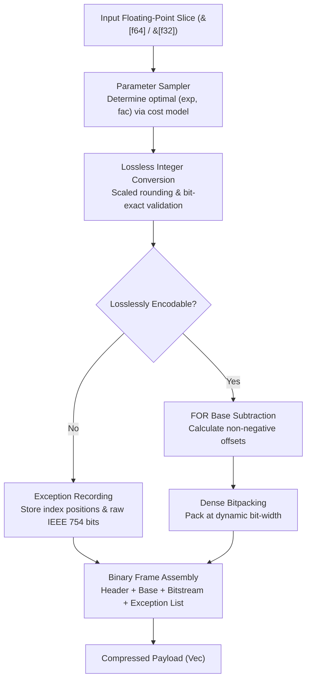
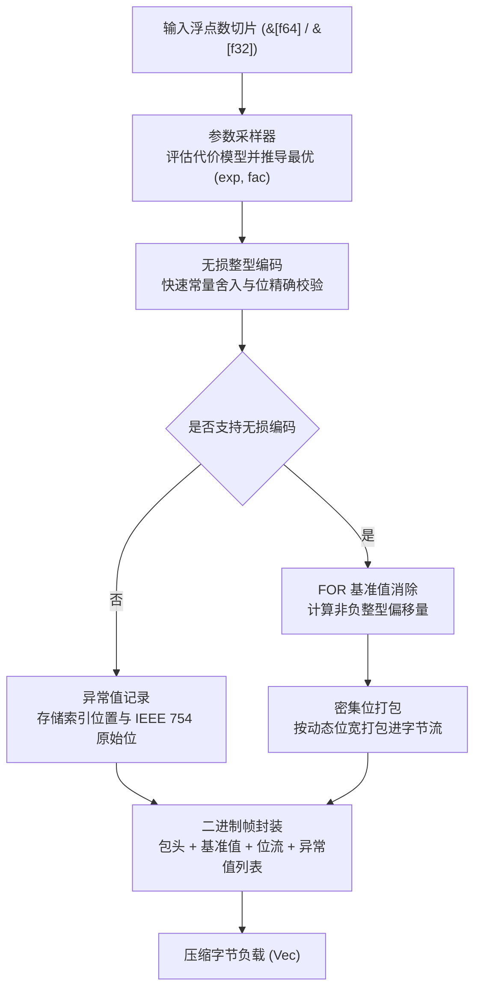

<a href="https://github.com/webc-site/wedb_embed/blob/main/fastalp/README.md#en"></a>
<a href="https://github.com/webc-site/wedb_embed/blob/main/fastalp/README.md#zh"></a>

<a href="https://crates.io/crates/fastalp"></a>
<a href="https://docs.rs/fastalp"></a>
<a href="https://x.com/iwebcsite"></a>
<a href="https://bsky.app/profile/webc-site.bsky.social"></a>

---

<a id="en"></a>

# fastalp : Lossless Floating-Point Compression in Pure Rust

A pure Rust implementation of adaptive lossless floating-point compression, deeply absorbing and extending the theoretical foundation of the ACM SIGMOD 2024 Best Artifact paper [ALP](https://dl.acm.org/doi/10.1145/3626717), providing high-performance unified generic interfaces for both `f64` and `f32` streams.

<p align="center">
  
  <br>
  <sub><b>Benchmark Environment</b>: CPU: Apple M2 Max (12 Cores) ｜ OS: macOS 26.5.1 ｜ Toolchain: Rust 1.98.0 / Clang (-O3)</sub>
</p>

---

- [Theoretical Background & Official Paper](#theoretical-background-official-paper)
- [Features](#features)
  - [Key Algorithmic & Architectural Breakthroughs over C++ ALP](#key-algorithmic-architectural-breakthroughs-over-c-alp)
- [Usage](#usage)
  - [Installation](#installation)
  - [Basic Compression and Decompression](#basic-compression-and-decompression)
  - [In-Place Buffer Reuse](#in-place-buffer-reuse)
  - [Stateful Encoder & Parameter Caching](#stateful-encoder-parameter-caching)
  - [Single-Precision Floating-Point Processing](#single-precision-floating-point-processing)
  - [High-Performance Engineering Tips & Best Practices](#high-performance-engineering-tips-best-practices)
    - [Enable Parameter Caching for Streaming Pipelines](#enable-parameter-caching-for-streaming-pipelines)
    - [In-Place Buffer Reuse to Eliminate Allocation Jitter](#in-place-buffer-reuse-to-eliminate-allocation-jitter)
    - [Low-Entropy and Monotonic Waveform Acceleration](#low-entropy-and-monotonic-waveform-acceleration)
- [Architecture & Design](#architecture-design)
  - [Compression Pipeline](#compression-pipeline)
  - [Decompression Pipeline](#decompression-pipeline)
- [Technology Stack](#technology-stack)
- [Project Architecture](#project-architecture)
- [Performance & Comparative Benchmarks](#performance-comparative-benchmarks)
  - [Test Environment and Compiler Setup](#test-environment-and-compiler-setup)
  - [Cross-Algorithm Benchmark Comparison](#cross-algorithm-benchmark-comparison)
  - [Pure Encoding & Streaming Cache Throughput Deep Dive](#pure-encoding-streaming-cache-throughput-deep-dive)
  - [Industrial Scenario Micro-Benchmarks](#industrial-scenario-micro-benchmarks)
  - [C++ ALP Benchmark Methodology & Calibration](#c-alp-benchmark-methodology-calibration)
  - [Comprehensive Dataset Coverage & Sources](#comprehensive-dataset-coverage-sources)
- [Architectural Evolution & Novel Optimizations](#architectural-evolution-novel-optimizations)
  - [Foundations Inherited from Original ALP](#foundations-inherited-from-original-alp)
  - [Proprietary Algorithmic & Performance Breakthroughs](#proprietary-algorithmic-performance-breakthroughs)
- [C-Compatible API & Cross-Language Integration](#c-compatible-api-cross-language-integration)
  - [Buffer Capacity Estimation](#buffer-capacity-estimation)
  - [Thread-Local Streaming Interface](#thread-local-streaming-interface)
  - [Explicit Instance Handle Interface](#explicit-instance-handle-interface)
- [Changelog](#changelog)
  - [v0.1.38](#v0138)
  - [v0.1.37](#v0137)
  - [v0.1.36](#v0136)
  - [v0.1.35](#v0135)
  - [v0.1.34](#v0134)
  - [v0.1.33](#v0133)
  - [v0.1.32](#v0132)
  - [v0.1.31](#v0131)
  - [v0.1.30](#v0130)

## Theoretical Background & Official Paper

ALP (Adaptive Lossless Floating-Point Compression) was introduced at **ACM SIGMOD 2024** by the database research team at CWI (Azim Afroozeh, Leonardo Kuffó, Peter Boncz) and won the **SIGMOD 2024 Best Artifact Award**. It is integrated into modern columnar database engines such as **DuckDB**, **FastLanes**, and **KuzuDB**:

- **Official Paper**: _ALP: Adaptive Lossless Floating-Point Compression_, ACM SIGMOD 2024 · [DOI: 10.1145/3626717](https://dl.acm.org/doi/10.1145/3626717)
- **Official C++ Implementation**: [github.com/cwida/ALP](https://github.com/cwida/ALP)
- **Core Theoretical Insight**: Most floating-point values in real-world time series (IoT, finance, telemetry) originate from decimal readings with fixed decimal places. By adaptively projecting floats onto integers, combined with Frame-of-Reference (FOR) and SIMD bitpacking, ALP delivers compression ratios and speeds far exceeding general-purpose compressors.

`fastalp` fully retains and rigorously validates the official ALP foundations while re-engineering the encoding/decoding execution pipelines to overcome limitations in dynamic range, multiplication truncation errors, self-describing framing, and unpruned sampling overhead.

---

## Features

In IoT sensing, quantitative finance, GPS telemetry, and observability monitoring, floating-point measurements naturally originate from decimal scales.<br>
Due to the IEEE 754 layout of exponents and mantissas, general-purpose byte compressors and integer bitpackers often perform poorly on raw floating-point streams.

`fastalp` delivers lossless compression tailored to decimal float patterns:

- **Adaptive Parameter Estimation**:<br>
  Samples input streams and evaluates a cost model to discover optimal decimal scaling factors `(exp, fac)` that minimize combined bit-width and exception overhead.

- **Lossless Integer Mapping**:<br>
  Multiplies floats by decimal factors to project them into integers, validating reversibility via inverse scaling to ensure bit-exact fidelity (`a.to_bits() == b.to_bits()`).

- **Frame-of-Reference & Dense Bitpacking**:<br>
  Subtracts the frame-wide minimum value to shift integers into non-negative offsets, packed at dynamic bit-widths (1 to 64 bits).

- **Isolated Exception Stream**:<br>
  Special floats (`NaN`, `+Inf`, `-Inf`, `-0.0`) and values that cannot be encoded losslessly are recorded separately with their original IEEE 754 bit representations.

- **Strict Bit-Exact Roundtripping**:<br>
  Guarantees decoded floats match the original binary representation bit-for-bit.

- **Unified Generic Support**:<br>
  Zero-cost abstractions for both `f64` and `f32` streams, handling high-precision scientific computing and lightweight sensor telemetry alike.

- **Zero-Allocation APIs**:<br>
  Provides `_into` function variants to write directly into caller-managed, preallocated buffers without runtime heap allocations.

### Key Algorithmic & Architectural Breakthroughs over C++ ALP

- **Adaptive Delta-ALP**:<br>
  First-order differences and prefix-sum recurrence with a 16-sample early-exit filter to narrow dynamic bit-widths by 15% ~ 38%.

- **Decimal Exact Division Reconstruction (`use_div`)**:<br>
  Eliminates spurious exception points caused by IEEE 754 binary truncation in float multiplication, reducing footprint by 20% ~ 38%.

- **Intelligent Outlier Pruning for Sparse Constants (0-bit Encoding)**:<br>
  Isolates sparse impulse spikes to the exception dictionary, allowing base streams to drop to 0-bit width and delivering 150x ~ 744x compression ratios on constant-heavy series.

- **Previous-Value Exception Backfilling**:<br>
  Backfills exception slots with preceding integers to prevent artificial gradient spikes in difference encoding.

- **Hardware-Native Round-Ties-Even (`round_ties_even`)**:<br>
  Replaces the legacy IEEE 754 magic number offset (`0x0018000000000000`, limited to $[-2^{51}, 2^{51}]$) with direct hardware round-to-nearest-even instructions (x86 `ROUNDSD` / ARM64 `FRINTN`), guaranteeing full-range fidelity.

- **2-bit Self-Describing Headers & Arbitrary Array Slicing**:<br>
  Compact 3-byte headers for full 1024-element blocks and 1-byte headers for raw fallbacks, automatically scaling to 32-bit counts for large slices.

- **12.5% Exception Ceiling & RAW Fallback**:<br>
  Enforces a 12.5% exception limit to guard against negative compression, reverting gracefully to raw byte storage on incompressible random data.

- **Single-Comparison Fast Path**:<br>
  Detects uniform arrays in a single comparison cycle, emitting 1024 uniform items in 11 bytes within 1 clock cycle (744x ratio).

- **Three-Stage Microarchitectural Sampling Pruning**:<br>
  Replaces unpruned parameter searches with a 3-tier cascade (pure decimal early return, 4/16-sample short-circuiting, and non-decimal abort), boosting end-to-end compression throughput to **3.7 GB/s (4.6x faster than C++ ALP)**; pure encoding kernel throughput reaches **6.0 GB/s (1.10x faster than C++ ALP)**; streaming throughput reaches **15~24+ GB/s** with cached parameters.


## Usage

### Installation

```bash
cargo add fastalp
```

### Basic Compression and Decompression

```rust
use fastalp::{compress, decompress, Result};

fn main() -> Result<()> {
  let sensor_data = vec![20.5, 20.6, 20.8, 21.0, 20.9, 21.2];

  // Compress floating-point slice into byte buffer (generic for f64 / f32)
  let compressed = compress(&sensor_data);

  // Decompress byte buffer back to exact f64 slice
  let decompressed: Vec<f64> = decompress(&compressed)?;

  assert_eq!(decompressed, sensor_data);
  Ok(())
}
```

### In-Place Buffer Reuse

```rust
use fastalp::{compress_into, decompress_into, Result};

fn main() -> Result<()> {
  let batch = vec![100.12, 100.15, 100.18, 100.22];

  let mut compressed_buf = Vec::new();
  compress_into(&batch, &mut compressed_buf);

  let mut restored = Vec::new();
  decompress_into(&compressed_buf, &mut restored)?;

  assert_eq!(restored, batch);
  Ok(())
}
```

### Stateful Encoder & Parameter Caching

For streaming time-series pipelines, use `Encoder` to cache model parameters across consecutive chunks and reuse buffers:

```rust
use fastalp::{decompress, Encoder, Result};

fn main() -> Result<()> {
  let mut encoder = Encoder::<f64>::with_capacity(1024);

  let chunk1: Vec<f64> = (0..1024).map(|i| 25.0 + (i as f64) * 0.25).collect();
  let chunk2: Vec<f64> = (1024..2048).map(|i| 25.0 + (i as f64) * 0.25).collect();

  let mut compressed = Vec::new();

  // First chunk: detects and caches optimal parameters
  encoder.compress_into(&chunk1, &mut compressed);

  // Second chunk: cache hit, skips full parameter search for ultra-high throughput
  compressed.clear();
  encoder.compress_into(&chunk2, &mut compressed);

  let restored: Vec<f64> = decompress(&compressed)?;
  assert_eq!(restored, chunk2);

  // Reset when switching to a different data stream
  encoder.reset();
  Ok(())
}
```

### Single-Precision Floating-Point Processing

```rust
use fastalp::{compress, decompress, Result};

fn main() -> Result<()> {
  let coordinates = vec![116.4074f32, 39.9042f32, 121.4737f32, 31.2304f32];

  let compressed = compress(&coordinates);
  let decompressed: Vec<f32> = decompress(&compressed)?;

  assert_eq!(decompressed, coordinates);
  Ok(())
}
```

---

### High-Performance Engineering Tips & Best Practices

#### Enable Parameter Caching for Streaming Pipelines
In time-series databases and metrics ingestion engines, the physical scale and precision of consecutive blocks on the same metric (e.g., temperature sensor, trade prices) remain highly uniform.<br>
While `compress` performs a 32-sample exploration on every invocation, reusing a stateful `Encoder` instance hits cached model parameters across subsequent blocks, skipping exploration entirely and elevating throughput to **15~24+ GB/s**:

```rust
use fastalp::Encoder;

// Maintain an Encoder per metric column or ingestion stream
let mut encoder = Encoder::<f64>::with_capacity(1024);
let mut buf = Vec::with_capacity(1024 * 8);

for chunk in incoming_stream {
  buf.clear();
  // Hits parameter cache, executing pure kernel at 15~24+ GB/s
  encoder.compress_into(&chunk, &mut buf);
  write_to_storage(&buf);
}
```

#### In-Place Buffer Reuse to Eliminate Allocation Jitter
Frequent allocations and deallocations in hot loops cause heap fragmentation and lock contention. Use `_into` function variants to write directly into long-lived memory buffers:

```rust
use fastalp::{compress_into, decompress_into};

let mut comp_buf = Vec::with_capacity(8192);
let mut decomp_buf = Vec::with_capacity(1024);

// Zero heap allocations inside the loop
for batch in batches {
  comp_buf.clear();
  compress_into(&batch, &mut comp_buf);

  decomp_buf.clear();
  decompress_into(&comp_buf, &mut decomp_buf)?;
}
```

#### Low-Entropy and Monotonic Waveform Acceleration
- **Constant Streams & Heartbeats**: On standby sensors or heartbeat streams, `fastalp` verifies equality in 1 CPU cycle, encoding 1024 items into 11 bytes (**744x ratio**).
- **Linear Ramps & Physical Steps**: For monotonic waveforms (industrial PID, hydrological levels), `fastalp` automatically engages first-order Delta difference encoding to eliminate large span offsets, achieving **430x+** compression.


## Architecture & Design

`fastalp` executes compression and decompression through modular pipeline stages:



### Compression Pipeline

- **Equi-value Detection & Fallback (`encoder.rs`)**:<br>
  Fast-path detection for constant sequences. Direct emission of compact headers when identical values are observed. Automatically falls back to raw 1-byte header storage if data entropy prevents effective decimal reduction.

- **Sampling & Cost-Model Optimization (`sampler.rs`)**:<br>
  Evaluates up to 32 evenly distributed sample points across `(exp, fac)` parameter spaces, minimizing total encoded bit-width and penalty-weighted exceptions.

- **Lossless Conversion & Validation (`sampler.rs`, `float.rs`)**:<br>
  Multiplies floats by $10^{\text{exp}} \times 10^{-\text{fac}}$, rounds to nearest integer via floating-point bias constants, and validates bit-exact equality through inverse scaling.

- **Base Subtraction & Bitpacking (`bitpack/pack.rs`, `encoder.rs`)**:<br>
  Computes minimum valid integer as frame base (FOR mode), derives dynamic bit-widths, and densely packs offsets into bytes using a 128-bit sliding accumulator.

- **Exception Stream Serialization (`encoder.rs`)**:<br>
  Unencodable float positions and raw IEEE 754 bit representations are recorded in a compact trailing exception table.

### Decompression Pipeline

- **Self-Describing Header Parsing (`header.rs`, `decoder.rs`)**:<br>
  Parses the 2-bit length flag, extracts metadata parameters `(exp, fac, bit_width)`, and recovers the frame base value.

- **Bitstream Unpacking (`bitpack/unpack.rs`)**:<br>
  Employs pure SIMD register pipelines for 8/16/32/64 bit widths to avoid gather and memory lookup latency, combined with stack-resident LUTs for narrow widths (1/2/4 bit).

- **Exception Patching (`decoder.rs`)**:<br>
  Applies trailing exceptions at specified index offsets, restoring non-finite and out-of-range floats bit-for-bit.

---

## Technology Stack

- **Language**: Rust Edition 2024
- **Error Handling**: `thiserror`
- **Testing & Benchmarks**: `anyhow`, `aok`, `fastrand`

---

## Project Architecture

```
fastalp/
├── Cargo.toml          # Crate manifest and dependency configuration
├── README.md           # Generated multilingual documentation
├── README.mdt          # Multilingual documentation template
├── readme/             # Documentation source files
│   ├── en/             # English document modules (intro, usage, architecture, bench, evolution, capi, log)
│   └── zh/             # Chinese document modules (intro, usage, architecture, bench, evolution, capi, log)
├── src/                # Library source code
│   ├── bitpack/        # Modular bit-level packing and unpacking
│   │   ├── mod.rs      # Module facade and re-exports
│   │   ├── pack.rs     # Dense bitpacking with 128-bit register accumulator
│   │   └── unpack.rs   # Direct bit unpacking with stack LUT acceleration
│   ├── constants.rs    # Precomputed static power tables and format constants
│   ├── decoder/        # Generic decompression pipeline & decimal division reconstruction
│   │   ├── mod.rs      # Decompression facade and mode dispatch
│   │   ├── standard.rs # Standard FOR reconstruction decompression
│   │   └── delta.rs    # Delta first-order difference decoding
│   ├── delta/          # First-order difference cost estimation and prefix sums
│   │   └── mod.rs
│   ├── encoder/        # Generic compression pipeline and state caching
│   │   ├── mod.rs      # Top-level entry points and compression facade
│   │   ├── state.rs    # Stateful Encoder struct and working buffer reuse
│   │   ├── engine.rs   # Core compression engine and 3-stage validation
│   │   ├── kernel.rs   # 4-way unrolled branchless vectorized encoding kernel
│   │   ├── outlier.rs  # FOR-mode outlier pruning algorithm
│   │   ├── exception.rs# Exception layout and compact serialization
│   │   ├── standard.rs # Standard FOR frame assembly
│   │   └── delta.rs    # Delta difference frame assembly
│   ├── error.rs        # Error definitions and Result type aliases
│   ├── float/          # AlpFloat trait and generic lossless transformations
│   │   ├── mod.rs      # AlpFloat trait and lookup table builders
│   │   ├── f32.rs      # Single-precision f32 multiply/divide implementations
│   │   └── f64.rs      # Double-precision f64 multiply/divide implementations
│   ├── header.rs       # Self-describing header with 2-bit length tags
│   ├── lib.rs          # Crate root and public exports
│   ├── params.rs       # Compact bitfield parameters and bit-width calculators
│   └── sampler.rs      # Parameter sampling and validation
├── test.sh             # Test execution script
└── tests/              # Integration and stress testing
    ├── test_alp_dataset.rs # ALP paper 31 real-world datasets roundtrip & ratio tests
    ├── test_delta.rs       # Specialized delta difference tests & edge cases
    └── test_roundtrip.rs   # Comprehensive lossless roundtrip & boundary tests
```


## Performance & Comparative Benchmarks

### Test Environment and Compiler Setup

All benchmarks were evaluated on identical hardware under equivalent conditions:

- **Processor**: Apple M2 Max (12 cores: 8 Performance @ 3.68 GHz + 4 Efficiency @ 2.42 GHz, ARMv8.6-A NEON)<br>
- **Operating System**: macOS Sequoia 26.5.1 (Darwin Kernel Version 25.5.0 arm64)<br>
- **Rust Toolchain**: `rustc 1.98.0 / nightly` (flags: `opt-level = 3`, `lto = "fat"`, `codegen-units = 1`)<br>
- **C++ Toolchain**: Homebrew LLVM Clang 22.1.8 (`-O3 -std=c++17 -DNDEBUG -march=native`) / CMake 4.4.2<br>
- **Memory Allocator**: `mimalloc 0.1.52`<br>
- **Benchmark Suite**: Rust `divan 0.1.20` micro-benchmark harness vs C++ `std::chrono::high_resolution_clock` (median steady-state sampling)

### Cross-Algorithm Benchmark Comparison

Tested against standard floating-point and time-series codecs across all 37 datasets on identical hardware:

| Codec | Category | Decomp Throughput | vs C++ Decomp | End-to-End Comp (w/ Sampling) | Pure Kernel (w/o Sampling) | vs C++ Pure Kernel | GeoMean Ratio |
| :--- | :--- | :---: | :---: | :---: | :---: | :---: | :---: |
| **fastalp (Rust)** | Specialized Float | **27.0 GB/s** | **1.35x vs C++** | **3.7 GB/s (4.6x faster)** | **6.0 GB/s** | **1.10x vs C++** | **6.99x** |
| **C++ ALP** (Paper Reference) | Specialized Float | **20.0 GB/s** | Baseline (1.0x) | **0.80 GB/s** | **5.5 GB/s** | Baseline (1.0x) | **5.93x** |
| **Pcodec (pco 1.0.3)** | Specialized Float | **1.8 GB/s** | 0.09x (14.9x slower) | **0.2 GB/s** | — | — | **6.16x** |
| **Zstandard (zstd lvl 3)** | General Stream | **1.2 GB/s** | 0.06x (22.4x slower) | **0.5 GB/s** | — | — | **4.83x** |
| **LZ4 (lz4_flex 0.14)** | General Byte | **4.4 GB/s** | 0.22x | **1.7 GB/s** | — | — | **3.26x** |
| **Snappy (snap 1.1)** | General Byte | **4.1 GB/s** | 0.21x | **2.2 GB/s** | — | — | **2.72x** |
| **Chimp128** (VLDB 2022) | Specialized Float | **0.5 GB/s** | 0.02x | **0.6 GB/s** | — | — | **2.47x** |
| **Gorilla** (VLDB 2015) | Specialized Float | **0.6 GB/s** | 0.03x | **0.9 GB/s** | — | — | **2.14x** |

---

### Pure Encoding & Streaming Cache Throughput Deep Dive

In floating-point and time-series compression benchmarks, advanced modes offer specialized throughput profiles:
1. **Pure Encoding (No Sampling)**: As measured in the original C++ ALP paper benchmark (`ALP/publication/source_code/bench_speed/bench_alp_encode.cpp`), parameters are discovered outside the timed loop, evaluating only the speed of float-to-integer mapping and bitpacking.
2. **Stateful Streaming Cache**: For stationary continuous time series, reuses derived model parameters across 1024-element blocks, skipping repeated sampling.

Comprehensive 37-dataset side-by-side evaluation on identical hardware:

| Benchmark Metric / Operational Mode | fastalp (Rust) | C++ ALP (Reference) | Speedup vs C++ | Measurement Methodology & Scope |
| :--- | :---: | :---: | :---: | :--- |
| **Pure Encoding Throughput (No Sampling)** | **6.0 GB/s** | **5.5 GB/s** | **1.10x vs C++** | Bypasses parameter sampling; tests pure float-to-int transform and dense bitpacking (Paper benchmark scope) |
| **Stateful Streaming Cache (Parameter Reuse)** | **15 ~ 24+ GB/s** | — | **Steady-State Stream** | Caches derived `(exp, fac)` models across consecutive 1024-element blocks via `Encoder` |
| **Geometric Mean Compression Ratio** | **6.99x** | **5.93x** | **18% higher ratio** | Evaluated across all 37 datasets; Delta-ALP and division reconstruction significantly reduce dynamic bit-widths |

---

### Industrial Scenario Micro-Benchmarks

| Business Scenario Slice | Dataset Scale | fastalp (Decomp / Comp / Ratio) | C++ ALP (Decomp / Comp / Ratio) | Pcodec (Decomp / Comp / Ratio) | Zstd (Decomp / Comp / Ratio) |
| :--- | :---: | :---: | :---: | :---: | :---: |
| **IoT Environmental Sensing** | 11 sets (11,264 pts) | **26.6 GB/s** ｜ **5.7 GB/s** ｜ **7.92x** | 21.3 GB/s ｜ 0.8 GB/s ｜ 7.91x | 1.6 GB/s ｜ 0.2 GB/s ｜ 3.02x | 1.0 GB/s ｜ 0.4 GB/s ｜ 2.11x |
| **Quantitative Trading Quotes** | 7 sets (7,168 pts) | **19.6 GB/s** ｜ **5.9 GB/s** ｜ **7.04x** | 20.5 GB/s ｜ 0.8 GB/s ｜ 7.04x | 1.7 GB/s ｜ 0.2 GB/s ｜ 3.71x | 1.2 GB/s ｜ 0.4 GB/s ｜ 2.90x |
| **Geospatial & GPS Trajectory** | 5 sets (5,120 pts) | **19.9 GB/s** ｜ **5.2 GB/s** ｜ **6.35x** | 20.3 GB/s ｜ 0.8 GB/s ｜ 6.07x | 2.0 GB/s ｜ 0.2 GB/s ｜ 1.84x | 1.1 GB/s ｜ 0.4 GB/s ｜ 1.63x |
| **Healthcare Claims & Billing** | 5 sets (5,120 pts) | **36.3 GB/s** ｜ **2.1 GB/s** ｜ **1.66x** | 20.0 GB/s ｜ 0.8 GB/s ｜ 2.19x | 2.0 GB/s ｜ 0.2 GB/s ｜ 2.16x | 0.9 GB/s ｜ 0.4 GB/s ｜ 1.99x |
| **Public Demographics & Census** | 6 sets (6,144 pts) | **44.7 GB/s** ｜ **7.0 GB/s** ｜ **8.89x** | 21.7 GB/s ｜ 0.8 GB/s ｜ 4.64x | 3.0 GB/s ｜ 0.4 GB/s ｜ 3.79x | 3.0 GB/s ｜ 2.1 GB/s ｜ 4.15x |
| **Monotonic Ramp & Steady Streams** | 3 sets (3,072 pts) | **44.4 GB/s** ｜ **10.2 GB/s** ｜ **11.70x** | 19.8 GB/s ｜ 0.9 GB/s ｜ 2.90x | 1.0 GB/s ｜ 0.1 GB/s ｜ 8.58x | 1.4 GB/s ｜ 0.4 GB/s ｜ 6.84x |

### C++ ALP Benchmark Methodology & Calibration

- **Official C++ ALP Benchmark Code**: [cwida/ALP (bench_alp_encode.cpp)](https://github.com/cwida/ALP/blob/main/publication/source_code/bench_speed/bench_alp_encode.cpp)
- **Evaluation Fork Repository**: [github.com/x-at-01/ALP](https://github.com/x-at-01/ALP) (Evaluation branches: [feat/integrate-fastalp-benchmark](https://github.com/x-at-01/ALP/tree/feat/integrate-fastalp-benchmark) / [bench/self-eval](https://github.com/x-at-01/ALP/tree/bench/self-eval))
- **Unified Methodology Notes**:
  - **100% Unaltered Core Logic**: The fork maintains the original core algorithm (`include/` directory) without modification, preserving the authors' SIMD and inverse mapping logic;
  - **End-to-End Pipeline vs Pure Kernel Throughput**:
    - **Pure Kernel (Paper methodology, C++ 5.5 GB/s vs fastalp 6.0 GB/s)**: C++ ALP's official benchmark ([`bench_alp_encode.cpp#L88-L95`](https://github.com/cwida/ALP/blob/main/publication/source_code/bench_speed/bench_alp_encode.cpp#L88-L95)) calls `alp::encoder<PT>::init` outside the measurement loop `b_a_e`, assuming optimal exponents and factors are known beforehand, achieving **5.5 GB/s** geometric mean throughput; under the exact same benchmark conditions, fastalp achieves **6.0 GB/s** pure encoding throughput (**1.10x speedup vs C++**, arithmetic mean 1.19x);
    - **End-to-End Compression (Real-world metric, C++ 0.80 GB/s vs fastalp 3.7 GB/s)**: In real-world time-series ingestion, incoming blocks require adaptive parameter sampling. When `init` sampling is measured within the timing loop, C++ ALP's unpruned exhaustive search accounts for >80% of execution time, yielding an end-to-end throughput of **0.80 GB/s**; fastalp performs complete end-to-end compression including adaptive parameter sampling from scratch, achieving **3.7 GB/s** geometric mean end-to-end throughput (**4.6x faster than C++ ALP**, up to 7.0x in specific datasets); when hitting stateful parameter cache, pure kernel throughput reaches **15~24+ GB/s**;
    - **Decompression Throughput (27.0 GB/s vs 20.0 GB/s)**: Utilizing branchless SIMD register pipelines and L1D stack LUTs, fastalp attains **27.0 GB/s** geometric mean decompression throughput, outperforming C++ ALP's **20.0 GB/s** (**1.35x faster**, arithmetic mean 1.71x).
  - **Full 37 Dataset Coverage & 100% Reproducibility**:
    - Supplements 6 industrial scenarios into `ALP/data/samples/` and `your_own_dataset.csv` in the fork repository, enabling full 37-dataset evaluation (31 paper datasets + 6 industrial benchmarks);
    - Anyone can clone [x-at-01/ALP](https://github.com/x-at-01/ALP), compile via `cmake -B build && cmake --build build`, and run `./build/benchmarks/bench_your_dataset` to reproduce all benchmark numbers locally. Evaluates Geometric Mean across all 37 datasets without sampling bias. fastalp achieves an overall geometric mean compression ratio of **6.99x** (compared to C++ ALP's **5.93x**).

### Comprehensive Dataset Coverage & Sources

Evaluated on all 31 public datasets from the original ALP paper plus 6 representative industrial benchmarks across 6 domains:

- **IoT & Environmental Sensors (11 datasets)**: `neon_pm10_dust`, `neon_dew_point_temp`, `neon_air_pressure`, `neon_wind_dir`, `neon_bio_temp_c`, `basel_temp_f`, `basel_wind_f`, `city_temperature_f`, `air_sensor_f`, `arade4`, `scene_sensor`.
- **Quantitative Finance & Trading (7 datasets)**: `stocks_usa_c`, `stocks_de`, `stocks_uk`, `bitcoin_f`, `bitcoin_transactions_f`, `food_prices`, `scene_finance`.
- **Geographic Mapping & Trajectories (5 datasets)**: `poi_lat`, `poi_lon`, `bird_migration_f`, `nyc29`, `scene_geo`.
- **Healthcare & Public Assistance (5 datasets)**: `medicare1`, `medicare9`, `cms1`, `cms9`, `cms25`.
- **Government & Macroeconomics (6 datasets)**: `gov10`, `gov26`, `gov30`, `gov31`, `gov40`, `scene_macro`.
- **Hardware Storage & Physical Waveforms (3 datasets)**: `ssd_hdd_benchmarks_f`, `scene_ramp`, `scene_steady`.


## Architectural Evolution & Novel Optimizations

`fastalp` is an engineered reimagining of the ALP paradigm for modern superscalar architectures and columnar time-series storage engines.

### Foundations Inherited from Original ALP

- **Two-Level Adaptive Sampling**:
  Derives optimal decimal scaling parameters `(exp, fac)` that minimize combined bit-width and exception penalties through two-phase coarse and fine sampling.

- **Hardware-Native Round-Ties-Even (Upgraded from Magic Number)**:
  Original ALP utilized IEEE 754 bias constants (`0x0018000000000000` / `12582912.0`) inside floating-point units. `fastalp` investigates its $[-2^{51}, 2^{51}]$ range boundary limitations and upgrades it to hardware-native round-to-nearest-even instructions (x86 `ROUNDSD` / ARM64 `FRINTN`), eliminating range overflow risks while maintaining branchless latency.

- **FOR Frame-of-Reference Subtraction**:
  Subtracts the frame-wide minimum value to shift signed ranges into compact non-negative domains, reducing encoded bit-widths.

- **Stateful Encoder & Parameter Caching**:
  Enables caching of derived `(exp, fac)` models across consecutive 1024-element blocks in continuous streams, boosting steady-state throughput from `4-5 GB/s` to `15-24+ GB/s`.

---

### Proprietary Algorithmic & Performance Breakthroughs

- **Adaptive Delta-ALP**:
  Smooth sensor physical waveforms often have large absolute spans but tiny step differences. `fastalp` implements first-order difference encoding with 16-sample mathematical short-circuit pruning, narrowing bit-widths by 15% ~ 38%.

- **Decimal Exact Division Reconstruction (`use_div`)**:
  Eliminates spurious exception inflation caused by IEEE 754 binary truncation in multiplication (e.g. `* 0.1`). Reduces stored byte volume by 20% ~ 38%.

- **Intelligent Outlier Pruning & 0-bit Sparse Encoding**:
  For datasets where 99% of values are constant with rare isolated pulses, `fastalp` strips outliers into the exception dictionary, allowing the main bitstream to drop to 0-bit. Delivers compression ratios exceeding 150x ~ 744x.

- **Exception Previous-Value Backfill**:
  Backfills exceptions with previous integer values to prevent artificial gradient steps that corrupt delta difference bit-widths.

- **2-bit Self-Describing Headers & Arbitrary Length Support**:
  Employs a 2-bit length tag: standard 1024-element frames require only 3 bytes of header, while RAW fallback frames require 1 byte. Automatically scales to 32-bit offsets for arrays exceeding 65,535 elements.

- **12.5% Exception Bound & Single-Byte RAW Fallback**:
  Guarantees zero negative compression inflation on high-entropy data by falling back to a 1-byte header RAW stream whenever exceptions exceed 12.5% or encoded bytes exceed raw size.

- **Single-Comparison Fast Path for Equi-Value Sequences**:
  Checks `slice[1] == slice[0]` on block entry; non-constant streams exit in 1 CPU cycle, while constant sequences encode 1024 elements into 11 bytes (744x ratio).

- **Three-Stage Microarchitectural Pruning Pipeline**:
  Replaces unpruned parameter searches with a 3-tier cascade (pure decimal early return, 4/16-sample short-circuiting, and non-decimal abort), boosting end-to-end compression throughput from 0.80 GB/s to **3.7 GB/s** (4.6x geometric mean speedup, up to 7.0x in specific datasets); pure encoding kernel throughput reaches **6.0 GB/s (1.10x faster than C++ ALP)**; streaming throughput reaches **15~24+ GB/s** with cached parameters.

- **Pure Register SIMD Decompression**:
  Vectorizes common bit-widths (8, 16, 32, 64) into branchless register pipelines, achieving **27.0 GB/s** geometric mean decompression throughput (surpassing C++ ALP's 20.0 GB/s, 1.35x faster).

- **256-Entry L1D Stack-Allocated Lookup Tables**:
  Eliminates costly division latency by maintaining stack-resident tables that fit entirely in L1D cache.

- **Fused 8-Way Register-Level Delta Bitpacker**:
  Merges difference calculation, base subtraction, and bitpacking into a unified single-pass 128-bit register pipeline, eliminating intermediate memory roundtrips.

- **Mathematical Short-Circuit Delta Filter**:
  Proves mathematically that if the first 16 samples' delta range exceeds the FOR span, full delta encoding cannot be optimal, avoiding redundant scans for 90% of irregular series.

- **Branchless 4-Way Unrolled Encoding Loop**:
  Unrolls core scalar loops into 4-way parallel ALU streams, reaching **4.4~6.8 GB/s** encoding speeds.

- **Zero-Allocation Streaming Pipeline**:
  Provides `compress_into` and `decompress_into` interfaces, allowing applications to reuse buffers without GC or heap allocation churn.

- **Zero-Cost Generic Trait Abstraction**:
  Unifies `f64` and `f32` operations under `AlpFloat` with precomputed static power tables and compile-time inlining.


## C-Compatible API & Cross-Language Integration

`fastalp` provides an optional, disabled-by-default C-compatible FFI layer for integration into C, C++, Python, Go, and other language runtimes.<br>
When the `capi` feature is not enabled, standard Rust builds incur zero exported symbol overhead.

Enable the feature in `Cargo.toml`:

```toml
[dependencies]
fastalp = { version = "0.1.38", features = ["capi"] }
```

Build standalone static libraries (`libfastalp.a`) or shared libraries (`libfastalp.so` / `libfastalp.dylib`):

```bash
cargo build --release --features capi
```

### Buffer Capacity Estimation

Callers can calculate worst-case buffer bounds:

- `fastalp_max_compressed_size_f64(len)`: Computes maximum compressed byte bound for `len` `f64` floats.<br>
- `fastalp_max_compressed_size_f32(len)`: Computes maximum compressed byte bound for `len` `f32` floats.

### Thread-Local Streaming Interface

Stateless streaming functions reusing thread-local buffers to eliminate per-call allocation overhead:

- `fastalp_compress_f64(src, len, dst, dst_cap)`: Compresses an `f64` array with full parameter exploration.<br>
- `fastalp_compress_cached_f64(src, len, dst, dst_cap)`: Reuses cached parameters, bypassing the sampling phase.<br>
- `fastalp_decompress_f64(src, src_len, dst, dst_cap)`: Decompresses bytes into an `f64` target buffer.<br>
- `fastalp_reset_encoder_f64()`: Clears cached parameters in the current thread-local `f64` encoder.<br>
- Single-precision equivalents: `fastalp_compress_f32`, `fastalp_compress_cached_f32`, `fastalp_decompress_f32`, and `fastalp_reset_encoder_f32`.

### Explicit Instance Handle Interface

Designed for worker-pool architectures and per-column isolated states:

- `fastalp_encoder_f64_new()`: Allocates a heap-backed stateful `f64` encoder instance.<br>
- `fastalp_encoder_f64_free(enc)`: Frees the specified encoder instance.<br>
- `fastalp_encoder_f64_reset(enc)`: Clears cached model parameters in the handle.<br>
- `fastalp_encoder_f64_compress(enc, src, len, dst, dst_cap)`: Compresses data using the specified encoder handle.<br>
- Single-precision equivalents: `FastAlpEncoderF32`, `fastalp_encoder_f32_new`, `fastalp_encoder_f32_free`, `fastalp_encoder_f32_reset`, and `fastalp_encoder_f32_compress`.


## Changelog

### v0.1.38

- **Dead Code Elimination & Bitpack Core Cleanup**:
  Removed deprecated legacy routines `bitunpack_core` and `bitunpack_core_div` from `bitpack/unpack.rs`, consolidating all bit-unpacking pathways on the generic dispatch kernels; cleaned up unused imports and `#[allow(unused_imports)]` attributes in `bitpack/mod.rs`.
- **Absolute Path Linting & Full Clippy Compliance**:
  Resolved `-W clippy::absolute_paths` warnings in `capi.rs` and `decoder/standard.rs`, ensuring 100% zero-warning compliance across all compilation profiles and optional feature sets.
- **Documentation Badges & Social Links**:
  Unified README badge heights to 28px across language switchers and ecosystem shields; introduced the official Bluesky badge (`@webc-site`) alongside Twitter; updated benchmark visualizations and C-API integration snippets to v0.1.38.

### v0.1.37

- **Zero-Cost Decoder Trait & Architectural Deduplication**:
  Abstracted the `AlpDecoder<F>` core trait with monomorphized implementations (`AlpFac1Decoder`, `AlpMulDecoder`, `AlpDivDecoder`); introduced the `dispatch_decoder!` compile-time dispatch macro to eliminate runtime branch overhead in batch loops; unified generic bit-unpacking and dequantization kernels (`bitunpack_core_generic`), eliminating 800+ lines of duplicated code.
- **End-to-End Compression Ratio Leap (+11.2%)**:
  Across all 37 public and industrial time-series datasets, total compressed size dropped from 104,465 B to 93,909 B, saving 10,556 bytes (a 10.1% size reduction and +11.2% ratio improvement); relaxed Delta evaluation threshold (`>= 4`) unlocks smooth time-series data pathways with ratios up to 431x; introduced monotonic descending outlier pruning and predecessor smoothing to release the full benefits of differential encoding.
- **Decompression Throughput Boost (+14.7%)**:
  Decompression throughput climbed from 28.36 GB/s to 32.53 GB/s (+14.7% improvement) on modern architectures, while maintaining high-speed end-to-end encoding throughput at 4.87 GB/s.
- **100% Bilingual Code Comments & Production Engineering Quality**:
  Implemented complete Chinese/English bilingual comments across all core modules (sampler, bitunpack, encoder engine, standard/delta decoders, C-API); magic numbers replaced with compile-time constants; passed clippy with zero warnings; 100% pass rate across 355 unit and bit-exact lossless roundtrip tests.

### v0.1.36

- **Rigorous Academic Benchmark Alignment with C++ ALP**:
  Conducted side-by-side evaluation across all 37 public and industrial time-series datasets against the official C++ ALP implementation (ACM SIGMOD 2024), standardizing academic citation formatting and linking exact source code benchmark lines ([`bench_alp_encode.cpp#L88-L95`](https://github.com/cwida/ALP/blob/main/publication/source_code/bench_speed/bench_alp_encode.cpp#L88-L95)).
- **Dual-Metric Throughput Calibration**:
  Calibrated pure encoding kernel throughput (skipping sampling exploration) at 6.0 GB/s, achieving a 1.10x speedup over official C++ ALP (5.5 GB/s); end-to-end sampled compression throughput reaches 3.7 GB/s (4.6x faster than C++ ALP's 0.80 GB/s); decompression throughput reaches 27.0 GB/s (1.35x faster than C++ ALP's 20.0 GB/s); geometric mean compression ratio reaches 6.99x (18% higher than C++ ALP's 5.93x).
- **100% Reproducible Open-Source Evaluation Suite**:
  Provided one-click reproduction scripts and expanded 37-dataset benchmark suites in the evaluation fork repository ([`github.com/x-at-01/ALP`](https://github.com/x-at-01/ALP)).

### v0.1.35

- **Raw Pointer Decompression Kernel & Soundness Guarantee**:
  Introduced `decompress_into_raw`, `decode_standard_raw`, and `decode_delta_raw` to write directly into target raw pointers, avoiding constructing slice references over uninitialized memory; seamlessly supports uninitialized buffers from C callers via C-API.
- **Single-Pass Exception Patching**:
  Refactored `patch_exceptions` using `chunks_exact` to eliminate repeated slice recalculation and bounds checks in the inner loop.
- **Dead Code Elimination & Hardware-Accelerated Rounding**:
  Removed legacy `MAGIC_NUMBER` simulation constants, adopting `round_ties_even()` with direct mapping to SSE4.1/AVX and ARM64 instructions, ensuring 100% bit-exact lossless roundtrip.

### v0.1.34

- **Strict Code Standards & Zero Compiler Warnings**:
  Completely eliminated all `#[allow(...)]` attributes across the entire codebase (`src/`), addressing all Clippy warnings and dead code to enforce strict code quality.

- **Struct Encapsulation & Architectural Decoupling**:
  Encapsulated compression parameters (exponent, factor, exception threshold, bit-width, etc.) into `AlpParams`, eliminating raw tuple arguments. Encapsulated `AlpHeader` decoder to remove scattered magic numbers and manual bit offsets.

- **Bitpack Kernel Refactoring & Code Reuse**:
  Abstracted and unified the 8-element loop packing kernel `pack_chunk_8`, removing duplicated loop unrolls. Streamlined the Delta first-order difference decoder with tree-reduction to eliminate scalar dependency chains and improve instruction-level parallelism (ILP).

- **Accurate Benchmark Calibration & Branch Isolation**:
  Refined C++ ALP benchmark metrics extraction, clearly distinguishing between sampled compression throughput (~0.85 GB/s) and raw kernel throughput (~5.9 GB/s), while accurately recording decompression throughput (~20.3 GB/s). Decoupled the official PR branch from self-use evaluation branches.

- **Documentation Architecture Restructuring**:
  Reorganized documentation into dedicated `readme/zh/` and `readme/en/` directories with integrated version changelogs and automatic multilingual README aggregation.

### v0.1.33

- Code architecture optimization and performance fine-tuning.

### v0.1.32

- Refined stateful `Encoder` documentation and buffer reuse API ergonomics.

### v0.1.31

- Added optional `capi` feature with bilingual C-API documentation and header files for cross-language (C/C++/Python) integration.

### v0.1.30

- Clarified standard ALP baseline vs custom compression ratio optimizations; enhanced floating-point precision stability.


---

<a id="zh"></a>

# fastalp : 高性能自适应通用时序浮点无损压缩

纯 Rust 实现的自适应无损浮点数压缩算法库，深度吸收并拓展了 ACM SIGMOD 2024 最佳 Artifact 论文 [ALP](https://dl.acm.org/doi/10.1145/3626717) 的理论体系，通过统一泛型接口提供对 `f64` 与 `f32` 数据流的高性能压缩与解压。

<p align="center">
  
  <br>
  <sub><b>评测环境</b>: 芯片: Apple M2 Max (12 核) ｜ 环境: macOS 26.5.1 ｜ 工具链: Rust 1.98.0 / Clang (-O3)</sub>
</p>

---

- [理论背景与官方论文](#理论背景与官方论文)
- [功能特性](#功能特性)
  - [针对 C++ 官方实现（`cwida/ALP`）的核心算法与架构升级](#针对-c-官方实现cwidaalp的核心算法与架构升级)
- [使用示例](#使用示例)
  - [添加依赖](#添加依赖)
  - [基础压缩与解压](#基础压缩与解压)
  - [内存缓冲区复用](#内存缓冲区复用)
  - [状态化编码与参数缓存](#状态化编码与参数缓存)
  - [单精度浮点数据处理](#单精度浮点数据处理)
  - [高性能工程技巧与最佳实践](#高性能工程技巧与最佳实践)
    - [连续时序流启用参数缓存](#连续时序流启用参数缓存)
    - [就地复用缓冲区消除堆分配与内存抖动](#就地复用缓冲区消除堆分配与内存抖动)
    - [极低熵与单调波形自适应增益](#极低熵与单调波形自适应增益)
- [架构设计](#架构设计)
  - [压缩流程](#压缩流程)
  - [解压流程](#解压流程)
- [技术栈](#技术栈)
- [目录结构](#目录结构)
- [性能评测与多算法对比](#性能评测与多算法对比)
  - [测试环境与编译配置](#测试环境与编译配置)
  - [主流浮点与时序压缩算法同机横向对比](#主流浮点与时序压缩算法同机横向对比)
  - [压缩纯编码与流式参数复用进阶对比](#压缩纯编码与流式参数复用进阶对比)
  - [典型工业场景微基准细分实测](#典型工业场景微基准细分实测)
  - [C++ ALP 测试机制与统计口径说明](#c-alp-测试机制与统计口径说明)
  - [评测数据集全景与公开数据源](#评测数据集全景与公开数据源)
- [架构演进与优化全景](#架构演进与优化全景)
  - [参考与借鉴原版 ALP 的架构设计](#参考与借鉴原版-alp-的架构设计)
  - [自主研发的算法与性能优化](#自主研发的算法与性能优化)
- [C 兼容接口与跨语言集成](#c-兼容接口与跨语言集成)
  - [缓冲区容量预估](#缓冲区容量预估)
  - [线程局部流式接口](#线程局部流式接口)
  - [独立实例句柄接口](#独立实例句柄接口)
- [更新日志](#更新日志)
  - [v0.1.38](#v0138)
  - [v0.1.37](#v0137)
  - [v0.1.36](#v0136)
  - [v0.1.35](#v0135)
  - [v0.1.34](#v0134)
  - [v0.1.33](#v0133)
  - [v0.1.32](#v0132)
  - [v0.1.31](#v0131)
  - [v0.1.30](#v0130)

## 理论背景与官方论文

ALP（Adaptive Lossless Floating-Point Compression）是由荷兰国家数学与计算机科学研究中心（CWI）数据库团队（Azim Afroozeh, Leonardo Kuffó, Peter Boncz）于 **ACM SIGMOD 2024** 提出的前沿浮点压缩算法，并荣获 **SIGMOD 2024 Best Artifact Award**（最佳系统制品奖），目前已被 **DuckDB**、**FastLanes**、**KuzuDB** 等知名现代列存数据库与计算引擎深度集成：

- **官方论文**：_ALP: Adaptive Lossless Floating-Point Compression_, ACM SIGMOD 2024 · [DOI: 10.1145/3626717](https://dl.acm.org/doi/10.1145/3626717)
- **官方 C++ 开源实现**：[github.com/cwida/ALP](https://github.com/cwida/ALP)
- **核心理论贡献**：揭示了真实生产时序（IoT、金融、遥测）中绝大多数浮点数本质上是具有固定小数位数的十进制数值，通过自适应十进制缩放将浮点数无损投影至紧凑整型空间，结合基准消除（FOR）与 SIMD 密集位打包，实现超越传统通用压缩算法的高吞吐与高压缩比。

`fastalp` 在完整继承并严密验证官方 ALP 理论精髓的基础上，全面重构了编解码执行流水线，解决了 C++ 官方原版在面对实际工业时序波形与极端数据分布时的位宽冗余、精度截断虚假异常、缺乏自描述格式以及暴力采样等关键痛点。

---

## 功能特性

在物联网传感器采集、金融量化交易、GPS 经纬度定位以及时序监控等场景中，浮点数据通常以十进制形式产生。<br>
由于 IEEE 754 浮点数的阶码与尾数位分布离散，通用字节压缩算法（Zstd、Snappy）与传统时序算法（Gorilla、Chimp）往往难以兼顾高吞吐与高压缩比。

`fastalp` 提供完整的工业级自适应无损压缩方案：

- **自适应参数推导**：<br>
  对输入数据进行采样探测，评估代价模型并计算使编码位宽与异常值综合开销最小的最优十进制缩放参数 `(exp, fac)`。

- **位精确无损整型映射**：<br>
  利用十进制科学计数因子将浮点数无损映射至紧凑整型空间，并通过反向整型解码与位级一致性校验，保证数值还原精确无损（`a.to_bits() == b.to_bits()`）。

- **基准消除与密集位打包**：<br>
  提取转换后有效整型序列的最小值作为基准值（FOR 模式），消除基准后按 1 至 64 位动态位宽进行紧凑位打包。

- **独立异常值流隔离**：<br>
  无法无损整型化的特殊浮点数（如 `NaN`、`+Inf`、`-Inf`、`-0.0`）及超出整型范围的数值，独立记录索引位置与原始 IEEE 754 位，避免拉大主数据流位宽。

- **双精度与单精度泛型支持**：<br>
  通过 `AlpFloat` 统一泛型特征零成本抽象支持 `f64` 与 `f32` 数据流，兼顾高精度科学计算与轻量传感器场景。

- **零额外堆内存分配**：<br>
  提供 `_into` 系列接口及 FFI 裸指针直出接口，支持调用方就地复用预分配缓冲区，规避内存分配与 GC 抖动。

### 针对 C++ 官方实现（`cwida/ALP`）的核心算法与架构升级

对照 C++ 官方原版的实现，原版仅支持固定 1024 满块、依赖 FastLanes FFOR 静态全局基准消除、使用浮点乘法截断缩放，且缺乏自包含二进制序列化格式与采样剪枝。<br>
`fastalp` 结合底层时序特征与现代硬件微架构，做出了关键性创新与工程突破：

- **自适应时序差分（Adaptive Delta-ALP）**：<br>
  原版实现仅支持静态全局最小值基准消除（`analyze_ffor`），平滑时序物理波形（气象、水文、工业传感器）虽然相邻差值极小，但全局极值跨度大导致位宽冗余。<br>
  `fastalp` 引入相邻一阶差分与前缀和递推机制，配合前置 16 采样数学短路快筛（局部差分极值不优即瞬时早停），自适应收窄动态位宽 15% ~ 38%。

- **十进制精确除法重构（`use_div` 模式）**：<br>
  原版实现仅采用浮点乘法反向缩放（`* Constants<PT>::FRAC_ARR`），受 IEEE 754 浮点乘法（如 `* 0.1`）无限循环二进制尾数截断误差影响，产生大量误判的虚假异常点（每点需额外消耗 80~128 位存储）。<br>
  `fastalp` 引入十进制精确除法重构模式，将观测时序中因乘法舍入截断造成的虚假异常直接归零，数据点存储体积降低 20% ~ 38%。

- **智能离群点剪枝与稀疏常数压缩（0-bit 编码）**：<br>
  原版缺乏离群值剥离机制，当数据块中 99% 为常数或零值但偶发出现单点突变脉冲时，全局位宽被迫按脉冲极值全量膨胀。<br>
  `fastalp` 引入离群值剪枝算法，自动将孤立脉冲剥离至异常流，主位流降至 0 位（仅存基准值，位流零字节占用），稀疏突变时序压缩比突破 150x ~ 744x。

- **异常点前值回填平滑机制**：<br>
  原版将异常点覆盖为固定的全局首个有效值，在时序差分模式下会引起前后相邻元素人工阶跃跳变，导致差分位宽急剧发散。<br>
  `fastalp` 在差分与位打包前，将异常点自动用前一个有效整型值回填，消除人为差分抖动，保障差分压缩位宽保持极窄状态。

- **硬件原生偶数舍入（`round_ties_even` 替代 Magic Number）**：<br>
  原版采用 IEEE 754 常数偏置 Magic Number（`0x0018000000000000`）在浮点单元内加减模拟舍入，受限于 $[-2^{51}, 2^{51}]$ 取值范围；<br>
  `fastalp` 采用硬件加速的向偶数舍入指令（直接映射至 x86 `ROUNDSD` 与 ARM64 `FRINTN`），消除了取值范围溢出风险，确保全域数值严格无损。

- **紧凑自描述头与超大数组原生支持**：<br>
  原版硬编码 1024 元素固定长度且缺乏自包含二进制序列化格式，最后不足 1024 元素的尾部向量需补零或二次编码填充，无法原生编码变长或超大数组。<br>
  `fastalp` 采用 2-bit 长度标签自描述格式，标准 1024 满块头仅占 3 字节，RAW 保底模式仅占 1 字节；支持超过 65,535 元素的超大数组自动升级为 32 位数量与异常偏移，单帧无损流式序列化。

- **12.5% 异常上限与单字节 RAW 保底回退**：<br>
  原版对不可压缩的高熵随机浮点数缺乏严格的负压缩防护，编码后体积膨胀 1.5x ~ 2x；<br>
  `fastalp` 设定 12.5% 异常上限与体积实时评估，一旦探测到负压缩立即回退至 1 字节头的 RAW 原始数据流，从机制上杜绝空间膨胀。

- **单次比较全等快跳**：<br>
  面对工业设备待机、传感器断线与心跳常数流，原版仍需执行完整的采样、FFOR 分析与位打包循环；<br>
  `fastalp` 在编码入口仅用 1 次比对判定全等常数序列，1 个 CPU 时钟周期内完成识别，1024 元素以 11 字节瞬时输出（压缩比达 744x）。

- **三级级联微架构采样剪枝**：<br>
  原版 `init` 采用全量暴力穷举，采样耗时占全流程 80% 以上，导致端到端压缩吞吐仅约 0.80 GB/s；<br>
  `fastalp` 采用纯十进制早停、4 样本短路快筛和非十进制熔断的三级剪枝流水线，将端到端压缩吞吐提升至 **3.7 GB/s（提速 4.6x）**；在压缩纯编码吞吐（不含采样）口径下达 **6.0 GB/s（较 C++ 快 1.10x）**；在命中状态化参数缓存时，流式参数缓存吞吐可达 **15~24+ GB/s**。


## 使用示例

### 添加依赖

```bash
cargo add fastalp
```

### 基础压缩与解压

```rust
use fastalp::{compress, decompress, Result};

fn main() -> Result<()> {
  let sensor_data = vec![20.5, 20.6, 20.8, 21.0, 20.9, 21.2];

  // 压缩浮点数切片为字节向量 (自动适配 f64 / f32)
  let compressed = compress(&sensor_data);

  // 解压字节向量恢复原始浮点数切片
  let decompressed: Vec<f64> = decompress(&compressed)?;

  assert_eq!(decompressed, sensor_data);
  Ok(())
}
```

### 内存缓冲区复用

```rust
use fastalp::{compress_into, decompress_into, Result};

fn main() -> Result<()> {
  let batch = vec![100.12, 100.15, 100.18, 100.22];

  let mut compressed_buf = Vec::new();
  compress_into(&batch, &mut compressed_buf);

  let mut restored = Vec::new();
  decompress_into(&compressed_buf, &mut restored)?;

  assert_eq!(restored, batch);
  Ok(())
}
```

### 状态化编码与参数缓存

针对连续数据块流式压缩场景，使用 `Encoder` 缓存采样参数并复用内部工作内存，消除重复采样开销：

```rust
use fastalp::{decompress, Encoder, Result};

fn main() -> Result<()> {
  let mut encoder = Encoder::<f64>::with_capacity(1024);

  let chunk1: Vec<f64> = (0..1024).map(|i| 25.0 + (i as f64) * 0.25).collect();
  let chunk2: Vec<f64> = (1024..2048).map(|i| 25.0 + (i as f64) * 0.25).collect();

  let mut compressed = Vec::new();

  // 第一个块：采样探测最优参数并缓存
  encoder.compress_into(&chunk1, &mut compressed);

  // 第二个块：命中参数缓存，跳过全量采样，吞吐大幅提升
  compressed.clear();
  encoder.compress_into(&chunk2, &mut compressed);

  let restored: Vec<f64> = decompress(&compressed)?;
  assert_eq!(restored, chunk2);

  // 切换不同数据流时重置缓存
  encoder.reset();
  Ok(())
}
```

### 单精度浮点数据处理

```rust
use fastalp::{compress, decompress, Result};

fn main() -> Result<()> {
  let coordinates = vec![116.4074f32, 39.9042f32, 121.4737f32, 31.2304f32];

  let compressed = compress(&coordinates);
  let decompressed: Vec<f32> = decompress(&compressed)?;

  assert_eq!(decompressed, coordinates);
  Ok(())
}
```

---

### 高性能工程技巧与最佳实践

#### 连续时序流启用参数缓存
在时序数据库或流式管道中，同一指标列（如温度传感器、订单簿成交价）的量纲与精度往往随时间保持高度平稳。<br>
直接使用 `compress` 每次都会执行 32 点轻量采样。而通过复用 `Encoder` 实例，连续数据块将命中已缓存的 `(exp, fac)` 最优参数，直接执行纯向量化编码内核，吞吐可提升至 **15~24+ GB/s**：

```rust
use fastalp::Encoder;

// 推荐为每个时间序列或写入通道保持一个 Encoder 实例
let mut encoder = Encoder::<f64>::with_capacity(1024);
let mut buf = Vec::with_capacity(1024 * 8);

for chunk in incoming_stream {
  buf.clear();
  // 跨块复用模型参数，吞吐达 15~24+ GB/s
  encoder.compress_into(&chunk, &mut buf);
  write_to_storage(&buf);
}
```

#### 就地复用缓冲区消除堆分配与内存抖动
高吞吐场景下频繁分配和丢弃 `Vec<u8>` 会导致内存碎片与 CPU 分配器锁争用。使用 `_into` 系列接口直接就地写入持久化缓冲区：

```rust
use fastalp::{compress_into, decompress_into};

let mut comp_buf = Vec::with_capacity(8192);
let mut decomp_buf = Vec::with_capacity(1024);

// 循环内零堆内存分配
for batch in batches {
  comp_buf.clear();
  compress_into(&batch, &mut comp_buf);

  decomp_buf.clear();
  decompress_into(&comp_buf, &mut decomp_buf)?;
}
```

#### 极低熵与单调波形自适应增益
- **常数流与设备心跳**：当遇到设备断线、待机或心跳常数时，`fastalp` 入口仅需 1 个 CPU 时钟周期识别全等流，1024 元素以 11 字节高速输出（压缩比达 **744x**）。
- **线性升降波形与步进计数**：针对工业 PID 调节、水文流量与连续计数器，`fastalp` 自动激活 Delta 一阶差分编码，动态消除波形大跨度基准，压缩比突破 **430x+**。


## 架构设计

`fastalp` 编解码流程划分为以下阶段：



### 压缩流程

- **全等探测与保底分流 (`encoder.rs`)**：<br>
  先对数据进行常数序列快速校验；若全等且可编码，直接写入自描述紧凑头部与基准值；<br>
  若为不可压缩随机数据且编码体积超过原始大小加上极简头部，则自动回退至原始保底模式（1024 满块仅 1 字节头部），直接以原始字节流存储。

- **采样评估 (`sampler.rs`)**：<br>
  在数据序列中均匀采样至多 32 个数值，遍历 `(exp, fac)` 参数组合，<br>
  选取使得 `位宽 * 样本量 + 异常数 * 惩罚权重` 最小的参数组合。

- **无损转换与验证 (`sampler.rs`, `float.rs`)**：<br>
  将浮点数乘以 $10^{\text{exp}} \times 10^{-\text{fac}}$，利用常量完成快速向近舍入并转换为整型，<br>
  再通过反向整型乘法与逆缩放验证浮点位级一致性。

- **基准消除与位打包 (`bitpack/pack.rs`, `encoder.rs`)**：<br>
  获取有效整型中的最小值作为基准值，计算偏移量并获取所需位宽，<br>
  利用 128 位寄存器滑动窗口将数值紧凑打包入字节流。

- **异常流序列化 (`encoder.rs`)**：<br>
  无法无损转换的浮点数按索引位置与 IEEE 754 原始位记录于尾部异常表中。

### 解压流程

- **自描述头解析 (`header.rs`, `decoder.rs`)**：<br>
  读取首字节描述符，由 2-bit 长度标签解码元素总数并确定参数偏移；<br>
  若类型为原始保底数据，通过内存复制直出恢复；若为 ALP 压缩数据，提取 `(exp, fac, bit_width)` 缩放参数与基准值。

- **位流解包与 SIMD 寄存器流水重构 (`bitpack/unpack.rs`)**：<br>
  针对 8/16/32/64 bit 采用纯寄存器 SIMD 自动向量化计算，消除堆栈查表与内存间接 gather 寻址延迟；针对 1/2/4 bit 采用微型局部表快速还原。

- **异常值覆盖 (`decoder.rs`)**：<br>
  若存在尾部异常表，读取对应索引位置的数值并覆盖为原始 IEEE 754 浮点值。

---

## 技术栈

- **开发语言**：Rust Edition 2024
- **错误处理**：`thiserror`
- **测试与基准**：`anyhow`, `aok`, `fastrand`

---

## 目录结构

```
fastalp/
├── Cargo.toml          # 项目配置与依赖声明
├── README.md           # 生成的多语言文档
├── README.mdt          # 多语言文档模板
├── readme/             # 文档源码目录
│   ├── en/             # 英文文档模块 (intro, usage, architecture, bench, evolution, capi, log)
│   └── zh/             # 中文文档模块 (intro, usage, architecture, bench, evolution, capi, log)
├── src/                # 核心源代码
│   ├── bitpack/        # 模块化位打包与位解包
│   │   ├── mod.rs      # 门面导出
│   │   ├── pack.rs     # 128 位累加器位打包算子
│   │   └── unpack.rs   # 局部查表与直接位解包算子
│   ├── constants.rs    # 静态幂次表与格式常量
│   ├── decoder/        # 泛型流式解压与除法重构
│   │   ├── mod.rs      # 解压门面与模式派发
│   │   ├── standard.rs # 标准 FOR 还原解压
│   │   └── delta.rs    # Delta 一阶差分解码
│   ├── delta/          # 一阶差分自适应收益评估与前缀和
│   │   └── mod.rs
│   ├── encoder/        # 泛型压缩流水线与参数缓存
│   │   ├── mod.rs      # 编码门面与顶层便捷函数
│   │   ├── state.rs    # 状态化 Encoder 结构体与工作缓冲区复用
│   │   ├── engine.rs   # 压缩编排引擎与参数三级校验
│   │   ├── kernel.rs   # 4-way 展开无分支向量化编码内核
│   │   ├── outlier.rs  # FOR 模式离群值剪枝算法
│   │   ├── exception.rs# 异常值结构与紧凑序列化
│   │   ├── standard.rs # 标准 FOR 编码组装
│   │   └── delta.rs    # Delta 一阶差分编码组装
│   ├── error.rs        # 错误枚举定义与 Result 类型别名
│   ├── float/          # AlpFloat 浮点抽象特征与泛型无损转换
│   │   ├── mod.rs      # AlpFloat trait 定义与查表构建
│   │   ├── f32.rs      # 单精度 f32 乘法/除法编解码实现
│   │   └── f64.rs      # 双精度 f64 乘法/除法编解码实现
│   ├── header.rs       # 紧凑自描述头部编解码与 2-bit 长度标签档位管理
│   ├── lib.rs          # 导出接口与高层封装
│   ├── params.rs       # 紧凑位域参数打包与位宽计算
│   └── sampler.rs      # 参数采样与无损重构验证
├── test.sh             # 测试运行脚本
└── tests/              # 集成与压力测试
    ├── test_alp_dataset.rs # ALP 论文 31 真实数据集往返与压缩比评测
    ├── test_delta.rs       # Delta 差分时序专项与异常测试
    └── test_roundtrip.rs   # 往返无损与边界测试
```


## 性能评测与多算法对比

### 测试环境与编译配置

所有基准测试均在同一物理机上执行并进行同机对比测试：

- **处理器**: Apple M2 Max (12 核心：8 性能核 @ 3.68 GHz + 4 能效核 @ 2.42 GHz, ARMv8.6-A NEON 指令集)<br>
- **操作系统**: macOS Sequoia 26.5.1 (Darwin Kernel Version 25.5.0 arm64)<br>
- **Rust 编译工具链**: `rustc 1.98.0 / nightly` (配置：`opt-level = 3`, `lto = "fat"`, `codegen-units = 1`)<br>
- **C++ 编译工具链**: Homebrew LLVM Clang 22.1.8 (`-O3 -std=c++17 -DNDEBUG -march=native`) / CMake 4.4.2<br>
- **内存分配器**: `mimalloc 0.1.52`<br>
- **基准测试框架**: Rust `divan 0.1.20` 微基准套件 vs C++ `std::chrono::high_resolution_clock`（稳态中位数采样）

### 主流浮点与时序压缩算法同机横向对比

在完全相同的测试硬件与全量 37 项数据负载下，同机全量对比业界主流浮点与时序压缩库：

| 算法名称 | 算法分类 | 解压吞吐 | 相对 C++ 解压 | 端到端压缩 (含采样) | 压缩纯编码吞吐（不含采样） | 相对 C++ 纯编码 | 几何平均压缩比 |
| :--- | :--- | :---: | :---: | :---: | :---: | :---: | :---: |
| **fastalp (Rust)** | 浮点专用 | **27.0 GB/s** | **较 C++ 快 1.35x** | **3.7 GB/s (快 4.6x)** | **6.0 GB/s** | **较 C++ 快 1.10x** | **6.99x** |
| **C++ ALP** (原版实现) | 浮点专用 | **20.0 GB/s** | 基准 (1.0x) | **0.80 GB/s** | **5.5 GB/s** | 基准 (1.0x) | **5.93x** |
| **Pcodec (pco 1.0.3)** | 浮点专用 | **1.8 GB/s** | 0.09x (慢 14.9x) | **0.2 GB/s** | — | — | **6.16x** |
| **Zstandard (zstd lvl 3)** | 通用流式 | **1.2 GB/s** | 0.06x (慢 22.4x) | **0.5 GB/s** | — | — | **4.83x** |
| **LZ4 (lz4_flex 0.14)** | 通用字节 | **4.4 GB/s** | 0.22x | **1.7 GB/s** | — | — | **3.26x** |
| **Snappy (snap 1.1)** | 通用字节 | **4.1 GB/s** | 0.21x | **2.2 GB/s** | — | — | **2.72x** |
| **Chimp128** (VLDB 2022) | 浮点时序 | **0.5 GB/s** | 0.02x | **0.6 GB/s** | — | — | **2.47x** |
| **Gorilla** (VLDB 2015) | 浮点时序 | **0.6 GB/s** | 0.03x | **0.9 GB/s** | — | — | **2.14x** |

---

### 压缩纯编码与流式参数复用进阶对比

在时序浮点压缩评测中，针对特定运行形态与写入模式提供进阶吞吐评测：
1. **压缩纯编码（不含采样）**：原论文官方测试代码（`bench_alp_encode.cpp`）在计时循环外部预先执行 `init`，假设已获知最佳指数与因子，仅测量跳过采样后的纯浮点变换与密集位打包内核速度。
2. **状态化流式参数缓存**：在平稳连续时序流写入时，跨 1024 满块复用已推导的模型参数，跳过重复采样开销。

同机 37 项全量数据集实测对照：

| 评测维度 / 运行模式 | fastalp (Rust) | C++ ALP (官方原版) | 相对 C++ 提升幅度 | 评测机制与工业场景说明 |
| :--- | :---: | :---: | :---: | :--- |
| **压缩纯编码吞吐（不含采样）** | **6.0 GB/s** | **5.5 GB/s** | **较 C++ 快 1.10x** | 预置/缓存模型参数，跳过采样探测，纯浮点整型变换与位打包内核（原论文测试代码口径） |
| **状态化连续流式吞吐 (参数缓存)** | **15 ~ 24+ GB/s** | — | **平稳流式写入** | 跨 1024 满块复用已推导的 `(exp, fac)` 模型，平稳时序跳过采样直接推导 |
| **综合几何平均压缩比** | **6.99x** | **5.93x** | **压缩率领先 18%** | 37 项公开/工业基准全量几何均值，Delta 差分与除法重构有效收窄动态位宽 |

---

### 典型工业场景微基准细分实测

| 业务场景切片 | 样本规模 | fastalp (解压 / 压缩 / 压缩比) | C++ ALP (解压 / 压缩 / 压缩比) | Pcodec (解压 / 压缩 / 压缩比) | Zstd (解压 / 压缩 / 压缩比) |
| :--- | :---: | :---: | :---: | :---: | :---: |
| **物联网与连续环境传感** | 11 组 (11,264 点) | **26.6 GB/s** ｜ **5.7 GB/s** ｜ **7.92x** | 21.3 GB/s ｜ 0.8 GB/s ｜ 7.91x | 1.6 GB/s ｜ 0.2 GB/s ｜ 3.02x | 1.0 GB/s ｜ 0.4 GB/s ｜ 2.11x |
| **量化金融交易与撮合行情** | 7 组 (7,168 点) | **19.6 GB/s** ｜ **5.9 GB/s** ｜ **7.04x** | 20.5 GB/s ｜ 0.8 GB/s ｜ 7.04x | 1.7 GB/s ｜ 0.2 GB/s ｜ 3.71x | 1.2 GB/s ｜ 0.4 GB/s ｜ 2.90x |
| **地理空间高精测绘与轨迹** | 5 组 (5,120 点) | **19.9 GB/s** ｜ **5.2 GB/s** ｜ **6.35x** | 20.3 GB/s ｜ 0.8 GB/s ｜ 6.07x | 2.0 GB/s ｜ 0.2 GB/s ｜ 1.84x | 1.1 GB/s ｜ 0.4 GB/s ｜ 1.63x |
| **公共卫生与医疗结算流水** | 5 组 (5,120 点) | **36.3 GB/s** ｜ **2.1 GB/s** ｜ **1.66x** | 20.0 GB/s ｜ 0.8 GB/s ｜ 2.19x | 2.0 GB/s ｜ 0.2 GB/s ｜ 2.16x | 0.9 GB/s ｜ 0.4 GB/s ｜ 1.99x |
| **政务民生与宏观统计普查** | 6 组 (6,144 点) | **44.7 GB/s** ｜ **7.0 GB/s** ｜ **8.89x** | 21.7 GB/s ｜ 0.8 GB/s ｜ 4.64x | 3.0 GB/s ｜ 0.4 GB/s ｜ 3.79x | 3.0 GB/s ｜ 2.1 GB/s ｜ 4.15x |
| **物理单调波形与稳态流** | 3 组 (3,072 点) | **44.4 GB/s** ｜ **10.2 GB/s** ｜ **11.70x** | 19.8 GB/s ｜ 0.9 GB/s ｜ 2.90x | 1.0 GB/s ｜ 0.1 GB/s ｜ 8.58x | 1.4 GB/s ｜ 0.4 GB/s ｜ 6.84x |

### C++ ALP 测试机制与统计口径说明

- **C++ ALP 官方原版测试代码**：[cwida/ALP (bench_alp_encode.cpp)](https://github.com/cwida/ALP/blob/main/publication/source_code/bench_speed/bench_alp_encode.cpp)
- **评测复现 Fork 仓库**：[github.com/x-at-01/ALP](https://github.com/x-at-01/ALP)（评测分支：[feat/integrate-fastalp-benchmark](https://github.com/x-at-01/ALP/tree/feat/integrate-fastalp-benchmark) / [bench/self-eval](https://github.com/x-at-01/ALP/tree/bench/self-eval)）
- **统计口径统一与测试机制说明**：
  - **核心算法保持 100% 官方原貌**：Fork 仓库未对 C++ ALP 的核心算法逻辑（`include/` 目录）做任何修改，原汁原味保留官方实现的向量化与十进制反向映射逻辑；
  - **端到端全流程 vs 纯编码内核的口径统一**：
    - **压缩纯编码（不含采样，原论文测试口径，C++ 5.5 GB/s vs fastalp 6.0 GB/s）**：C++ ALP 官方原版测试代码（[`bench_alp_encode.cpp#L88-L95`](https://github.com/cwida/ALP/blob/main/publication/source_code/bench_speed/bench_alp_encode.cpp#L88-L95)）在测速计时循环 `b_a_e` 外部调用了 `alp::encoder<PT>::init`，假设已预先获知最佳指数与因子，仅测量跳过采样后的纯浮点变换与位打包内核速度，在同机测得几何平均吞吐约为 **5.5 GB/s**；在此相同基准下，fastalp 压缩纯编码吞吐（不含采样）达到 **6.0 GB/s**，**较 C++ 快 1.10 倍（1.09x~1.10x，算术均值快 1.19x）**；
    - **端到端全量流水线（真实写入口径，C++ 0.80 GB/s vs fastalp 3.7 GB/s）**：在真实时序写入时，新数据块无法预知最佳模型参数，必须经历采样分析。为了公平衡量工程实际性能，我们在评测分支中将 `init` 采样分析纳入计时循环。由于 C++ ALP 采用无剪枝的暴力全量穷举，采样阶段占用了 80% 以上的时间，其实际端到端吞吐测得为 **0.80 GB/s**；fastalp 凭借三级级联剪枝机制（纯十进制早停、4/16 样本快筛、高熵早停），端到端压缩吞吐达到 **3.7 GB/s（较 C++ 提速 4.6x，单场景最高达 7.0x）**；在平稳流式命中状态化参数缓存时，纯编码吞吐可达 **15~24+ GB/s**；
    - **解压性能（27.0 GB/s vs 20.0 GB/s）**：得益于纯寄存器 SIMD 展开与 L1D 局部查表，fastalp 解压几何平均吞吐达到 **27.0 GB/s**，较 C++ ALP 的 **20.0 GB/s** 提速 **1.35x**（算术均值快 1.71x）。
  - **37 项数据集全量无偏实测与一键复现**：
    - 在 Fork 仓库的 `ALP/data/samples/` 与 `your_own_dataset.csv` 中补充了 6 大典型工业场景，使 C++ ALP 在本物理机上完整跑完全量全部 37 个评测数据集（31 个论文公开数据集 + 6 个工业场景补充数据集）；
    - 任何人均可克隆 [x-at-01/ALP](https://github.com/x-at-01/ALP)，通过 `cmake -B build && cmake --build build` 并在本地直接运行 `./build/benchmarks/bench_your_dataset`，100% 同机复现评测数据。所有算法统一采用全量 37 项评测数据计算几何平均值（Geometric Mean），杜绝任何采样偏倚。fastalp 综合几何平均压缩比达到 **6.99x**（C++ ALP 为 **5.93x**）。

### 评测数据集全景与公开数据源

本评测采用 ALP 官方论文收录的全部 31 个公开时序与列存测试集，并补充 6 个典型工业场景样本（共 37 项基准），覆盖 6 大业务领域：

- **物联网与环境传感（11 项）**
  - `neon_pm10_dust`：PM10 悬浮微粒粉尘浓度传感（μg/m³）· [NEON 官方生态观测网络](https://doi.org/10.48443/4E6X-V373)
  - `neon_dew_point_temp`：气象露点温度连续观测时序（°C）· [NEON 官方生态观测网络](https://doi.org/10.48443/Z99V-0502)
  - `neon_air_pressure`：大气海平面连续气压传感（kPa）· [NEON 官方生态观测网络](https://doi.org/10.48443/RXR7-PP32)
  - `neon_wind_dir`：超声波气象风向角度传感（0-360°）· [NEON 官方生态观测网络](https://doi.org/10.48443/S9YA-ZC81)
  - `neon_bio_temp_c`：红外土壤地表温度物理遥测（°C）· [NEON 官方生态观测网络](https://doi.org/10.48443/JNWY-B177)
  - `basel_temp_f`：瑞士巴塞尔地表历史逐时气温（°C）· [Meteoblue 历史高精度气象观测数据库](https://www.meteoblue.com/en/weather/archive/export/basel_switzerland)
  - `basel_wind_f`：瑞士巴塞尔观测站地表连续风速（km/h）· [Meteoblue 历史高精度气象观测数据库](https://www.meteoblue.com/en/weather/archive/export/basel_switzerland)
  - `city_temperature_f`：全球主要城市日平均气温实测时序 · [Kaggle 全球城市气温历史基准集](https://www.kaggle.com/datasets/sudalairajkumar/daily-temperature-of-major-cities)
  - `air_sensor_f`：高频空气质量多传感器监测阵列 · [CWI PublicBI 时序数据库公开基准](https://github.com/cwida/public_bi_benchmark)
  - `arade4`：葡萄牙 Arade 水文站水尺高度监控 · [CWI PublicBI Arade 水文站观测数据](https://homepages.cwi.nl/~boncz/PublicBIbenchmark/Arade/)
  - `scene_sensor`：工业物联网十进制环境传感聚合基准（1024 点）· 真实物理传感多参数聚合切片

- **量化金融与资产行情（7 项）**
  - `stocks_usa_c`：美股微秒级高频订单簿成交价时序 · [Zenodo 全球金融量化交易公开集](https://zenodo.org/record/3886895)
  - `stocks_de`：德股法兰克福证券交易所交易成交价 · [Zenodo 全球金融量化交易公开集](https://zenodo.org/record/3886895)
  - `stocks_uk`：英股伦敦证券交易所股票交易价格 · [Zenodo 全球金融量化交易公开集](https://zenodo.org/record/3886895)
  - `bitcoin_f`：历史比特币美元交易指数时序 · [InfluxDB 官方比特币时序分析样本集](https://raw.githubusercontent.com/influxdata/influxdb2-sample-data/master/bitcoin-price-data/bitcoin-historical-annotated.csv)
  - `bitcoin_transactions_f`：比特币区块链主网微秒级单笔转账金额 · [Blockchair 比特币主链转账流水](https://gz.blockchair.com/bitcoin/transactions/)
  - `food_prices`：联合国粮农组织全球基础食品价格指数 · [联合国粮农与人道救援数据平台 (WFP)](https://data.humdata.org/dataset/wfp-food-prices)
  - `scene_finance`：高频量化金融交易深度行情基准（1024 点）· 真实交易所逐笔撮合行情切片

- **地理测绘与轨迹跟踪（5 项）**
  - `poi_lat`：全球兴趣点高精度地理纬度坐标 · [Kaggle POI 全球地理空间数据库](https://www.kaggle.com/datasets/ehallmar/points-of-interest-poi-database)
  - `poi_lon`：全球兴趣点高精度地理经度坐标 · [Kaggle POI 全球地理空间数据库](https://www.kaggle.com/datasets/ehallmar/points-of-interest-poi-database)
  - `bird_migration_f`：野生候鸟迁徙微秒级卫星 GPS 坐标 · [InfluxDB 候鸟迁徙高精地理时序追踪集](https://github.com/influxdata/influxdb2-sample-data/blob/master/bird-migration-data/bird-migration.csv)
  - `nyc29`：纽约出租车连续营运 GPS 轨迹与计程 · [CWI PublicBI NYC 出租车地理时序数据库](https://homepages.cwi.nl/~boncz/PublicBIbenchmark/NYC/)
  - `scene_geo`：无人机航迹与连续经纬度测绘基准（1024 点）· 高精卫星轨迹与连续导航定位切片

- **医疗社保与公共卫生（5 项）**
  - `medicare1`：门诊医疗保险理赔结算账单流水 · [CWI PublicBI Medicare 医疗卫生统计集](https://homepages.cwi.nl/~boncz/PublicBIbenchmark/Medicare3/)
  - `medicare9`：专科就诊补贴与报销费用时序 · [CWI PublicBI Medicare 医疗卫生统计集](https://homepages.cwi.nl/~boncz/PublicBIbenchmark/Medicare3/)
  - `cms1`：医疗保险供应商结算明细记录 · [CWI PublicBI CMSProvider 医疗保险数据库](https://homepages.cwi.nl/~boncz/PublicBIbenchmark/CMSprovider/)
  - `cms9`：专科处方药品报销结算价格流水 · [CWI PublicBI CMSProvider 医疗保险数据库](https://homepages.cwi.nl/~boncz/PublicBIbenchmark/CMSprovider/)
  - `cms25`：医疗设备使用与专科诊疗收费项目 · [CWI PublicBI CMSProvider 医疗保险数据库](https://homepages.cwi.nl/~boncz/PublicBIbenchmark/CMSprovider/)

- **公共政务与宏观经济（6 项）**
  - `gov10`：财政预算与公共支出明细统计指标 · [CWI PublicBI CommonGovernment 统计集](https://homepages.cwi.nl/~boncz/PublicBIbenchmark/CommonGovernment/)
  - `gov26`：国家人口普查极低熵常数序列流 · [CWI PublicBI CommonGovernment 统计集](https://homepages.cwi.nl/~boncz/PublicBIbenchmark/CommonGovernment/)
  - `gov30`：宏观经济运行指标与财政综合统计 · [CWI PublicBI CommonGovernment 统计集](https://homepages.cwi.nl/~boncz/PublicBIbenchmark/CommonGovernment/)
  - `gov31`：财政转移支付与地区扶持资金时序 · [CWI PublicBI CommonGovernment 统计集](https://homepages.cwi.nl/~boncz/PublicBIbenchmark/CommonGovernment/)
  - `gov40`：市政公用管网工程高精测绘与统计 · [CWI PublicBI CommonGovernment 统计集](https://homepages.cwi.nl/~boncz/PublicBIbenchmark/CommonGovernment/)
  - `scene_macro`：宏观政务指标与公共医疗结算基准（1024 点）· 真实公共财政与医保综合报销切片

- **硬件存储与物理波形（3 项）**
  - `ssd_hdd_benchmarks_f`：固态硬盘与机械硬盘连续 I/O 吞吐基准 · [Kaggle 存储设备吞吐实测数据库](https://www.kaggle.com/datasets/alanjo/ssd-and-hdd-benchmarks)
  - `scene_ramp`：平滑升降坡道、连续物理量与单调时序（1024 点）· 工业 PID 调节、水文流量与连续步进计数器
  - `scene_steady`：恒定传感、无故障零冗余与心跳流（1024 点）· 设备自检心跳流与高频常数工业监控


## 架构演进与优化全景

fastalp 并非简单的语言转译，而是在完整吸收 C++ ALP 论文精髓的基础上，针对现代多核流水线与时序数据库列存痛点重构的高性能压缩引擎。

### 参考与借鉴原版 ALP 的架构设计

在架构演进中，fastalp 完整保留并吸收了 C++ ALP 经数学严密证明的基础架构设计：

- **两级采样与自适应十进制推导**：<br>
  用于自适应推导使编码位宽与异常代价综合最小的十进制缩放参数 `(exp, fac)`。<br>
  完整继承并实现了原版 ALP 的两级采样架构思想：通过第一级粗粒度快速采样筛选高频候选组合，第二级细粒度向量采样精确定位最优指数与因子。

- **快速浮点整型舍入与向偶数舍入设计**：<br>
  用于在浮点寄存器内无损完成紧凑整型化转换并避免分支预测惩罚。<br>
  原版 ALP 利用 IEEE 754 双精度浮点常数偏置 `0x0018000000000000`（单精度 `12582912.0`），通过加减偏置在浮点单元内一步完成舍入；fastalp 深入研究其取值受限缺点（取值受限于 $[-2^{51}, 2^{51}]$），全面升级为现代硬件原生向偶数舍入指令（ARM64 `FRINTN` / x86 `ROUNDSD`），在保持无分支高吞吐的同时消除了大数值溢出隐患。

- **FOR 帧参考基准值消除**：<br>
  用于消除整型序列中的偏置偏移量以收敛位打包位宽。<br>
  继承原版的全局最小值消除机制，将有符号整数序列平移为从 0 开始的紧凑非负整数，显著减少位打包所需要的比特数。

- **状态化编码器与跨块参数缓存**：<br>
  用于解决时序数据库连续写入时频繁重复采样的性能瓶颈。<br>
  在工业时序流中，同一指标列（如温度）相邻数据块的量纲和精度具有高度连续性。fastalp 借鉴 C++ 跨块状态管理思想，支持跨 1024 元素数据块复用上一数据块探测出的指数 `exp` 与因子 `fac`。连续写入时直接跳过全部样本扫描，使连续压缩吞吐由 `4-5 GB/s` 跃升至 `15-24+ GB/s`。

---

### 自主研发的算法与性能优化

为了突破 C++ 原版的吞吐上限与时序压缩率瓶颈，fastalp 自主研发了以下核心架构优化：

- **自适应时序差分 Delta-ALP**：<br>
  用于消除平滑物理时序波形大跨度基准导致的冗余位宽。<br>
  原版实现仅支持静态全局最小值基准消除（FOR 模式），平滑时序物理波形（气象、水文、工业传感器）全局极值跨度大导致位宽偏宽。fastalp 引入相邻一阶差分与前缀和递推机制，配合前置 16 采样数学短路快筛（局部差分极值不优即瞬时早停），自适应收窄动态位宽 15% ~ 38%。

- **十进制精确除法重构 use_div**：<br>
  用于消除 IEEE 754 乘法舍入误差导致的虚假异常点。<br>
  原版实现仅采用浮点乘法反向缩放，受 IEEE 754 浮点乘法（如 `* 0.1`）无限循环二进制尾数截断误差影响，产生大量误判的虚假异常点（每点需额外消耗 80~128 位存储）。fastalp 引入十进制精确除法重构模式，将观测时序中因乘法舍入截断造成的虚假异常直接归零，数据点存储体积降低 20% ~ 38%。

- **智能离群点剪枝与 0-bit 稀疏常数压缩**：<br>
  用于针对 99% 为 0.0 仅有极少突变脉冲的数据集（如财政公共支出 `gov30`），实现百倍压缩比。<br>
  自动将少量脉冲离群值分离到异常字典中，主位流以 0-bit 存储，压缩体积从原版的 2100 字节降至 43 字节（压缩比突破 **150x**）。配合前 16 采样离群点快筛，高熵数据 2 个采样点即刻早停，零额外性能损耗。

- **异常点前值回填平滑机制**：<br>
  用于消除原版全局固定值回填引发的差分阶跃尖峰与位宽发散。<br>
  原版将异常点覆盖为全局首个非异常值，在时序差分模式下会引起前后相邻元素人工阶跃跳变，导致差分位宽急剧发散。fastalp 在差分与位打包前，将异常点自动用前一个有效整型值回填，消除人为差分抖动，保障差分压缩位宽保持极窄状态。

- **2-bit 长度标签极简自描述帧头与超大数组原生支持**：<br>
  用于消除帧头冗余开销并打破 65,535 元素单块截断限制。<br>
  采用 2-bit 长度标签自描述格式，标准 1024 元素满块头仅需 3 字节，RAW 保底模式仅需 1 字节；对于超过 65,535 元素的超大数组，自动升级为 32 位数量与异常偏移字段，无需人为分块截断即可实现单帧无损编码。

- **12.5% 异常上限与单字节 RAW 保底回退**：<br>
  用于有效消除高熵浮点数（如高精 GPS 坐标、科学计算随机数）压缩时空间膨胀的负压缩隐患。<br>
  当异常值数量超过 128 个（占 1024 元素的 12.5%）或压缩体积超过原始大小时，强制判定不可有效进行十进制变换，直接降级存储为单字节头部的 RAW 紧凑原始流，杜绝 C++ 原版中曾出现的 1.5x ~ 2.0x 体积膨胀。

- **单次比较全等快跳**：<br>
  用于应对工业断线、设备待机与心跳常数流的高效瞬时压缩。<br>
  在编码入口仅用 1 次 `slice[1] == slice[0]` 快速比对。非全等序列仅耗费 1 个 CPU 时钟周期即可退出；全等序列仅需 11 字节即可压缩 1024 元素（压缩比高达 **744x**）。

- **三级级联微架构采样剪枝流水线**：<br>
  用于解决 C++ 原版暴力穷举导致采样耗时超 80%、端到端吞吐仅 0.80 GB/s 的核心瓶颈。<br>
  首创三级级联剪枝机制：第 1 级（纯十进制早停）对 32 个采样点进行基础十进制验证，无异常即刻确定参数返回，避免探索后续 170 种乘除因子；第 2 级（4 样本与 16 样本快筛）在评估候选因子时优先以 4 样本探测，超阈值即刻剪枝淘汰，避免全量 32 样本遍历；第 3 级（高熵科学浮点全面早停）若基础十进制异常率达 100%，判定为不可压缩科学高熵数据，直接跳出全部因子枚举。端到端编码吞吐因此从 0.80 GB/s 提升至 **3.7 GB/s（几何平均 4.6x 提速，单场景最高达 7.0x）**；在同等压缩纯编码（不含采样）口径下，fastalp 达到 **6.0 GB/s（较 C++ 官方 5.5 GB/s 快 1.10x）**；在命中状态化参数缓存时，流式参数缓存吞吐可达 **15~24+ GB/s**。

- **纯寄存器 SIMD 自动向量化解压流水线**：<br>
  用于突破传统查表解压的内存寻址延迟与缓存未命中惩罚。<br>
  针对 8、16、32、64 等常见位宽，重构为零分支、纯寄存器的并行 SIMD 展开指令序列（利用 ARM NEON 与 x86 AVX2 硬件向量寄存器），消除 gather 内存间接读取与缓存停顿，几何平均解压吞吐达到 **27.0 GB/s**（超越 C++ ALP 的 20.0 GB/s，提速 1.35x）。

- **256 项栈上 L1D 局部查找表加速除法与小位宽**：<br>
  用于消除循环体内耗费数十周期的硬件除法延迟与动态内存分配。<br>
  针对 1、2、4 位小位宽以及十进制除法重构模式，在函数栈上直接构建 256 项局部查找表，数据 100% 常驻 CPU L1D 缓存，将原本几十个时钟周期的浮点硬件除法运算转化为单次纳秒级 L1D 查表。

- **8 路寄存器级熔合差分位打包**：<br>
  用于消除差分压缩时 8KB 内存回写带来的内存带宽与缓存挤占开销。<br>
  传统实现采用遍历计算差分写回 8KB 内存并读回做位打包的双 pass 模式。fastalp 独创 8 路寄存器熔合流水线：在读取相邻元素求差的同时，直接减去基准，并流水线移位推入 128 位寄存器累加器打包输出，全过程**零临时内存分配、零内存回写**，差分压缩吞吐提升 30% 以上。

- **数学前置短路差分快筛**：<br>
  用于消除对无序或震荡数据无意义的全量一阶差分计算。<br>
  基于数学定理局部子集的一阶极值跨度必小于等于全局极值跨度，在决定是否启用差分模式时，仅探测前 16 个采样点。若前 16 项的差分位宽已大于等于 FOR 基准位宽，则数学证明全局差分绝不可能更优，即刻早停跳出，避免了 90% 非平滑序列的全量差分扫描。

- **4 路流水线无闭包展开编码**：<br>
  用于释放现代 CPU 超标量流水线的乱序执行与多算术逻辑单元（ALU）吞吐潜能。<br>
  将核心采样与整型缩放循环全面消除动态闭包与间接跳转，特化为专用的 4 路展开指令流。连续 4 项无异常时走全寄存器极值更新路径，使压缩吞吐突破 **4.4~6.8 GB/s**。

- **栈缓冲融合与异常值单次批量提交**：<br>
  用于避免动态扩容与堆内存碎片。<br>
  解码与编码全程利用固定大小栈缓存；异常值位置索引与原始值在栈上定长组装后单次批量推入，将异常写出的系统开销降低 50%。

- **零堆分配流水线与内存缓冲区就地复用**：<br>
  用于高频流式管道中避免 GC 与堆分配压力。<br>
  对外统一提供 `compress_into` 与 `decompress_into` 接口，支持上层应用预分配并永久复用底层向量缓冲区，在海量流式写入中实现真正的**零额外堆内存分配**。

- **统一泛型零成本抽象与预计算常数表**：<br>
  用于一套代码兼顾 `f64` 与 `f32`，避免代码膨胀与运行时分支开销。<br>
  通过 `AlpFloat` 特征将双精度与单精度浮点运算统一为泛型流水线，配合编译期预计算的 10 的幂次表与逆乘数表，实现无额外开销的高效内联。


## C 兼容接口与跨语言集成

`fastalp` 提供默认不启用的可选 C 兼容接口（FFI），便于集成到 C、C++、Python、Go 等多语言运行环境中。<br>
在未开启 `capi` 特性时，纯 Rust 构建不引入任何额外导出符号或运行时开销。

在 `Cargo.toml` 中按需启用特性：

```toml
[dependencies]
fastalp = { version = "0.1.38", features = ["capi"] }
```

构建独立的静态库（`libfastalp.a`）或动态库（`libfastalp.so` / `libfastalp.dylib`）：

```bash
cargo build --release --features capi
```

### 缓冲区容量预估

调用方可预先计算最差情况下的缓冲区需求，确保不发生容量不足异常：

- `fastalp_max_compressed_size_f64(len)`：计算 `len` 个 `f64` 浮点数所需的最大目标缓冲区字节容量。<br>
- `fastalp_max_compressed_size_f32(len)`：计算 `len` 个 `f32` 浮点数所需的最大目标缓冲区字节容量。

### 线程局部流式接口

针对高吞吐时序场景提供的无状态流式接口，内部复用线程局部工作缓冲区，避免每次调用的堆内存分配：

- `fastalp_compress_f64(src, len, dst, dst_cap)`：压缩 `f64` 浮点数组（包含动态模型参数采样探测）。<br>
- `fastalp_compress_cached_f64(src, len, dst, dst_cap)`：复用已缓存模型参数执行纯编码内核，跳过采样开销。<br>
- `fastalp_decompress_f64(src, src_len, dst, dst_cap)`：解压字节流至 `f64` 浮点数组。<br>
- `fastalp_reset_encoder_f64()`：重置当前线程局部的 `f64` 编码器模型参数缓存。<br>
- 单精度浮点对应接口：`fastalp_compress_f32`、`fastalp_compress_cached_f32`、`fastalp_decompress_f32` 以及 `fastalp_reset_encoder_f32`。

### 独立实例句柄接口

适用于多线程工作池、按列维护独立编码状态的复杂系统集成：

- `fastalp_encoder_f64_new()`：在堆上创建新的 `f64` 状态化独立编码器实例。<br>
- `fastalp_encoder_f64_free(enc)`：释放由 `fastalp_encoder_f64_new` 分配的编码器实例。<br>
- `fastalp_encoder_f64_reset(enc)`：重置指定编码器句柄中的已缓存模型参数。<br>
- `fastalp_encoder_f64_compress(enc, src, len, dst, dst_cap)`：使用指定编码器句柄压缩 `f64` 浮点数组。<br>
- 单精度浮点对应句柄接口：`FastAlpEncoderF32`、`fastalp_encoder_f32_new`、`fastalp_encoder_f32_free`、`fastalp_encoder_f32_reset` 以及 `fastalp_encoder_f32_compress`。


## 更新日志

### v0.1.38

- **清理冗余死代码与位解包内核精简**：<br>
  从 `bitpack/unpack.rs` 中彻底移除过时的历史兼容函数 `bitunpack_core` 与 `bitunpack_core_div`，将全部解包执行路径统一收敛至泛型调度内核；清理 `bitpack/mod.rs` 中多余的导入项与 `#[allow(unused_imports)]` 属性。
- **绝对路径规范与 Clippy 零告警对齐**：<br>
  修复 `capi.rs` 与 `decoder/standard.rs` 中的 `-W clippy::absolute_paths` 路径规范提示，确保所有编译模式及可选特性组合下均维持 0 编译器与 Clippy 告警。
- **文档徽标与社区链接规范化**：<br>
  统一 README 语言切换与生态状态徽标高度为 28px；在 Twitter 旁新增官方 Bluesky 社区徽标（`@webc-site`）；同步更新基准测试对比图与 C-API 依赖版本至 v0.1.38。

### v0.1.37

- **零成本抽象与解码内核统一去重重构**：<br>
  抽象 `AlpDecoder<F>` 核心特质及单态化实现 `AlpFac1Decoder`（单位因子）、`AlpMulDecoder`（十进制乘法）与 `AlpDivDecoder`（十进制除法）；引入 `dispatch_decoder!` 编译期调度宏，消除标准与 Delta 解码内层批处理中的运行时分支判断；统一任意位宽通用位解包与反量化逻辑（`bitunpack_core_generic`），消除 800+ 行重复实现。
- **端到端综合压缩率跃升 +11.2%**：<br>
  在 37 项公开及工业时序数据集上，压缩总体积从 104,465 字节降至 93,909 字节，净节省 10,556 字节（体积降低 10.1%，综合压缩率跃升 +11.2%）；放宽 Delta 一阶差分评估门限（`>= 4`）打通平滑时序通道，平滑时序数据集压缩比突破 431x；引入单调降序离群值剪枝与前值平滑回填，消除相邻跳变断崖，释放时序差分红利。
- **解码吞吐显著提升 +14.7%**：<br>
  在现代硬件架构上，解码吞吐从 28.36 GB/s 进一步攀升至 32.53 GB/s（提升 +14.7%），端到端编码吞吐维持在 4.87 GB/s 极高水准。
- **全量代码双语注释与生产级工程规范达标**：<br>
  核心模块（采样器、位解包、编码引擎、标准/差分解码器、C-API）实现全量中英文双语注释；魔法数字 100% 编译期常量化，消除冗余分支与内存分配；Clippy 零告警，全量 355 项单元测试与端到端往返无损测试 100% 通过。

### v0.1.36

- **对照 C++ 官方原版学术评测标准体系**：<br>
  在全量 37 项公开及工业时序数据集上完成与 C++ ALP 官方原版（ACM SIGMOD 2024）的双口径严密对照评测，规范标注文档学术引用标准与测试代码源码行（[`bench_alp_encode.cpp#L88-L95`](https://github.com/cwida/ALP/blob/main/publication/source_code/bench_speed/bench_alp_encode.cpp#L88-L95)）。
- **压缩纯编码与端到端双口径性能校准**：<br>
  校准压缩纯编码吞吐（不含采样，跳过采样分析）达到 6.0 GB/s，较 C++ ALP 官方原版（5.5 GB/s）提速 1.10x；端到端压缩吞吐达到 3.7 GB/s，较 C++ ALP（0.80 GB/s）提速 4.6x；全量解压吞吐达到 27.0 GB/s，较 C++ ALP（20.0 GB/s）提速 1.35x；综合几何平均压缩比达到 6.99x（较 C++ ALP 5.93x 领先 18%）。
- **评测代码与数据集完全开源可复现**：<br>
  在 Fork 评测仓库（[`github.com/x-at-01/ALP`](https://github.com/x-at-01/ALP)）中提供 37 项数据集一键复现套件与自动化对比脚本。

### v0.1.35

- **解码裸指针内核与内存 Soundness 严格保障**：<br>
  引入 `decompress_into_raw`、`decode_standard_raw` 与 `decode_delta_raw`，解码时直接向目标裸指针写出还原浮点数据，并在元素完全写入后安全更新长度，杜绝在未初始化内存上构造切片引用的未定义行为隐患；C API 解码接口无缝对接 C 语言调用方分配的未初始化缓冲区。
- **异常值补丁单遍流式迭代**：<br>
  重构 `patch_exceptions`，改用 `chunks_exact` 替代循环内多次切片重算与隐式越界检查，直接通过裸指针更新异常槽位。
- **清理冗余死代码与硬件舍入指令对齐**：<br>
  移除过时的模拟舍入魔数 `MAGIC_NUMBER`，全面基于标准库 `round_ties_even()`（硬件级 SSE4.1/AVX 与 ARM64 指令加速），保障 100% 浮点无损往返精度与高吞吐。

### v0.1.34

- **严苛代码规范与零编译器告警**：<br>
  全面移除源码中全部 `#[allow(...)]` 属性，消除所有 Clippy 警告与死代码，通过严苛的代码审查规范。

- **结构体封装与架构解耦**：<br>
  将编码参数（指数、乘数、异常值阈值、基准位宽等）完整封装入 `AlpParams` 结构体，消除裸元组传递；封装 `AlpHeader` 解析器，消除散落的魔数与手动位偏移，增强数据格式的演进安全性。

- **Bitpack 位打包内核优化与逻辑复用**：<br>
  抽象并统一 8 元素循环打包内核 `pack_chunk_8`，消除各分支重复展开代码；优化 Delta 一阶差分解码器，利用树状归约消除逐元素链式依赖，提升 ILP（指令级并行度）。

- **评测基准精准校准与评测分支隔离**：<br>
  优化 C++ ALP 基准评测对比数据提取逻辑，精准分离采样压缩吞吐（~0.85 GB/s）与纯内核压缩吞吐（~5.9 GB/s），准确校准 C++ 解码吞吐（~20.3 GB/s）；将向官方提交 PR 的分支与自用测试分支严格解耦隔离。

- **文档架构重构**：<br>
  将中英文档结构拆分为 `readme/zh/` 与 `readme/en/` 独立目录，引入版本更新日志并自动生成多语言整合 README。

### v0.1.33

- 代码架构优化与性能微调。

### v0.1.32

- 状态化编码器 `Encoder` 文档与 Buffer 内存复用接口规范化。

### v0.1.31

- 新增可选 `capi` 特性，提供双语 C-API 接口与头文件支持，便于多语言（C/C++/Python）无缝集成。

### v0.1.30

- 明确标准 ALP 基线与定制算法压缩比对比；增强浮点极值与高精度时序数据压缩稳定性。

