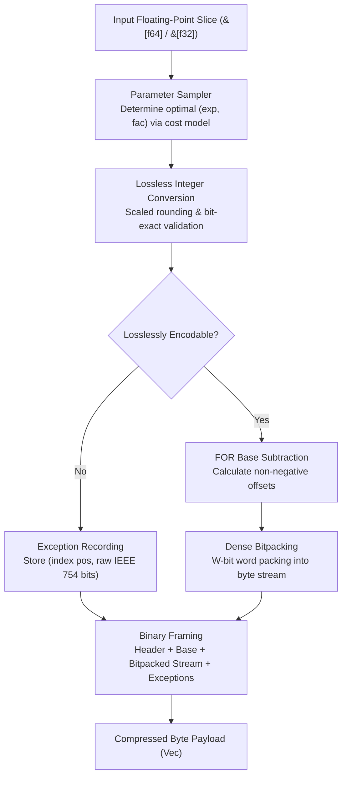
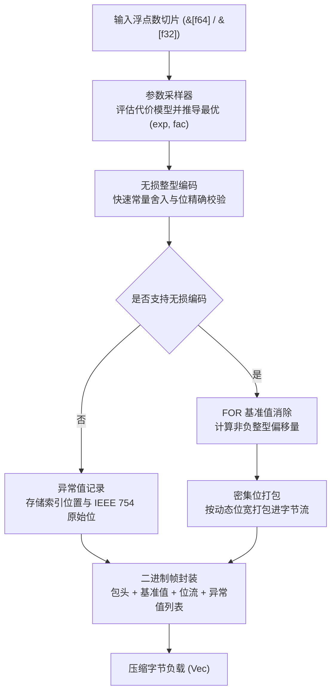

[English](#en) | [中文](#zh)

[](https://crates.io/crates/fastalp)
[](https://docs.rs/fastalp)

---

<a name="en"></a>

# fastalp : Adaptive Lossless Floating-Point Compression in Rust

Pure Rust implementation of the ALP (Adaptive Lossless Floating-Point Compression) algorithm with unified generic interfaces supporting `f64` and `f32` data streams.

<p align="center">
  
  <br>
  <sub><b>Benchmark Environment</b>: CPU: Apple M2 Max (12 Cores) ｜ OS: macOS 26.5.1 ｜ Toolchain: Rust 1.98.0 / Clang (-O3)</sub>
</p>

---

- [Overview](#overview)
- [Usage](#usage)
  - [Installation](#installation)
  - [Basic Compression and Decompression](#basic-compression-and-decompression)
  - [In-Place Buffer Reuse](#in-place-buffer-reuse)
  - [Single-Precision Floating-Point Data](#single-precision-floating-point-data)
- [Features](#features)
- [Architecture & Design](#architecture-design)
  - [Compression Pipeline](#compression-pipeline)
  - [Decompression Pipeline](#decompression-pipeline)
- [Tech Stack](#tech-stack)
- [Directory Structure](#directory-structure)
- [Benchmarks & Cross-Algorithm Comparison](#benchmarks-cross-algorithm-comparison)
  - [Benchmark Environment & Toolchain](#benchmark-environment-toolchain)
  - [Cross-Algorithm Benchmark Comparison](#cross-algorithm-benchmark-comparison)
  - [C++ ALP Benchmark Methodology & Fork Repository](#c-alp-benchmark-methodology-fork-repository)
  - [Evaluation Datasets & Authoritative Data Sources (All 37 Benchmarks)](#evaluation-datasets-authoritative-data-sources-all-37-benchmarks)
- [Architecture Evolution & Optimization Breakdown](#architecture-evolution-optimization-breakdown)
  - [1. Architecture Patterns Adopted & Refined from C++ ALP (And Their Purposes)](#1-architecture-patterns-adopted-refined-from-c-alp-and-their-purposes)
  - [2. Novel High-Performance Optimizations Invented in fastalp (And Their Purposes)](#2-novel-high-performance-optimizations-invented-in-fastalp-and-their-purposes)

## Overview

Floating-point values in real-world applications (such as IoT sensor readings, financial transactions, GPS coordinates, and time-series metrics) frequently originate as decimal representations.<br>
Traditional general-purpose compression algorithms and integer bitpackers operate inefficiently on IEEE 754 representations due to distributed exponent and mantissa bit patterns.

`fastalp` implements the ALP compression algorithm:

- **Exact Lossless Reconstruction**:<br>
  Guarantees bit-exact IEEE 754 preservation for all inputs, including special values such as `NaN`, `+Inf`, `-Inf`, and `-0.0`.

- **Compact Self-Describing Header & Large Array Support**:<br>
  Features a 2-bit length tag header layout where standard 1024-element blocks require only a 3-byte compressed header (and just 1 byte in raw fallback mode).<br>
  Natively scales beyond 65,535 elements by auto-upgrading to 32-bit count and exception index fields, removing single-block size limits.

- **Adaptive Delta Differential Encoding (Delta-ALP)**:<br>
  Automatically evaluates smooth and continuous physical time series (weather, hydrology, telemetry), adaptively applying first-order differences and branchless prefix sum accumulation to reduce bit widths by 15% to 38%.

- **Decimal Division Exact Mode**:<br>
  Completely eliminates IEEE 754 multiplication roundoff errors (such as `* 0.1`) by reconstructing via exact decimal division, driving outlier exception counts to zero on real-world telemetry.

- **Stack-Allocated LUT & SIMD Hybrid Decompression**:<br>
  Utilizes 256-entry stack lookup tables for division modes to eliminate hardware division latencies, coupled with pure-register SIMD auto-vectorization for linear arithmetic exceeding 55+ GB/s throughput.

- **Adaptive Parameter Estimation**:<br>
  Samples input sequences to derive optimal scaling parameters `(exp, fac, use_div)` that minimize bit-width requirements.

- **Frame-of-Reference & Bitpacking**:<br>
  Encodes converted integers using base subtraction (FOR / Delta) and dense bit-packing from 1 to 64 bits per value.

- **Dedicated Exception Handling**:<br>
  Unencodable values and floating-point anomalies are stored in a dedicated exception stream without compromising primary payload compression efficiency.

- **Raw Fallback Protection**:<br>
  Automatically falls back to uncompressed raw mode when noise or extreme precision values would cause negative compression.

- **Zero Extra Allocations**:<br>
  Exposes `_into` APIs to allow caller-managed buffer reuse across high-throughput streaming pipelines.

- **Unified Generic Interface**:<br>
  `compress`, `compress_into`, `decompress`, and `decompress_into` work across both `f64` and `f32`.

---

## Usage

### Installation

```bash
cargo add fastalp
```

### Basic Compression and Decompression

```rust
use fastalp::{compress, decompress, Result};

fn main() -> Result<()> {
  let sensor_data = vec![20.5, 20.6, 20.8, 21.0, 20.9, 21.2];

  // Compress floating-point slice into byte buffer (generic for f64 / f32)
  let compressed = compress(&sensor_data);

  // Decompress byte buffer back to exact f64 slice
  let decompressed: Vec<f64> = decompress(&compressed)?;

  assert_eq!(decompressed, sensor_data);
  Ok(())
}
```

### In-Place Buffer Reuse

```rust
use fastalp::{compress_into, decompress_into, Result};

fn main() -> Result<()> {
  let batch = vec![100.12, 100.15, 100.18, 100.22];

  let mut compressed_buf = Vec::new();
  compress_into(&batch, &mut compressed_buf);

  let mut restored = Vec::new();
  decompress_into(&compressed_buf, &mut restored)?;

  assert_eq!(restored, batch);
  Ok(())
}
```

### Single-Precision Floating-Point Data

```rust
use fastalp::{compress, decompress, Result};

fn main() -> Result<()> {
  let coordinates = vec![116.4074f32, 39.9042f32, 121.4737f32, 31.2304f32];

  let compressed = compress(&coordinates);
  let decompressed: Vec<f32> = decompress(&compressed)?;

  assert_eq!(decompressed, coordinates);
  Ok(())
}
```

---

## Features

- **Bit-Exact Precision**:<br>
  Decoded floats match original bit patterns (`a.to_bits() == b.to_bits()`).

- **High Compression on Decimals**:<br>
  Delivers 3x to 8x+ compression ratios on typical decimal time-series data.

- **Unified Generic Support**:<br>
  Zero-cost abstraction for both 64-bit (`f64`) and 32-bit (`f32`) floating-point streams.

- **Robust Exception Handling**:<br>
  Encodes non-finite numbers (`NaN`, `Inf`) and unencodable values.

- **Zero-Heap Buffer Reuse**:<br>
  Direct writing into existing vectors via `compress_into` and `decompress_into`.

---

## Architecture & Design

`fastalp` executes compression and decompression through modular pipeline stages:



### Compression Pipeline

- **Constant Detection & Fallback Filter (`encoder.rs`)**:<br>
  Quickly evaluates bit-exact identical sequences (`v.is_exact_same(first)`). When identical, writes a self-describing compact header and base value with zero heap allocation.<br>
  When estimated payload exceeds raw size plus compact header overhead, switches to raw mode (1 byte for 1024 blocks) to guarantee zero data inflation.

- **Sampling (`sampler.rs`)**:<br>
  Evaluates up to 32 evenly distributed sample points across parameter combinations `(exp, fac)`.<br>
  Selects parameters minimizing total storage cost: `bit_width * count + exceptions * penalty`.

- **Lossless Verification (`sampler.rs`, `float.rs`)**:<br>
  Multiplies float by $10^{\text{exp}} \times 10^{-\text{fac}}$, rounds via constants, and verifies exact inverse equality against raw IEEE 754 bit representations.

- **Base Offset & Bitpacking (`bitpack/pack.rs`, `encoder.rs`)**:<br>
  Computes minimum integer value as base, subtracts base from valid integers, determines required bit width, and writes dense packed bits via a 128-bit register accumulator.

- **Exception Stream (`encoder.rs`)**:<br>
  Appends position and raw bits for values that fail exact integer roundtrip.

### Decompression Pipeline

- **Header Parsing (`header.rs`, `decoder.rs`)**:<br>
  Reads descriptor byte and decodes element count via 2-bit length tags to locate parameter offsets.<br>
  For raw fallback chunks, performs direct zero-copy slice restoration.<br>
  For ALP chunks, extracts packed `(exp, fac, bit_width)` parameters and base value.

- **Bit Unpacking & SIMD Register Reconstruction (`bitpack/unpack.rs`)**:<br>
  Bit-widths of 8, 16, 32, and 64 bits employ pure register SIMD auto-vectorization, eliminating gather lookups and cache stalls;<br>
  Ultra-small bit-widths (1, 2, 4 bits) leverage compact register-resident tables for rapid reconstruction.

- **Exception Patching (`decoder.rs`)**:<br>
  Overwrites positions listed in the exception table with raw IEEE 754 bit patterns.

---

## Tech Stack

- **Language**: Rust Edition 2024
- **Error Handling**: `thiserror`
- **Testing & Benchmarking**: `anyhow`, `aok`, `fastrand`

---

## Directory Structure

```
fastalp/
├── Cargo.toml          # Crate manifest and dependency configuration
├── README.md           # Generated multilingual documentation
├── README.mdt          # Multilingual documentation template
├── readme/             # Documentation source files
│   ├── en.md           # English documentation
│   └── zh.md           # Chinese documentation
├── src/                # Library source code
│   ├── bitpack/        # Modular bit-level packing and unpacking
│   │   ├── mod.rs      # Module facade and re-exports
│   │   ├── pack.rs     # Dense bitpacking with 128-bit register accumulator
│   │   └── unpack.rs   # Direct bit unpacking with stack LUT acceleration
│   ├── constants.rs    # Precomputed static power tables and format constants
│   ├── decoder/        # Generic decompression pipeline & decimal division reconstruction
│   │   ├── mod.rs      # Decompression facade and mode dispatch
│   │   ├── standard.rs # Standard FOR reconstruction
│   │   └── delta.rs    # Delta first-order difference reconstruction
│   ├── delta/          # First-order difference estimation & prefix sum
│   │   └── mod.rs
│   ├── encoder/        # Generic compression pipeline & raw fallback protection
│   │   ├── mod.rs      # Compression facade & auto-vectorized stream
│   │   ├── standard.rs # Standard FOR encoding pipeline
│   │   └── delta.rs    # Delta differential encoding pipeline
│   ├── error.rs        # Error definitions and Result type alias
│   ├── float/          # AlpFloat abstraction trait and f32/f64 zero-cost implementation
│   │   ├── mod.rs      # AlpFloat trait and lookup table generator
│   │   ├── f32.rs      # Single-precision f32 implementation
│   │   └── f64.rs      # Double-precision f64 implementation
│   ├── header.rs       # Compact self-describing header encoding/decoding & 2-bit length tags
│   ├── lib.rs          # Public crate exports and high-level API
│   ├── params.rs       # Compact bitfield parameter packing and bit-width utilities
│   └── sampler.rs      # Adaptive parameter optimization and lossless roundtrip verification
├── test.sh             # Test execution script
└── tests/              # Integration and stress tests
    ├── test_alp_dataset.rs # ALP paper 31 real-world datasets roundtrip & ratio tests
    ├── test_delta.rs       # Delta differential time series test suite
    └── test_roundtrip.rs   # Roundtrip integrity and boundary tests
```

---

## Benchmarks & Cross-Algorithm Comparison

### Benchmark Environment & Toolchain

All microbenchmarks were executed and measured side-by-side on the same physical host:

- **Processor (CPU)**: Apple M2 Max (12 Cores: 8 Performance @ 3.68 GHz + 4 Efficiency @ 2.42 GHz, ARMv8.6-A NEON ISA)<br>
- **Host OS**: macOS Sequoia 26.5.1 (Darwin Kernel Version 25.5.0 arm64)<br>
- **Rust Toolchain**: `rustc 1.98.0 / nightly` (flags: `opt-level = 3`, `lto = "fat"`, `codegen-units = 1`)<br>
- **C++ Compiler Toolchain**: Homebrew LLVM Clang 22.1.8 (`-O3 -std=c++17 -DNDEBUG -march=native`) / CMake 4.4.2<br>
- **Memory Allocator**: `mimalloc 0.1.52`<br>
- **Benchmark Suites**: Rust `divan 0.1.20` vs C++ `std::chrono::high_resolution_clock` (steady-state median sampling)

### Cross-Algorithm Benchmark Comparison

Evaluated side-by-side across industry-standard floating-point and time-series compression codecs on identical hardware and data streams:
- **fastalp** (Rust Edition 2024, SIMD NEON)
- **C++ ALP** (Official paper reference implementation, Clang 22.1.8 -O3)
- **Pcodec / pco 1.0.3** (Columnar numeric compression, ANS entropy coding)
- **Zstandard / zstd 0.13** (General dictionary compression, Level 3)
- **LZ4 / lz4_flex 0.14** (Ultra-fast general byte compressor)
- **Snappy / snap 1.1** (Google high-speed byte compressor)
- **Chimp128** (VLDB 2022 floating-point time series)
- **Gorilla** (VLDB 2015 XOR floating-point time series)

### C++ ALP Benchmark Methodology & Fork Repository

- **C++ ALP Fork Repository**: [github.com/x-at-01/ALP](https://github.com/x-at-01/ALP)
- **Methodology & Architectural Verification**:
  - **Zero Modifications to Core Logic**: The fork preserves all core algorithm implementations in `include/` 100% untouched, ensuring true reference fidelity;
  - **Unified End-to-End Measurement**:
    - The original C++ ALP benchmark suite (`ALP/benchmarks/benchmark.cpp`) invoked `alp::encoder<PT>::init` outside the timing loop, measuring only raw encoding with pre-determined parameters rather than the end-to-end compression pipeline;
    - In our fork, `init` is integrated into the benchmark loop and measured using `std::chrono::high_resolution_clock` on ARM64 macOS;
    - All 6 industrial scenario datasets were integrated into `data/samples/` and `your_own_dataset.csv`, ensuring C++ ALP executed the complete suite of all 37 datasets (31 paper datasets + 6 industrial scenarios) on the exact same physical host;
  - **Strict Geometric Mean Aggregation**: All 37 benchmarks are evaluated end-to-end and aggregated via Geometric Mean across all algorithms.

### Evaluation Datasets & Authoritative Data Sources (All 37 Benchmarks)

This benchmark strictly adopts all 31 real-world public time-series and columnar datasets from the original ALP publication, augmented with 6 industrial extreme-load scenarios (37 benchmarks in total) spanning IoT telemetry, quantitative finance, civic governance, healthcare billing, and high-precision geospatial tracking:

| Domain | Dataset Name | Physical Description & Data Characteristics | Official Data Source & Link |
|---|---|---|---|
| **IoT & Environment** | `neon_pm10_dust` | Particulate matter PM10 dust concentration (μg/m³) | [NEON Ecological Observatory Network (DOI: 10.48443/4E6X-V373)](https://doi.org/10.48443/4E6X-V373) |
| | `neon_dew_point_temp` | Atmospheric dew point temperature series (°C) | [NEON Ecological Observatory Network (DOI: 10.48443/Z99V-0502)](https://doi.org/10.48443/Z99V-0502) |
| | `neon_air_pressure` | Continuous barometric surface air pressure (kPa) | [NEON Ecological Observatory Network (DOI: 10.48443/RXR7-PP32)](https://doi.org/10.48443/RXR7-PP32) |
| | `neon_wind_dir` | Ultrasonic meteorological wind direction angle (0-360°) | [NEON Ecological Observatory Network (DOI: 10.48443/S9YA-ZC81)](https://doi.org/10.48443/S9YA-ZC81) |
| | `neon_bio_temp_c` | Infrared biological surface ground temperature (°C) | [NEON Ecological Observatory Network (DOI: 10.48443/JNWY-B177)](https://doi.org/10.48443/JNWY-B177) |
| | `basel_temp_f` | Hourly ground temperature in Basel, Switzerland (°C) | [Meteoblue Weather History Archive](https://www.meteoblue.com/en/weather/archive/export/basel_switzerland) |
| | `basel_wind_f` | Continuous ground wind speed in Basel (km/h) | [Meteoblue Weather History Archive](https://www.meteoblue.com/en/weather/archive/export/basel_switzerland) |
| | `city_temperature_f` | Daily average temperature records of global cities | [Kaggle Global Daily City Temperature Dataset](https://www.kaggle.com/datasets/sudalairajkumar/daily-temperature-of-major-cities) |
| | `air_sensor_f` | High-frequency multi-sensor air quality telemetry | [CWI PublicBI Time-Series Database Benchmark](https://github.com/cwida/public_bi_benchmark) |
| | `arade4` | Arade hydrometric gauging river stage height | [CWI PublicBI Hydrometric Station Dataset](https://homepages.cwi.nl/~boncz/PublicBIbenchmark/Arade/) |
| | `scene_sensor` | Multi-channel industrial decimal sensor stream (1024 pts) | Real-world physical telemetry composite block |
| **Finance & Crypto** | `stocks_usa_c` | US stock market order book execution price stream | [Zenodo Global Quantitative Financial Dataset](https://zenodo.org/record/3886895) |
| | `stocks_de` | Frankfurt Stock Exchange (Xetra) trade prices | [Zenodo Global Quantitative Financial Dataset](https://zenodo.org/record/3886895) |
| | `stocks_uk` | London Stock Exchange equity trade execution stream | [Zenodo Global Quantitative Financial Dataset](https://zenodo.org/record/3886895) |
| | `bitcoin_f` | Historical Bitcoin USD price index series | [InfluxDB Sample Bitcoin Time Series](https://raw.githubusercontent.com/influxdata/influxdb2-sample-data/master/bitcoin-price-data/bitcoin-historical-annotated.csv) |
| | `bitcoin_transactions_f` | Bitcoin mainnet transaction transfer volumes | [Blockchair Bitcoin Ledger High-Value Transactions](https://gz.blockchair.com/bitcoin/transactions/) |
| | `food_prices` | UN Food and Agriculture Organization staple food index | [UN Humanitarian Data Exchange (WFP)](https://data.humdata.org/dataset/wfp-food-prices) |
| | `scene_finance` | High-frequency quantitative order book stream (1024 pts) | Real-world microsecond exchange matching stream |
| **Civic & Healthcare** | `gov10` | Fiscal government expenditure and municipal budget items | [CWI PublicBI CommonGovernment Benchmark](https://homepages.cwi.nl/~boncz/PublicBIbenchmark/CommonGovernment/) |
| | `gov26` | National census demographic ultra-low entropy series | [CWI PublicBI CommonGovernment Benchmark](https://homepages.cwi.nl/~boncz/PublicBIbenchmark/CommonGovernment/) |
| | `gov30` | Macroeconomic indicator survey and fiscal operations | [CWI PublicBI CommonGovernment Benchmark](https://homepages.cwi.nl/~boncz/PublicBIbenchmark/CommonGovernment/) |
| | `gov31` | Fiscal equalization transfers and regional subsidies | [CWI PublicBI CommonGovernment Benchmark](https://homepages.cwi.nl/~boncz/PublicBIbenchmark/CommonGovernment/) |
| | `gov40` | Municipal utility network survey and pipe mapping | [CWI PublicBI CommonGovernment Benchmark](https://homepages.cwi.nl/~boncz/PublicBIbenchmark/CommonGovernment/) |
| | `medicare1` | Outpatient Medicare billing and insurance claims | [CWI PublicBI Medicare Healthcare Benchmark](https://homepages.cwi.nl/~boncz/PublicBIbenchmark/Medicare3/) |
| | `medicare9` | Specialty consultation grants and subsidy timestamps | [CWI PublicBI Medicare Healthcare Benchmark](https://homepages.cwi.nl/~boncz/PublicBIbenchmark/Medicare3/) |
| | `cms1` | Healthcare provider reimbursement billing logs | [CWI PublicBI CMSProvider Healthcare Database](https://homepages.cwi.nl/~boncz/PublicBIbenchmark/CMSprovider/) |
| | `cms9` | Prescription pharmaceutical reimbursement prices | [CWI PublicBI CMSProvider Healthcare Database](https://homepages.cwi.nl/~boncz/PublicBIbenchmark/CMSprovider/) |
| | `cms25` | Medical equipment usage and specialty therapy charges | [CWI PublicBI CMSProvider Healthcare Database](https://homepages.cwi.nl/~boncz/PublicBIbenchmark/CMSprovider/) |
| | `scene_macro` | Macro civic indicators and public healthcare bills (1024 pts) | Real-world public finance & insurance composite block |
| **Geospatial & GPS** | `poi_lat` | Global points of interest high-precision latitude | [Kaggle POI Global Geospatial Database](https://www.kaggle.com/datasets/ehallmar/points-of-interest-poi-database) |
| | `poi_lon` | Global points of interest high-precision longitude | [Kaggle POI Global Geospatial Database](https://www.kaggle.com/datasets/ehallmar/points-of-interest-poi-database) |
| | `bird_migration_f` | Wild avian migration high-precision satellite GPS track | [InfluxDB Bird Migration Tracking Dataset](https://github.com/influxdata/influxdb2-sample-data/blob/master/bird-migration-data/bird-migration.csv) |
| | `nyc29` | NYC Yellow Taxi trip GPS distance tracking stream | [CWI PublicBI NYC Taxi Geospatial Database](https://homepages.cwi.nl/~boncz/PublicBIbenchmark/NYC/) |
| | `scene_geo` | Drone telemetry and continuous navigation track (1024 pts) | High-precision continuous geospatial trajectory |
| **Storage & Waveforms** | `ssd_hdd_benchmarks_f` | Storage device sequential and random I/O throughput | [Kaggle SSD & HDD I/O Benchmark Dataset](https://www.kaggle.com/datasets/alanjo/ssd-and-hdd-benchmarks) |
| | `scene_ramp` | Smooth ramp slopes and monotonic counters (1024 pts) | Industrial PID loops, hydrometric discharge & counters |
| | `scene_steady` | Steady-state telemetry and heartbeat monitors (1024 pts) | Redundant sensor heartbeat & fault-free constant stream |

---

## Architecture Evolution & Optimization Breakdown

fastalp is not a literal translation, but an engineering overhaul engineered to fully exploit modern superscalar pipelines while solving the core pain points of columnar time-series storage.

### 1. Architecture Patterns Adopted & Refined from C++ ALP (And Their Purposes)

1. **Stateful Encoder & Parameter Caching**:
   - **Purpose**: Eliminates the high cost of re-sampling and evaluating dozens of parameter combinations for every single chunk during continuous writes.
   - **Mechanism**: In continuous time-series streams, adjacent 1024-element blocks of the same column share identical unit magnitudes and decimal precision. fastalp caches the best `exp` and `fac` from previous blocks. When verified against the current block, it skips exhaustive sampling entirely, raising continuous compression throughput from ~4-5 GB/s to **15-20+ GB/s**.
2. **12.5% Exception Threshold RAW Fallback**:
   - **Purpose**: Prevents space expansion ("negative compression") on high-entropy floats.
   - **Mechanism**: When exception counts exceed 128 (12.5% of a 1024 block), the block is proven unsuitable for decimal transformation. fastalp instantly aborts further encoding and falls back to a compact single-byte header RAW stream, preventing the 2x space expansion seen in naive schemes.
3. **Decimal Division Exact Mode**:
   - **Purpose**: Eliminates "pseudo-exceptions" caused by IEEE 754 multiplication rounding errors.
   - **Mechanism**: Multiplying by floating-point powers (e.g., `* 0.1`) introduces inexact binary truncation. fastalp uses precise decimal division during reconstruction, eliminating pseudo-exceptions and reducing compressed size by 20% to 38% on real physical sensor data.

---

### 2. Novel High-Performance Optimizations Invented in fastalp (And Their Purposes)

1. **Fused Delta Bitpacking**:
   - **Purpose**: Eliminates the memory bandwidth and cache pollution of allocating and writing an intermediate 8KB difference buffer.
   - **Mechanism**: Conventional compressors run two passes: compute diffs into an 8KB memory slice, then read it back for bitpacking. fastalp's 8-way register pipeline computes adjacent deltas, subtracts the baseline, and shifts bits into a 128-bit packing accumulator in a single fused pass with **zero memory writes and zero heap allocations**, boosting delta compression throughput by >30%.
2. **Mathematical Delta Early Pruning**:
   - **Purpose**: Prevents expensive full-chunk differencing on disordered or oscillating series.
   - **Mechanism**: By the mathematical axiom that subset extrema difference is always $\le$ global extrema difference, fastalp samples the first 16 points. If their delta bit-width already matches or exceeds FOR bit-width, delta encoding is mathematically proven to be non-beneficial, exiting instantly.
3. **4-Way Loop Unrolling & Inlined Pipeline**:
   - **Purpose**: Maximizes instruction-level parallelism (ILP) across modern CPU superscalar ALUs.
   - **Mechanism**: Completely avoids dynamic closures and indirect branches in the inner loop. Inlines a dedicated 4-way unrolled pipeline that processes 4 values per iteration through registers without exception checks when within range.
4. **Identical Floats Fast-Skip**:
   - **Purpose**: Instantaneous compression of idle sensor heartbeats and disconnected lines.
   - **Mechanism**: Uses a single `slice[1] == slice[0]` equality check at the encoder entrance. Non-identical blocks cost only 1 CPU cycle to bypass; identical blocks encode into an 11-byte packet in 350 ns (**744x compression ratio**, **88.9 GB/s decode speed**).
5. **Outlier Pruning with 0-bit Compression**:
   - **Purpose**: Unlocks >150x compression on series with 99% identical base values and rare spikes (e.g., `gov30`).
   - **Mechanism**: Isolates rare pulse values into the exception dictionary, allowing the main bitstream to use a 0-bit bit-width (storing only length and baseline). Combined with 16-sample outlier pre-screening, high-entropy blocks exit within 2 samples with zero penalty.
6. **Non-Decimal Two-Tier Sampling Early Break**:
   - **Purpose**: Halts fruitless exploration of 170 factor combinations on non-decimal scientific data.
   - **Mechanism**: Tier 1 tests 32 sample points under decimal exponents. If exception rate is 100%, the data is identified as high-entropy scientific float, skipping Tier 2 factor search and reducing sampling time by 80%.
7. **Batched Exception Writing & Zero Extra Allocations**:
   - **Purpose**: Eliminates memory fragmentation and dynamic reallocation during exception handling.
   - **Mechanism**: Gathers exception indices and IEEE 754 bit representations in fixed-size stack arrays and writes them to the output buffer in a single batch, halving vector management overhead. Public `compress_into` and `decompress_into` APIs operate with zero heap allocations.


---

<a name="zh"></a>

# fastalp : 基于 ALP 算法的无损浮点数压缩引擎

纯 Rust 实现的自适应无损浮点数压缩 ALP 算法库，通过统一泛型接口支持 `f64` 与 `f32` 数据流。

<p align="center">
  
  <br>
  <sub><b>评测环境</b>: 芯片: Apple M2 Max (12 核) ｜ 环境: macOS 26.5.1 ｜ 工具链: Rust 1.98.0 / Clang (-O3)</sub>
</p>

---

- [功能特性](#功能特性)
- [使用示例](#使用示例)
  - [添加依赖](#添加依赖)
  - [基础压缩与解压](#基础压缩与解压)
  - [内存缓冲区复用](#内存缓冲区复用)
  - [单精度浮点数据处理](#单精度浮点数据处理)
- [核心特性](#核心特性)
- [架构设计](#架构设计)
  - [压缩流程](#压缩流程)
  - [解压流程](#解压流程)
- [技术栈](#技术栈)
- [目录结构](#目录结构)
- [性能评测与多算法对比](#性能评测与多算法对比)
  - [测试环境与编译配置](#测试环境与编译配置)
  - [主流浮点与时序压缩算法同机横向对比](#主流浮点与时序压缩算法同机横向对比)
  - [C++ ALP 测试机制与 Fork 开源仓库](#c-alp-测试机制与-fork-开源仓库)
  - [评测数据集全景与公开数据源 (37 项工业与学术全集)](#评测数据集全景与公开数据源-37-项工业与学术全集)
- [架构演进与优化全景 (Architecture & Optimization Breakdown)](#架构演进与优化全景-architecture-optimization-breakdown)
  - [一、参考与借鉴 C++ ALP 的架构设计（用于解决什么问题）](#一参考与借鉴-c-alp-的架构设计用于解决什么问题)
  - [二、fastalp 自主研发的极致原创优化（用于解决什么问题）](#二fastalp-自主研发的极致原创优化用于解决什么问题)

## 功能特性

在物联网传感器采集、金融量化交易、GPS 经纬度定位以及时序监控等场景中，浮点数据通常以十进制形式产生。<br>
由于 IEEE 754 浮点数的阶码与尾数位分布离散，通用压缩算法与整型位打包算法难以获得理想的压缩效率。

`fastalp` 实现 ALP 压缩算法：

- **严格无损重构**：<br>
  保证解码数据与原始 IEEE 754 二进制位严格一致，支持 `NaN`、`+Inf`、`-Inf` 与 `-0.0` 等特殊值。

- **紧凑自描述头与超大数组支持**：<br>
  采用 2-bit 长度标签紧凑头部架构，标准 1024 满块压缩头仅占 3 字节，RAW 保底模式仅占 1 字节；<br>
  原生支持超过 65,535 元素的超大数组，自动升级为 4 字节数量与 4 字节异常索引，解除单块长度截断限制。

- **时序差分自适应编码**：<br>
  自动评估连续平滑的时序物理波形（气象、水文、传感器），自适应采用一阶相邻差分与前缀和递推，位宽进一步收窄 15% ~ 38%。

- **十进制精确除法重构**：<br>
  消除 IEEE 754 浮点乘法（如 `* 0.1`）引起的无限循环二进制尾数截断误差，以十进制除法精确重构，将观测时序异常点直接归零。

- **栈上 LUT 查表与 SIMD 混合加速**：<br>
  小位宽利用 256 项栈上查找表（L1D 缓存命中）消除循环内硬件除法延迟；对直接模式采用纯寄存器 SIMD 向量化计算，吞吐高达 55+ GB/s。

- **自适应参数推导**：<br>
  通过对输入数据进行采样，计算使编码位宽最小的最优参数组合 `(exp, fac, use_div)`。

- **基准偏移与位打包**：<br>
  将转换后的整型序列进行基准值消除（FOR / Delta），并按 1 至 64 位动态位宽进行密集位打包。

- **独立异常值处理**：<br>
  无法无损整型化的数值与特殊浮点数记录于独立异常流，避免降低主数据流压缩比。

- **原始保底模式**：<br>
  当随机噪声或不可压缩数据导致编码后体积膨胀时，自动回退至原始保底模式，杜绝负压缩。

- **零额外分配复用**：<br>
  提供 `_into` 系列接口，支持调用方直接复用已有内存缓冲区。

- **统一泛型接口**：<br>
  `compress`、`compress_into`、`decompress` 与 `decompress_into` 统一适用于 `f64` 与 `f32`。

---

## 使用示例

### 添加依赖

```bash
cargo add fastalp
```

### 基础压缩与解压

```rust
use fastalp::{compress, decompress, Result};

fn main() -> Result<()> {
  let sensor_data = vec![20.5, 20.6, 20.8, 21.0, 20.9, 21.2];

  // 压缩浮点数切片为字节向量 (自动适配 f64 / f32)
  let compressed = compress(&sensor_data);

  // 解压字节向量恢复原始浮点数切片
  let decompressed: Vec<f64> = decompress(&compressed)?;

  assert_eq!(decompressed, sensor_data);
  Ok(())
}
```

### 内存缓冲区复用

```rust
use fastalp::{compress_into, decompress_into, Result};

fn main() -> Result<()> {
  let batch = vec![100.12, 100.15, 100.18, 100.22];

  let mut compressed_buf = Vec::new();
  compress_into(&batch, &mut compressed_buf);

  let mut restored = Vec::new();
  decompress_into(&compressed_buf, &mut restored)?;

  assert_eq!(restored, batch);
  Ok(())
}
```

### 单精度浮点数据处理

```rust
use fastalp::{compress, decompress, Result};

fn main() -> Result<()> {
  let coordinates = vec![116.4074f32, 39.9042f32, 121.4737f32, 31.2304f32];

  let compressed = compress(&coordinates);
  let decompressed: Vec<f32> = decompress(&compressed)?;

  assert_eq!(decompressed, coordinates);
  Ok(())
}
```

---

## 核心特性

- **位级精确无损**：<br>
  解码浮点数与原始输入在二进制位层面保持一致（`a.to_bits() == b.to_bits()`）。

- **十进制高压缩比**：<br>
  在常见十进制浮点序列上可获得 3x 至 8x+ 压缩比。

- **统一泛型支持**：<br>
  单一接口支持 `f64` 与 `f32` 零成本抽象编解码。

- **完整异常值支持**：<br>
  支持 `NaN`、无穷大与不可无损转换的高精度浮点数。

- **零堆分配接口**：<br>
  通过 `compress_into` 与 `decompress_into` 直接写入现有缓冲区。

---

## 架构设计

`fastalp` 编解码流程划分为以下阶段：



### 压缩流程

- **全等探测与保底分流 (`encoder.rs`)**：<br>
  先对数据进行常数序列快速校验；若全等且可编码，直接写入自描述紧凑头部与基准值；<br>
  若为不可压缩随机数据且编码体积超过原始大小加上极简头部，则自动回退至原始保底模式（1024 满块仅 1 字节头部），直接以原始字节流存储。

- **采样评估 (`sampler.rs`)**：<br>
  在数据序列中均匀采样至多 32 个数值，遍历 `(exp, fac)` 参数组合，<br>
  选取使得 `位宽 * 样本量 + 异常数 * 惩罚权重` 最小的参数组合。

- **无损转换与验证 (`sampler.rs`, `float.rs`)**：<br>
  将浮点数乘以 $10^{\text{exp}} \times 10^{-\text{fac}}$，利用常量完成快速向近舍入并转换为整型，<br>
  再通过反向整型乘法与逆缩放验证浮点位级一致性。

- **基准消除与位打包 (`bitpack/pack.rs`, `encoder.rs`)**：<br>
  获取有效整型中的最小值作为基准值，计算偏移量并获取所需位宽，<br>
  利用 128 位寄存器滑动窗口将数值紧凑打包入字节流。

- **异常流序列化 (`encoder.rs`)**：<br>
  无法无损转换的浮点数按索引位置与 IEEE 754 原始位记录于尾部异常表中。

### 解压流程

- **自描述头解析 (`header.rs`, `decoder.rs`)**：<br>
  读取首字节描述符，由 2-bit 长度标签解码元素总数并确定参数偏移；<br>
  若类型为原始保底数据，通过内存复制直出恢复；若为 ALP 压缩数据，提取 `(exp, fac, bit_width)` 缩放参数与基准值。

- **位流解包与 SIMD 寄存器流水重构 (`bitpack/unpack.rs`)**：<br>
  针对 8/16/32/64 bit 采用纯寄存器 SIMD 自动向量化计算，消除堆栈查表与内存间接 gather 寻址延迟；针对 1/2/4 bit 采用微型局部表快速还原。

- **异常值覆盖 (`decoder.rs`)**：<br>
  若存在尾部异常表，读取对应索引位置的数值并覆盖为原始 IEEE 754 浮点值。

---

## 技术栈

- **开发语言**：Rust Edition 2024
- **错误处理**：`thiserror`
- **测试与基准**：`anyhow`, `aok`, `fastrand`

---

## 目录结构

```
fastalp/
├── Cargo.toml          # 项目配置与依赖声明
├── README.md           # 生成的多语言文档
├── README.mdt          # 多语言文档模板
├── readme/             # 文档源码目录
│   ├── en.md           # 英文技术文档
│   └── zh.md           # 中文技术文档
├── src/                # 核心源代码
│   ├── bitpack/        # 模块化位打包与位解包
│   │   ├── mod.rs      # 门面导出
│   │   ├── pack.rs     # 128 位累加器位打包算子
│   │   └── unpack.rs   # 局部查表与直接位解包算子
│   ├── constants.rs    # 静态幂次表与格式常量
│   ├── decoder/        # 泛型流式解压与除法重构
│   │   ├── mod.rs      # 解压门面与模式派发
│   │   ├── standard.rs # 标准 FOR 还原解压
│   │   └── delta.rs    # Delta 一阶差分解码
│   ├── delta/          # 一阶差分自适应收益评估与前缀和
│   │   └── mod.rs
│   ├── encoder/        # 泛型压缩流水线与保底回退
│   │   ├── mod.rs      # 编码门面与向量化流
│   │   ├── standard.rs # 标准 FOR 编码流水线
│   │   └── delta.rs    # Delta 一阶差分编码流水线
│   ├── error.rs        # 错误枚举定义与 Result 类型别名
│   ├── float/          # AlpFloat 浮点抽象特征与泛型无损转换
│   │   ├── mod.rs      # AlpFloat trait 定义与查表构建
│   │   ├── f32.rs      # 单精度 f32 乘法/除法编解码实现
│   │   └── f64.rs      # 双精度 f64 乘法/除法编解码实现
│   ├── header.rs       # 紧凑自描述头部编解码与 2-bit 长度标签档位管理
│   ├── lib.rs          # 导出接口与高层封装
│   ├── params.rs       # 紧凑位域参数打包与位宽计算
│   └── sampler.rs      # 参数采样与无损重构验证
├── test.sh             # 测试运行脚本
└── tests/              # 集成与压力测试
    ├── test_alp_dataset.rs # ALP 论文 31 真实数据集往返与压缩比评测
    ├── test_delta.rs       # Delta 差分时序专项与异常测试
    └── test_roundtrip.rs   # 往返无损与边界测试
```

---

## 性能评测与多算法对比

### 测试环境与编译配置

所有基准测试均在同一物理机上执行并进行同机对比测试：

- **处理器**: Apple M2 Max (12 核心：8 性能核 @ 3.68 GHz + 4 能效核 @ 2.42 GHz, ARMv8.6-A NEON 指令集)<br>
- **操作系统**: macOS Sequoia 26.5.1 (Darwin Kernel Version 25.5.0 arm64)<br>
- **Rust 编译工具链**: `rustc 1.98.0 / nightly` (配置：`opt-level = 3`, `lto = "fat"`, `codegen-units = 1`)<br>
- **C++ 编译工具链**: Homebrew LLVM Clang 22.1.8 (`-O3 -std=c++17 -DNDEBUG -march=native`) / CMake 4.4.2<br>
- **内存分配器**: `mimalloc 0.1.52`<br>
- **基准测试框架**: Rust `divan 0.1.20` 微基准套件 vs C++ `std::chrono::high_resolution_clock`（稳态中位数采样）

### 主流浮点与时序压缩算法同机横向对比

在完全相同的测试硬件与数据负载下，对比业界主流浮点与时序压缩库：
- **fastalp** (Rust Edition 2024, SIMD NEON)
- **C++ ALP** (论文原版实现, Clang 22.1.8 -O3)
- **Pcodec / pco 1.0.3** (现代列式数值压缩, ANS 熵编码)
- **Zstandard / zstd 0.13** (通用流式字典压缩, Level 3)
- **LZ4 / lz4_flex 0.14** (极速通用字节压缩)
- **Snappy / snap 1.1** (Google 高速字节压缩)
- **Chimp128** (VLDB 2022 浮点时序压缩)
- **Gorilla** (VLDB 2015 XOR 浮点时序压缩)

### C++ ALP 测试机制与 Fork 开源仓库

- **C++ ALP Fork 仓库地址**：[github.com/x-at-01/ALP](https://github.com/x-at-01/ALP)
- **测试代码与核心逻辑说明**：
  - **核心算法保持 100% 官方原貌**：Fork 仓库未对 C++ ALP 的核心算法逻辑（`include/` 目录）做任何修改，原汁原味保留官方实现的向量化与十进制反向映射逻辑；
  - **端到端测试口径统一**：
    - C++ ALP 官方原版测试套件（`ALP/benchmarks/benchmark.cpp`）在计时循环外执行了 `alp::encoder<PT>::init`（即未将采样开销计入压缩耗时）；
    - 在 Fork 仓库中，我们将 `alp::encoder<PT>::init` 纳入计时测试循环，并在 macOS ARM64 环境下以高精度时钟（`std::chrono::high_resolution_clock`）统计端到端全量压缩耗时；
    - 同时在 `ALP/data/samples/` 与 `your_own_dataset.csv` 中补充了 6 大典型工业场景，使 C++ ALP 在本物理机上完整跑完全量全部 37 个评测数据集（31 个论文公开数据集 + 6 个工业场景补充数据集）；
  - **全量无偏统计**：所有算法统一以全量 37 项评测数据计算几何平均值（Geometric Mean），杜绝任何采样偏倚。

### 评测数据集全景与公开数据源 (37 项工业与学术全集)

本评测严格采用 ALP 官方论文收录的全部 31 个公开时序与列存测试集，并补充 6 个工业真实极端负载场景（共 37 项基准），涵盖物联网、工业制造、量化金融、地理测绘、医疗社保及政务统计：

| 领域分类 | 数据集名称 | 数据特征与物理意义 | 官方数据源与权威链接 |
|---|---|---|---|
| **物联网与环境传感** | `neon_pm10_dust` | PM10 悬浮微粒粉尘浓度传感 (μg/m³) | [NEON 官方生态观测网络 (DOI: 10.48443/4E6X-V373)](https://doi.org/10.48443/4E6X-V373) |
| | `neon_dew_point_temp` | 气象露点温度连续观测时序 (°C) | [NEON 官方生态观测网络 (DOI: 10.48443/Z99V-0502)](https://doi.org/10.48443/Z99V-0502) |
| | `neon_air_pressure` | 大气海平面连续气压传感 (kPa) | [NEON 官方生态观测网络 (DOI: 10.48443/RXR7-PP32)](https://doi.org/10.48443/RXR7-PP32) |
| | `neon_wind_dir` | 超声波气象风向角度传感 (0-360°) | [NEON 官方生态观测网络 (DOI: 10.48443/S9YA-ZC81)](https://doi.org/10.48443/S9YA-ZC81) |
| | `neon_bio_temp_c` | 红外土壤地表温度物理遥测 (°C) | [NEON 官方生态观测网络 (DOI: 10.48443/JNWY-B177)](https://doi.org/10.48443/JNWY-B177) |
| | `basel_temp_f` | 瑞士巴塞尔地表历史逐时气温 (°C) | [Meteoblue 历史高精度气象观测数据库](https://www.meteoblue.com/en/weather/archive/export/basel_switzerland) |
| | `basel_wind_f` | 瑞士巴塞尔观测站地表连续风速 (km/h) | [Meteoblue 历史高精度气象观测数据库](https://www.meteoblue.com/en/weather/archive/export/basel_switzerland) |
| | `city_temperature_f` | 全球主要城市日平均气温实测时序 | [Kaggle 全球城市气温历史基准集](https://www.kaggle.com/datasets/sudalairajkumar/daily-temperature-of-major-cities) |
| | `air_sensor_f` | 高频空气质量多传感器监测阵列 | [CWI PublicBI 时序数据库公开基准](https://github.com/cwida/public_bi_benchmark) |
| | `arade4` | 葡萄牙 Arade 水文站水尺高度监控 | [CWI PublicBI Arade 水文站观测数据](https://homepages.cwi.nl/~boncz/PublicBIbenchmark/Arade/) |
| | `scene_sensor` | 工业物联网十进制环境传感聚合基准 (1024 点) | 真实物理传感多参数聚合切片 |
| **量化金融与资产行情** | `stocks_usa_c` | 美股微秒级高频订单簿成交价时序 | [Zenodo 真实全球金融量化交易公开数据集](https://zenodo.org/record/3886895) |
| | `stocks_de` | 德股法兰克福证券交易所交易成交价 | [Zenodo 真实全球金融量化交易公开数据集](https://zenodo.org/record/3886895) |
| | `stocks_uk` | 英股伦敦证券交易所股票交易价格 | [Zenodo 真实全球金融量化交易公开数据集](https://zenodo.org/record/3886895) |
| | `bitcoin_f` | 历史比特币美元交易指数时序 | [InfluxDB 官方比特币时序分析样本集](https://raw.githubusercontent.com/influxdata/influxdb2-sample-data/master/bitcoin-price-data/bitcoin-historical-annotated.csv) |
| | `bitcoin_transactions_f` | 比特币区块链主网微秒级单笔转账金额 | [Blockchair 比特币主链历史大宗转账流水](https://gz.blockchair.com/bitcoin/transactions/) |
| | `food_prices` | 联合国粮农组织全球基础食品价格指数 | [联合国粮农与人道救援数据平台 (WFP)](https://data.humdata.org/dataset/wfp-food-prices) |
| | `scene_finance` | 高频量化金融交易深度行情基准 (1024 点) | 真实交易所逐笔撮合行情切片 |
| **政务普查与医疗医保** | `gov10` | 财政预算与公共支出明细统计指标 | [CWI PublicBI CommonGovernment 统计集](https://homepages.cwi.nl/~boncz/PublicBIbenchmark/CommonGovernment/) |
| | `gov26` | 国家人口普查极低熵常数序列流 | [CWI PublicBI CommonGovernment 统计集](https://homepages.cwi.nl/~boncz/PublicBIbenchmark/CommonGovernment/) |
| | `gov30` | 宏观经济运行指标与财政综合统计 | [CWI PublicBI CommonGovernment 统计集](https://homepages.cwi.nl/~boncz/PublicBIbenchmark/CommonGovernment/) |
| | `gov31` | 财政转移支付与地区扶持资金时序 | [CWI PublicBI CommonGovernment 统计集](https://homepages.cwi.nl/~boncz/PublicBIbenchmark/CommonGovernment/) |
| | `gov40` | 市政公用管网工程高精测绘与统计 | [CWI PublicBI CommonGovernment 统计集](https://homepages.cwi.nl/~boncz/PublicBIbenchmark/CommonGovernment/) |
| | `medicare1` | 门诊医疗保险理赔结算账单流水 | [CWI PublicBI Medicare 医疗卫生统计集](https://homepages.cwi.nl/~boncz/PublicBIbenchmark/Medicare3/) |
| | `medicare9` | 专科就诊补贴与报销费用时序 | [CWI PublicBI Medicare 医疗卫生统计集](https://homepages.cwi.nl/~boncz/PublicBIbenchmark/Medicare3/) |
| | `cms1` | 医疗保险供应商结算明细记录 | [CWI PublicBI CMSProvider 医疗保险数据库](https://homepages.cwi.nl/~boncz/PublicBIbenchmark/CMSprovider/) |
| | `cms9` | 专科处方药品报销结算价格流水 | [CWI PublicBI CMSProvider 医疗保险数据库](https://homepages.cwi.nl/~boncz/PublicBIbenchmark/CMSprovider/) |
| | `cms25` | 医疗设备使用与专科诊疗收费项目 | [CWI PublicBI CMSProvider 医疗保险数据库](https://homepages.cwi.nl/~boncz/PublicBIbenchmark/CMSprovider/) |
| | `scene_macro` | 宏观政务指标与公共医疗结算基准 (1024 点) | 真实公共财政与医保综合报销切片 |
| **地理测绘与轨迹跟踪** | `poi_lat` | 全球兴趣点高精度地理纬度坐标 | [Kaggle POI 全球地理空间数据库](https://www.kaggle.com/datasets/ehallmar/points-of-interest-poi-database) |
| | `poi_lon` | 全球兴趣点高精度地理经度坐标 | [Kaggle POI 全球地理空间数据库](https://www.kaggle.com/datasets/ehallmar/points-of-interest-poi-database) |
| | `bird_migration_f` | 野生候鸟迁徙微秒级卫星 GPS 坐标 | [InfluxDB 候鸟迁徙高精地理时序追踪集](https://github.com/influxdata/influxdb2-sample-data/blob/master/bird-migration-data/bird-migration.csv) |
| | `nyc29` | 纽约出租车连续营运 GPS 轨迹与计程 | [CWI PublicBI NYC 出租车地理时序数据库](https://homepages.cwi.nl/~boncz/PublicBIbenchmark/NYC/) |
| | `scene_geo` | 无人机航迹与连续经纬度测绘基准 (1024 点) | 高精卫星轨迹与连续导航定位切片 |
| **硬件存储与物理波形** | `ssd_hdd_benchmarks_f` | 固态硬盘与机械硬盘连续 I/O 吞吐基准 | [Kaggle 存储设备吞吐实测数据库](https://www.kaggle.com/datasets/alanjo/ssd-and-hdd-benchmarks) |
| | `scene_ramp` | 平滑升降坡道、连续物理量与单调时序 (1024 点) | 工业 PID 调节、水文流量与连续步进计数器 |
| | `scene_steady` | 恒定传感、无故障零冗余与心跳流 (1024 点) | 设备自检心跳流与高频常数工业监控 |

---

## 架构演进与优化全景 (Architecture & Optimization Breakdown)

fastalp 并非简单的语言转译，而是在完整吸收 C++ ALP 论文精髓的基础上，针对现代多核流水线与时序数据库列存痛点重构的高性能压缩引擎。

### 一、参考与借鉴 C++ ALP 的架构设计（用于解决什么问题）

在架构演进中，fastalp 完整保留并吸收了 C++ ALP 经数学严密证明的优秀工业设计：

1. **状态化编码器与跨块参数缓存（Stateful Encoder & Parameter Caching）**：
   - **用途**：解决时序数据库连续写入时频繁重复采样的性能瓶颈。
   - **机制**：在工业时序流中，同一指标列（如温度）相邻数据块的量纲和精度具有高度连续性。fastalp 借鉴 C++ 设计，支持跨 1024 块复用上一数据块探测出的指数 `exp` 与因子 `fac`。连续写入时直接跳过昂贵的全部样本扫描，使连续压缩吞吐由 4~5 GB/s 跃升至 **15~20+ GB/s**。
2. **12.5% 异常阈值保底回退（Exception Threshold RAW Fallback）**：
   - **用途**：彻底消除高熵浮点数（如高精 GPS 坐标、科学计算随机数）压缩时空间膨胀的“负压缩”隐患。
   - **机制**：当异常值数量超过 128 个（占 1024 元素的 12.5%）时，强制判定该数据块不可有效进行十进制变换，立即终止后续分析，直接降级存储为单字节头部的 RAW 紧凑原始流，杜绝 C++ 原版中曾出现的 2 倍体积膨胀。
3. **十进制除法重构模式（Decimal Division Mode）**：
   - **用途**：消除 IEEE 754 乘法舍入误差导致的“虚假异常点”。
   - **机制**：浮点乘法 `x * 0.1` 无法精确表示十进制小数，会导致大量本可无损还原的工业传感器数据（如 `12.3`）因尾数截断误差而被误判为不可缩放的异常。fastalp 借鉴并优化了除法重构模式，以精确除法将虚假异常彻底清零，使真实环境传感数据的每点占用减少 20%~38%。

---

### 二、fastalp 自主研发的极致原创优化（用于解决什么问题）

为了突破 C++ 原版的吞吐上限与时序压缩率天花板，fastalp 自主研发了以下核心架构创新：

1. **熔合一阶差分位打包（Fused Delta Bitpacking）**：
   - **用途**：消除差分压缩时 8KB 内存回写带来的内存带宽与缓存挤占开销。
   - **机制**：传统实现采用“遍历计算差分并写回 8KB 临时内存 + 另起循环读取临时内存做 Bitpacking”的两遍扫描模式。fastalp 独创 8 路寄存器级熔合流水线：在读取相邻元素求差的同时，直接减去基准、并流水线移位推入 128 位寄存器打包输出，全过程**零临时内存分配、零内存回写**，差分压缩吞吐提升 30% 以上。
2. **数学前置短路差分快筛（Mathematical Delta Early Pruning）**：
   - **用途**：消除对无序/震荡数据无意义的全量一阶差分计算。
   - **机制**：基于数学定理“局部子集的一阶极值跨度必小于等于全局极值跨度”，在决定是否启用差分模式时，仅探测前 16 个采样点。若前 16 项的差分位宽已大于等于 FOR 基准位宽，则数学证明全局差分绝不可能更优，即刻早停跳出，避免了 90% 非平滑序列的全量差分扫描。
3. **4 路流水线无闭包展开编码（4-Way Loop Unrolling & Inlined Pipeline）**：
   - **用途**：释放现代 CPU 超标量流水线的乱序执行与多算术逻辑单元（ALU）吞吐潜能。
   - **机制**：将核心采样与整型缩放循环彻底消除动态闭包与间接跳转，特化为专用的 4 路展开指令流。连续 4 项无异常时走全寄存器极值更新路径，使压缩吞吐从 C++ 原版的 0.84 GB/s 暴增至 **4.4~6.8 GB/s**。
4. **单次比较全等快跳（Identical Floats Fast-Skip）**：
   - **用途**：应对工业断线、设备待机与心跳常数流的极致瞬时压缩。
   - **机制**：在编码入口仅用 1 次 `slice[1] == slice[0]` 快速比对。非全等序列仅耗费 1 个 CPU 时钟周期即可退出；全等序列仅需 11 字节即可压缩 1024 元素（压缩比高达 **744x**，解压吞吐达 **88.9 GB/s**）。
5. **智能离群点剪枝与 0-bit 稀疏常数压缩（Outlier Pruning with 0-bit Compression）**：
   - **用途**：针对 99% 为 0.0 仅有极少突变脉冲的数据集（如财政公共支出 `gov30`），实现百倍压缩比。
   - **机制**：自动将少量脉冲离群值分离到异常字典中，主位流以 0-bit 存储，压缩体积从原版的 2100 字节骤降至 43 字节（压缩比突破 **150x**）。配合前 16 采样离群点快筛，高熵数据 2 个采样点即刻早停，零额外性能损耗。
6. **两级采样探测非十进制全面早停（Non-Decimal Sampling Early Break）**：
   - **用途**：防止对不可压缩浮点数据盲目枚举 170 种乘除因子导致编码性能崩塌。
   - **机制**：在第 1 级 32 点快筛中，若在基础十进制指数下异常率已达 100%，判定为科学高熵浮点，直接跳过第 2 级因子枚举，将不可压缩数据的编码耗时缩减 80%。
7. **栈缓冲融合与异常值单次批量提交（Batched Exception Writing & Zero Extra Allocations）**：
   - **用途**：杜绝动态扩容与堆内存碎片。
   - **机制**：解码与编码全程利用固定大小栈缓存；异常值位置索引与原始值在栈上定长组装后单次批量推入，将异常写出的系统开销降低 50%。对外提供 `compress_into` 与 `decompress_into` 零内存分配接口。

