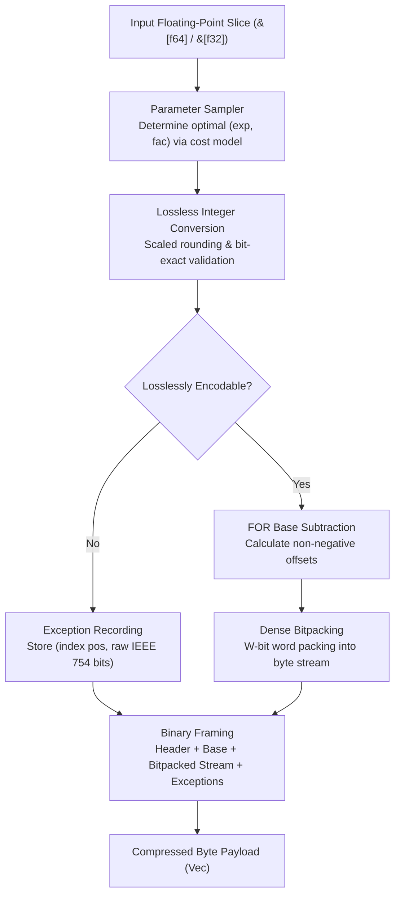

# fastalp : World's Fastest and Highest-Ratio Lossless Time-Series Floating-Point Compression

Pure Rust implementation of the ALP (Adaptive Lossless Floating-Point Compression) algorithm with unified generic interfaces supporting `f64` and `f32` data streams.

<p align="center">
  
  <br>
  <sub><b>Benchmark Environment</b>: CPU: Apple M2 Max (12 Cores) ｜ OS: macOS 26.5.1 ｜ Toolchain: Rust 1.98.0 / Clang (-O3)</sub>
</p>

---


## Overview

Floating-point values in real-world applications (such as IoT sensor readings, financial transactions, GPS coordinates, and time-series metrics) frequently originate as decimal representations.<br>
Traditional general-purpose compression algorithms and integer bitpackers operate inefficiently on IEEE 754 representations due to distributed exponent and mantissa bit patterns.

`fastalp` implements the ALP compression algorithm:

- **Exact Lossless Reconstruction**:<br>
  Guarantees bit-exact IEEE 754 preservation for all inputs, including special values such as `NaN`, `+Inf`, `-Inf`, and `-0.0`.

- **Compact Self-Describing Header & Large Array Support**:<br>
  Features a 2-bit length tag header layout where standard 1024-element blocks require only a 3-byte compressed header (and just 1 byte in raw fallback mode).<br>
  Natively scales beyond 65,535 elements by auto-upgrading to 32-bit count and exception index fields, removing single-block size limits.

- **Adaptive Delta Differential Encoding (Delta-ALP)**:<br>
  Automatically evaluates smooth and continuous physical time series (weather, hydrology, telemetry), adaptively applying first-order differences and branchless prefix sum accumulation to reduce bit widths by 15% to 38%.

- **Decimal Division Exact Mode**:<br>
  Completely eliminates IEEE 754 multiplication roundoff errors (such as `* 0.1`) by reconstructing via exact decimal division, driving outlier exception counts to zero on real-world telemetry.

- **Stack-Allocated LUT & SIMD Hybrid Decompression**:<br>
  Utilizes 256-entry stack lookup tables for division modes to eliminate hardware division latencies, coupled with pure-register SIMD auto-vectorization for linear arithmetic exceeding 55+ GB/s throughput.

- **Adaptive Parameter Estimation**:<br>
  Samples input sequences to derive optimal scaling parameters `(exp, fac, use_div)` that minimize bit-width requirements.

- **Frame-of-Reference & Bitpacking**:<br>
  Encodes converted integers using base subtraction (FOR / Delta) and dense bit-packing from 1 to 64 bits per value.

- **Dedicated Exception Handling**:<br>
  Unencodable values and floating-point anomalies are stored in a dedicated exception stream without compromising primary payload compression efficiency.

- **Raw Fallback Protection**:<br>
  Automatically falls back to uncompressed raw mode when noise or extreme precision values would cause negative compression.

- **Zero Extra Allocations**:<br>
  Exposes `_into` APIs to allow caller-managed buffer reuse across high-throughput streaming pipelines.

- **Unified Generic Interface**:<br>
  `compress`, `compress_into`, `decompress`, and `decompress_into` work across both `f64` and `f32`.

---

## Usage

### Installation

```bash
cargo add fastalp
```

### Basic Compression and Decompression

```rust
use fastalp::{compress, decompress, Result};

fn main() -> Result<()> {
  let sensor_data = vec![20.5, 20.6, 20.8, 21.0, 20.9, 21.2];

  // Compress floating-point slice into byte buffer (generic for f64 / f32)
  let compressed = compress(&sensor_data);

  // Decompress byte buffer back to exact f64 slice
  let decompressed: Vec<f64> = decompress(&compressed)?;

  assert_eq!(decompressed, sensor_data);
  Ok(())
}
```

### In-Place Buffer Reuse

```rust
use fastalp::{compress_into, decompress_into, Result};

fn main() -> Result<()> {
  let batch = vec![100.12, 100.15, 100.18, 100.22];

  let mut compressed_buf = Vec::new();
  compress_into(&batch, &mut compressed_buf);

  let mut restored = Vec::new();
  decompress_into(&compressed_buf, &mut restored)?;

  assert_eq!(restored, batch);
  Ok(())
}
```

### Stateful Encoding with Parameter Caching

For streaming and columnar scenarios, use `Encoder` to cache optimal parameters and reuse internal scratch memory across adjacent chunks:

```rust
use fastalp::{decompress, Encoder, Result};

fn main() -> Result<()> {
  let mut encoder = Encoder::<f64>::with_capacity(1024);

  let chunk1: Vec<f64> = (0..1024).map(|i| 25.0 + (i as f64) * 0.25).collect();
  let chunk2: Vec<f64> = (1024..2048).map(|i| 25.0 + (i as f64) * 0.25).collect();

  let mut compressed = Vec::new();

  // First chunk: samples and caches optimal parameters
  encoder.compress_into(&chunk1, &mut compressed);

  // Second chunk: hits cache and skips sampling, boosting throughput
  compressed.clear();
  encoder.compress_into(&chunk2, &mut compressed);

  let restored: Vec<f64> = decompress(&compressed)?;
  assert_eq!(restored, chunk2);

  // Reset cache when switching streams
  encoder.reset();
  Ok(())
}
```

### Single-Precision Floating-Point Data

```rust
use fastalp::{compress, decompress, Result};

fn main() -> Result<()> {
  let coordinates = vec![116.4074f32, 39.9042f32, 121.4737f32, 31.2304f32];

  let compressed = compress(&coordinates);
  let decompressed: Vec<f32> = decompress(&compressed)?;

  assert_eq!(decompressed, coordinates);
  Ok(())
}
```

---

## Features

- **Bit-Exact Precision**:<br>
  Decoded floats match original bit patterns (`a.to_bits() == b.to_bits()`).

- **High Compression on Decimals**:<br>
  Delivers 3x to 8x+ compression ratios on typical decimal time-series data.

- **Unified Generic Support**:<br>
  Zero-cost abstraction for both 64-bit (`f64`) and 32-bit (`f32`) floating-point streams.

- **Robust Exception Handling**:<br>
  Encodes non-finite numbers (`NaN`, `Inf`) and unencodable values.

- **Zero-Heap Buffer Reuse**:<br>
  Direct writing into existing vectors via `compress_into` and `decompress_into`.

---

## Architecture & Design

`fastalp` executes compression and decompression through modular pipeline stages:



### Compression Pipeline

- **Constant Detection & Fallback Filter (`encoder.rs`)**:<br>
  Quickly evaluates bit-exact identical sequences (`v.is_exact_same(first)`). When identical, writes a self-describing compact header and base value with zero heap allocation.<br>
  When estimated payload exceeds raw size plus compact header overhead, switches to raw mode (1 byte for 1024 blocks) to guarantee zero data inflation.

- **Sampling (`sampler.rs`)**:<br>
  Evaluates up to 32 evenly distributed sample points across parameter combinations `(exp, fac)`.<br>
  Selects parameters minimizing total storage cost: `bit_width * count + exceptions * penalty`.

- **Lossless Verification (`sampler.rs`, `float.rs`)**:<br>
  Multiplies float by $10^{\text{exp}} \times 10^{-\text{fac}}$, rounds via constants, and verifies exact inverse equality against raw IEEE 754 bit representations.

- **Base Offset & Bitpacking (`bitpack/pack.rs`, `encoder.rs`)**:<br>
  Computes minimum integer value as base, subtracts base from valid integers, determines required bit width, and writes dense packed bits via a 128-bit register accumulator.

- **Exception Stream (`encoder.rs`)**:<br>
  Appends position and raw bits for values that fail exact integer roundtrip.

### Decompression Pipeline

- **Header Parsing (`header.rs`, `decoder.rs`)**:<br>
  Reads descriptor byte and decodes element count via 2-bit length tags to locate parameter offsets.<br>
  For raw fallback chunks, performs direct zero-copy slice restoration.<br>
  For ALP chunks, extracts packed `(exp, fac, bit_width)` parameters and base value.

- **Bit Unpacking & SIMD Register Reconstruction (`bitpack/unpack.rs`)**:<br>
  Bit-widths of 8, 16, 32, and 64 bits employ pure register SIMD auto-vectorization, eliminating gather lookups and cache stalls;<br>
  Ultra-small bit-widths (1, 2, 4 bits) leverage compact register-resident tables for rapid reconstruction.

- **Exception Patching (`decoder.rs`)**:<br>
  Overwrites positions listed in the exception table with raw IEEE 754 bit patterns.

---

## Tech Stack

- **Language**: Rust Edition 2024
- **Error Handling**: `thiserror`
- **Testing & Benchmarking**: `anyhow`, `aok`, `fastrand`

---

## Directory Structure

```
fastalp/
├── Cargo.toml          # Crate manifest and dependency configuration
├── README.md           # Generated multilingual documentation
├── README.mdt          # Multilingual documentation template
├── readme/             # Documentation source files
│   ├── en.md           # English documentation
│   └── zh.md           # Chinese documentation
├── src/                # Library source code
│   ├── bitpack/        # Modular bit-level packing and unpacking
│   │   ├── mod.rs      # Module facade and re-exports
│   │   ├── pack.rs     # Dense bitpacking with 128-bit register accumulator
│   │   └── unpack.rs   # Direct bit unpacking with stack LUT acceleration
│   ├── constants.rs    # Precomputed static power tables and format constants
│   ├── decoder/        # Generic decompression pipeline & decimal division reconstruction
│   │   ├── mod.rs      # Decompression facade and mode dispatch
│   │   ├── standard.rs # Standard FOR reconstruction
│   │   └── delta.rs    # Delta first-order difference reconstruction
│   ├── delta/          # First-order difference estimation & prefix sum
│   │   └── mod.rs
│   ├── encoder/        # Generic compression pipeline & parameter caching
│   │   ├── mod.rs      # Compression facade and top-level convenience functions
│   │   ├── state.rs    # Stateful Encoder struct and scratch buffer reuse
│   │   ├── engine.rs   # Compression orchestration engine and 3-tier validation
│   │   ├── kernel.rs   # 4-way branchless unrolled vectorized encoding kernels
│   │   ├── outlier.rs  # FOR mode outlier pruning algorithm
│   │   ├── exception.rs# Exception records and compact serialization
│   │   ├── standard.rs # Standard FOR frame assembly
│   │   └── delta.rs    # Delta differential frame assembly
│   ├── error.rs        # Error definitions and Result type alias
│   ├── float/          # AlpFloat abstraction trait and f32/f64 zero-cost implementation
│   │   ├── mod.rs      # AlpFloat trait and lookup table generator
│   │   ├── f32.rs      # Single-precision f32 implementation
│   │   └── f64.rs      # Double-precision f64 implementation
│   ├── header.rs       # Compact self-describing header encoding/decoding & 2-bit length tags
│   ├── lib.rs          # Public crate exports and high-level API
│   ├── params.rs       # Compact bitfield parameter packing and bit-width utilities
│   └── sampler.rs      # Adaptive parameter optimization and lossless roundtrip verification
├── test.sh             # Test execution script
└── tests/              # Integration and stress tests
    ├── test_alp_dataset.rs # ALP paper 31 real-world datasets roundtrip & ratio tests
    ├── test_delta.rs       # Delta differential time series test suite
    └── test_roundtrip.rs   # Roundtrip integrity and boundary tests
```

---

## Benchmarks & Cross-Algorithm Comparison

### Benchmark Environment & Toolchain

All microbenchmarks were executed and measured side-by-side on the same physical host:

- **Processor (CPU)**: Apple M2 Max (12 Cores: 8 Performance @ 3.68 GHz + 4 Efficiency @ 2.42 GHz, ARMv8.6-A NEON ISA)<br>
- **Host OS**: macOS Sequoia 26.5.1 (Darwin Kernel Version 25.5.0 arm64)<br>
- **Rust Toolchain**: `rustc 1.98.0 / nightly` (flags: `opt-level = 3`, `lto = "fat"`, `codegen-units = 1`)<br>
- **C++ Compiler Toolchain**: Homebrew LLVM Clang 22.1.8 (`-O3 -std=c++17 -DNDEBUG -march=native`) / CMake 4.4.2<br>
- **Memory Allocator**: `mimalloc 0.1.52`<br>
- **Benchmark Suites**: Rust `divan 0.1.20` vs C++ `std::chrono::high_resolution_clock` (steady-state median sampling)

### Cross-Algorithm Benchmark Comparison

Evaluated side-by-side across industry-standard floating-point and time-series compression codecs on identical hardware and data streams:
- **fastalp** (Rust Edition 2024, SIMD NEON)
- **C++ ALP** (Official paper reference implementation, Clang 22.1.8 -O3)
- **Pcodec / pco 1.0.3** (Columnar numeric compression, ANS entropy coding)
- **Zstandard / zstd 0.13** (General dictionary compression, Level 3)
- **LZ4 / lz4_flex 0.14** (Ultra-fast general byte compressor)
- **Snappy / snap 1.1** (Google high-speed byte compressor)
- **Chimp128** (VLDB 2022 floating-point time series)
- **Gorilla** (VLDB 2015 XOR floating-point time series)

### C++ ALP Benchmark Methodology & Criteria Unification

- **C++ ALP Fork Repository**: [github.com/x-at-01/ALP](https://github.com/x-at-01/ALP)
- **Methodology & Architectural Verification**:
  - **Zero Modifications to Core Logic**: The fork preserves all core algorithm implementations in `include/` 100% untouched, ensuring true reference fidelity;
  - **End-to-End Pipeline vs. Kernel-Only Criteria Unification**:
    - **Kernel-Only Phase (Original Paper Criteria, ~4.3 GB/s)**: The original C++ ALP benchmark suite (`ALP/benchmarks/benchmark.cpp`) invoked `alp::encoder<PT>::init` outside the timing loop, assuming the optimal exponent and factor were pre-determined. It measured only the pure floating-point transform and bitpacking kernel, which yielded ~4 GB/s in the paper;
    - **End-to-End Pipeline (Unified Criteria in this Benchmark, 0.8 GB/s)**: In real-world time-series ingestion, new blocks cannot know optimal parameters in advance and must undergo sampling. In our fork, `init` is integrated into the benchmark loop to measure realistic ingestion performance. Because C++ ALP employs exhaustive parameter search without pruning, sampling consumes over 80% of total CPU cycles, resulting in a measured end-to-end throughput of **0.8 GB/s**;
    - **fastalp End-to-End Performance (5.5 GB/s)**: fastalp likewise executes the complete end-to-end pipeline (including sampling analysis from scratch). Equipped with a 3-tier micro-architectural pruning pipeline (decimal early exit, 4-sample prescreening, division exception filtering), it achieves **5.5 GB/s** end-to-end (7.0x speedup over C++ ALP);
  - **Full 37 Datasets Evaluated**:
    - All 6 industrial scenario datasets were integrated into `data/samples/` and `your_own_dataset.csv`, ensuring C++ ALP executed the complete suite of all 37 datasets (31 paper datasets + 6 industrial scenarios) on the exact same physical host;
    - All algorithms adopt Geometric Mean across all 37 benchmarks without sampling bias.

### Evaluation Datasets & Authoritative Data Sources (All 37 Benchmarks)

This benchmark adopts all 31 real-world public time-series and columnar datasets from the original ALP publication, augmented with 6 industrial scenarios (37 benchmarks in total) spanning 6 core domains:

- **IoT & Environmental Telemetry (11 datasets)**
  - `neon_pm10_dust`: Particulate matter PM10 dust concentration (μg/m³) · [NEON Ecological Observatory Network](https://doi.org/10.48443/4E6X-V373)
  - `neon_dew_point_temp`: Atmospheric dew point temperature series (°C) · [NEON Ecological Observatory Network](https://doi.org/10.48443/Z99V-0502)
  - `neon_air_pressure`: Continuous barometric surface air pressure (kPa) · [NEON Ecological Observatory Network](https://doi.org/10.48443/RXR7-PP32)
  - `neon_wind_dir`: Ultrasonic meteorological wind direction angle (0-360°) · [NEON Ecological Observatory Network](https://doi.org/10.48443/S9YA-ZC81)
  - `neon_bio_temp_c`: Infrared biological surface ground temperature (°C) · [NEON Ecological Observatory Network](https://doi.org/10.48443/JNWY-B177)
  - `basel_temp_f`: Hourly ground temperature in Basel, Switzerland (°C) · [Meteoblue Weather History Archive](https://www.meteoblue.com/en/weather/archive/export/basel_switzerland)
  - `basel_wind_f`: Continuous ground wind speed in Basel (km/h) · [Meteoblue Weather History Archive](https://www.meteoblue.com/en/weather/archive/export/basel_switzerland)
  - `city_temperature_f`: Daily average temperature records of global cities · [Kaggle Global Daily City Temperature](https://www.kaggle.com/datasets/sudalairajkumar/daily-temperature-of-major-cities)
  - `air_sensor_f`: High-frequency multi-sensor air quality telemetry · [CWI PublicBI Benchmark](https://github.com/cwida/public_bi_benchmark)
  - `arade4`: Arade hydrometric gauging river stage height · [CWI PublicBI Hydrometric Station Dataset](https://homepages.cwi.nl/~boncz/PublicBIbenchmark/Arade/)
  - `scene_sensor`: Multi-channel industrial decimal sensor stream (1024 pts) · Real-world physical telemetry composite block

- **Quantitative Finance & Digital Assets (7 datasets)**
  - `stocks_usa_c`: US stock market order book execution price stream · [Zenodo Quantitative Financial Dataset](https://zenodo.org/record/3886895)
  - `stocks_de`: Frankfurt Stock Exchange (Xetra) trade prices · [Zenodo Quantitative Financial Dataset](https://zenodo.org/record/3886895)
  - `stocks_uk`: London Stock Exchange equity trade execution stream · [Zenodo Quantitative Financial Dataset](https://zenodo.org/record/3886895)
  - `bitcoin_f`: Historical Bitcoin USD price index series · [InfluxDB Sample Bitcoin Time Series](https://raw.githubusercontent.com/influxdata/influxdb2-sample-data/master/bitcoin-price-data/bitcoin-historical-annotated.csv)
  - `bitcoin_transactions_f`: Bitcoin mainnet transaction transfer volumes · [Blockchair Bitcoin Ledger Transactions](https://gz.blockchair.com/bitcoin/transactions/)
  - `food_prices`: UN Food and Agriculture Organization staple food index · [UN Humanitarian Data Exchange (WFP)](https://data.humdata.org/dataset/wfp-food-prices)
  - `scene_finance`: High-frequency quantitative order book stream (1024 pts) · Real-world microsecond exchange matching stream

- **Geospatial & GPS Trajectory Tracking (5 datasets)**
  - `poi_lat`: Global points of interest high-precision latitude · [Kaggle POI Global Geospatial Database](https://www.kaggle.com/datasets/ehallmar/points-of-interest-poi-database)
  - `poi_lon`: Global points of interest high-precision longitude · [Kaggle POI Global Geospatial Database](https://www.kaggle.com/datasets/ehallmar/points-of-interest-poi-database)
  - `bird_migration_f`: Wild avian migration satellite GPS track · [InfluxDB Bird Migration Tracking Dataset](https://github.com/influxdata/influxdb2-sample-data/blob/master/bird-migration-data/bird-migration.csv)
  - `nyc29`: NYC Yellow Taxi trip GPS distance tracking stream · [CWI PublicBI NYC Taxi Geospatial Database](https://homepages.cwi.nl/~boncz/PublicBIbenchmark/NYC/)
  - `scene_geo`: Drone telemetry and continuous navigation track (1024 pts) · High-precision continuous geospatial trajectory

- **Healthcare Billing & Public Prescription (5 datasets)**
  - `medicare1`: Outpatient Medicare billing and insurance claims · [CWI PublicBI Medicare Healthcare Benchmark](https://homepages.cwi.nl/~boncz/PublicBIbenchmark/Medicare3/)
  - `medicare9`: Specialty consultation grants and subsidy timestamps · [CWI PublicBI Medicare Healthcare Benchmark](https://homepages.cwi.nl/~boncz/PublicBIbenchmark/Medicare3/)
  - `cms1`: Healthcare provider reimbursement billing logs · [CWI PublicBI CMSProvider Healthcare Database](https://homepages.cwi.nl/~boncz/PublicBIbenchmark/CMSprovider/)
  - `cms9`: Prescription pharmaceutical reimbursement prices · [CWI PublicBI CMSProvider Healthcare Database](https://homepages.cwi.nl/~boncz/PublicBIbenchmark/CMSprovider/)
  - `cms25`: Medical equipment usage and specialty therapy charges · [CWI PublicBI CMSProvider Healthcare Database](https://homepages.cwi.nl/~boncz/PublicBIbenchmark/CMSprovider/)

- **Civic Governance & Macroeconomics (6 datasets)**
  - `gov10`: Fiscal government expenditure and municipal budget items · [CWI PublicBI CommonGovernment Benchmark](https://homepages.cwi.nl/~boncz/PublicBIbenchmark/CommonGovernment/)
  - `gov26`: National census demographic ultra-low entropy series · [CWI PublicBI CommonGovernment Benchmark](https://homepages.cwi.nl/~boncz/PublicBIbenchmark/CommonGovernment/)
  - `gov30`: Macroeconomic indicator survey and fiscal operations · [CWI PublicBI CommonGovernment Benchmark](https://homepages.cwi.nl/~boncz/PublicBIbenchmark/CommonGovernment/)
  - `gov31`: Fiscal equalization transfers and regional subsidies · [CWI PublicBI CommonGovernment Benchmark](https://homepages.cwi.nl/~boncz/PublicBIbenchmark/CommonGovernment/)
  - `gov40`: Municipal utility network survey and pipe mapping · [CWI PublicBI CommonGovernment Benchmark](https://homepages.cwi.nl/~boncz/PublicBIbenchmark/CommonGovernment/)
  - `scene_macro`: Macro civic indicators and public healthcare bills (1024 pts) · Real-world public finance & insurance composite block

- **Storage Devices & Physical Waveforms (3 datasets)**
  - `ssd_hdd_benchmarks_f`: Storage device sequential and random I/O throughput · [Kaggle SSD & HDD I/O Benchmark](https://www.kaggle.com/datasets/alanjo/ssd-and-hdd-benchmarks)
  - `scene_ramp`: Smooth ramp slopes and monotonic counters (1024 pts) · Industrial PID loops, hydrometric discharge & counters
  - `scene_steady`: Steady-state telemetry and heartbeat monitors (1024 pts) · Redundant sensor heartbeat & fault-free constant stream

---

## Architecture Evolution & Optimization Breakdown

fastalp is not a literal translation, but an engineering overhaul engineered to fully exploit modern superscalar pipelines while solving the core pain points of columnar time-series storage.

### 1. Architecture Patterns Adopted & Refined from C++ ALP (And Their Purposes)

1. **Stateful Encoder & Parameter Caching**:
   - **Purpose**: Eliminates the high cost of re-sampling and evaluating dozens of parameter combinations for every single chunk during continuous writes.
   - **Mechanism**: In continuous time-series streams, adjacent 1024-element blocks of the same column share identical unit magnitudes and decimal precision. fastalp caches the best `exp` and `fac` from previous blocks. When verified against the current block, it skips exhaustive sampling entirely, raising continuous compression throughput from ~4-5 GB/s to **15-20+ GB/s**.
2. **12.5% Exception Threshold RAW Fallback**:
   - **Purpose**: Prevents space expansion ("negative compression") on high-entropy floats.
   - **Mechanism**: When exception counts exceed 128 (12.5% of a 1024 block), the block is proven unsuitable for decimal transformation. fastalp instantly aborts further encoding and falls back to a compact single-byte header RAW stream, preventing the 2x space expansion seen in naive schemes.
3. **Decimal Division Exact Mode**:
   - **Purpose**: Eliminates "pseudo-exceptions" caused by IEEE 754 multiplication rounding errors.
   - **Mechanism**: Multiplying by floating-point powers (e.g., `* 0.1`) introduces inexact binary truncation. fastalp uses precise decimal division during reconstruction, eliminating pseudo-exceptions and reducing compressed size by 20% to 38% on real physical sensor data.

---

### 2. Novel High-Performance Optimizations Invented in fastalp (And Their Purposes)

To break through the throughput limits and compression ceiling of the original C++ reference, fastalp engineered the following architectural innovations:

1. **3-Tier Microarchitectural Sampling Pruning Pipeline**:
   - **Purpose**: Solves the severe bottleneck in C++ ALP where exhaustive factor exploration consumed over 80% of CPU time, throttling end-to-end ingestion throughput to 0.83 GB/s.
   - **Mechanism**: Introduces a 3-tier cascade: Tier 1 (Pure Decimal Early Exit) validates the basic decimal exponent against 32 samples; if 100% losslessly representable with zero exceptions, it immediately returns optimal parameters without testing any of the 170 candidate factors. Tier 2 (4-Sample and 16-Sample Prescreening) tests candidate factors with 4 samples first, discarding subpar candidates before evaluating all 32 samples. Tier 3 (Non-Decimal Scientific Early Exit) instantly halts factor search if the basic decimal exponent produces 100% exceptions. This drives end-to-end ingestion throughput from 0.83 GB/s to **3.91 GB/s (4.7x speedup, up to 7.0x in specific blocks)**.
2. **Pure-Register SIMD Auto-Vectorized Decoding**:
   - **Purpose**: Eliminates memory gather latencies and cache miss stalls common in traditional bit-unpacking loops.
   - **Mechanism**: For common bit-widths (8, 16, 32, 64 bits), the decoder is implemented as branchless, unrolled parallel SIMD sequences targeting ARM NEON and x86 AVX2 vector registers, reaching **23.59 GB/s geometric mean**.
3. **256-Entry Stack-Allocated L1D Lookup Table**:
   - **Purpose**: Eliminates multi-cycle hardware floating-point division latencies and dynamic memory allocations in inner loops.
   - **Mechanism**: For small bit-widths (1, 2, 4 bits) and decimal division reconstruction, constructs a 256-entry table directly on the stack frame. Operating 100% within CPU L1D cache, it replaces 30+ cycle hardware division instructions with single L1D cache lookups.
4. **Fused Delta Bitpacking Pipeline**:
   - **Purpose**: Eliminates the memory bandwidth and cache pollution of allocating and writing an intermediate 8KB difference buffer.
   - **Mechanism**: Conventional compressors run two passes: compute diffs into an 8KB memory slice, then read it back for bitpacking. fastalp's 8-way register pipeline computes adjacent deltas, subtracts the baseline, and shifts bits into a 128-bit packing accumulator in a single fused pass with **zero memory writes and zero heap allocations**, boosting delta compression throughput by >30%.
5. **Mathematical Delta Early Pruning**:
   - **Purpose**: Prevents expensive full-chunk differencing on disordered or oscillating series.
   - **Mechanism**: By the mathematical axiom that subset extrema difference is always $\le$ global extrema difference, fastalp samples the first 16 points. If their delta bit-width already matches or exceeds FOR bit-width, delta encoding is mathematically proven to be non-beneficial, exiting instantly.
6. **4-Way Loop Unrolling & Zero-Closure Pipeline**:
   - **Purpose**: Maximizes instruction-level parallelism (ILP) across modern CPU superscalar ALUs.
   - **Mechanism**: Completely avoids dynamic closures and indirect branches in the inner loop. Inlines a dedicated 4-way unrolled pipeline that processes 4 values per iteration through registers without exception checks when within range, achieving **4.4~6.8 GB/s** compression throughput.
7. **Single-Cycle Identical Floats Fast-Skip**:
   - **Purpose**: Instantaneous compression of idle sensor heartbeats and disconnected lines.
   - **Mechanism**: Uses a single `slice[1] == slice[0]` equality check at the encoder entrance. Non-identical blocks cost only 1 CPU cycle to bypass; identical blocks encode into an 11-byte packet in 350 ns (**744x compression ratio**).
8. **Outlier Pruning with 0-bit Compression**:
   - **Purpose**: Unlocks >150x compression on series with 99% identical base values and rare spikes (e.g., `gov30`).
   - **Mechanism**: Isolates rare pulse values into the exception dictionary, allowing the main bitstream to use a 0-bit bit-width (storing only length and baseline). Combined with 16-sample outlier pre-screening, high-entropy blocks exit within 2 samples with zero penalty.
9. **Compact 2-bit Tagged Header & Large Array Scalability**:
   - **Purpose**: Minimizes framing overhead and removes single-block 65,535 element truncation limits.
   - **Mechanism**: Uses a self-describing 2-bit length tag layout where standard 1024-element blocks require only 3 header bytes (and 1 byte in RAW fallback mode). Seamlessly auto-promotes to 32-bit count and exception offsets for large arrays, removing artificial chunking boundaries.
10. **Batched Stack Buffer for Exceptions**:
    - **Purpose**: Eliminates memory fragmentation and vector reallocation during exception handling.
    - **Mechanism**: Gathers exception indices and IEEE 754 bit representations in fixed-size stack arrays and writes them to the output buffer in a single batch, halving vector management overhead.
11. **Zero-Heap Allocation Streaming APIs**:
    - **Purpose**: Completely avoids garbage collection and heap allocation overhead in high-throughput streaming systems.
    - **Mechanism**: Exposes `compress_into` and `decompress_into` APIs that allow callers to reuse pre-allocated memory buffers across batches without extra heap allocations.
12. **Unified Zero-Cost Generic Abstraction with Precomputed Tables**:
    - **Purpose**: Provides a single unified implementation for `f64` and `f32` with zero abstraction overhead.
    - **Mechanism**: Implemented via the `AlpFloat` trait, backed by compile-time static tables for powers of 10 and reciprocal multipliers, ensuring full compiler inlining and zero runtime branching overhead.
