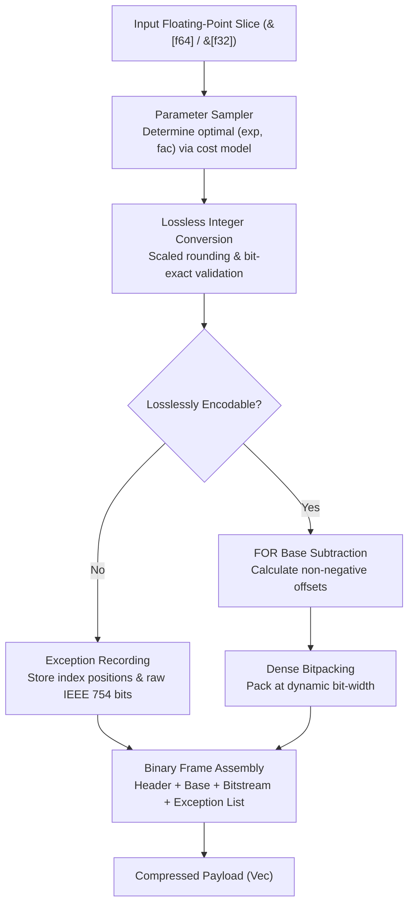

## Architecture & Design

`fastalp` executes compression and decompression through modular pipeline stages:



### Compression Pipeline

- **Equi-value Detection & Fallback (`encoder.rs`)**:<br>
  Fast-path detection for constant sequences. Direct emission of compact headers when identical values are observed. Automatically falls back to raw 1-byte header storage if data entropy prevents effective decimal reduction.

- **Sampling & Cost-Model Optimization (`sampler.rs`)**:<br>
  Evaluates up to 32 evenly distributed sample points across `(exp, fac)` parameter spaces, minimizing total encoded bit-width and penalty-weighted exceptions.

- **Lossless Conversion & Validation (`sampler.rs`, `float.rs`)**:<br>
  Multiplies floats by $10^{\text{exp}} \times 10^{-\text{fac}}$, rounds to nearest integer via floating-point bias constants, and validates bit-exact equality through inverse scaling.

- **Base Subtraction & Bitpacking (`bitpack/pack.rs`, `encoder.rs`)**:<br>
  Computes minimum valid integer as frame base (FOR mode), derives dynamic bit-widths, and densely packs offsets into bytes using a 128-bit sliding accumulator.

- **Exception Stream Serialization (`encoder.rs`)**:<br>
  Unencodable float positions and raw IEEE 754 bit representations are recorded in a compact trailing exception table.

### Decompression Pipeline

- **Self-Describing Header Parsing (`header.rs`, `decoder.rs`)**:<br>
  Parses the 2-bit length flag, extracts metadata parameters `(exp, fac, bit_width)`, and recovers the frame base value.

- **Bitstream Unpacking (`bitpack/unpack.rs`)**:<br>
  Employs pure SIMD register pipelines for 8/16/32/64 bit widths to avoid gather and memory lookup latency, combined with stack-resident LUTs for narrow widths (1/2/4 bit).

- **Exception Patching (`decoder.rs`)**:<br>
  Applies trailing exceptions at specified index offsets, restoring non-finite and out-of-range floats bit-for-bit.

---

## Technology Stack

- **Language**: Rust Edition 2024
- **Error Handling**: `thiserror`
- **Testing & Benchmarks**: `anyhow`, `aok`, `fastrand`

---

## Project Architecture

```
fastalp/
├── Cargo.toml          # Crate manifest and dependency configuration
├── README.md           # Generated multilingual documentation
├── README.mdt          # Multilingual documentation template
├── readme/             # Documentation source files
│   ├── en/             # English document modules (intro, usage, architecture, bench, evolution, capi, log)
│   └── zh/             # Chinese document modules (intro, usage, architecture, bench, evolution, capi, log)
├── src/                # Library source code
│   ├── bitpack/        # Modular bit-level packing and unpacking
│   │   ├── mod.rs      # Module facade and re-exports
│   │   ├── pack.rs     # Dense bitpacking with match_pack_23 dispatch
│   │   └── unpack/     # Decoupled bit-unpacking engine
│   │       ├── mod.rs      # Top-level dispatch and safe facades
│   │       ├── consumer.rs # AlpConsumer abstraction (FOR/Delta prefix-sum/raw writes)
│   │       ├── decoder.rs  # AlpDecoder float reconstruction (Mul/Div/RD/Dict)
│   │       └── kernel.rs   # 64-way monomorphized unpacking subkernels
│   ├── capi.rs         # Optional C-compatible FFI bindings and handle management
│   ├── constants.rs    # Precomputed static power tables and format constants
│   ├── decoder/        # Generic decompression pipeline & decimal division reconstruction
│   │   ├── mod.rs      # Decompression facade and mode dispatch
│   │   ├── standard.rs # Standard FOR reconstruction decompression
│   │   └── delta.rs    # Delta first-order difference decoding
│   ├── delta/          # First-order difference cost estimation and prefix sums
│   │   └── mod.rs
│   ├── encoder/        # Generic compression pipeline and state caching
│   │   ├── mod.rs      # Top-level entry points and compression facade
│   │   ├── state.rs    # Stateful Encoder struct and working buffer reuse
│   │   ├── engine.rs   # Core compression engine and 3-stage validation
│   │   ├── kernel.rs   # 4-way unrolled branchless vectorized encoding kernel
│   │   ├── outlier.rs  # FOR-mode outlier pruning algorithm
│   │   ├── exception.rs# Exception layout and compact serialization
│   │   ├── standard.rs # Standard FOR frame assembly
│   │   └── delta.rs    # Delta difference frame assembly
│   ├── error.rs        # Error definitions and Result type aliases
│   ├── float/          # AlpFloat trait and generic lossless transformations
│   │   ├── mod.rs      # AlpFloat trait and lookup table builders
│   │   ├── f32.rs      # Single-precision f32 multiply/divide implementations
│   │   └── f64.rs      # Double-precision f64 multiply/divide implementations
│   ├── header.rs       # Self-describing header with 2-bit length tags
│   ├── lib.rs          # Crate root and public exports
│   ├── macros.rs       # Global unrolling, array construction, and bit-width dispatch macros
│   ├── params.rs       # Compact bitfield parameters and bit-width calculators
│   └── sampler.rs      # Parameter sampling and validation
├── test.sh             # Test execution script
└── tests/              # Integration and stress testing
    ├── test_alp_dataset.rs # ALP paper 31 real-world datasets roundtrip & ratio tests
    ├── test_delta.rs       # Specialized delta difference tests & edge cases
    └── test_roundtrip.rs   # Comprehensive lossless roundtrip & boundary tests
```
