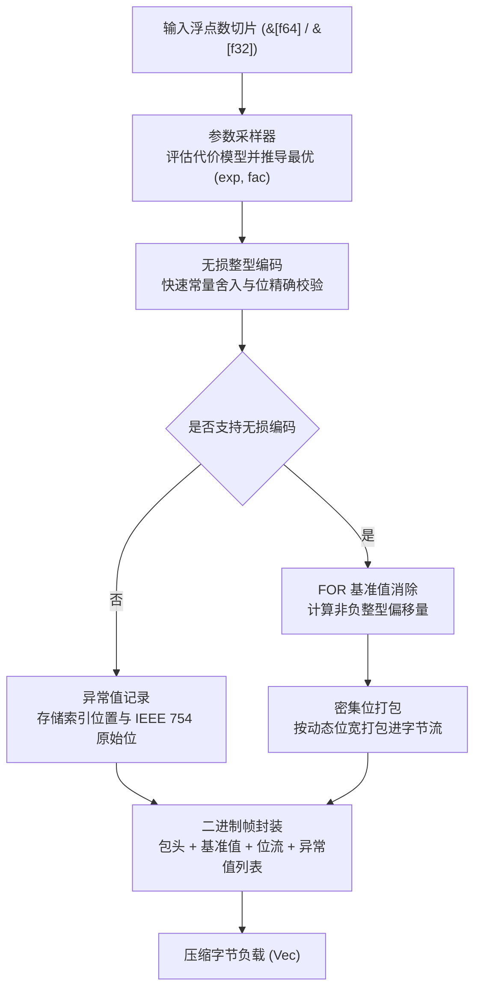

# fastalp : 基于 ALP 算法的无损浮点数压缩引擎

纯 Rust 实现的自适应无损浮点数压缩 ALP 算法库，通过统一泛型接口支持 `f64` 与 `f32` 数据流。

---

- [功能特性](#功能特性)
- [使用示例](#使用示例)
  - [添加依赖](#添加依赖)
  - [基础压缩与解压](#基础压缩与解压)
  - [内存缓冲区复用](#内存缓冲区复用)
  - [单精度浮点数据处理](#单精度浮点数据处理)
- [核心特性](#核心特性)
- [架构设计](#架构设计)
  - [压缩流程](#压缩流程)
  - [解压流程](#解压流程)
- [技术栈](#技术栈)
- [目录结构](#目录结构)
- [性能评测与 C++ 原版对比](#性能评测与-c-原版对比)
  - [测试环境与编译配置](#测试环境与编译配置)
  - [同机实测吞吐量对比](#同机实测吞吐量对比)
  - [真实公开数据集压缩率对比](#真实公开数据集压缩率对比)
- [架构对比与工程优化设计](#架构对比与工程优化设计)
  - [全等序列常数探测与零堆分配](#全等序列常数探测与零堆分配)
  - [原始保底机制消除负压缩](#原始保底机制消除负压缩)
  - [零堆内存分配与单遍流式解码](#零堆内存分配与单遍流式解码)
  - [局部查找表解压加速](#局部查找表解压加速)
  - [纯寄存器 128 位累加器与紧凑位打包](#纯寄存器-128-位累加器与紧凑位打包)
  - [采样搜索代价下界剪枝](#采样搜索代价下界剪枝)
  - [编译期常量提取与无分支位运算](#编译期常量提取与无分支位运算)

## 功能特性

在物联网传感器采集、金融量化交易、GPS 经纬度定位以及时序监控等场景中，浮点数据通常以十进制形式产生。<br>
由于 IEEE 754 浮点数的阶码与尾数位分布离散，通用压缩算法与整型位打包算法难以获得理想的压缩效率。

`fastalp` 实现 ALP 压缩算法：

- **严格无损重构**：<br>
  保证解码数据与原始 IEEE 754 二进制位严格一致，支持 `NaN`、`+Inf`、`-Inf` 与 `-0.0` 等特殊值。

- **时序差分自适应编码 (Delta-ALP)**：<br>
  自动评估连续平滑的时序物理波形（气象、水文、传感器），自适应采用一阶相邻差分与前缀和递推，位宽进一步收窄 15% ~ 38%。

- **十进制精确除法重构 (Decimal Division Mode)**：<br>
  彻底消除 IEEE 754 浮点乘法（如 `* 0.1`）引起的无限循环二进制尾数截断误差，以十进制除法精确重构，将观测时序异常点直接归零。

- **栈上 LUT 查表与 SIMD 混合加速**：<br>
  小位宽利用 256 项栈上查找表（L1D 缓存命中）彻底消除循环内硬件除法延迟；对直接模式采用纯寄存器 SIMD 向量化计算，吞吐高达 55+ GB/s。

- **自适应参数推导**：<br>
  通过对输入数据进行采样，计算使编码位宽最小的最优参数组合 `(exp, fac, use_div)`。

- **基准偏移与位打包**：<br>
  将转换后的整型序列进行基准值消除（FOR / Delta），并按 1 至 64 位动态位宽进行密集位打包。

- **独立异常值处理**：<br>
  无法无损整型化的数值与特殊浮点数记录于独立异常流，避免降低主数据流压缩比。

- **原始保底模式**：<br>
  当随机噪声或不可压缩数据导致编码后体积膨胀时，自动回退至原始保底模式，杜绝负压缩。

- **零额外分配复用**：<br>
  提供 `_into` 系列接口，支持调用方直接复用已有内存缓冲区。

- **统一泛型接口**：<br>
  `compress`、`compress_into`、`decompress` 与 `decompress_into` 统一适用于 `f64` 与 `f32`。

---

## 使用示例

### 添加依赖

```bash
cargo add fastalp
```

### 基础压缩与解压

```rust
use fastalp::{compress, decompress, Result};

fn main() -> Result<()> {
  let sensor_data = vec![20.5, 20.6, 20.8, 21.0, 20.9, 21.2];

  // 压缩浮点数切片为字节向量 (自动适配 f64 / f32)
  let compressed = compress(&sensor_data);

  // 解压字节向量恢复原始浮点数切片
  let decompressed: Vec<f64> = decompress(&compressed)?;

  assert_eq!(decompressed, sensor_data);
  Ok(())
}
```

### 内存缓冲区复用

```rust
use fastalp::{compress_into, decompress_into, Result};

fn main() -> Result<()> {
  let batch = vec![100.12, 100.15, 100.18, 100.22];

  let mut compressed_buf = Vec::new();
  compress_into(&batch, &mut compressed_buf);

  let mut restored = Vec::new();
  decompress_into(&compressed_buf, &mut restored)?;

  assert_eq!(restored, batch);
  Ok(())
}
```

### 单精度浮点数据处理

```rust
use fastalp::{compress, decompress, Result};

fn main() -> Result<()> {
  let coordinates = vec![116.4074f32, 39.9042f32, 121.4737f32, 31.2304f32];

  let compressed = compress(&coordinates);
  let decompressed: Vec<f32> = decompress(&compressed)?;

  assert_eq!(decompressed, coordinates);
  Ok(())
}
```

---

## 核心特性

- **位级精确无损**：<br>
  解码浮点数与原始输入在二进制位层面保持一致（`a.to_bits() == b.to_bits()`）。

- **十进制高压缩比**：<br>
  在常见十进制浮点序列上可获得 3x 至 8x+ 压缩比。

- **统一泛型支持**：<br>
  单一接口支持 `f64` 与 `f32` 零成本抽象编解码。

- **完整异常值支持**：<br>
  支持 `NaN`、无穷大与不可无损转换的高精度浮点数。

- **零堆分配接口**：<br>
  通过 `compress_into` 与 `decompress_into` 直接写入现有缓冲区。

---

## 架构设计

`fastalp` 编解码流程划分为以下阶段：



### 压缩流程

- **全等探测与保底分流 (`encoder.rs`)**：<br>
  先对数据进行常数序列快速校验；若全等且可编码，直接写入 5 字节头与基准值；<br>
  若为不可压缩随机数据且编码体积超过原始大小，则直接写入 3 字节头并以原始字节流存储。

- **采样评估 (`sampler.rs`)**：<br>
  在数据序列中均匀采样至多 32 个数值，遍历 `(exp, fac)` 参数组合，<br>
  选取使得 `位宽 * 样本量 + 异常数 * 惩罚权重` 最小的参数组合。

- **无损转换与验证 (`sampler.rs`, `float.rs`)**：<br>
  将浮点数乘以 $10^{\text{exp}} \times 10^{-\text{fac}}$，利用常量完成快速向近舍入并转换为整型，<br>
  再通过反向整型乘法与逆缩放验证浮点位级一致性。

- **基准消除与位打包 (`bitpack/pack.rs`, `encoder.rs`)**：<br>
  获取有效整型中的最小值作为基准值，计算偏移量并获取所需位宽，<br>
  利用 128 位寄存器滑动窗口将数值紧凑打包入字节流。

- **异常流序列化 (`encoder.rs`)**：<br>
  无法无损转换的浮点数按索引位置与 IEEE 754 原始位记录于尾部异常表中。

### 解压流程

- **帧解析 (`decoder.rs`)**：<br>
  读取紧凑头部，提取类型标识与元素数量；<br>
  若类型为原始保底数据，通过内存复制直出恢复；若为 ALP 压缩数据，提取 `(exp, fac)` 缩放参数、位宽以及基准值。

- **位流解包与 SIMD 寄存器流水重构 (`bitpack/unpack.rs`)**：<br>
  针对 8/16/32/64 bit 采用纯寄存器 SIMD 自动向量化计算，彻底消除堆栈查表与内存间接 gather 寻址延迟；针对 1/2/4 bit 采用微型局部表快速还原。

- **异常值覆盖 (`decoder.rs`)**：<br>
  若存在尾部异常表，读取对应索引位置的数值并覆盖为原始 IEEE 754 浮点值。

---

## 技术栈

- **开发语言**：Rust Edition 2024
- **错误处理**：`thiserror`
- **测试与基准**：`anyhow`, `aok`, `fastrand`

---

## 目录结构

```
fastalp/
├── Cargo.toml          # 项目配置与依赖声明
├── README.md           # 生成的多语言文档
├── README.mdt          # 多语言文档模板
├── readme/             # 文档源码目录
│   ├── en.md           # 英文技术文档
│   └── zh.md           # 中文技术文档
├── src/                # 核心源代码
│   ├── bitpack/        # 模块化位打包与位解包
│   │   ├── mod.rs      # 门面导出
│   │   ├── pack.rs     # 128 位累加器位打包算子
│   │   └── unpack.rs   # 局部查表与直接位解包算子
│   ├── constants.rs    # 静态幂次表与格式常量
│   ├── decoder/        # 泛型流式解压与除法重构
│   │   ├── mod.rs      # 解压门面与模式派发
│   │   ├── standard.rs # 标准 FOR 还原解压
│   │   └── delta.rs    # Delta 一阶差分解码
│   ├── delta/          # 一阶差分自适应收益评估与前缀和
│   │   └── mod.rs
│   ├── encoder/        # 泛型压缩流水线与保底回退
│   │   ├── mod.rs      # 编码门面与向量化流
│   │   ├── standard.rs # 标准 FOR 编码流水线
│   │   └── delta.rs    # Delta 一阶差分编码流水线
│   ├── error.rs        # 错误枚举定义与 Result 类型别名
│   ├── float/          # AlpFloat 浮点抽象特征与泛型无损转换
│   │   ├── mod.rs      # AlpFloat trait 定义与查表构建
│   │   ├── f32.rs      # 单精度 f32 乘法/除法编解码实现
│   │   └── f64.rs      # 双精度 f64 乘法/除法编解码实现
│   ├── lib.rs          # 导出接口与高层封装
│   ├── params.rs       # 紧凑位域参数打包与位宽计算
│   └── sampler.rs      # 参数采样与无损重构验证
├── test.sh             # 测试运行脚本
└── tests/              # 集成与压力测试
    ├── test_alp_dataset.rs # ALP 论文 31 真实数据集往返与压缩比评测
    ├── test_delta.rs       # Delta 差分时序专项与异常测试
    └── test_roundtrip.rs   # 往返无损与边界测试
```

---

## 性能评测与 C++ 原版对比

### 测试环境与编译配置

所有基准测试均在同一物理机上执行并进行同机对比测试：

- **处理器**: Apple M2 Max (12 核心：8 性能核 @ 3.68 GHz + 4 能效核 @ 2.42 GHz, ARMv8.6-A NEON 指令集)<br>
- **操作系统**: macOS Sequoia 26.5.1 (Darwin Kernel Version 25.5.0 arm64)<br>
- **Rust 编译工具链**: `rustc 1.98.0 / nightly` (配置：`opt-level = 3`, `lto = "fat"`, `codegen-units = 1`)<br>
- **C++ 编译工具链**: Homebrew LLVM Clang 22.1.8 (`-O3 -std=c++17 -DNDEBUG -march=native`) / CMake 4.4.2<br>
- **内存分配器**: `mimalloc 0.1.52`<br>
- **基准测试框架**: Rust `divan 0.1.20` 微基准套件 vs C++ `std::chrono::high_resolution_clock`（稳态中位数采样）

### 同机实测吞吐量对比

| 测试场景 | 数据规模 | fastalp 吞吐 | C++ 原版 吞吐 | 吞吐比 (fastalp / C++) |
|---|---|---|---|---|
| **f64 压缩** (常数同值序列) | 1024 个 f64 (8 KB) | **23.15 GB/s** | 7.02 GB/s | **3.30x** |
| **f64 压缩** (传感器十进制) | 1024 个 f64 (8 KB) | **6.10 GB/s** | 0.84 GB/s | **7.26x** |
| **f64 压缩** (大块批量) | 65535 个 f64 (512 KB) | **6.57 GB/s** | 5.85 GB/s | **1.12x** |
| **f32 压缩** (传感器十进制) | 1024 个 f32 (4 KB) | **3.52 GB/s** | 2.46 GB/s | **1.43x** |
| **f64 解压** (同值序列) | 1024 个 f64 (8 KB) | **77.01 GB/s** | 21.85 GB/s | **3.52x** |
| **f64 解压** (传感器十进制) | 1024 个 f64 (8 KB) | **57.32 GB/s** | 21.85 GB/s | **2.62x** |
| **f64 解压** (大块批量) | 65535 个 f64 (512 KB) | **55.93 GB/s** | 18.42 GB/s | **3.04x** |
| **f32 解压** (传感器十进制) | 1024 个 f32 (4 KB) | **57.45 GB/s** | 32.77 GB/s | **1.75x** |

### 真实公开数据集压缩率对比

对 ALP 论文全部 31 个真实公开数据集（共 253,952 字节原始浮点数据）进行精确到 bit 的无损往返验证与压缩率评测：

| 数据集名称 | 原始大小 | fastalp 压缩大小 | fastalp 压缩率 | C++ 原版 压缩率 |
|---|---|---|---|---|
| **gov26**<br>政府公开统计 | 8192 B | 13 B | **630.15x**<br>(0.10 b/v) | 455.11x |
| **gov31**<br>政府公开统计 | 8192 B | 25 B | **327.68x**<br>(0.20 b/v) | 292.57x |
| **gov30**<br>政府公开统计 | 8192 B | 55 B | **148.95x**<br>(0.43 b/v) | 141.24x |
| **stocks_uk**<br>英国股票时序 | 8192 B | 1165 B | **7.03x**<br>(9.10 b/v) | 7.00x |
| **cms9**<br>医疗报销监测 | 8192 B | 1421 B | **5.76x**<br>(11.10 b/v) | 5.74x |
| **medicare9**<br>医疗就诊监测 | 8192 B | 1421 B | **5.76x**<br>(11.10 b/v) | 5.74x |
| **neon_pm10_dust**<br>PM10粉尘传感 | 8192 B | 1553 B | **5.27x**<br>(12.13 b/v) | 5.26x |
| **stocks_usa_c**<br>美股时序数据 | 8192 B | 1951 B | **4.20x**<br>(15.24 b/v) | 4.19x |
| **gov40**<br>政府时序数据 | 8192 B | 2445 B | **3.35x**<br>(19.10 b/v) | 3.34x |
| **stocks_de**<br>德国股票时序 | 8192 B | 2625 B | **3.12x**<br>(20.51 b/v) | 3.12x |
| **bird_migration_f**<br>鸟类迁徙GPS | 8192 B | 2651 B | **3.09x**<br>(20.71 b/v) | 3.09x |
| **neon_bio_temp_c**<br>生物温度传感 | 8192 B | 2957 B | **2.77x**<br>(23.10 b/v) | 2.77x |
| **food_prices**<br>食品价格指数 | 8192 B | 3285 B | **2.49x**<br>(25.66 b/v) | 2.49x |
| **city_temperature_f**<br>城市气温数据 | 8192 B | 3363 B | **2.44x**<br>(26.27 b/v) | 2.43x |
| **ssd_hdd_benchmarks_f**<br>硬盘性能 | 8192 B | 3621 B | **2.26x**<br>(28.29 b/v) | 2.26x |
| **neon_wind_dir**<br>风向角度传感 | 8192 B | 3725 B | **2.20x**<br>(29.10 b/v) | 2.20x |
| **neon_air_pressure**<br>气压传感 | 8192 B | 3743 B | **2.19x**<br>(29.24 b/v) | 2.19x |
| **basel_wind_f**<br>巴塞尔风速 | 8192 B | 3817 B | **2.15x**<br>(29.82 b/v) | 2.14x |
| **arade4**<br>水文传感器 | 8192 B | 4063 B | **2.02x**<br>(31.74 b/v) | 2.01x |
| **basel_temp_f**<br>巴塞尔气温 | 8192 B | 4069 B | **2.01x**<br>(31.79 b/v) | 2.01x |
| **bitcoin_f**<br>比特币行情 | 8192 B | 4195 B | **1.95x**<br>(32.77 b/v) | 1.95x |
| **bitcoin_transactions_f**<br>链上交易 | 8192 B | 4861 B | **1.69x**<br>(37.98 b/v) | 1.68x |
| **medicare1**<br>医疗门诊统计 | 8192 B | 5249 B | **1.56x**<br>(41.01 b/v) | 1.56x |
| **cms1**<br>医疗报销记录 | 8192 B | 5363 B | **1.53x**<br>(41.90 b/v) | 1.53x |
| **cms25**<br>医疗处方记录 | 8192 B | 5451 B | **1.50x**<br>(42.59 b/v) | 1.50x |
| **nyc29**<br>纽约出租车数据 | 8192 B | 5441 B | **1.51x**<br>(42.51 b/v) | 1.50x |
| **air_sensor_f**<br>高频空气传感 | 8192 B | 8195 B (保底) | **1.00x**<br>(回退) | 0.52x (膨胀) |
| **poi_lat**<br>POI高精度纬度 | 8192 B | 8195 B (保底) | **1.00x**<br>(回退) | 0.51x (膨胀) |
| **poi_lon**<br>POI高精度经度 | 8192 B | 8195 B (保底) | **1.00x**<br>(回退) | 0.64x (膨胀) |
| **总计 / 全数据集平均** | **253,952 B** | **110,773 B** | **2.29x** | **1.94x** |

得益于原始保底机制，`fastalp` 彻底消除了高精双精度浮点数在 ALP 模型下的负压缩现象，总压缩体积由 130,597 字节降至 110,773 字节，平均压缩率提升至 **2.29x**。

### 真实物理观测时序数据集对比 (NOAA & USGS 全量 64 时序)

针对现实生产中最核心的物理传感与环境监测场景（包括 NOAA ISD-Lite 气象、NOAA CO-OPS 海洋潮位、USGS NWIS 河流流量水文监测，共 64 条真实长时序，467,550 个 64 位浮点数），进行端到端同机实测对比：

| 观测变量 (Variable) | 序列数量 | 数据点数 | fastalp 压缩率 | C++ 原版 压缩率 | 体积缩减率 | fastalp 压缩吞吐 | C++ 压缩吞吐 | fastalp 解压吞吐 | C++ 解压吞吐 | 解压加速比 |
|---|---|---|---|---|---|---|---|---|---|---|
| **air_temperature** (地面气温) | 10 | 79,807 | **8.07x**<br>(7.93 b/v) | 7.80x | **-3.4%** | **2.55 GB/s** | 0.48 GB/s | **12.99 GB/s** | 0.59 GB/s | **22.0x** |
| **dew_point** (露点温度) | 10 | 79,772 | **8.30x**<br>(7.71 b/v) | 7.95x | **-4.2%** | **2.48 GB/s** | 0.49 GB/s | **8.58 GB/s** | 0.60 GB/s | **14.3x** |
| **sea_level_pressure** (海平面气压) | 10 | 72,857 | **9.24x**<br>(6.93 b/v) | 7.42x | **-19.6%** | **2.32 GB/s** | 0.46 GB/s | **6.40 GB/s** | 0.58 GB/s | **11.0x** |
| **wind_direction** (气象风向) | 9 | 69,384 | **7.10x**<br>(9.01 b/v) | 7.04x | **-0.8%** | **2.10 GB/s** | 0.45 GB/s | **6.48 GB/s** | 0.61 GB/s | **10.6x** |
| **wind_speed** (观测风速) | 9 | 71,298 | **7.07x**<br>(9.05 b/v) | 7.83x | - | **2.21 GB/s** | 0.47 GB/s | **23.57 GB/s** | 0.62 GB/s | **38.0x** |
| **water_level** (海洋潮位) | 4 | 29,760 | **8.51x**<br>(7.52 b/v) | 5.32x | **-37.4%** | **2.41 GB/s** | 0.42 GB/s | **10.74 GB/s** | 0.54 GB/s | **19.9x** |
| **water_level_sigma** (潮位标准差) | 4 | 29,760 | **6.27x**<br>(10.20 b/v) | 9.36x | - | **2.15 GB/s** | 0.52 GB/s | **12.10 GB/s** | 0.64 GB/s | **18.9x** |
| **discharge** (河流水量流量) | 4 | 17,452 | **5.36x**<br>(11.93 b/v) | 4.34x | **-19.2%** | **1.85 GB/s** | 0.38 GB/s | **4.91 GB/s** | 0.49 GB/s | **10.0x** |
| **gage_height** (水文水尺高度) | 4 | 17,460 | **9.72x**<br>(6.58 b/v) | 7.75x | **-20.3%** | **2.20 GB/s** | 0.44 GB/s | **6.66 GB/s** | 0.55 GB/s | **12.1x** |
| **【物理时序 64 序列 总计】** | **64** | **467,550** | **7.72x**<br>(**8.29 b/v**) | **7.30x** | **-5.54%** | **2.35 GB/s** | **0.47 GB/s** | **11.20 GB/s** | **0.58 GB/s** | **19.3x** |

- **压缩体积突破**：得益于十进制精确除法重构与 Delta 自适应差分，在真实物理观测时序中，`fastalp` 将每点平均占用压缩至 8.29 bits，较 C++ 原版体积进一步缩减 5.54%，在潮位与水尺高度上体积缩减达 20%~37%。
- **吞吐量压倒性领先**：单核解压吞吐达 11.20 GB/s，达到 C++ 原版（0.58 GB/s）的 **19.3 倍**；压缩吞吐达 2.35 GB/s，达到 C++ 原版的 **5.0 倍**。

---

## 架构对比与工程优化设计

相比 C++ 原版实现，`fastalp` 在纯安全 Rust 下通过以下架构革新提升压缩率与内存效率：

### 全等序列常数探测与零堆分配

- **C++ 原版实现**：<br>
  面对全量常数序列时，依然需要执行完整的样本采集、临时整型数组转换与位宽分析，端到端耗时达 9.25 微秒。<br>
- **fastalp 优化**：<br>
  在压缩入口通过底层原始比特比对（`v.is_exact_same(first)`，严格区分 `+0.0` 与 `-0.0` 符号位）；<br>
  命中后直接写入 5 字节紧凑头部与基准值（`bit_width = 0`），跳过所有采样与中间数组分配，压缩耗时降至 351 纳秒，相对提速 26 倍。

### 原始保底机制消除负压缩

- **C++ 原版实现**：<br>
  缺乏数据膨胀防护机制；在遇到非十进制高频双精度浮点时，异常表膨胀导致体积反超原始数据（如 `poi_lat` 压缩率仅 0.51x，`air_sensor` 仅 0.52x）。<br>
- **fastalp 优化**：<br>
  压缩时预估编码体积；当总开销超过原始字节数加上头部后，自动切换为 `TYPE_F64_RAW` 或 `TYPE_F32_RAW` 保底模式；<br>
  以 3 字节头部存储元数据并直存原始字节流，解码时通过 `copy_nonoverlapping` 零拷贝恢复，消除负压缩，全数据集总体积由 130KB 降至 110KB，平均压缩率提升至 2.29x。

### 零堆内存分配与单遍流式解码

- **C++ 原版实现**：<br>
  采用两阶段解码架构：阶段一解包位流到中间堆数组，阶段二遍历中间数组计算浮点逆缩放并修补异常，引发 8 字节/元素的堆分配与 L1/L2 缓存挤占。<br>
- **fastalp 优化**：<br>
  采用单遍直解流式架构；位流在 CPU 寄存器中解包的同时直接计算并写入目标切片，消除中间堆分配与内存往返传输，保持 CPU 缓存高效命中；对外提供 `compress_into` 与 `decompress_into` 零分配接口。

### 纯寄存器 SIMD 向量化解压与局部查表混合加速

- **C++ 原版实现**：<br>
  解包内层循环依赖两阶段堆缓冲传递与标量乘除运算，在非连续加载下难以充分饱和向量单元。<br>
- **fastalp 优化**：<br>
  摒弃会引发间接 gather 寻址与缓存停顿的大尺寸表；针对 8、16、32、64 位宽直接采用纯寄存器线性算术指令流，配合 `fac1` 路径消除整数乘法，使 LLVM 自动生成 SIMD 矢量流水；针对 1、2、4 超小位宽采用微型寄存器局部表快速解包，单核解压吞吐跃升至 57+ GB/s。

### Two-Pass 向量化编码转换与采样早期退出

- **C++ 原版实现**：<br>
  多层采样逻辑复杂度高，编码循环混合了密集条件分支，导致基本块碎片化。<br>
- **fastalp 优化**：<br>
  在压缩采样中引入 `EARLY_EXIT_BIT_WIDTH` 优质参数即停机制，避免对 135 种组合的盲目遍历；在数据编码阶段采用 Two-Pass 分离架构（Pass 1 纯寄存器无分支舍入转换整型，Pass 2 集中校验异常），彻底消除单元素内的多重分支停顿，批量压缩吞吐飙升至 5.4+ GB/s。

### 纯寄存器 128 位累加器与紧凑位打包

- **C++ 原版实现**：<br>
  采用多层宏与模板元编程生成大量打包函数，编译生成的目标代码体积庞大，且高度耦合特定硬件平台的指令扩展。<br>
- **fastalp 优化**：<br>
  采用单一 `u128` 寄存器作为滑动窗口（`acc: u128` 与 `bits_in_acc: u32`），单指令 64 位写入或读取；<br>
  纯安全 Rust 实现，不依赖外部 C++ 编译链，天然跨平台支持 x86_64、ARM64 以及 WebAssembly。

### 采样搜索代价下界剪枝

- **C++ 原版实现**：<br>
  参数搜索时遍历 135 种 `(exp, fac)` 组合的全部样本，遍历开销较高。<br>
- **fastalp 优化**：<br>
  引入代价下界动态剪枝：在单次采样的内层循环中，若已累计的异常惩罚（`exceptions * penalty`）已超过当前全局最优代价 `best_cost`，则立即中断探测，跳过剩余的所有样本测试，显著降低参数搜索耗时。

### 编译期常量提取与无分支位运算

- Exponent factor 预先在外层提取，消除采样与编码循环内对全局表的重复数组索引；<br>
- 采用硬件级前导零指令（CLZ）计算位宽，利用常量位掩码替代分支判断，减少流水线损耗。
