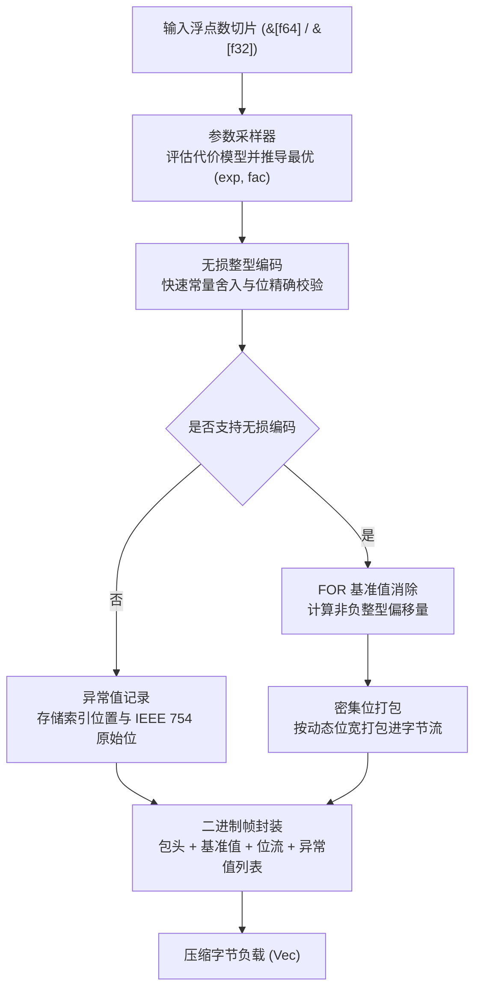

## 架构设计

`fastalp` 编解码流程划分为以下阶段：



### 压缩流程

- **全等探测与保底分流 (`encoder.rs`)**：<br>
  先对数据进行常数序列快速校验；若全等且可编码，直接写入自描述紧凑头部与基准值；<br>
  若为不可压缩随机数据且编码体积超过原始大小加上极简头部，则自动回退至原始保底模式（1024 满块仅 1 字节头部），直接以原始字节流存储。

- **采样评估 (`sampler.rs`)**：<br>
  在数据序列中均匀采样至多 32 个数值，遍历 `(exp, fac)` 参数组合，<br>
  选取使得 `位宽 * 样本量 + 异常数 * 惩罚权重` 最小的参数组合。

- **无损转换与验证 (`sampler.rs`, `float.rs`)**：<br>
  将浮点数乘以 $10^{\text{exp}} \times 10^{-\text{fac}}$，利用常量完成快速向近舍入并转换为整型，<br>
  再通过反向整型乘法与逆缩放验证浮点位级一致性。

- **基准消除与位打包 (`bitpack/pack.rs`, `encoder.rs`)**：<br>
  获取有效整型中的最小值作为基准值，计算偏移量并获取所需位宽，<br>
  利用 128 位寄存器滑动窗口将数值紧凑打包入字节流。

- **异常流序列化 (`encoder.rs`)**：<br>
  无法无损转换的浮点数按索引位置与 IEEE 754 原始位记录于尾部异常表中。

### 解压流程

- **自描述头解析 (`header.rs`, `decoder.rs`)**：<br>
  读取首字节描述符，由 2-bit 长度标签解码元素总数并确定参数偏移；<br>
  若类型为原始保底数据，通过内存复制直出恢复；若为 ALP 压缩数据，提取 `(exp, fac, bit_width)` 缩放参数与基准值。

- **位流解包与 SIMD 寄存器流水重构 (`bitpack/unpack.rs`)**：<br>
  针对 8/16/32/64 bit 采用纯寄存器 SIMD 自动向量化计算，消除堆栈查表与内存间接 gather 寻址延迟；针对 1/2/4 bit 采用微型局部表快速还原。

- **异常值覆盖 (`decoder.rs`)**：<br>
  若存在尾部异常表，读取对应索引位置的数值并覆盖为原始 IEEE 754 浮点值。

---

## 技术栈

- **开发语言**：Rust Edition 2024
- **错误处理**：`thiserror`
- **测试与基准**：`anyhow`, `aok`, `fastrand`

---

## 目录结构

```
fastalp/
├── Cargo.toml          # 项目配置与依赖声明
├── README.md           # 生成的多语言文档
├── README.mdt          # 多语言文档模板
├── readme/             # 文档源码目录
│   ├── en/             # 英文文档模块 (intro, usage, architecture, bench, evolution, capi, log)
│   └── zh/             # 中文文档模块 (intro, usage, architecture, bench, evolution, capi, log)
├── src/                # 核心源代码
│   ├── bitpack/        # 模块化位打包与位解包
│   │   ├── mod.rs      # 门面导出
│   │   ├── pack.rs     # 128 位累加器位打包算子与 match_pack_23 派发
│   │   └── unpack/     # 模块化分层位解包算子体系
│   │       ├── mod.rs      # 解包顶层调度与安全门面
│   │       ├── consumer.rs # AlpConsumer 消费器抽象（FOR/Delta前缀和/原始写入）
│   │       ├── decoder.rs  # AlpDecoder 浮点重构器（乘法/除法/RD/字典）
│   │       └── kernel.rs   # 64 路定宽解包与展开内联内核
│   ├── capi.rs         # C 兼容 FFI 接口与独立编码器句柄
│   ├── constants.rs    # 静态幂次表与格式常量
│   ├── decoder/        # 泛型流式解压与除法重构
│   │   ├── mod.rs      # 解压门面与模式派发
│   │   ├── standard.rs # 标准 FOR 还原解压
│   │   └── delta.rs    # Delta 一阶差分解码
│   ├── delta/          # 一阶差分自适应收益评估与前缀和
│   │   └── mod.rs
│   ├── encoder/        # 泛型压缩流水线与参数缓存
│   │   ├── mod.rs      # 编码门面与顶层便捷函数
│   │   ├── state.rs    # 状态化 Encoder 结构体与工作缓冲区复用
│   │   ├── engine.rs   # 压缩编排引擎与参数三级校验
│   │   ├── kernel.rs   # 4-way 展开无分支向量化编码内核
│   │   ├── outlier.rs  # FOR 模式离群值剪枝算法
│   │   ├── exception.rs# 异常值结构与紧凑序列化
│   │   ├── standard.rs # 标准 FOR 编码组装
│   │   └── delta.rs    # Delta 一阶差分编码组装
│   ├── error.rs        # 错误枚举定义与 Result 类型别名
│   ├── float/          # AlpFloat 浮点抽象特征与泛型无损转换
│   │   ├── mod.rs      # AlpFloat trait 定义与查表构建
│   │   ├── f32.rs      # 单精度 f32 乘法/除法编解码实现
│   │   └── f64.rs      # 双精度 f64 乘法/除法编解码实现
│   ├── header.rs       # 紧凑自描述头部编解码与 2-bit 长度标签档位管理
│   ├── lib.rs          # 导出接口与高层封装
│   ├── macros.rs       # 全局循环展开、数组构造与位宽派发宏体系
│   ├── params.rs       # 紧凑位域参数打包与位宽计算
│   └── sampler.rs      # 参数采样与无损重构验证
├── test.sh             # 测试运行脚本
└── tests/              # 集成与压力测试
    ├── test_alp_dataset.rs # ALP 论文 31 真实数据集往返与压缩比评测
    ├── test_delta.rs       # Delta 差分时序专项与异常测试
    └── test_roundtrip.rs   # 往返无损与边界测试
```
